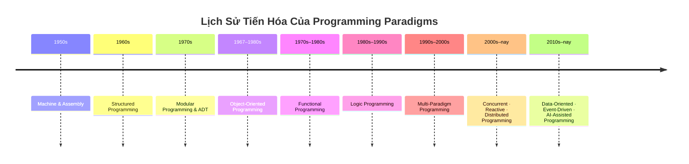

# Lập Trình Hướng Đối Tượng (OOP)

## Table of Contents

- [Giới Thiệu](#giới-thiệu)
- [Lịch Sử Tiến Hóa Paradigms](#lịch-sử-tiến-hóa-paradigms)
- [Quan Hệ Giữa Các Lớp](#quan-hệ-giữa-các-lớp)
- [Bốn Thuộc Tính Cốt Lõi](#bốn-thuộc-tính-cốt-lõi)

---

## Giới Thiệu

Lập trình Hướng Đối Tượng (Object-Oriented Programming - OOP) là mô hình lập trình tổ chức hệ thống phần mềm xung quanh các **Đối tượng (Objects)** — nơi kết hợp giữa **Trạng thái (State)** và **Hành vi (Behavior)**.

Tài liệu này tổng hợp lịch sử phát triển của các paradigm lập trình, các mối quan hệ giữa các lớp trong thiết kế và 4 thuộc tính nền tảng của OOP.

---

## Lịch Sử Tiến Hóa Của Programming Paradigms

### Programming Paradigm là gì?

**Programming paradigm** là một **cách tư duy và tổ chức chương trình**.

Nó trả lời câu hỏi:

> **“Ta nên xây dựng chương trình theo cách nào?”**

Khi phần mềm ngày càng lớn, cách làm cũ dần bộc lộ giới hạn. Con người vì thế liên tục tạo ra những cách tư duy mới.

### Timeline

### Các giai đoạn chính

| Thời kỳ     | Paradigm                     | Ý tưởng chính                    |
| ----------- | ---------------------------- | -------------------------------- |
| 1950s       | Machine & Assembly           | Làm việc trực tiếp với máy       |
| 1960s       | Structured Programming       | Kiểm soát luồng chương trình     |
| 1970s       | Modular Programming & ADT    | Chia nhỏ và giấu chi tiết        |
| 1967–1980s  | Object-Oriented Programming  | Kết hợp dữ liệu và hành vi       |
| 1970s–1980s | Functional Programming       | Tập trung vào hàm và dữ liệu     |
| 1980s–1990s | Logic Programming            | Mô tả luật và quan hệ            |
| 1990s–2000s | Multi-Paradigm               | Kết hợp nhiều cách tư duy        |
| 2000s–nay   | Concurrent & Distributed     | Xử lý nhiều tác vụ và nhiều máy  |
| 2010s–nay   | Data-Oriented & Event-Driven | Tổ chức quanh dữ liệu và sự kiện |
| 2010s–nay   | AI-Assisted Programming      | Con người làm việc cùng AI       |

Lịch sử này có thể nhìn như một chuỗi thay đổi:

**Machine → Control Flow → Data → Object → Function → Logic → Composition → Concurrency → Data & Events → AI**

Không có paradigm nào hoàn toàn thay thế paradigm trước. **Các paradigm mới thường được thêm vào để giải quyết những loại vấn đề mới.**

Và trong dòng lịch sử đó, **OOP là một bước rất quan trọng**: thay vì chỉ nghĩ về *lệnh*, *luồng chạy* hay *dữ liệu*, chúng ta bắt đầu nghĩ về **Object, State, Behavior và Interaction**.

---

## Quan Hệ Giữa Các Lớp

- [**Mối Quan Hệ Giữa Các Lớp (Class Relationships)**](class_relationships.md): Phân tích chi tiết kèm mã nguồn minh họa cho các mối quan hệ Association, Aggregation, Composition, Inheritance và Realization.

---

## Bốn Thuộc Tính Cốt Lõi

Các thuộc tính được tách thành từng tài liệu phân tích riêng biệt:

1. [**Đóng Gói (Encapsulation)**](encapsulation.md): Bảo vệ tính toàn vẹn trạng thái nội bộ và kiểm soát quyền truy cập.
2. [**Trừu Tượng Hóa & Interface (Abstraction)**](abstraction.md): Che giấu chi tiết cài đặt, phân biệt `Is-A`, `Has-A`, `Can-Do` và nghịch lý `default` method trong Java.
3. [**Kế Thừa (Inheritance)**](inheritance.md): Mô hình hóa phân cấp kiểu `Is-A` để mở rộng hệ thống.
4. [**Đa Hình (Polymorphism)**](polymorphism.md): Cung cấp giao diện thống nhất với nhiều hành vi thực thi linh hoạt tại runtime.

---

[← Back to README](../README.md)

