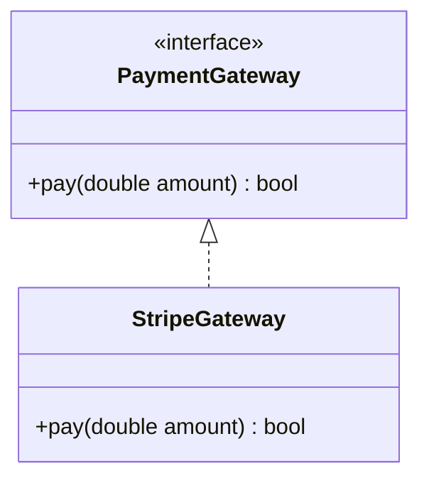

# Trừu Tượng Hóa & Interface (Abstraction)

## Table of Contents

- [Khái Niệm Trừu Tượng Hóa](#khái-niệm-trừu-tượng-hóa)
- [Phân Biệt Class và Interface: Is-A, Has-A, Can-Do](#phân-biệt-class-và-interface-is-a-has-a-can-do)
- [Nghịch Lý Default Method Trong Java Interface](#nghịch-lý-default-method-trong-java-interface)

---

## Khái Niệm Trừu Tượng Hóa

**Trừu tượng hóa (Abstraction)** là tư duy thiết kế tập trung bộc lộ các tính năng cốt lõi (giao diện công khai - Public Contract) và ẩn đi toàn bộ chi tiết cài đặt thuật toán phức tạp bên trong.

Mục tiêu chính:
- Giảm độ phức tạp nhận thức (Cognitive Load) khi sử dụng các thành phần phần mềm.
- Phân tách hoàn toàn giữa **"Interface (Hợp đồng làm gì)"** và **"Implementation (Chi tiết làm như thế nào)"**.

Sơ đồ thể hiện sự tách biệt giữa giao diện trừu tượng và lớp thực thi:



Ví dụ trừu tượng hóa dịch vụ thanh toán trong Java:

```java
// Interface trừu tượng đóng vai trò hợp đồng giao tiếp
public interface PaymentGateway {
    boolean pay(double amount);
}

// Chi tiết gọi API Stripe phức tạp được giấu đằng sau Interface
public class StripeGateway implements PaymentGateway {
    @Override
    public boolean pay(double amount) {
        System.out.println("Processing payment of $" + amount + " via Stripe API...");
        return true;
    }
}
```

---

## Phân Biệt Class và Interface: Is-A, Has-A, Can-Do

Để thiết kế hệ thống chuẩn xác, cần phân biệt rõ ranh giới ngữ nghĩa giữa `Class`, `Abstract Class` và `Interface` dựa trên 3 mối quan hệ cốt lõi:

| Mối quan hệ | Khái niệm ngữ nghĩa | Thành phần đại diện | Ví dụ thực tế |
| :--- | :--- | :--- | :--- |
| **`Is-A`** (Là một) | Quan hệ bản chất kiểu / Phân cấp bản thể | **Class / Abstract Class** | Con Hổ **là một** Loài Động Vật (`Tiger extends Animal`) |
| **`Has-A`** (Sở hữu) | Quan hệ sở hữu thành phần | **Composition / Field** | Xe Hơi **có một** Động Cơ (`Car has Engine`) |
| **`Can-Do`** (Có thể làm) | Quan hệ hợp đồng năng lực hành vi | **Interface** | Xe Hơi **có thể** Lái (`Car implements Drivable`) |

Bảng so sánh chi tiết giữa Class, Abstract Class và Interface:

| Tiêu chí | Concrete Class | Abstract Class | Interface (`Can-Do`) |
| :--- | :--- | :--- | :--- |
| **Bản chất ngữ nghĩa** | Đối tượng thực thể cụ thể | Bản mẫu trừu tượng dở dang (`Is-A`) | Hợp đồng năng lực hành vi (`Can-Do`) |
| **Trạng thái (State)** | Chứa thuộc tính dữ liệu (`fields`) | Chứa thuộc tính dữ liệu (`fields`) | Không chứa thuộc tính dữ liệu instance (chỉ chứa `public static final`) |
| **Đa kế thừa** | Đơn kế thừa (`extends 1 Class`) | Đơn kế thừa (`extends 1 Class`) | Đa triển khai (`implements nhiều Interface`) |

---

## Nghịch Lý Default Method Trong Java Interface

### Khái niệm ban đầu về Interface

Theo lý thuyết OOP thuần túy, `Interface` đại diện cho một hợp đồng hành vi **`Can-Do`** tuyệt đối:
- 100% các phương thức đều là trừu tượng (`abstract`).
- Không chứa bất kỳ dòng mã thực thi nào.
- Không chứa trạng thái dữ liệu (state).

### Nghịch lý xuất hiện từ Java 8

Từ phiên bản Java 8, ngôn ngữ cho phép sử dụng từ khóa `default` để định nghĩa phương thức có sẵn mã thực thi trực tiếp ngay bên trong `Interface`:

```java
public interface Drivable {
    void drive(); // Phương thức trừu tượng tiêu chuẩn

    // Nghịch lý: Interface chứa trực tiếp logic thực thi!
    default void stop() {
        System.out.println("Vehicle stopped automatically.");
    }
}
```

### Nguyên nhân & Đánh đổi Kiến trúc (Engineering Tradeoff)

- **Về lý thuyết thiết kế**: Việc giới thiệu `default` method làm mờ ranh giới giữa `Interface` và `Abstract Class`, tạo ra nghịch lý phá vỡ nguyên tắc hợp đồng hành vi thuần túy của `Interface`.
- **Về thực tiễn kỹ thuật**: Đây là một sự đánh đổi bắt buộc để đảm bảo **Tính tương thích ngược (Backward Compatibility)**.
  - Khi Java 8 giới thiệu **Stream API**, họ cần bổ sung phương thức `.stream()` vào giao diện `Collection`.
  - Nếu `Collection` chỉ chứa phương thức trừu tượng, việc thêm `.stream()` sẽ làm gãy vỡ (break) hàng triệu lớp đang triển khai `Collection` trên toàn thế giới.
  - Từ khóa `default` giúp Java mở rộng interface sẵn có mà không làm hỏng các hệ thống mã nguồn cũ.

---

[← Quay lại README OOP](README.md)
