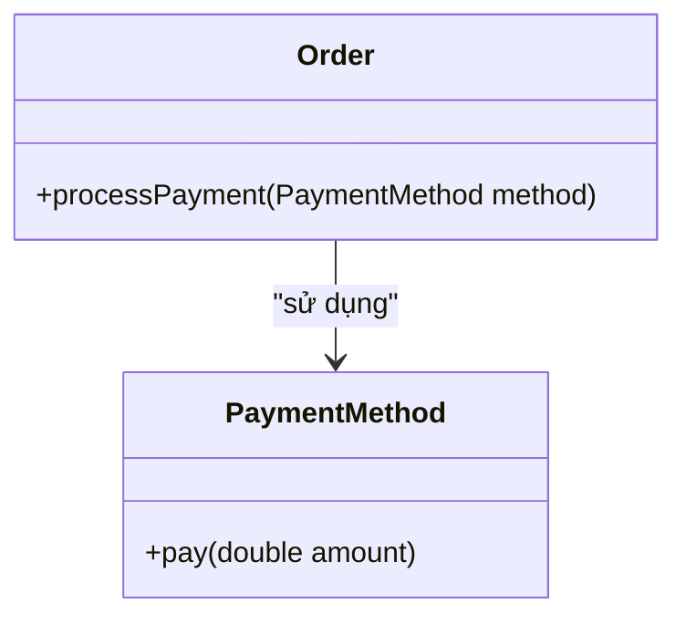
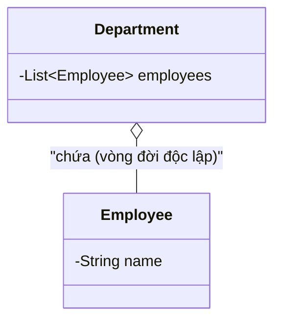
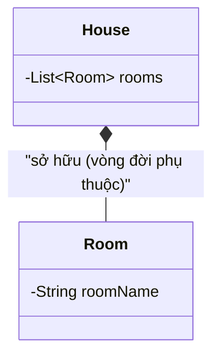
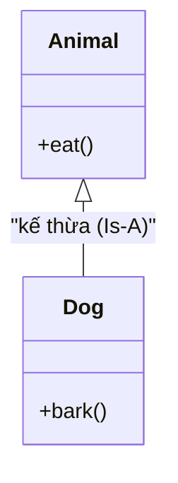
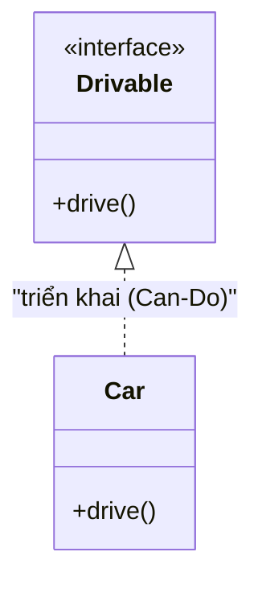

# Mối Quan Hệ Giữa Các Lớp (Class Relationships)

## Table of Contents

- [Tổng Quan Các Mối Quan Hệ](#tổng-quan-các-mối-quan-hệ)
- [Chi Tiết Các Dạng Quan Hệ](#chi-tiết-các-dạng-quan-hệ)
- [Phân Biệt Is-A, Has-A và Can-Do](#phân-biệt-is-a-has-a-và-can-do)

---

## Tổng Quan Các Mối Quan Hệ

Trong thiết kế Hướng Đối Tượng, các lớp không hoạt động cô lập mà liên kết với nhau qua các mối quan hệ cấu trúc. Việc xác định đúng dạng quan hệ giúp kiến trúc phần mềm đạt tiêu chuẩn **`High Cohesion`** và **`Low Coupling`**:

- **`High Cohesion` (Tính gắn kết cao)**: Mỗi lớp/module tập trung xử lý một trách nhiệm duy nhất và các thành phần bên trong có liên kết chặt chẽ với mục tiêu đó, giúp hệ thống dễ hiểu, dễ bảo trì và dễ kiểm thử.
- **`Low Coupling` (Tính liên kết lỏng)**: Giảm thiểu tối đa sự phụ thuộc trực tiếp giữa các lớp. Thay đổi tại một lớp sẽ ít hoặc không gây ảnh hưởng chân dây chuyền tới các lớp khác, tăng tính linh hoạt và khả năng mở rộng.
---

## Chi Tiết Các Dạng Quan Hệ

### 1. Association

**Association** biểu diễn mối quan hệ giao tiếp thông thường giữa 2 lớp. Một lớp sử dụng dịch vụ của lớp kia thông qua phương thức hoặc tham số truyền vào mà không có quan hệ sở hữu.

Sơ đồ biểu diễn quan hệ Association:



Ví dụ mã nguồn biểu diễn quan hệ Association trong Java:

```java
public class PaymentMethod {
    public void pay(double amount) {
        System.out.println("Paid $" + amount);
    }
}

public class Order {
    // Association: Order nhận PaymentMethod qua tham số hàm (không sở hữu làm thuộc tính)
    public void processPayment(PaymentMethod method, double amount) {
        method.pay(amount);
    }
}
```

### 2. Aggregation

**Aggregation** là quan hệ sở hữu dạng **`Has-A`** nhưng có **vòng đời độc lập**. Lớp sở hữu chứa tham chiếu đến đối tượng khác, nhưng nếu đối tượng sở hữu bị hủy, đối tượng thành phần vẫn tiếp tục tồn tại độc lập.

Sơ đồ biểu diễn quan hệ Aggregation:



Ví dụ mã nguồn biểu diễn quan hệ Aggregation trong Java:

```java
public class Employee {
    private String name;

    public Employee(String name) {
        this.name = name;
    }
}

public class Department {
    private List<Employee> employees; // Has-A (Lỏng)

    // Aggregation: Employee được khởi tạo từ bên ngoài và truyền vào (Dependency Injection)
    public Department(List<Employee> employees) {
        this.employees = employees;
    }
    // Nếu đối tượng Department bị hủy, danh sách Employee bên ngoài vẫn tồn tại độc lập
}
```

### 3. Composition

**Composition** là quan hệ sở hữu mạnh dạng **`Has-A`** với **vòng đời phụ thuộc tuyệt đối**. Lớp sở hữu trực tiếp tạo và quản lý đối tượng thành phần. Khi đối tượng cha bị xóa khỏi bộ nhớ, toàn bộ đối tượng thành phần con cũng bị tiêu hủy theo.

Sơ đồ biểu diễn quan hệ Composition:



Ví dụ mã nguồn biểu diễn quan hệ Composition trong Java:

```java
public class Room {
    private String roomName;

    public Room(String roomName) {
        this.roomName = roomName;
    }
}

public class House {
    private List<Room> rooms; // Has-A (Chặt)

    public House() {
        this.rooms = new ArrayList<>();
        // Composition: House tự trực tiếp tạo và quản lý vòng đời của các đối tượng Room
        this.rooms.add(new Room("Living Room"));
        this.rooms.add(new Room("Bedroom"));
    }
    // Khi House bị hủy khỏi bộ nhớ, toàn bộ các đối tượng Room bên trong cũng bị hủy theo
}
```

### 4. Inheritance / Generalization (Kế thừa - Is-A)

**Inheritance (Generalization)** biểu diễn mối quan hệ phân cấp kiểu bản chất dạng **`Is-A`** giữa lớp con và lớp cha. Lớp con thừa hưởng toàn bộ thuộc tính, phương thức của lớp cha.

Sơ đồ biểu diễn quan hệ Inheritance:



Ví dụ mã nguồn biểu diễn quan hệ Inheritance trong Java:

```java
public class Animal {
    public void eat() {
        System.out.println("Animal is eating...");
    }
}

// Inheritance: Dog là một (Is-A) Animal
public class Dog extends Animal {
    public void bark() {
        System.out.println("Dog is barking...");
    }
}
```

### 5. Realization / Implementation (Triển khai - Can-Do)

**Realization** biểu diễn mối quan hệ giữa một lớp với một Interface mà nó triển khai, thể hiện năng lực hành vi dạng **`Can-Do`**.

Sơ đồ biểu diễn quan hệ Realization:



Ví dụ mã nguồn biểu diễn quan hệ Realization trong Java:

```java
// Interface thể hiện năng lực hành vi (Can-Do)
public interface Drivable {
    void drive();
}

// Realization: Car thực thi hợp đồng hành vi drive()
public class Car implements Drivable {
    @Override
    public void drive() {
        System.out.println("Car is driving on the road.");
    }
}
```

---

## Phân Biệt Is-A, Has-A và Can-Do

Bảng so sánh tổng hợp các mối quan hệ giữa các lớp trong OOP:

| Mối quan hệ | Ngữ nghĩa bản chất | Ràng buộc vòng đời | Mức độ phụ thuộc (`Coupling`) |
| :--- | :--- | :--- | :--- |
| **Association** | Giao tiếp / Sử dụng | Độc lập hoàn toàn | Rất lỏng (`Very Loose`) |
| **Aggregation** | **`Has-A`** (Sở hữu lỏng lẽo) | Độc lập (Xóa cha, con vẫn tồn tại) | Lỏng lẽo (`Loose`) |
| **Composition** | **`Has-A`** (Sở hữu chặt chẽ) | Phụ thuộc (Xóa cha, con bị xóa theo) | Trung bình (`Moderate`) |
| **Inheritance** | **`Is-A`** (Là một) | Biên dịch compile-time | Rất chặt (`Tight Coupling`) |
| **Realization** | **`Can-Do`** (Có thể làm) | Hợp đồng interface | Lỏng (`Loose Coupling`) |

---

[← Quay lại README OOP](README.md)

