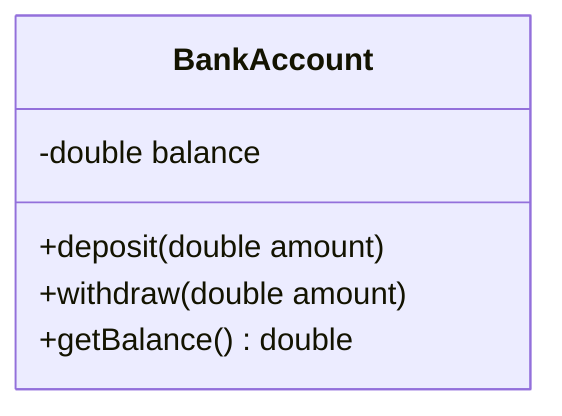

# Đóng Gói (Encapsulation)

## Table of Contents

- [Khái Niệm & Mục Tiêu](#khái-niệm--mục-tiêu)
- [Chi Tiết Kỹ Thuật & Ví Dụ](#chi-tiết-kỹ-thuật--ví-dụ)
- [Lợi Ích Kiến Trúc](#lợi-ích-kiến-trúc)

---

## Khái Niệm & Mục Tiêu

**Đóng gói (Encapsulation)** là cơ chế nén dữ liệu (trạng thái nội bộ) và các hàm xử lý dữ liệu đó vào trong cùng một thực thể độc lập (Class/Object), đồng thời kiểm soát quyền truy cập trực tiếp từ bên ngoài.

Mục tiêu chính:
- **Bảo vệ tính toàn vẹn (Invariant Protection)**: Ngăn chặn dữ liệu bị sửa đổi tự do thành các giá trị không hợp lệ.
- **Giảm độ phụ thuộc (`Low Coupling`)**: Bên ngoài chỉ tương tác qua các phương thức được cho phép (`public API`), hoàn toàn không phụ thuộc vào cấu trúc lưu trữ nội bộ.

---

## Chi Tiết Kỹ Thuật & Ví Dụ

Đóng gói không đơn thuần là việc khai báo thuộc tính `private` rồi tạo bộ đôi `getter/setter`. Nếu một lớp tạo `setter` công khai mà không có kiểm tra điều kiện, tính đóng gói vẫn bị vi phạm.

Sơ đồ thể hiện ranh giới đóng gói dữ liệu của lớp tài khoản ngân hàng:



Ví dụ triển khai Đóng gói hợp lệ bảo vệ trạng thái trong Java:

```java
// Lớp tài khoản ngân hàng bảo vệ chặt chẽ trạng thái số dư
public class BankAccount {
    private double balance;

    public BankAccount(double initialBalance) {
        if (initialBalance < 0) {
            throw new IllegalArgumentException("Số dư ban đầu không được âm.");
        }
        this.balance = initialBalance;
    }

    public void deposit(double amount) {
        if (amount <= 0) {
            throw new IllegalArgumentException("Số tiền nạp phải lớn hơn 0.");
        }
        this.balance += amount;
    }

    public void withdraw(double amount) {
        if (amount <= 0 || amount > this.balance) {
            throw new IllegalStateException("Giao dịch không hợp lệ hoặc số dư không đủ.");
        }
        this.balance -= amount;
    }

    public double getBalance() {
        return this.balance;
    }
}
```

---

## Lợi Ích Kiến Trúc

- **Bảo vệ dữ liệu rác**: Mọi thao tác thay đổi trạng thái đều bắt buộc phải trải qua các quy tắc kiểm tra nghiệp vụ.
- **Thay đổi nội bộ an toàn**: Lập trình viên có thể thay đổi kiểu dữ liệu nội bộ (ví dụ đổi từ `double` sang `BigDecimal`) mà không làm ảnh hưởng đến mã nguồn bên ngoài.

---

[← Quay lại README OOP](README.md)
