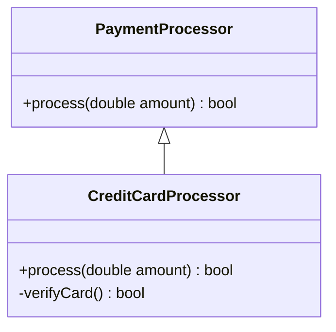

# Kế Thừa (Inheritance)

## Table of Contents

- [Khái Niệm & Mục Tiêu](#khái-niệm--mục-tiêu)
- [Nguyên Lý Phân Cấp Kiểu Is-A](#nguyên-lý-phân-cấp-kiểu-is-a)
- [Lưu Ý & Ví Dụ Triển Khai](#lưu-ý--ví-dụ-triển-khai)

---

## Khái Niệm & Mục Tiêu

**Kế thừa (Inheritance)** là cơ chế cho phép một lớp con (Subclass) tiếp nhận lại toàn bộ thuộc tính, phương thức từ một lớp cha (Superclass) và mở rộng thêm các tính năng riêng biệt.

Mục tiêu chính:
- Mô hình hóa mối quan hệ phân cấp kiểu bản chất (**`Is-A`**).
- Tái sử dụng cấu trúc mã nguồn và mở rộng hệ thống theo tầng bậc.

---

## Nguyên Lý Phân Cấp Kiểu Is-A

Kế thừa chỉ hợp lệ khi lớp con thỏa mãn tuyệt đối mối quan hệ **`Is-A`** (Là một) với lớp cha.

> [!WARNING]
> Không sử dụng Kế thừa chỉ để dùng lại mã nguồn (Code Reuse). Nếu hai lớp không có quan hệ bản chất `Is-A`, việc kế thừa sẽ tạo ra sự phụ thuộc chặt chẽ (`Tight Coupling`) và làm hỏng kiến trúc.

Sơ đồ mô hình kế thừa phân cấp bộ xử lý thanh toán:



---

## Lưu Ý & Ví Dụ Triển Khai

Khi thiết kế Kế thừa, lớp con phải tuân thủ **Nguyên lý Thay thế Liskov (LSP)**: Đối tượng của lớp cha có thể được thay thế bằng đối tượng của lớp con mà không làm hỏng tính đúng đắn của ứng dụng.

Ví dụ Kế thừa hợp lệ trong Java:

```java
// Lớp cha định nghĩa quy trình thanh toán chung
public class PaymentProcessor {
    public boolean process(double amount) {
        System.out.println("Processing generic payment: $" + amount);
        return true;
    }
}

// Lớp con kế thừa và mở rộng tính năng xác thực thẻ
public class CreditCardProcessor extends PaymentProcessor {
    @Override
    public boolean process(double amount) {
        System.out.println("Authenticating Credit Card...");
        return super.process(amount);
    }
}
```

---

[← Quay lại README OOP](README.md)
