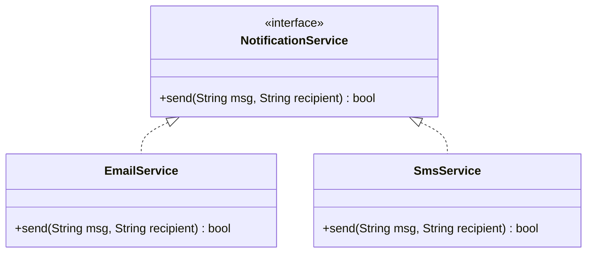

# Đa Hình (Polymorphism)

## Table of Contents

- [Khái Niệm & Mục Tiêu](#khái-niệm--mục-tiêu)
- [Các Dạng Đa Hình Trong Lập Trình](#các-dạng-đa-hình-trong-lập-trình)
- [Ví Dụ Đa Hình Runtime](#ví-dụ-đa-hình-runtime)

---

## Khái Niệm & Mục Tiêu

**Đa hình (Polymorphism)** là khả năng các đối tượng thuộc các kiểu khác nhau xử lý cùng một thông điệp (gọi cùng một phương thức) theo những cách thức riêng biệt tại runtime.

Mục tiêu chính:
- **Tách biệt phụ thuộc (`Decoupling`)**: Phía gọi (Client) chỉ giao tiếp qua giao diện trừu tượng chung, không cần quan tâm lớp cụ thể nào đang thực thi.
- **Mở rộng linh hoạt (`Open-Closed Principle`)**: Dễ dàng thêm lớp triển khai mới mà không phải chỉnh sửa mã nguồn xử lý sẵn có.

---

## Các Dạng Đa Hình Trong Lập Trình

1. **Compile-time Polymorphism (Đa hình lúc biên dịch / Overloading)**: Cùng một tên hàm nhưng khác tham số đầu vào trong cùng một lớp.
2. **Runtime Polymorphism (Đa hình lúc thực thi / Overriding)**: Lớp con hoặc lớp triển khai ghi đè phương thức từ Interface/Abstract class, quyết định hành vi thực thi tại thời điểm chạy.

Sơ đồ giao tiếp đa hình qua interface chung:



---

## Ví Dụ Đa Hình Runtime

Ví dụ triển khai Đa hình Runtime trong Java:

```java
// Interface chung định nghĩa hợp đồng thông báo
public interface NotificationService {
    boolean send(String message, String recipient);
}

public class EmailService implements NotificationService {
    @Override
    public boolean send(String message, String recipient) {
        System.out.println("Sending Email to " + recipient + ": " + message);
        return true;
    }
}

public class SmsService implements NotificationService {
    @Override
    public boolean send(String message, String recipient) {
        System.out.println("Sending SMS to " + recipient + ": " + message);
        return true;
    }
}

// Phía gọi chỉ phụ thuộc vào Interface chung
public class NotificationManager {
    public void notifyUser(NotificationService service, String msg, String user) {
        // Hành vi gửi email hay SMS sẽ do đối tượng cụ thể quyết định tại runtime
        service.send(msg, user);
    }
}
```

---

[← Quay lại README OOP](README.md)
