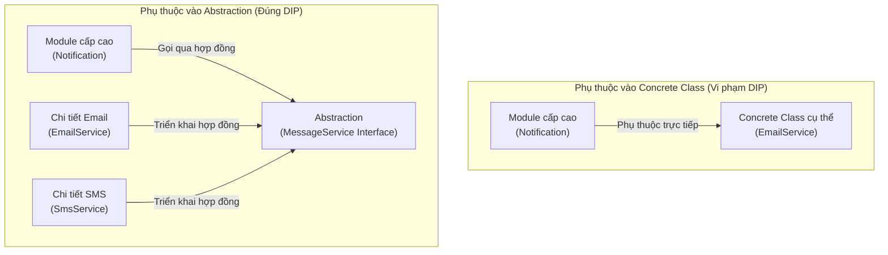

# Dependency Inversion Principle (DIP)

## Table of Contents

- [Tổng quan về nguyên lý](#tổng-quan-về-nguyên-lý)
- [Ví dụ minh họa](#ví-dụ-minh-họa)
- [Bản chất của việc phụ thuộc vào Abstraction](#bản-chất-của-việc-phụ-thuộc-vào-abstraction)
- [Sơ đồ kiến trúc đảo ngược phụ thuộc](#sơ-đồ-kiến-trúc-đảo-ngược-phụ-thuộc)
- [Lợi ích](#lợi-ích)

---

## Tổng quan về nguyên lý

Nguyên lý đảo ngược phụ thuộc (DIP) đưa ra hai mệnh đề cốt lõi:

> **1. Các module cấp cao (*High-level modules*) không nên phụ thuộc vào các module cấp thấp (*Low-level modules*). Cả hai đều phải phụ thuộc vào Abstraction.**
>
> **2. Abstraction không được phụ thuộc vào chi tiết triển khai (*Details*). Chi tiết triển khai bắt buộc phải phụ thuộc vào Abstraction.**

> [!NOTE]
> - **Module cấp cao (*High-level module*)**: Đại diện cho tầng xử lý logic nghiệp vụ (*Business Logic*), chịu trách nhiệm điều phối luồng xử lý và đưa ra các quyết định quan trọng (ví dụ: `Notification`, `OrderService`, `PaymentProcessor`).
> - **Module cấp thấp (*Low-level module*)**: Đại diện cho các tác vụ kỹ thuật cơ sở hạ tầng, I/O, cơ sở dữ liệu hoặc dịch vụ bên thứ ba (ví dụ: `EmailService`, `SmsClient`, `MySqlRepository`).

---

## Ví dụ minh họa

### Trường hợp 1: Tự khởi tạo trực tiếp class cấp thấp (Sai DIP)

Đoạn mã sau tự khởi tạo đối tượng triển khai cụ thể bên trong class nghiệp vụ.

```java
public class EmailService {
    public void sendEmail(String message) {
        System.out.println("Gửi thư điện tử: " + message);
    }
}

public class Notification {
    // Module cấp cao tự tạo và gắn cứng với class cấp thấp cụ thể
    private EmailService emailService = new EmailService();

    public void send(String message) {
        emailService.sendEmail(message);
    }
}
```

Trong thiết kế này, `Notification` bị trói chặt vào `EmailService` ngay từ lúc khởi tạo.

---

### Trường hợp 2: Truyền trực tiếp Concrete Class qua Constructor (Vẫn vi phạm DIP)

Đoạn mã sau nhận `EmailService` qua tham số hàm khởi tạo thay vì tự `new`.

```java
public class EmailService {
    public void sendEmail(String message) {
        System.out.println("Gửi thư điện tử: " + message);
    }
}

public class Notification {
    // Vẫn phụ thuộc trực tiếp vào Concrete Class (Chi tiết triển khai)
    private final EmailService emailService;

    public Notification(EmailService emailService) {
        this.emailService = emailService;
    }

    public void send(String message) {
        this.emailService.sendEmail(message);
    }
}
```

> [!WARNING]
> Mặc dù đối tượng `EmailService` được truyền từ bên ngoài vào qua constructor, `Notification` vẫn **vi phạm DIP** vì kiểu dữ liệu tham chiếu vẫn là class triển khai cụ thể (`EmailService`) chứ không phải một Abstraction. Khi cần gửi thông báo bằng `SmsService` hay `ZaloService`, ta vẫn buộc phải thay đổi mã nguồn của `Notification`.

---

### Trường hợp 3: Thiết kế đúng chuẩn DIP (Phụ thuộc vào Abstraction)

Đoạn mã dưới đây sử dụng interface làm hợp đồng trung gian giữa module cấp cao và các chi tiết triển khai.

```java
// 1. Abstraction (Hợp đồng chung)
public interface MessageService {
    void sendMessage(String message);
}

// 2. Chi tiết triển khai 1 (Module cấp thấp)
public class EmailService implements MessageService {
    @Override
    public void sendMessage(String message) {
        System.out.println("Gửi thư điện tử: " + message);
    }
}

// 3. Chi tiết triển khai 2 (Module cấp thấp)
public class SmsService implements MessageService {
    @Override
    public void sendMessage(String message) {
        System.out.println("Gửi tin nhắn SMS: " + message);
    }
}

// 4. Module cấp cao chỉ phụ thuộc vào Abstraction
public class Notification {
    private final MessageService messageService;

    public Notification(MessageService messageService) {
        this.messageService = messageService;
    }

    public void send(String message) {
        this.messageService.sendMessage(message);
    }
}
```

Lúc này, `Notification` chỉ biết đến `MessageService`. Mọi chi tiết kỹ thuật như gửi qua email hay SMS đều do các class triển khai phụ trách.

---

## Bản chất của việc phụ thuộc vào Abstraction

Một module được xem là **phụ thuộc vào Abstraction** khi đáp ứng ba tiêu chuẩn kỹ thuật:

1. **Giao tiếp qua hợp đồng trừu tượng**: Kiểu dữ liệu của biến thành viên, tham số hàm hoặc kiểu trả về đều là `interface` hoặc `abstract class` (ví dụ: `MessageService`), tuyệt đối không tham chiếu trực tiếp class cụ thể.
2. **Ẩn giấu chi tiết kỹ thuật**: Module cấp cao hoàn toàn không biết và không quan tâm bên dưới sử dụng giao thức nào (SMTP, REST API, WebSocket), thư viện nào hay kết nối cơ sở dữ liệu nào.
3. **Độc lập trước biến đổi**: Việc sửa đổi logic bên trong class cấp thấp hoặc thay thế bằng một class cấp thấp khác không gây ra bất kỳ tác động nào lên module cấp cao.

> [!IMPORTANT]
> **Abstraction không được phụ thuộc vào chi tiết**: Bản thân interface phải được thiết kế xoay quanh nhu cầu của nghiệp vụ, không được để lộ chi tiết công nghệ của một bên triển khai cụ thể (ví dụ: đặt tên method là `sendMessage(...)` thay vì `sendViaSmtpPort25(...)`).

---

## Sơ đồ kiến trúc đảo ngược phụ thuộc



| Thành phần | Vai trò kiến trúc | Trách nhiệm |
| :--- | :--- | :--- |
| **Module cấp cao** (`Notification`) | Điều phối nghiệp vụ | Tiếp nhận yêu cầu và điều phối việc gửi tin mà không quan tâm hạ tầng kỹ thuật. |
| **Abstraction** (`MessageService`) | Cầu nối giao ước (*Contract*) | Định nghĩa tập hành vi chuẩn mà module cấp cao yêu cầu. |
| **Chi tiết triển khai** (`EmailService`, `SmsService`) | Xử lý hạ tầng kỹ thuật | Thực thi hành vi cụ thể tương thích với giao ước mà Abstraction đặt ra. |

---

## Lợi ích

- **Mô-đun hóa tối đa (*Loose Coupling*)**: Giảm thiểu sự liên kết cứng nhắc giữa các tầng trong ứng dụng.
- **Tối ưu hóa khả năng kiểm thử (*Testability*)**: Dễ dàng truyền các đối tượng giả lập (`MockMessageService`) vào tầng nghiệp vụ để viết Unit Test cô lập mà không cần gửi mail hay SMS thật.
- **Dễ dàng mở rộng (*Extensibility*)**: Thêm các kênh thông báo mới (Zalo, Telegram, Push Notification) chỉ bằng cách tạo class mới hiện thực interface mà không làm thay đổi tầng logic nghiệp vụ sẵn có.

---
[← Quay lại mục lục SOLID](README.md)
