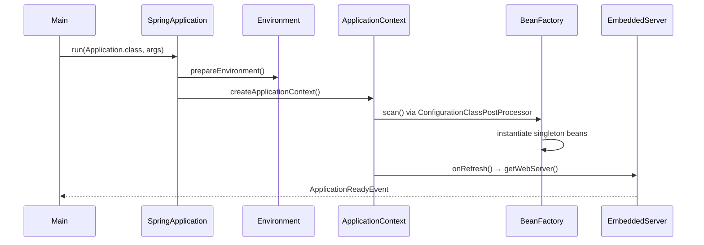
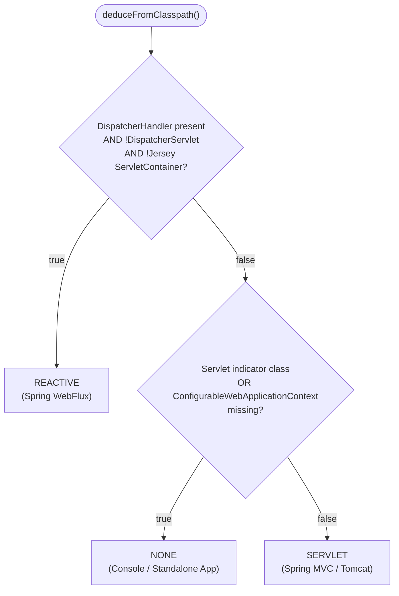
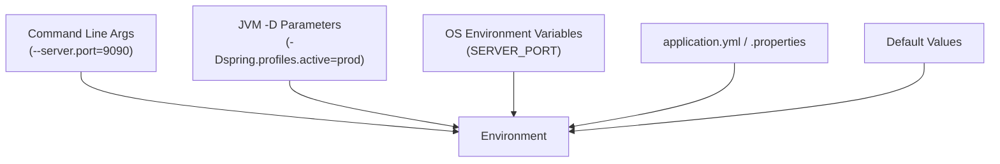
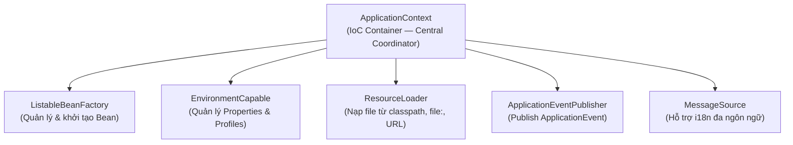
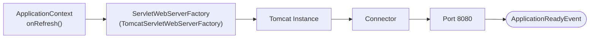

# Spring Boot Startup & IoC Container

## Table of Contents

- [Startup Overview](#startup-overview)
- [WebApplicationType Detection](#webapplicationtype-detection)
- [Environment & PropertySource](#environment--propertysource)
- [ApplicationContext & BeanFactory](#applicationcontext--beanfactory)
- [Embedded Server Startup](#embedded-server-startup)

---

## Startup Overview

Phương thức `main` của mọi ứng dụng Spring Boot chỉ chứa một câu lệnh duy nhất, nhưng ẩn sau đó là chuỗi xử lý được chia thành 6 giai đoạn liên kết chặt chẽ.

Khai báo entry point chuẩn của ứng dụng Spring Boot:

```java
@SpringBootApplication
public class Application {
    public static void main(String[] args) {
        SpringApplication.run(Application.class, args);
    }
}
```

Câu lệnh trên tương đương với việc khởi tạo instance và gọi `run()` tường minh:

```java
new SpringApplication(Application.class).run(args);
```

`SpringApplication` đóng vai trò **Bootstrapper** — không quản lý bean, không phải IoC Container. Nhiệm vụ của nó là chuẩn bị hạ tầng startup, khởi tạo đúng loại `ApplicationContext`, và kích hoạt toàn bộ quy trình nạp cấu hình.

Luồng tổng quan qua 6 giai đoạn khởi động:

```mermaid
flowchart LR
    accTitle: Spring Boot Six-Phase Startup Flow
    accDescr: Overall execution flow from main() to Application Ready state across six phases.

    mainNode(["main()"]) --> runNode["SpringApplication.run()"]
    runNode --> envNode["Prepare Environment"]
    envNode --> ctxNode["Create ApplicationContext"]
    ctxNode --> loadNode["Load BeanDefinitions"]
    loadNode --> beanNode["Instantiate Singleton Beans"]
    beanNode --> serverNode["Start Embedded Server"]
    serverNode --> readyNode(["Application Ready"])
```



Mục tiêu cụ thể của từng giai đoạn:

| Phase | Mục tiêu | Thành phần đảm trách |
| :--- | :--- | :--- |
| **Bootstrap** | Khởi tạo `SpringApplication`, phát hiện loại ứng dụng | `SpringApplication` constructor |
| **Environment** | Tổng hợp toàn bộ nguồn cấu hình | `SpringApplicationRunListeners` |
| **Context** | Khởi tạo IoC Container phù hợp với runtime | `ApplicationContextFactory` |
| **Bean Loading** | Quét classpath, đăng ký `BeanDefinition` | `ClassPathBeanDefinitionScanner` |
| **Bean Creation** | Khởi tạo singleton bean, inject dependency | `DefaultListableBeanFactory` |
| **Web Server** | Kích hoạt Tomcat/Jetty lắng nghe HTTP | `ServletWebServerApplicationContext` |

Biểu đồ trình tự thể hiện sự phối hợp giữa các thành phần trung tâm trong quá trình khởi động:



> [!NOTE]
> Toàn bộ logic quan trọng nhất — từ scan BeanDefinition đến khởi tạo bean — diễn ra trong phương thức `ApplicationContext.refresh()`. Đây là phương thức trung tâm của Spring Framework.

---

## WebApplicationType Detection

Ngay trong constructor của `SpringApplication`, hệ thống phân tích classpath để xác định loại ứng dụng sẽ chạy. Thuật toán này ảnh hưởng trực tiếp đến loại `ApplicationContext` được khởi tạo ở giai đoạn sau.

Spring gọi `WebApplicationType.deduceFromClasspath()` với logic kiểm tra loại trừ theo thứ tự ưu tiên:



Ba nhánh kết quả và ý nghĩa kiến trúc:

| Loại | Điều kiện xác định | `ApplicationContext` được tạo |
| :--- | :--- | :--- |
| **REACTIVE** | `DispatcherHandler` có mặt, `DispatcherServlet` vắng mặt | `AnnotationConfigReactiveWebServerApplicationContext` |
| **NONE** | Thiếu `javax/jakarta.servlet.Servlet` hoặc `ConfigurableWebApplicationContext` | `AnnotationConfigApplicationContext` |
| **SERVLET** | Có đủ cả hai class chỉ báo Servlet | `AnnotationConfigServletWebServerApplicationContext` |

> [!TIP]
> Thứ tự kiểm tra REACTIVE → NONE → SERVLET là có chủ đích. Spring ưu tiên loại trừ WebFlux trước để tránh nhầm lẫn khi cả hai dependency cùng tồn tại trên classpath (trường hợp hiếm gặp nhưng có thể xảy ra trong dự án migration).

---

## Environment & PropertySource

Giai đoạn chuẩn bị `Environment` diễn ra **trước khi bất kỳ bean nào được khởi tạo**. Spring tập hợp toàn bộ nguồn cấu hình vào một đối tượng thống nhất để `BeanFactory` có thể tra cứu sau.

Các nguồn cấu hình được tổng hợp vào `Environment`:



`Environment` duy trì danh sách `PropertySource` theo thứ tự ưu tiên giảm dần — nguồn đứng trước ghi đè nguồn đứng sau khi trùng key:

```text
Priority (cao → thấp):
  1. Command Line Arguments     (--key=value)
  2. JVM System Properties      (-Dkey=value)
  3. OS Environment Variables
  4. application-{profile}.yml
  5. application.yml / .properties
  6. Default Properties
```

> [!NOTE]
> Danh sách trên là rút gọn. Thứ tự đầy đủ trong Spring Boot bao gồm hơn 17 cấp, bao gồm `@TestPropertySource`, `SPRING_APPLICATION_JSON`, `RandomValuePropertySource`, Devtools global settings, v.v.

Khi annotation `@Value` hoặc `@ConfigurationProperties` được xử lý, Spring gọi `environment.getProperty(key)` — duyệt tuần tự qua từng `PropertySource` và trả về giá trị đầu tiên tìm thấy:

```java
// Spring nội bộ thực hiện tra cứu theo thứ tự ưu tiên
String port = environment.getProperty("server.port");
```

`Environment` bắt buộc phải hoàn chỉnh trước `BeanFactory` vì các bean hạ tầng cần thông số cấu hình (database URL, Redis host, JWT secret) ngay tại thời điểm khởi tạo. Nếu đảo ngược thứ tự, `BeanFactory` sẽ không thể resolve `@Value` khi tạo `DataSource` bean.

---

## ApplicationContext & BeanFactory

Sau khi `Environment` sẵn sàng, `SpringApplication` khởi tạo `ApplicationContext` — IoC Container cấp cao của Spring. Điểm cần hiểu rõ: `ApplicationContext` không tự làm tất cả mà **ủy thác** mỗi mảng công việc cho các subsystem con.

Kiến trúc các năng lực được tích hợp trong `ApplicationContext`:



Phân biệt rõ hai khái niệm thường bị nhầm lẫn:

| Khía cạnh | `BeanFactory` | `ApplicationContext` |
| :--- | :--- | :--- |
| **Vai trò** | IoC Container lõi — khởi tạo và quản lý bean | Wrapper cấp cao — tích hợp nhiều hệ thống con |
| **Khởi tạo Bean** | Lazy theo mặc định (tạo khi được yêu cầu) | Eager với singleton (tạo hết ngay khi refresh) |
| **Event System** | Không có | Có `ApplicationEventPublisher` |
| **i18n** | Không có | Có `MessageSource` |
| **Resource Loading** | Hạn chế | Có `ResourceLoader` đầy đủ |
| **Dùng trong production** | Hiếm khi dùng trực tiếp | Luôn dùng thông qua `ApplicationContext` |

`BeanFactory` xử lý pipeline nội bộ theo trình tự:

```text
BeanDefinition → Resolve Dependencies → new Instance() → Inject Fields → Callbacks → Singleton Cache
```

> [!IMPORTANT]
> `ApplicationContext` mở rộng `BeanFactory`. Mọi thao tác trên `ApplicationContext` đều đi qua `BeanFactory` bên dưới. Khi Spring docs nói "tạo bean", đó là `DefaultListableBeanFactory` thực thi — không phải `ApplicationContext`.

---

## Embedded Server Startup

Khi toàn bộ singleton bean đã khởi tạo xong, `ApplicationContext` kích hoạt Web Server nhúng thông qua hook `onRefresh()`. Đây là giai đoạn cuối trước khi ứng dụng sẵn sàng nhận traffic.

Chuỗi kích hoạt Embedded Server:



Các bước gọi khởi động Web Server:

```text
ServletWebServerApplicationContext.onRefresh()
  → getWebServer()
  → TomcatServletWebServerFactory.getWebServer()
  → Tomcat.start()
  → Connector.init() + Connector.start()
  → ApplicationReadyEvent published
```

Spring Boot tìm kiếm bean triển khai `ServletWebServerFactory` (mặc định là `TomcatServletWebServerFactory` khi có dependency `spring-boot-starter-web`) và yêu cầu khởi tạo `WebServer`. Khi Tomcat bắt đầu lắng nghe trên port cấu hình, `EventPublishingRunListener` bắn `ApplicationReadyEvent`, đánh dấu ứng dụng đã sẵn sàng xử lý HTTP request.

> [!TIP]
> `ApplicationReadyEvent` là thời điểm thích hợp để thực thi logic warm-up (pre-load cache, kiểm tra kết nối external service) vì tại đây tất cả bean đã hoàn toàn ready. Dùng `@EventListener(ApplicationReadyEvent.class)` thay vì `@PostConstruct` khi cần đảm bảo toàn bộ context đã khởi tạo xong.

Bảng tổng hợp toàn bộ luồng từ `main()` đến trạng thái sẵn sàng:

| Bước | Thành phần | Hành động |
| :--- | :--- | :--- |
| **1** | `main()` | Gọi `SpringApplication.run(Application.class, args)` |
| **2** | `SpringApplication` | Phát hiện `WebApplicationType`, nạp `Initializers` & `Listeners` |
| **3** | `SpringApplicationRunListeners` | Tổng hợp `Environment` từ tất cả nguồn cấu hình |
| **4** | `ApplicationContextFactory` | Khởi tạo `ApplicationContext` phù hợp với `WebApplicationType` |
| **5** | `ClassPathBeanDefinitionScanner` | Quét classpath, đánh giá `@Conditional`, đăng ký `BeanDefinition` |
| **6** | `DefaultListableBeanFactory` | Giải quyết dependency graph, khởi tạo singleton bean |
| **7** | `BeanPostProcessor` pipeline | Chạy `@PostConstruct`, bọc AOP proxy |
| **8** | `DefaultSingletonBeanRegistry` | Đưa bean hoàn chỉnh vào Cache Cấp 1 (`singletonObjects`) |
| **9** | `onRefresh()` hook | Khởi động Embedded Tomcat, lắng nghe HTTP port |
| **10** | `EventPublishingRunListener` | Bắn `ApplicationReadyEvent` |

---
[← Back to README](README.md)
