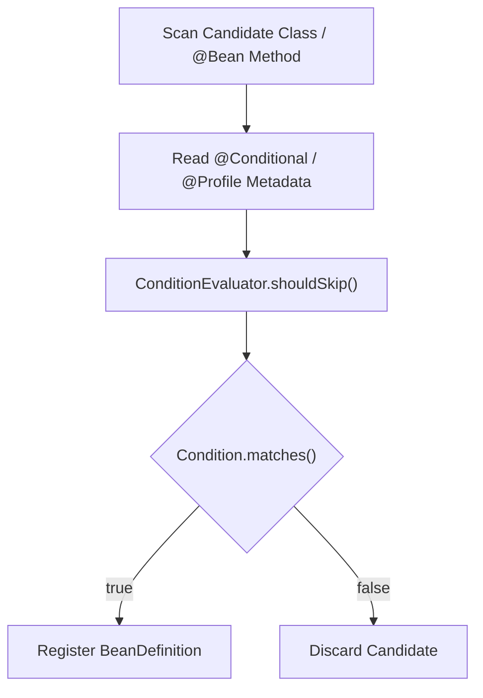
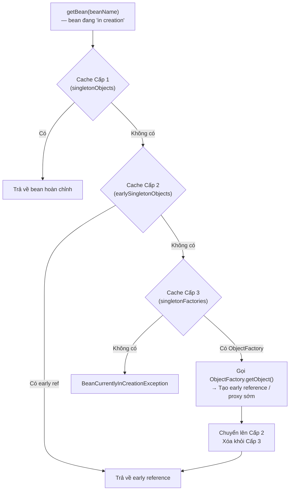

# Bean Lifecycle & Dependency Injection

## Table of Contents

- [BeanDefinition & Two-Phase Design](#beandefinition--two-phase-design)
- [Component Scan & Condition Evaluation](#component-scan--condition-evaluation)
- [Bean Creation Pipeline](#bean-creation-pipeline)
- [Constructor DI vs Field/Setter DI](#constructor-di-vs-fieldsetter-di)
- [Singleton 3-Level Cache & Circular Dependency](#singleton-3-level-cache--circular-dependency)

---

## BeanDefinition & Two-Phase Design

Spring không khởi tạo instance Java ngay khi quét thấy một class có annotation. Thay vào đó, toàn bộ thông tin cấu hình được đóng gói thành đối tượng `BeanDefinition` — một bản thiết kế metadata thuần túy chưa tiêu tốn bộ nhớ heap cho object thật.

Một `@Service` đơn giản sau khi được quét:

```java
@Service
public class UserService {
    private final UserRepository userRepository;

    public UserService(UserRepository userRepository) {
        this.userRepository = userRepository;
    }
}
```

Được ghi nhận dưới dạng metadata trong `BeanFactory`:

```text
BeanDefinition — UserService:
  beanClass:        UserService.class
  scope:            singleton
  lazyInit:         false
  autowireMode:     constructor
  dependsOn:        [userRepository]
  initMethodName:   null
  destroyMethodName: null
```

Mô hình chuyển đổi từ metadata sang instance thật:

```text
BeanDefinition (Metadata)  →  BeanFactory (Engine)  →  Object Instance (Runtime)
         ↕                                                       ↕
    Class Metadata         →  Reflection API         →      new Object()
```

Lý do thiết kế 2 giai đoạn tách biệt:

| Lợi ích | Giải thích kỹ thuật |
| :--- | :--- |
| **Phân tích dependency graph đầy đủ** | `BeanFactory` biết tất cả bean trước khi tạo bất kỳ bean nào, tránh lỗi thiếu dependency runtime |
| **Áp dụng AOP và BeanPostProcessor** | Proxy wrapper và custom post-processor chỉ có thể được inject sau khi có đủ metadata |
| **Phát hiện Circular Dependency sớm** | Dependency vòng có thể bị phát hiện và xử lý ở giai đoạn graph analysis |
| **`BeanFactoryPostProcessor` có thể chỉnh sửa metadata** | Cho phép dynamic modification trước khi instantiation (ví dụ: `PropertySourcesPlaceholderConfigurer`) |

> [!IMPORTANT]
> Nếu Spring khởi tạo object ngay khi quét, các phụ thuộc chéo sẽ thất bại vì class B có thể chưa được quét tới khi class A cần B. Two-phase design là lý do Spring có thể xử lý dependency graph phức tạp tuỳ ý.

---

## Component Scan & Condition Evaluation

Giai đoạn Component Scan thực thi cơ chế `@ComponentScan` — duyệt qua toàn bộ classpath trong base package, tìm các class mang annotation `@Component` hoặc các stereotype của nó (`@Service`, `@Repository`, `@Controller`).

Tiến trình tìm và đăng ký `BeanDefinition`:

```text
Scan Package
  → Find @Component / @Service / @Repository / @Controller / @Configuration
  → Evaluate @Conditional / @Profile conditions
  → Register BeanDefinition (nếu điều kiện thỏa mãn)
```

Mọi điều kiện `@Conditional` và `@Profile` đều được đánh giá **tại giai đoạn này** — trước khi bất kỳ instance bean nào được tạo:



`ConditionEvaluator` hoạt động theo hai pha phụ thuộc vào vị trí annotation:

| Pha (`ConfigurationPhase`) | Áp dụng trên | Hành vi khi `matches()` = `false` |
| :--- | :--- | :--- |
| **`PARSE_CONFIGURATION`** | Lớp `@Configuration` | Bỏ qua toàn bộ lớp và tất cả `@Bean` method bên trong |
| **`REGISTER_BEAN`** | `@Bean` method hoặc `@Component` đơn lẻ | Bỏ qua chỉ bean cụ thể đó |

`@Profile("dev")` thực chất là `@Conditional(ProfileCondition.class)`. Class `ProfileCondition` kiểm tra `environment.acceptsProfiles(Profiles.of("dev"))` — nếu profile không khớp, `ConditionEvaluator.shouldSkip()` trả về `true` và Spring không tạo `BeanDefinition` cho class đó.

> [!NOTE]
> Lọc ở cấp `BeanDefinition` thay vì ở cấp instance giúp tiết kiệm bộ nhớ và tránh lỗi thiếu dependency cho các bean không được kích hoạt. Bean bị loại bỏ không tồn tại trong `BeanFactory` registry — không phải tồn tại nhưng bị ẩn.

---

## Bean Creation Pipeline

Sau khi toàn bộ `BeanDefinition` được đăng ký, `BeanFactory` bắt đầu khởi tạo các singleton bean không khai báo `lazy-init = true`. Quy trình gồm 8 bước tuần tự:

| Bước | Giai đoạn | Hành động | Trạng thái Bean |
| :--- | :--- | :--- | :--- |
| **1** | **Resolve Constructor Args** | Tra cứu và resolve các bean dependency cần cho constructor | Chưa có instance. Nếu required dependency không tìm thấy → `BeanCreationException` |
| **2** | **Instantiate** | Gọi constructor qua Reflection: `new TargetClass(resolvedArgs)` | Instance thô được cấp phát trong heap JVM |
| **3** | **Populate Properties** | Quét `@Autowired`, `@Value` trên field và setter để inject | Field và setter dependency được gán giá trị |
| **4** | **Aware Callbacks** | Inject infrastructure interface (`BeanNameAware`, `BeanFactoryAware`, `ApplicationContextAware`) | Bean nhận biết được tên và container quản lý nó |
| **5** | **BeanPostProcessor — Before Init** | Thực thi `postProcessBeforeInitialization()` của tất cả `BeanPostProcessor` | `@PostConstruct` được chạy tại đây (qua `CommonAnnotationBeanPostProcessor`) |
| **6** | **InitializingBean & Custom Init** | Gọi `afterPropertiesSet()` và `initMethod` nếu được khai báo | Logic khởi tạo nghiệp vụ của bean được thực thi |
| **7** | **BeanPostProcessor — After Init** | Thực thi `postProcessAfterInitialization()`, bọc AOP Proxy nếu cần | Trả về proxy (CGLIB hoặc JDK Dynamic Proxy) nếu bean có advice |
| **8** | **Singleton Cache** | Đưa instance hoàn chỉnh vào Cache Cấp 1 (`singletonObjects`) | Bean sẵn sàng phục vụ cho toàn bộ ứng dụng |

Bước 7 là nơi Spring AOP được áp dụng. `AbstractAutoProxyCreator` (một `BeanPostProcessor`) kiểm tra xem bean có khớp với bất kỳ pointcut nào không. Nếu có, nó trả về một Proxy thay thế instance gốc. Điều này có nghĩa là **bean được inject vào các class khác là Proxy, không phải raw instance**.

---

## Constructor DI vs Field/Setter DI

Hiểu đúng thứ tự 8 bước ở trên giúp phân biệt rõ bản chất kỹ thuật của hai phong cách injection:

Constructor Injection (Bước 1 & 2 — trước và trong khi `new`):

```java
@Service
public class OrderService {
    // final field: đảm bảo tính bất biến (immutability)
    private final PaymentGateway paymentGateway;

    // Spring 4.3+: không cần @Autowired nếu chỉ có 1 constructor
    public OrderService(PaymentGateway paymentGateway) {
        // Đã nhận giá trị ngay khi constructor kết thúc
        this.paymentGateway = paymentGateway;
    }
}
```

Field/Setter Injection (Bước 3 — sau khi object đã tồn tại trong heap):

```java
@Service
public class UserService {
    @Autowired
    // Không thể khai báo final vì được gán sau new()
    private UserRepository userRepository;
}
```

So sánh kỹ thuật giữa hai phong cách:

| Tiêu chí | Constructor Injection | Field / Setter Injection |
| :--- | :--- | :--- |
| **Thời điểm inject** | Bước 1 & 2 (trước và trong `new`) | Bước 3 (sau khi object đã tồn tại trong heap) |
| **Dùng `final` được không** | **Có** — đảm bảo immutability | **Không** — Reflection gán sau khi khởi tạo |
| **Xử lý constructor đơn** | Tự động từ Spring 4.3+ (không cần `@Autowired`) | Luôn cần `@Autowired` hoặc `@Inject` |
| **Unit test không cần Spring** | **Có** — gọi constructor trực tiếp trong test | **Không** — cần `ReflectionTestUtils` hoặc Spring context |
| **Phát hiện dependency thiếu** | Compile-time (nếu dùng `final`) hoặc startup-time | Runtime khi method gọi đến dependency null |

> [!TIP]
> Luôn ưu tiên **Constructor Injection với `final` field** trong production code. Bean không thể tồn tại ở trạng thái bán khởi tạo (partially initialized), ngăn hoàn toàn `NullPointerException` do thiếu dependency, và Unit Test trở nên đơn giản hơn vì không phụ thuộc Spring context.

---

## Singleton 3-Level Cache & Circular Dependency

Phụ thuộc vòng (`ServiceA` → `ServiceB` → `ServiceA`) là tình huống Spring phải xử lý đặc biệt. Giải pháp dựa trên hệ thống 3 cấp cache trong `DefaultSingletonBeanRegistry`.

**Vấn đề**: `ServiceA` cần `ServiceB` trong quá trình khởi tạo, nhưng `ServiceB` lại cần `ServiceA` — tạo ra deadlock nếu mỗi bean chờ bean kia hoàn chỉnh trước.

**Giải pháp của Spring**: Cung cấp **early reference** (tham chiếu sớm) của `ServiceA` cho `ServiceB` ngay sau khi `ServiceA` gọi xong constructor — dù `ServiceA` chưa inject field xong.

Cấu trúc 3 cấp cache:

| Cache Level | Field trong `DefaultSingletonBeanRegistry` | Kiểu | Chứa |
| :--- | :--- | :--- | :--- |
| **Cấp 1** | `singletonObjects` | `Map<String, Object>` | Bean hoàn chỉnh 100% — sẵn sàng phục vụ |
| **Cấp 2** | `earlySingletonObjects` | `Map<String, Object>` | Early reference đã được lấy từ Cấp 3 lên — dùng chung cho nhiều bean |
| **Cấp 3** | `singletonFactories` | `Map<String, ObjectFactory<?>>` | Lambda factory tạo early reference; nếu có AOP → factory sinh ra Proxy sớm |

Khi `getBean("serviceA")` được gọi trong khi `ServiceA` đang trong quá trình khởi tạo:



Tiến trình thực tế khi khởi tạo `ServiceA` ↔ `ServiceB`:

| Bước | Hành động | Cache Cấp 1 | Cache Cấp 2 | Cache Cấp 3 |
| :--- | :--- | :--- | :--- | :--- |
| **1** | Tạo `ServiceA` — gọi xong constructor, chưa inject field | Rỗng | Rỗng | `serviceA` → `ObjectFactory` |
| **2** | Inject `ServiceB` vào A → kích hoạt tạo `ServiceB` | Rỗng | Rỗng | `serviceA`, `serviceB` |
| **3** | Inject `ServiceA` vào B → tra cứu Cache Cấp 3 | Rỗng | `serviceA` (promote từ C3) | `serviceB` |
| **4** | `ServiceB` nhận early ref của A, hoàn tất lifecycle | `serviceB` | `serviceA` | Rỗng |
| **5** | `ServiceA` nhận `serviceB` hoàn chỉnh, hoàn tất lifecycle | `serviceA`, `serviceB` | Rỗng | Rỗng |

**Tại sao Constructor Injection không thể giải quyết circular dependency:**

> [!WARNING]
> Đặt `ObjectFactory` vào Cache Cấp 3 chỉ xảy ra **sau khi constructor thực thi xong**. Với Constructor Injection, `ServiceA` cần `ServiceB` làm tham số constructor — JVM bắt buộc phải có instance `ServiceB` trước khi `new ServiceA()` có thể gọi được, khiến `ServiceA` không bao giờ hoàn tất constructor để đăng ký vào Cache Cấp 3. Kết quả: `BeanCurrentlyInCreationException`.

Các lựa chọn xử lý:

- **`@Lazy` trên tham số constructor**: Spring tạo CGLIB Proxy stub thay instance thật tại thời điểm khởi tạo, defer việc tạo bean thật đến lần gọi đầu tiên.
- **Refactor thiết kế**: Phụ thuộc vòng là **Code Smell** — vi phạm Single Responsibility Principle. Tách logic dùng chung sang `ServiceC`, hoặc dùng `ApplicationEventPublisher` để decouple.

---
[← Back to README](README.md)
