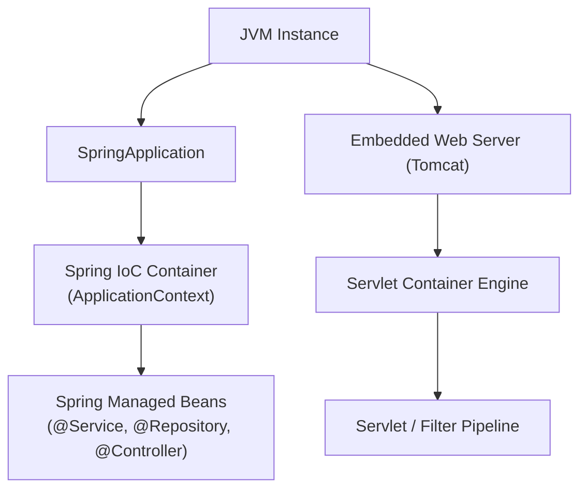
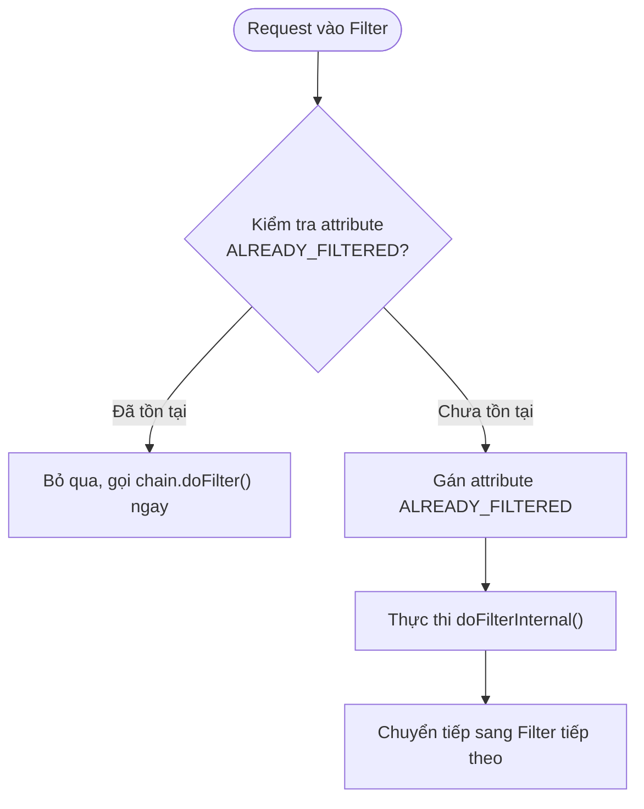
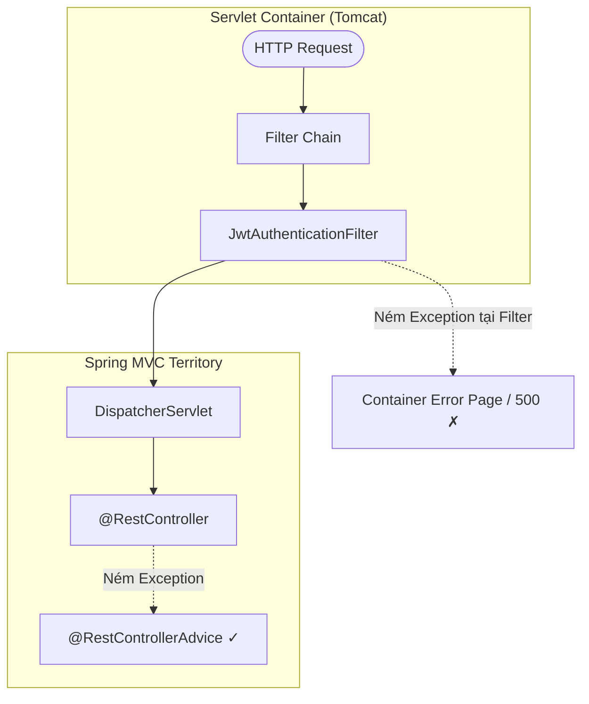
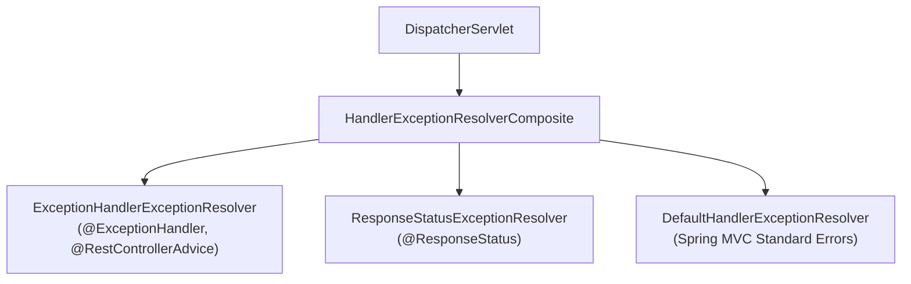
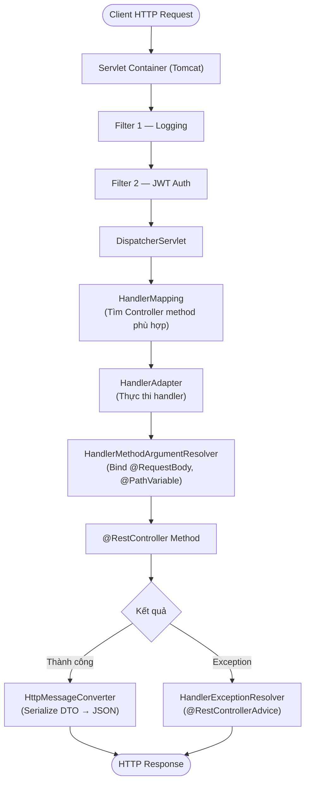

# Spring MVC & Web Layer

## Table of Contents

- [Servlet Container vs Spring IoC](#servlet-container-vs-spring-ioc)
- [Filter Integration](#filter-integration)
- [OncePerRequestFilter & DispatcherType](#onceperrequestfilter--dispatchertype)
- [Exception Boundary: Filter vs DispatcherServlet](#exception-boundary-filter-vs-dispatcherservlet)
- [HandlerExceptionResolver Chain](#handlerexceptionresolver-chain)
- [Full HTTP Request Flow](#full-http-request-flow)

---

## Servlet Container vs Spring IoC

Khi ứng dụng web Spring Boot khởi động, hai hệ thống quản trị vòng đời đối tượng hoạt động song song nhưng hoàn toàn tách biệt. Hiểu sai ranh giới này dẫn đến lỗi dependency injection không hoạt động hoặc exception handling không bắt được.



Mỗi hệ thống duy trì tập khái niệm và trách nhiệm riêng biệt:

| Hệ thống | Đối tượng quản lý | Cơ chế vận hành |
| :--- | :--- | :--- |
| **Servlet Container** (Tomcat) | `Servlet`, `Filter`, `FilterChain`, `ServletContext` | Xử lý TCP/IP, quản lý thread pool, phân phối request theo Servlet Specification |
| **Spring IoC Container** | `@Component`, `@Bean`, `ApplicationContext` | Quản lý Bean lifecycle, Dependency Injection, AOP Proxying |

> [!IMPORTANT]
> Servlet Container không biết gì về Spring Beans hay Dependency Injection. Nếu một `Filter` được Tomcat khởi tạo trực tiếp (qua `web.xml` hoặc Servlet API thuần), mọi `@Autowired` trong Filter đó sẽ là `null` — vì Spring chưa từng chạm vào object đó.

---

## Filter Integration

Spring Boot cung cấp ba cơ chế khác nhau để tích hợp Filter vào Servlet Pipeline. Lựa chọn phụ thuộc vào mức độ kiểm soát cần thiết.

**Cách 1 — `@Component`**: Spring Boot tự động phát hiện class `Filter` có `@Component` và đăng ký vào `ServletContext` với URL pattern `/*` và order thấp nhất.

```java
@Component
public class LoggingFilter implements Filter {

    private final AuditService auditService;

    // Constructor Injection hoạt động bình thường — Spring quản lý instance này
    public LoggingFilter(AuditService auditService) {
        this.auditService = auditService;
    }

    @Override
    public void doFilter(ServletRequest request, ServletResponse response, FilterChain chain)
            throws IOException, ServletException {
        auditService.recordTraffic(request.getRemoteAddr());
        chain.doFilter(request, response);
    }
}
```

**Cách 2 — `FilterRegistrationBean`**: Kiểm soát tường minh URL patterns, thứ tự thực thi, và có thể bật/tắt theo điều kiện.

```java
@Configuration
public class FilterConfig {

    @Bean
    public FilterRegistrationBean<CustomSecurityFilter> securityFilterRegistration(
            CustomSecurityFilter filter
    ) {
        FilterRegistrationBean<CustomSecurityFilter> registration = new FilterRegistrationBean<>();
        registration.setFilter(filter);
        registration.addUrlPatterns("/api/v1/secure/*");  // Chỉ áp dụng cho route cụ thể
        registration.setOrder(1);                          // Thực thi trước các filter khác
        registration.setName("customSecurityFilter");
        return registration;
    }
}
```

**Cách 3 — `DelegatingFilterProxy`**: Cầu nối chuẩn mực giữa Servlet Container và Spring IoC, là nền tảng của **Spring Security**.


`DelegatingFilterProxy` giải quyết hai bài toán kiến trúc:
1. **Lazy lookup**: Servlet Container có thể khởi tạo Filter trước khi Spring `ApplicationContext` sẵn sàng. Proxy trì hoãn việc tra cứu bean đích đến request đầu tiên.
2. **Single entry point cho Spring Security**: Tất cả security filter được gom vào `FilterChainProxy` — một Spring Bean duy nhất — thay vì đăng ký riêng lẻ vào Servlet Container.

So sánh ba cơ chế:

| Tiêu chí | `@Component` | `FilterRegistrationBean` | `DelegatingFilterProxy` |
| :--- | :--- | :--- | :--- |
| **URL Pattern** | Toàn bộ `/*` | Tùy biến linh hoạt | Dựa trên cấu hình proxy |
| **Order** | `@Order` hoặc mặc định `LOWEST_PRECEDENCE` | Tường minh qua `setOrder()` | Theo thứ tự đăng ký proxy |
| **Khởi tạo target** | Eager (theo Spring context) | Eager (đóng gói sẵn) | **Lazy** lookup từ `WebApplicationContext` |
| **Dùng khi** | Filter đơn giản toàn cục | URL-specific với order rõ ràng | Spring Security, hệ thống filter phức tạp |

---

## OncePerRequestFilter & DispatcherType

`OncePerRequestFilter` là lớp trừu tượng của Spring Web đảm bảo một Filter chỉ thực thi **một lần cho mỗi request dispatch** — không phải một lần cho toàn bộ vòng đời TCP connection.

Khai báo xác thực JWT kế thừa `OncePerRequestFilter`:

```java
@Component
public class JwtAuthenticationFilter extends OncePerRequestFilter {

    @Override
    protected void doFilterInternal(
            HttpServletRequest request,
            HttpServletResponse response,
            FilterChain filterChain
    ) throws ServletException, IOException {
        String authHeader = request.getHeader("Authorization");
        // Logic giải mã và xác thực JWT
        filterChain.doFilter(request, response);
    }
}
```

Cơ chế đảm bảo "một lần" sử dụng attribute trên `HttpServletRequest`:



Trong Servlet Container, một request HTTP có thể trải qua nhiều kiểu dispatch (`DispatcherType`) khác nhau trong vòng đời xử lý:

| `DispatcherType` | Kích hoạt khi | Ví dụ thực tế |
| :--- | :--- | :--- |
| **REQUEST** | Client gửi request mới | `GET /api/users` |
| **FORWARD** | Code gọi `RequestDispatcher.forward()` | Controller forward sang View |
| **INCLUDE** | Code gọi `RequestDispatcher.include()` | Server-side include |
| **ERROR** | Container tự kích hoạt khi có exception chưa bắt | Forward tới `/error` |
| **ASYNC** | `AsyncContext.dispatch()` được gọi | Xử lý bất đồng bộ |

Theo mặc định, `OncePerRequestFilter` **bỏ qua** ASYNC và ERROR dispatch. Để bật lại:

```java
@Override
protected boolean shouldNotFilterAsyncDispatch() {
    // Mặc định trả về true (bỏ qua ASYNC). Trả về false để bắt buộc filter chạy cả khi ASYNC dispatch
    return false;
}

@Override
protected boolean shouldNotFilterErrorDispatch() {
    // Mặc định trả về true (bỏ qua ERROR). Trả về false để filter xử lý cả error dispatch tới /error
    return false;
}
```

> [!NOTE]
> "One per request" của `OncePerRequestFilter` có nghĩa là một lần **per dispatch type**, không phải một lần cho toàn bộ vòng đời TCP socket. Nếu một request trải qua cả REQUEST dispatch lẫn ERROR dispatch, filter sẽ chạy hai lần trừ khi bạn override `shouldNotFilterErrorDispatch()`.

---

## Exception Boundary: Filter vs DispatcherServlet

Đây là điểm gây nhầm lẫn phổ biến nhất trong Spring MVC. `@RestControllerAdvice` **không bắt được** exception ném từ trong `doFilterInternal()` — vì Filter nằm ngoài phạm vi xử lý của `DispatcherServlet`.



Exception ném từ Filter đi thẳng lên Servlet Container — không qua `DispatcherServlet`, không qua `HandlerExceptionResolver`, không qua `@ExceptionHandler`.

```java
@Component
public class TokenValidationFilter extends OncePerRequestFilter {

    @Override
    protected void doFilterInternal(
            HttpServletRequest request,
            HttpServletResponse response,
            FilterChain filterChain
    ) throws ServletException, IOException {
        String authHeader = request.getHeader("Authorization");
        if (authHeader == null) {
            // Exception này KHÔNG đến được @RestControllerAdvice
            throw new IllegalArgumentException("Missing Authorization header");
        }
        filterChain.doFilter(request, response);
    }
}
```

Hai chiến lược xử lý chuẩn:

**Chiến lược 1 — Tự đóng gói response trực tiếp tại Filter:**

```java
@Override
protected void doFilterInternal(HttpServletRequest req, HttpServletResponse res, FilterChain chain)
        throws ServletException, IOException {
    try {
        chain.doFilter(req, res);
    } catch (CustomSecurityException ex) {
        res.setStatus(HttpServletResponse.SC_UNAUTHORIZED);
        res.setContentType("application/json;charset=UTF-8");
        res.getWriter().write("""
            {"code": 401, "error": "UNAUTHORIZED", "message": "%s"}
            """.formatted(ex.getMessage()));
    }
}
```

**Chiến lược 2 — Ủy quyền cho `HandlerExceptionResolver`:**

```java
@Component
public class DelegatingExceptionFilter extends OncePerRequestFilter {

    private final HandlerExceptionResolver handlerExceptionResolver;

    public DelegatingExceptionFilter(
            @Qualifier("handlerExceptionResolver") HandlerExceptionResolver resolver
    ) {
        this.handlerExceptionResolver = resolver;
    }

    @Override
    protected void doFilterInternal(HttpServletRequest req, HttpServletResponse res, FilterChain chain)
            throws ServletException, IOException {
        try {
            chain.doFilter(req, res);
        } catch (Exception ex) {
            // Chuyển quyền xử lý về hệ thống ExceptionResolver của Spring MVC
            handlerExceptionResolver.resolveException(req, res, null, ex);
        }
    }
}
```

---

## HandlerExceptionResolver Chain

Khi exception xảy ra bên trong `Controller` (sau khi request đã qua `DispatcherServlet`), Spring không bắt trực tiếp mà ủy thác cho chuỗi `HandlerExceptionResolver`.



`HandlerExceptionResolverComposite` duyệt danh sách theo thứ tự ưu tiên và **dừng tại resolver đầu tiên trả về non-null `ModelAndView`**:

| Resolver | Xử lý | Chi tiết |
| :--- | :--- | :--- |
| `ExceptionHandlerExceptionResolver` | `@ExceptionHandler` và `@ControllerAdvice` | Ánh xạ exception vào method xử lý tùy chỉnh của ứng dụng |
| `ResponseStatusExceptionResolver` | `@ResponseStatus` trên exception class | Chuyển đổi HTTP status code trực tiếp từ annotation |
| `DefaultHandlerExceptionResolver` | Lỗi chuẩn Spring MVC | Xử lý 405 Method Not Allowed, 400 Bad Request, 415 Unsupported Media Type |

---

## Full HTTP Request Flow

Toàn bộ chu trình từ TCP packet đến JSON response:



Ma trận phân định quyền quản lý theo tầng kiến trúc:

| Thành phần | Cơ quan quản lý | Tầng | Vai trò |
| :--- | :--- | :--- | :--- |
| `Filter` / `FilterChain` | Servlet Container | Servlet API | Lọc request trước Servlet |
| `DelegatingFilterProxy` | Servlet Container + Spring | Bridge | Ủy quyền sang Spring Bean |
| `DispatcherServlet` | Spring Boot / Servlet | Spring MVC Gateway | Điều phối trung tâm Spring MVC |
| `HandlerMapping` | Spring Framework | Spring MVC | Tìm Controller method matching |
| `HandlerAdapter` | Spring Framework | Spring MVC | Thực thi Controller method |
| `@RestController` | Spring IoC | Application Layer | Business logic |
| `@RestControllerAdvice` | Spring MVC | Web Exception Layer | Xử lý exception từ Controller |
| `OncePerRequestFilter` | Spring Framework | Spring Web Support | Filter wrapper đảm bảo single execution |

---
[← Back to README](README.md)
