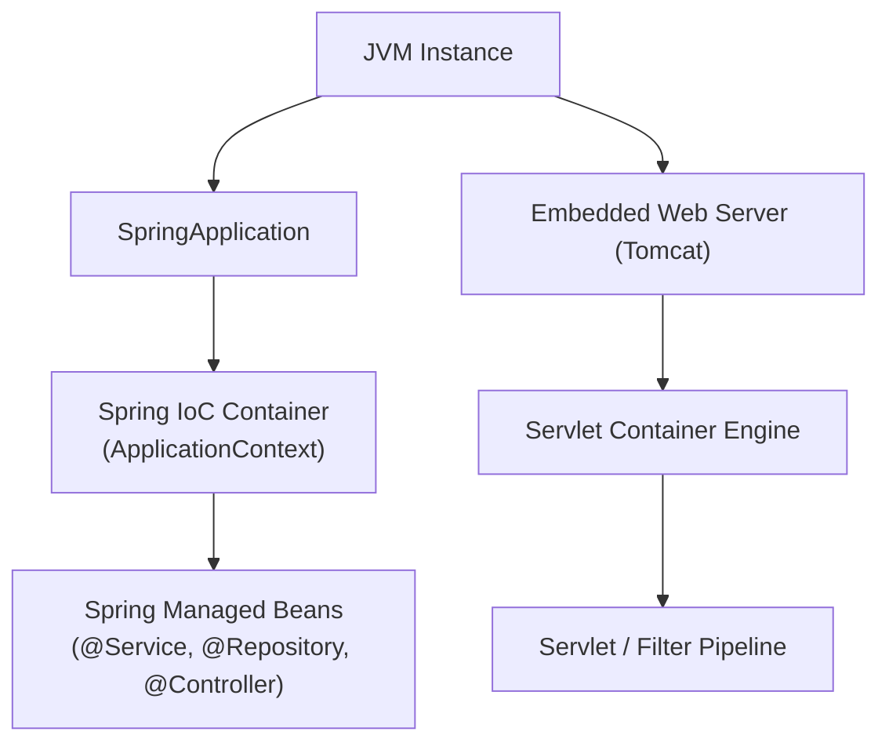
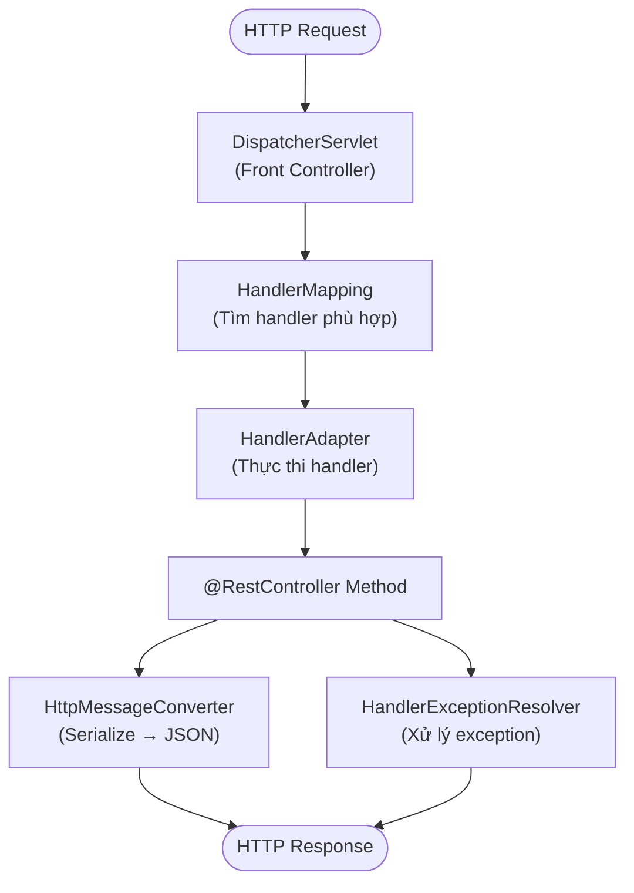
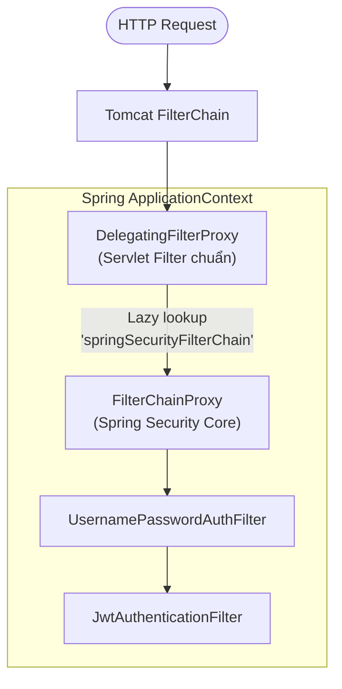
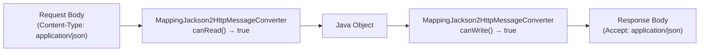
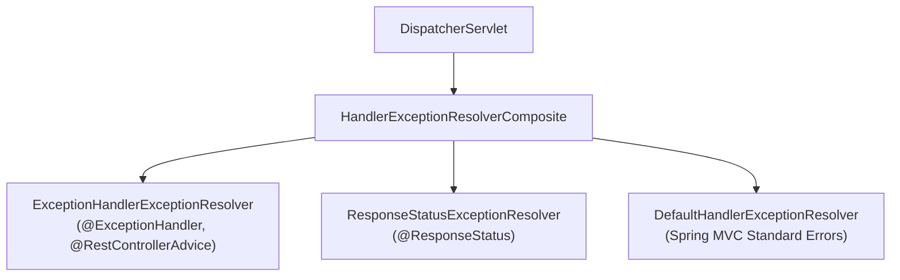
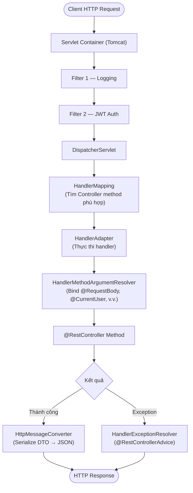

# Spring MVC & Web Layer

## Table of Contents

- [Servlet Container vs Spring IoC](#servlet-container-vs-spring-ioc)
- [DispatcherServlet Internals](#dispatcherservlet-internals)
- [Filter Integration](#filter-integration)
- [Argument Resolver & Message Converter](#argument-resolver--message-converter)
- [Global Exception Handling](#global-exception-handling)
- [Full HTTP Request Flow](#full-http-request-flow)

---

## Servlet Container vs Spring IoC

Khi ứng dụng web Spring Boot khởi động, hai hệ thống quản trị vòng đời đối tượng hoạt động song song nhưng hoàn toàn tách biệt. Hiểu sai ranh giới này dẫn đến lỗi dependency injection không hoạt động hoặc exception handling không bắt được đúng tầng.



Mỗi hệ thống duy trì tập khái niệm và trách nhiệm riêng biệt:

| Hệ thống | Đối tượng quản lý | Cơ chế vận hành |
| :--- | :--- | :--- |
| **Servlet Container** (Tomcat) | `Servlet`, `Filter`, `FilterChain`, `ServletContext` | Xử lý TCP/IP, quản lý thread pool, phân phối request theo Servlet Specification |
| **Spring IoC Container** | `@Component`, `@Bean`, `ApplicationContext` | Quản lý Bean lifecycle, Dependency Injection, AOP Proxying |

> [!IMPORTANT]
> Servlet Container không biết gì về Spring Beans hay Dependency Injection. Nếu một `Filter` được Tomcat khởi tạo trực tiếp (qua `web.xml` hoặc Servlet API thuần), mọi `@Autowired` trong Filter đó sẽ là `null` — vì Spring chưa từng chạm vào object đó.

---

## DispatcherServlet Internals

Trong kiến trúc Servlet thuần, mỗi endpoint cần một `Servlet` riêng. Spring MVC giải quyết sự phân tán này bằng **Front Controller Pattern**: một `DispatcherServlet` duy nhất nhận toàn bộ request, rồi ủy thác công việc cho các component chuyên biệt.



### HandlerMapping — Ai sẽ xử lý request này?

`HandlerMapping` nhận `HttpServletRequest` và trả về một `HandlerExecutionChain` — gồm handler chính (thường là method của `@Controller`) kèm danh sách `HandlerInterceptor` áp dụng cho route đó.

Spring Boot đăng ký sẵn các implementation theo thứ tự ưu tiên giảm dần:

| Implementation | Ánh xạ dựa trên | Dùng khi |
| :--- | :--- | :--- |
| `RequestMappingHandlerMapping` | `@RequestMapping`, `@GetMapping`, `@PostMapping` | Controller class thông thường (99% trường hợp) |
| `RouterFunctionMapping` | `RouterFunction` DSL (functional style) | WebFlux-style routing trong Spring MVC |
| `SimpleUrlHandlerMapping` | URL pattern tường minh trong configuration | Static resource, actuator endpoints |

`DispatcherServlet` duyệt qua danh sách `HandlerMapping` theo thứ tự `order` và dừng tại kết quả khớp đầu tiên. Nếu không `HandlerMapping` nào trả về kết quả, `DispatcherServlet` ném `NoHandlerFoundException` → response 404.

### HandlerAdapter — Làm thế nào để thực thi handler?

Khi `HandlerMapping` trả về handler, `DispatcherServlet` không gọi handler trực tiếp. Vấn đề là handler có thể là bất kỳ kiểu nào: một method của `@Controller`, một `HttpRequestHandler`, hay thậm chí một `Servlet` cũ. `HandlerAdapter` đóng vai trò adapter — che giấu sự dị biệt này và cung cấp giao diện thống nhất cho `DispatcherServlet`.

```java
// DispatcherServlet không quan tâm handler là gì, chỉ gọi adapter
HandlerAdapter adapter = getHandlerAdapter(mappedHandler.getHandler());
ModelAndView mv = adapter.handle(request, response, mappedHandler.getHandler());
```

`RequestMappingHandlerAdapter` — adapter xử lý `@RequestMapping` method — thực hiện toàn bộ công việc nặng nhọc:
1. Duyệt qua `HandlerMethodArgumentResolver` để bind tham số method.
2. Invoke method controller bằng reflection.
3. Duyệt qua `HttpMessageConverter` để serialize giá trị trả về.

> [!NOTE]
> `HandlerMapping` trả lời câu hỏi **"ai"**, `HandlerAdapter` trả lời câu hỏi **"làm thế nào"**. Phân chia trách nhiệm này cho phép Spring MVC hỗ trợ nhiều programming model (annotation-based, functional, legacy) mà không làm phức tạp core của `DispatcherServlet`.

---

## Filter Integration

Spring Boot cung cấp ba cơ chế tích hợp Filter vào Servlet Pipeline. Lựa chọn phụ thuộc vào mức độ kiểm soát cần thiết và yêu cầu về DI.

**Cách 1 — `@Component`**: Spring Boot tự động phát hiện `Filter` có `@Component` và đăng ký với URL pattern `/*`.

```java
@Component
public class LoggingFilter implements Filter {

    private final AuditService auditService;

    // Constructor Injection hoạt động bình thường — Spring quản lý instance này
    public LoggingFilter(AuditService auditService) {
        this.auditService = auditService;
    }

    @Override
    public void doFilter(ServletRequest request, ServletResponse response, FilterChain chain)
            throws IOException, ServletException {
        auditService.recordTraffic(request.getRemoteAddr());
        chain.doFilter(request, response);
    }
}
```

**Cách 2 — `FilterRegistrationBean`**: Kiểm soát tường minh URL patterns, thứ tự thực thi, và bật/tắt theo điều kiện.

```java
@Configuration
public class FilterConfig {

    @Bean
    public FilterRegistrationBean<CustomSecurityFilter> securityFilterRegistration(
            CustomSecurityFilter filter
    ) {
        FilterRegistrationBean<CustomSecurityFilter> registration = new FilterRegistrationBean<>();
        registration.setFilter(filter);
        registration.addUrlPatterns("/api/v1/secure/*");  // Chỉ áp dụng cho route cụ thể
        registration.setOrder(1);                          // Thực thi trước các filter khác
        registration.setName("customSecurityFilter");
        return registration;
    }
}
```

**Cách 3 — `DelegatingFilterProxy`**: Cầu nối chuẩn mực giữa Servlet Container và Spring IoC, là nền tảng của Spring Security.



`DelegatingFilterProxy` giải quyết hai bài toán kiến trúc:

1. **Lazy lookup**: Servlet Container có thể khởi tạo Filter trước khi Spring `ApplicationContext` sẵn sàng. Proxy trì hoãn việc tra cứu bean đích đến request đầu tiên.
2. **Single entry point cho Spring Security**: Tất cả security filter được gom vào `FilterChainProxy` — một Spring Bean duy nhất — thay vì đăng ký riêng lẻ vào Servlet Container.

So sánh ba cơ chế:

| Tiêu chí | `@Component` | `FilterRegistrationBean` | `DelegatingFilterProxy` |
| :--- | :--- | :--- | :--- |
| **URL Pattern** | Toàn bộ `/*` | Tùy biến linh hoạt | Dựa trên cấu hình proxy |
| **Order** | `@Order` hoặc mặc định `LOWEST_PRECEDENCE` | Tường minh qua `setOrder()` | Theo thứ tự đăng ký proxy |
| **Khởi tạo target** | Eager (theo Spring context) | Eager (đóng gói sẵn) | **Lazy** lookup từ `WebApplicationContext` |
| **Dùng khi** | Filter đơn giản toàn cục | URL-specific với order rõ ràng | Spring Security, hệ thống filter phức tạp |

### OncePerRequestFilter & DispatcherType

`OncePerRequestFilter` là lớp trừu tượng đảm bảo Filter chỉ thực thi **một lần cho mỗi dispatch** — không phải một lần cho toàn bộ vòng đời TCP connection. Trong Servlet Container, một request HTTP có thể trải qua nhiều kiểu dispatch trong vòng đời xử lý:

| `DispatcherType` | Kích hoạt khi | Ví dụ thực tế |
| :--- | :--- | :--- |
| **REQUEST** | Client gửi request mới | `GET /api/users` |
| **FORWARD** | Code gọi `RequestDispatcher.forward()` | Controller forward sang View |
| **INCLUDE** | Code gọi `RequestDispatcher.include()` | Server-side include |
| **ERROR** | Container kích hoạt khi có exception chưa bắt | Forward tới `/error` |
| **ASYNC** | `AsyncContext.dispatch()` được gọi | Xử lý bất đồng bộ |

Theo mặc định, `OncePerRequestFilter` **bỏ qua** ASYNC và ERROR dispatch. Override để thay đổi hành vi:

```java
@Override
protected boolean shouldNotFilterAsyncDispatch() {
    // Mặc định trả về true (bỏ qua ASYNC). Trả về false để filter chạy cả khi ASYNC dispatch
    return false;
}

@Override
protected boolean shouldNotFilterErrorDispatch() {
    // Mặc định trả về true (bỏ qua ERROR). Trả về false để filter xử lý cả error dispatch tới /error
    return false;
}
```

> [!NOTE]
> "One per request" của `OncePerRequestFilter` nghĩa là một lần **per dispatch type**, không phải một lần cho toàn bộ vòng đời TCP socket. Nếu một request trải qua cả REQUEST lẫn ERROR dispatch, filter sẽ chạy hai lần trừ khi override `shouldNotFilterErrorDispatch()`.

### Exception Boundary: Filter vs DispatcherServlet

`@RestControllerAdvice` **không bắt được** exception ném từ trong `doFilterInternal()` — Filter nằm ngoài phạm vi xử lý của `DispatcherServlet`.


Hai chiến lược xử lý chuẩn:

**Chiến lược 1 — Tự đóng gói response trực tiếp tại Filter:**

```java
@Override
protected void doFilterInternal(HttpServletRequest req, HttpServletResponse res, FilterChain chain)
        throws ServletException, IOException {
    try {
        chain.doFilter(req, res);
    } catch (CustomSecurityException ex) {
        res.setStatus(HttpServletResponse.SC_UNAUTHORIZED);
        res.setContentType("application/json;charset=UTF-8");
        res.getWriter().write("""
            {"code": 401, "error": "UNAUTHORIZED", "message": "%s"}
            """.formatted(ex.getMessage()));
    }
}
```

**Chiến lược 2 — Ủy quyền cho `HandlerExceptionResolver`:**

```java
@Component
public class DelegatingExceptionFilter extends OncePerRequestFilter {

    private final HandlerExceptionResolver handlerExceptionResolver;

    public DelegatingExceptionFilter(
            @Qualifier("handlerExceptionResolver") HandlerExceptionResolver resolver
    ) {
        this.handlerExceptionResolver = resolver;
    }

    @Override
    protected void doFilterInternal(HttpServletRequest req, HttpServletResponse res, FilterChain chain)
            throws ServletException, IOException {
        try {
            chain.doFilter(req, res);
        } catch (Exception ex) {
            // Chuyển quyền xử lý về hệ thống ExceptionResolver của Spring MVC
            handlerExceptionResolver.resolveException(req, res, null, ex);
        }
    }
}
```

---

## Argument Resolver & Message Converter

Hai thành phần này đảm nhiệm việc **đọc request** và **ghi response** — tách bạch hoàn toàn khỏi business logic của Controller method. Chúng là điểm mở rộng chính của `RequestMappingHandlerAdapter`.

### HandlerMethodArgumentResolver

Trước khi invoke một Controller method, `RequestMappingHandlerAdapter` cần bind giá trị cho từng tham số. Mỗi `HandlerMethodArgumentResolver` xử lý một loại tham số khác nhau:

| Annotation / Type | Resolver mặc định | Nguồn dữ liệu |
| :--- | :--- | :--- |
| `@RequestBody` | `RequestResponseBodyMethodProcessor` | HTTP request body |
| `@PathVariable` | `PathVariableMethodArgumentResolver` | URI path segment |
| `@RequestParam` | `RequestParamMethodArgumentResolver` | Query string / form data |
| `@RequestHeader` | `RequestHeaderMethodArgumentResolver` | HTTP header |
| `Principal` | `PrincipalMethodArgumentResolver` | `SecurityContext` |

Tình huống thực tế: API gateway gắn thông tin người dùng vào request header `X-User-Context` dưới dạng Base64-encoded JSON. Thay vì decode thủ công trong mỗi Controller, tạo một custom resolver để tự động parse thành object `UserContext`:

```java
// Model nhận dữ liệu từ header
public record UserContext(String userId, String role, String tenantId) {}
```

Annotation đánh dấu tham số cần inject:

```java
@Target(ElementType.PARAMETER)
@Retention(RetentionPolicy.RUNTIME)
public @interface CurrentUser {}
```

Resolver thực hiện decode và deserialize:

```java
@Component
public class UserContextArgumentResolver implements HandlerMethodArgumentResolver {

    private final ObjectMapper objectMapper;

    public UserContextArgumentResolver(ObjectMapper objectMapper) {
        this.objectMapper = objectMapper;
    }

    @Override
    public boolean supportsParameter(MethodParameter parameter) {
        // Chỉ xử lý tham số có annotation @CurrentUser và kiểu UserContext
        return parameter.hasParameterAnnotation(CurrentUser.class)
                && parameter.getParameterType().equals(UserContext.class);
    }

    @Override
    public Object resolveArgument(
            MethodParameter parameter,
            ModelAndViewContainer mavContainer,
            NativeWebRequest webRequest,
            WebDataBinderFactory binderFactory
    ) throws Exception {
        String header = webRequest.getHeader("X-User-Context");
        if (header == null) {
            throw new ResponseStatusException(HttpStatus.UNAUTHORIZED, "Thiếu header X-User-Context");
        }
        // Decode Base64 rồi deserialize JSON thành UserContext
        byte[] decoded = Base64.getDecoder().decode(header);
        return objectMapper.readValue(decoded, UserContext.class);
    }
}
```

Đăng ký resolver vào `RequestMappingHandlerAdapter`:

```java
@Configuration
public class WebMvcConfig implements WebMvcConfigurer {

    private final UserContextArgumentResolver userContextResolver;

    public WebMvcConfig(UserContextArgumentResolver userContextResolver) {
        this.userContextResolver = userContextResolver;
    }

    @Override
    public void addArgumentResolvers(List<HandlerMethodArgumentResolver> resolvers) {
        resolvers.add(userContextResolver);
    }
}
```

Controller method trở nên sạch, không còn parsing thủ công:

```java
@GetMapping("/api/orders")
public List<Order> getOrders(@CurrentUser UserContext user) {
    // user đã được inject tự động từ header
    return orderService.findByTenant(user.tenantId());
}
```

> [!TIP]
> Custom resolver nên ném `ResponseStatusException` thay vì exception thuần — Spring MVC sẽ tự động map sang HTTP status code mà không cần thêm `@ExceptionHandler`.

### HttpMessageConverter

Trong khi `ArgumentResolver` đọc request body, `HttpMessageConverter` chịu trách nhiệm **đọc** và **ghi** representation (JSON, XML, plain text) dựa trên `Content-Type` và `Accept` header. Quá trình **content negotiation** diễn ra theo hai chiều:



Spring Boot auto-configure `MappingJackson2HttpMessageConverter` với `ObjectMapper` mặc định. Production thường cần custom hóa — đặc biệt với Date/Time và Enum serialization:

```java
@Configuration
public class JacksonConfig {

    @Bean
    public ObjectMapper objectMapper() {
        return JsonMapper.builder()
                // Serialize LocalDateTime thành ISO-8601 string, không phải timestamp số
                .configure(SerializationFeature.WRITE_DATES_AS_TIMESTAMPS, false)
                // Bỏ qua field lạ khi deserialize — tránh lỗi khi API version thay đổi
                .configure(DeserializationFeature.FAIL_ON_UNKNOWN_PROPERTIES, false)
                // Serialize Enum thành string tên, không phải ordinal index
                .configure(SerializationFeature.WRITE_ENUMS_USING_TO_STRING, true)
                .addModule(new JavaTimeModule())
                .build();
    }
}
```

Khi cần serialize tùy chỉnh cho một type cụ thể — ví dụ `Money` phải ra `{"amount": 150000, "currency": "VND"}`:

```java
// Custom serializer cho Money type
public class MoneySerializer extends StdSerializer<Money> {

    public MoneySerializer() {
        super(Money.class);
    }

    @Override
    public void serialize(Money value, JsonGenerator gen, SerializerProvider provider)
            throws IOException {
        gen.writeStartObject();
        // Làm tròn về 0 chữ số thập phân cho VND
        gen.writeNumberField("amount", value.getAmount().setScale(0, RoundingMode.HALF_UP).longValue());
        gen.writeStringField("currency", value.getCurrency().getCurrencyCode());
        gen.writeEndObject();
    }
}

// Đăng ký serializer vào ObjectMapper qua Module
@Bean
public Module customSerializers() {
    SimpleModule module = new SimpleModule("CustomSerializers");
    module.addSerializer(Money.class, new MoneySerializer());
    return module;
}
```

> [!WARNING]
> Tránh cấu hình `ObjectMapper` trực tiếp trên `MappingJackson2HttpMessageConverter`. Spring Boot chia sẻ `ObjectMapper` bean với nhiều thành phần khác (validation, logging). Custom qua `@Bean ObjectMapper` đảm bảo cấu hình nhất quán toàn ứng dụng.

---

## Global Exception Handling

Khi application ở quy mô nhỏ, exception handling phân tán trong từng Controller còn quản lý được. Ở scale lớn hơn, điều này gây ra ba vấn đề: format response lỗi không nhất quán, logic trùng lặp, và khó thay đổi chuẩn response toàn hệ thống. `@RestControllerAdvice` giải quyết cả ba bằng cách tập trung toàn bộ exception handling vào một nơi.

### HandlerExceptionResolver Chain

Khi exception xảy ra bên trong Controller, `DispatcherServlet` không bắt trực tiếp mà ủy thác cho chuỗi `HandlerExceptionResolver` theo thứ tự ưu tiên:



`HandlerExceptionResolverComposite` duyệt danh sách và **dừng tại resolver đầu tiên trả về non-null `ModelAndView`**:

| Resolver | Xử lý | Chi tiết |
| :--- | :--- | :--- |
| `ExceptionHandlerExceptionResolver` | `@ExceptionHandler` và `@ControllerAdvice` | Ánh xạ exception vào method xử lý tùy chỉnh |
| `ResponseStatusExceptionResolver` | `@ResponseStatus` trên exception class | Chuyển đổi HTTP status code từ annotation |
| `DefaultHandlerExceptionResolver` | Lỗi chuẩn Spring MVC | Xử lý 405, 400, 415 tự động |

### @RestControllerAdvice & RFC 7807

`@RestControllerAdvice` là tổ hợp của `@ControllerAdvice` (AOP-style interceptor cho Controller layer) và `@ResponseBody` (mọi return value tự động serialize). Mỗi method được đánh dấu `@ExceptionHandler` ánh xạ một hoặc nhiều exception type sang HTTP response tương ứng.

RFC 7807 (Problem Details for HTTP APIs) chuẩn hóa format JSON cho response lỗi — tránh mỗi service sử dụng một schema riêng. Spring Framework 6 / Spring Boot 3 tích hợp sẵn `ProblemDetail` type:

```java
// Các exception domain cụ thể của ứng dụng
public class ResourceNotFoundException extends RuntimeException {
    private final String resourceType;
    private final String resourceId;

    public ResourceNotFoundException(String resourceType, String resourceId) {
        super("Không tìm thấy " + resourceType + " với id=" + resourceId);
        this.resourceType = resourceType;
        this.resourceId = resourceId;
    }

    public String getResourceType() { return resourceType; }
    public String getResourceId() { return resourceId; }
}

public class ValidationException extends RuntimeException {
    private final Map<String, String> fieldErrors;

    public ValidationException(Map<String, String> fieldErrors) {
        super("Dữ liệu đầu vào không hợp lệ");
        this.fieldErrors = fieldErrors;
    }

    public Map<String, String> getFieldErrors() { return fieldErrors; }
}
```

Global handler tập trung toàn bộ exception, sinh ra response theo RFC 7807:

```java
@RestControllerAdvice
public class GlobalExceptionHandler {

    // Xử lý resource không tồn tại → 404
    @ExceptionHandler(ResourceNotFoundException.class)
    public ProblemDetail handleResourceNotFound(
            ResourceNotFoundException ex, HttpServletRequest request
    ) {
        ProblemDetail problem = ProblemDetail.forStatusAndDetail(
                HttpStatus.NOT_FOUND, ex.getMessage()
        );
        problem.setTitle("Resource Not Found");
        problem.setType(URI.create("https://api.example.com/errors/resource-not-found"));
        problem.setInstance(URI.create(request.getRequestURI()));
        // Extension field tùy chỉnh — RFC 7807 cho phép thêm property
        problem.setProperty("resourceType", ex.getResourceType());
        problem.setProperty("resourceId", ex.getResourceId());
        return problem;
    }

    // Xử lý lỗi validation đầu vào → 422
    @ExceptionHandler(ValidationException.class)
    public ProblemDetail handleValidation(
            ValidationException ex, HttpServletRequest request
    ) {
        ProblemDetail problem = ProblemDetail.forStatusAndDetail(
                HttpStatus.UNPROCESSABLE_ENTITY, ex.getMessage()
        );
        problem.setTitle("Validation Failed");
        problem.setType(URI.create("https://api.example.com/errors/validation-failed"));
        problem.setInstance(URI.create(request.getRequestURI()));
        problem.setProperty("fieldErrors", ex.getFieldErrors());
        return problem;
    }

    // Xử lý lỗi validation của Bean Validation (@Valid) → 400
    @ExceptionHandler(MethodArgumentNotValidException.class)
    public ProblemDetail handleBeanValidation(
            MethodArgumentNotValidException ex, HttpServletRequest request
    ) {
        Map<String, String> errors = ex.getBindingResult()
                .getFieldErrors()
                .stream()
                .collect(Collectors.toMap(
                        FieldError::getField,
                        fe -> fe.getDefaultMessage() != null ? fe.getDefaultMessage() : "Giá trị không hợp lệ"
                ));

        ProblemDetail problem = ProblemDetail.forStatusAndDetail(
                HttpStatus.BAD_REQUEST, "Dữ liệu request không vượt qua validation"
        );
        problem.setTitle("Bad Request");
        problem.setType(URI.create("https://api.example.com/errors/bad-request"));
        problem.setInstance(URI.create(request.getRequestURI()));
        problem.setProperty("fieldErrors", errors);
        return problem;
    }

    // Fallback — bắt tất cả exception còn lại → 500
    @ExceptionHandler(Exception.class)
    public ProblemDetail handleUnexpected(
            Exception ex, HttpServletRequest request
    ) {
        // Không expose stack trace hay internal message ra ngoài
        ProblemDetail problem = ProblemDetail.forStatusAndDetail(
                HttpStatus.INTERNAL_SERVER_ERROR, "Đã xảy ra lỗi hệ thống, vui lòng thử lại sau"
        );
        problem.setTitle("Internal Server Error");
        problem.setType(URI.create("https://api.example.com/errors/internal-error"));
        problem.setInstance(URI.create(request.getRequestURI()));
        return problem;
    }
}
```

Response JSON chuẩn RFC 7807 khi `ResourceNotFoundException` xảy ra:

```json
{
  "type": "https://api.example.com/errors/resource-not-found",
  "title": "Resource Not Found",
  "status": 404,
  "detail": "Không tìm thấy Order với id=ORD-9999",
  "instance": "/api/orders/ORD-9999",
  "resourceType": "Order",
  "resourceId": "ORD-9999"
}
```

> [!IMPORTANT]
> Fallback handler `@ExceptionHandler(Exception.class)` phải **không bao giờ** trả về stack trace hay internal message ra response. Cấu trúc `ProblemDetail` cho phép log đầy đủ chi tiết ở server nhưng chỉ expose thông báo generic ra client — tránh information leakage là yêu cầu bảo mật cơ bản.

---

## Full HTTP Request Flow

Toàn bộ chu trình từ TCP packet đến JSON response, tích hợp tất cả thành phần đã phân tích:



Ma trận phân định quyền quản lý theo tầng kiến trúc:

| Thành phần | Cơ quan quản lý | Tầng | Vai trò |
| :--- | :--- | :--- | :--- |
| `Filter` / `FilterChain` | Servlet Container | Servlet API | Lọc request trước Servlet |
| `DelegatingFilterProxy` | Servlet Container + Spring | Bridge | Ủy quyền sang Spring Bean |
| `DispatcherServlet` | Spring Boot / Servlet | Spring MVC Gateway | Điều phối trung tâm Spring MVC |
| `HandlerMapping` | Spring Framework | Spring MVC | Tìm Controller method matching |
| `HandlerAdapter` | Spring Framework | Spring MVC | Thực thi Controller method |
| `HandlerMethodArgumentResolver` | Spring Framework | Spring MVC | Bind tham số method |
| `HttpMessageConverter` | Spring Framework | Spring MVC | Serialize / deserialize body |
| `@RestController` | Spring IoC | Application Layer | Business logic |
| `@RestControllerAdvice` | Spring MVC | Web Exception Layer | Xử lý exception từ Controller |
| `OncePerRequestFilter` | Spring Framework | Spring Web Support | Filter wrapper đảm bảo single execution |

---
[← Back to README](README.md)
