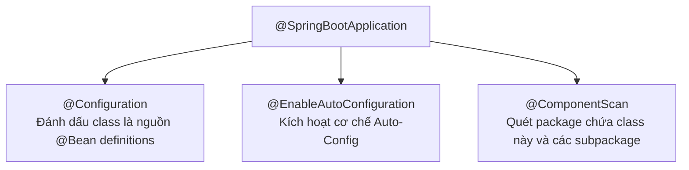
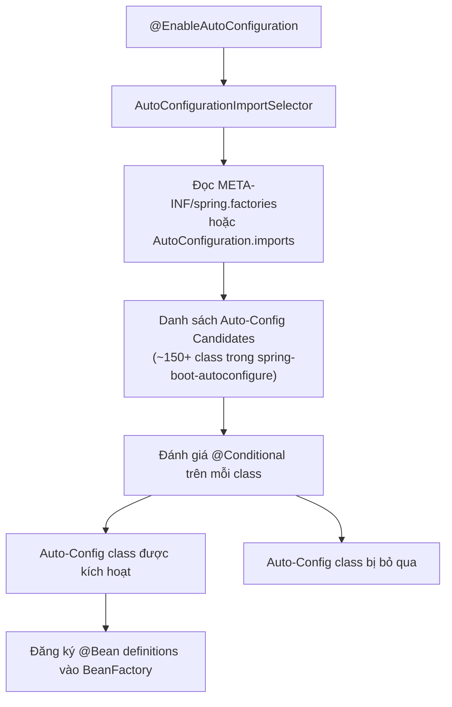

# Auto Configuration & Spring Factories

## Table of Contents

- [@SpringBootApplication Decomposed](#springbootapplication-decomposed)
- [Auto-Configuration Discovery](#auto-configuration-discovery)
- [Conditional Annotations](#conditional-annotations)
- [Custom AutoConfiguration](#custom-autoconfiguration)

---

## @SpringBootApplication Decomposed

`@SpringBootApplication` trông như một annotation đơn giản nhưng thực chất là một meta-annotation gộp ba annotation độc lập. Hiểu từng thành phần giúp kiểm soát chính xác hành vi khởi động.

```java
@SpringBootApplication
public class Application {
    public static void main(String[] args) {
        SpringApplication.run(Application.class, args);
    }
}
```

Tương đương với khai báo tường minh:

```java
@Configuration
@EnableAutoConfiguration
@ComponentScan(basePackages = "com.example")
public class Application { ... }
```

Ba thành phần cấu tạo:



| Annotation | Nhiệm vụ | Ghi chú quan trọng |
| :--- | :--- | :--- |
| **`@Configuration`** | Đánh dấu class là nguồn cung cấp `@Bean` definition | `@Bean` method trong `@Configuration` được proxy bởi CGLIB để đảm bảo singleton semantics |
| **`@EnableAutoConfiguration`** | Kích hoạt cơ chế đọc và nạp Auto-Configuration class | Đây là annotation cốt lõi tạo ra "magic" của Spring Boot |
| **`@ComponentScan`** | Quét package hiện tại và tất cả subpackage | Không có base package tường minh → dùng package của class annotated |

> [!TIP]
> Khi muốn loại trừ một AutoConfiguration cụ thể: `@SpringBootApplication(exclude = {DataSourceAutoConfiguration.class})`. Hữu ích khi viết integration test không cần database, hoặc khi muốn tự cấu hình thay vì dùng auto-config mặc định.

---

## Auto-Configuration Discovery

`@EnableAutoConfiguration` không scan classpath để tìm `@Configuration` class — nó đọc danh sách cấu hình từ các file descriptor đã được đóng gói sẵn trong các dependency JAR.

**Spring Boot < 2.7** — đọc từ `META-INF/spring.factories`:

```text
# Trong file: META-INF/spring.factories (bên trong spring-boot-autoconfigure.jar)
org.springframework.boot.autoconfigure.EnableAutoConfiguration=\
  org.springframework.boot.autoconfigure.jdbc.DataSourceAutoConfiguration,\
  org.springframework.boot.autoconfigure.web.servlet.WebMvcAutoConfiguration,\
  org.springframework.boot.autoconfigure.security.servlet.SecurityAutoConfiguration
```

**Spring Boot 2.7+** — đọc từ `META-INF/spring/org.springframework.boot.autoconfigure.AutoConfiguration.imports`:

```text
# Trong file: META-INF/spring/org.springframework.boot.autoconfigure.AutoConfiguration.imports
org.springframework.boot.autoconfigure.jdbc.DataSourceAutoConfiguration
org.springframework.boot.autoconfigure.web.servlet.WebMvcAutoConfiguration
org.springframework.boot.autoconfigure.security.servlet.SecurityAutoConfiguration
```

Luồng xử lý Auto-Configuration:



> [!NOTE]
> Spring Boot 2.7 giới thiệu `AutoConfiguration.imports` và deprecated `spring.factories` cho mục đích auto-configuration (vẫn hỗ trợ cho các mục đích khác). Lý do: file mới có format đơn giản hơn, hiệu năng parse tốt hơn, và phân tách rõ ràng giữa auto-configuration với các loại factory khác.

---

## Conditional Annotations

Mỗi Auto-Configuration class đều bọc logic của mình trong các `@Conditional` annotation. Đây là cơ chế giúp Spring Boot "biết" có nên kích hoạt một auto-config hay không mà không cần người dùng làm gì.

Ba annotation phổ biến nhất:

**`@ConditionalOnClass`** — Kiểm tra sự hiện diện của class trên classpath:

```java
@Configuration
@ConditionalOnClass({ DataSource.class, EmbeddedDatabaseType.class })
public class DataSourceAutoConfiguration {
    // Chỉ được nạp nếu DataSource và EmbeddedDatabaseType có trong classpath
    // Tức là: chỉ khi có dependency JDBC hoặc H2/MySQL driver
}
```

**`@ConditionalOnMissingBean`** — Chỉ tạo bean nếu người dùng chưa tự tạo:

```java
@Bean
@ConditionalOnMissingBean(DataSource.class)
public DataSource dataSource() {
    // Spring Boot tạo DataSource mặc định (H2 in-memory)
    // NHƯNG nếu developer đã khai báo @Bean DataSource riêng → auto-config này bị bỏ qua
    return new EmbeddedDatabaseBuilder().setType(EmbeddedDatabaseType.H2).build();
}
```

**`@ConditionalOnProperty`** — Kiểm tra giá trị property trong `Environment`:

```java
@Configuration
@ConditionalOnProperty(
    prefix = "app.cache",
    name = "enabled",
    havingValue = "true",
    matchIfMissing = false  // Bỏ qua nếu property không được định nghĩa
)
public class CacheAutoConfiguration {
    // Chỉ kích hoạt khi app.cache.enabled=true trong application.properties
}
```

Bảng so sánh các Conditional annotation phổ biến:

| Annotation | Điều kiện kiểm tra | Trường hợp sử dụng điển hình |
| :--- | :--- | :--- |
| `@ConditionalOnClass` | Class X tồn tại trong classpath | Auto-config cho thư viện optional (Redis, Kafka) |
| `@ConditionalOnMissingClass` | Class X **không** tồn tại trong classpath | Fallback khi thư viện không được thêm vào |
| `@ConditionalOnBean` | Bean kiểu X đã tồn tại trong `BeanFactory` | Config phụ thuộc vào bean khác đã được tạo |
| `@ConditionalOnMissingBean` | Bean kiểu X **chưa** tồn tại | Override point — cho phép developer tự cấu hình |
| `@ConditionalOnProperty` | Property có giá trị cụ thể | Feature flag, bật/tắt tính năng qua config |
| `@ConditionalOnExpression` | SpEL expression trả về `true` | Điều kiện phức tạp kết hợp nhiều property |
| `@ConditionalOnWebApplication` | Ứng dụng là web app (Servlet hoặc Reactive) | Web-specific configuration |

> [!IMPORTANT]
> `@ConditionalOnMissingBean` là convention quan trọng nhất trong Spring Boot ecosystem. Mọi auto-config được thiết kế đúng đều dùng nó để đảm bảo developer có thể override bất kỳ bean mặc định nào chỉ bằng cách khai báo `@Bean` cùng kiểu trong code của mình.

---

## Custom AutoConfiguration

Để hiểu rõ cơ chế, cách tốt nhất là tự viết một AutoConfiguration class. Ví dụ: tự động cấu hình một `RestTemplate` với timeout mặc định khi dependency tồn tại.

**Bước 1 — Tạo Auto-Configuration class:**

```java
package com.example.autoconfigure;

import org.springframework.boot.autoconfigure.AutoConfiguration;
import org.springframework.boot.autoconfigure.condition.ConditionalOnClass;
import org.springframework.boot.autoconfigure.condition.ConditionalOnMissingBean;
import org.springframework.boot.autoconfigure.condition.ConditionalOnProperty;
import org.springframework.boot.context.properties.EnableConfigurationProperties;
import org.springframework.context.annotation.Bean;
import org.springframework.web.client.RestTemplate;
import org.springframework.http.client.SimpleClientHttpRequestFactory;

@AutoConfiguration
@ConditionalOnClass(RestTemplate.class)               // Chỉ kích hoạt khi Spring Web có trong classpath
@EnableConfigurationProperties(RestClientProperties.class)
public class RestClientAutoConfiguration {

    @Bean
    @ConditionalOnMissingBean(RestTemplate.class)     // Không override nếu user đã tự cấu hình
    public RestTemplate restTemplate(RestClientProperties props) {
        SimpleClientHttpRequestFactory factory = new SimpleClientHttpRequestFactory();
        factory.setConnectTimeout(props.getConnectTimeout());
        factory.setReadTimeout(props.getReadTimeout());
        return new RestTemplate(factory);
    }
}
```

**Bước 2 — Tạo `@ConfigurationProperties` class:**

```java
@ConfigurationProperties(prefix = "rest.client")
public class RestClientProperties {
    private int connectTimeout = 5000;  // Giá trị mặc định: 5 giây
    private int readTimeout = 10000;    // Giá trị mặc định: 10 giây

    // Getters và setters
    public int getConnectTimeout() { return connectTimeout; }
    public void setConnectTimeout(int connectTimeout) { this.connectTimeout = connectTimeout; }
    public int getReadTimeout() { return readTimeout; }
    public void setReadTimeout(int readTimeout) { this.readTimeout = readTimeout; }
}
```

**Bước 3 — Đăng ký vào file descriptor:**

Với Spring Boot 2.7+, tạo file `src/main/resources/META-INF/spring/org.springframework.boot.autoconfigure.AutoConfiguration.imports`:

```text
com.example.autoconfigure.RestClientAutoConfiguration
```

Với Spring Boot < 2.7, thêm vào `src/main/resources/META-INF/spring.factories`:

```properties
org.springframework.boot.autoconfigure.EnableAutoConfiguration=\
  com.example.autoconfigure.RestClientAutoConfiguration
```

**Kết quả**: Khi dependency JAR này được thêm vào dự án khác, `RestTemplate` sẽ được tự động cấu hình với timeout mặc định 5s/10s — trừ khi developer khai báo `@Bean RestTemplate` riêng của mình, lúc đó `@ConditionalOnMissingBean` sẽ bỏ qua auto-config.

> [!NOTE]
> Annotation `@AutoConfiguration` (Spring Boot 2.7+) thay thế `@Configuration` cho mục đích auto-configuration. Nó được xử lý sau tất cả `@Configuration` class của người dùng, đảm bảo user config luôn có quyền ưu tiên cao hơn.

---
[← Back to README](README.md)
