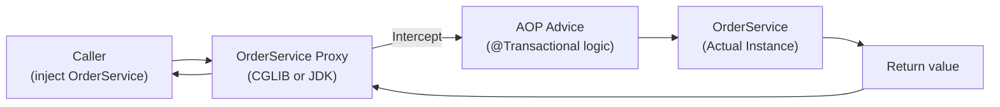
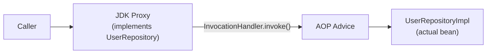
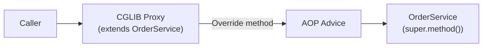
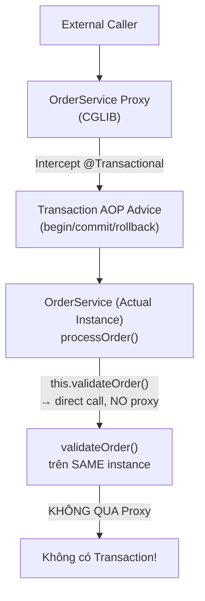

# Aspect-Oriented Programming (AOP) & Proxy

## Table of Contents

- [Spring Proxy Model](#spring-proxy-model)
- [JDK Dynamic Proxy vs CGLIB](#jdk-dynamic-proxy-vs-cglib)
- [Custom Aspect](#custom-aspect)
- [Self-Invocation Problem](#self-invocation-problem)

---

## Spring Proxy Model

Khi bạn inject `@Autowired OrderService orderService` vào một class khác, object bạn nhận được **không phải** là instance `OrderService` gốc — mà là một **Proxy** bọc ngoài instance đó. Đây là cơ sở kỹ thuật của toàn bộ Spring AOP, `@Transactional`, `@Cacheable`, và `@Async`.



Proxy được tạo tại **Bước 7 của Bean Creation Pipeline** — trong `postProcessAfterInitialization()` của `AbstractAutoProxyCreator`:

```text
Bean Creation (Bước 7):
  AbstractAutoProxyCreator.postProcessAfterInitialization(bean, beanName)
    → Kiểm tra pointcut: bean có khớp với @Transactional / @Cacheable / custom Aspect?
    → Nếu có → tạo Proxy bọc ngoài bean gốc
    → BeanFactory lưu Proxy (không phải bean gốc) vào Cache Cấp 1
```

Điều này có nghĩa là: `applicationContext.getBean(OrderService.class)` trả về Proxy, không phải instance thật. Gọi `proxy.getClass().getName()` sẽ thấy tên class có dạng `OrderService$$SpringCGLIB$$0`.

> [!IMPORTANT]
> Vì `BeanFactory` lưu Proxy vào Cache Cấp 1, **mọi caller đều nhận Proxy** — đây là điều kiện tiên quyết để AOP hoạt động. Nếu Spring lưu raw instance, `@Transactional` sẽ không có hiệu lực với bất kỳ method call nào.

---

## JDK Dynamic Proxy vs CGLIB

Spring lựa chọn loại Proxy dựa trên đặc điểm của bean target. Mỗi loại có cơ chế hoạt động và điều kiện áp dụng khác nhau.

**JDK Dynamic Proxy** — Dựa trên Interface:



```java
// JDK Proxy được dùng khi bean target implements ít nhất 1 interface
public interface UserRepository {
    User findById(Long id);
}

@Repository
public class UserRepositoryImpl implements UserRepository {
    @Override
    public User findById(Long id) { ... }
}
// Spring tạo: Proxy implements UserRepository, delegate về UserRepositoryImpl
```

**CGLIB Proxy** — Dựa trên Subclass:



```java
// CGLIB Proxy được dùng khi bean target KHÔNG implement bất kỳ interface nào
@Service
public class OrderService {
    public void processOrder(Order order) { ... }
}
// Spring tạo: class OrderService$$SpringCGLIB$$0 extends OrderService
// Override processOrder() để intercept trước khi gọi super.processOrder()
```

So sánh hai cơ chế:

| Tiêu chí | JDK Dynamic Proxy | CGLIB Proxy |
| :--- | :--- | :--- |
| **Yêu cầu** | Bean target phải implement ít nhất 1 interface | Không cần interface — hoạt động với bất kỳ class nào |
| **Cơ chế** | `java.lang.reflect.Proxy` + `InvocationHandler` | Bytecode generation — tạo subclass lúc runtime |
| **Hạn chế** | Chỉ proxy được method khai báo trong interface | Không proxy được `final` class hoặc `final` method |
| **Hiệu năng** | Nhẹ hơn (dùng Java standard library) | Chi phí khởi động cao hơn nhưng call overhead tương đương |
| **Spring Boot mặc định** | Dùng khi có interface | Ưu tiên dùng ngay cả khi có interface (Spring Boot 2.0+ với `proxyTargetClass=true`) |

> [!NOTE]
> Kể từ Spring Boot 2.0, `spring.aop.proxy-target-class=true` là mặc định — Spring **luôn dùng CGLIB** trừ khi bean là interface type. Lý do: tránh sự không nhất quán khi một bean implement nhiều interface, developer không biết proxy thuộc interface nào.

---

## Custom Aspect

Spring AOP dùng annotation `@Aspect` để khai báo Aspect — class chứa **Advice** (logic thêm vào) và **Pointcut** (điều kiện xác định method nào bị intercept).

Ba loại Advice phổ biến:

```java
@Aspect
@Component
public class ExecutionTimingAspect {

    private static final Logger log = LoggerFactory.getLogger(ExecutionTimingAspect.class);

    // @Around: bao bọc hoàn toàn method — kiểm soát cả trước và sau khi method chạy
    @Around("@annotation(com.example.annotation.Timed)")
    public Object measureExecutionTime(ProceedingJoinPoint joinPoint) throws Throwable {
        long startMs = System.currentTimeMillis();
        try {
            return joinPoint.proceed();  // Gọi method gốc
        } finally {
            long durationMs = System.currentTimeMillis() - startMs;
            log.info("Method {} executed in {}ms",
                joinPoint.getSignature().toShortString(), durationMs);
        }
    }

    // @Before: chạy trước method — không thể thay đổi kết quả hay dừng method
    @Before("execution(* com.example.service.*Service.*(..))") 
    public void logMethodEntry(JoinPoint joinPoint) {
        log.debug("Entering: {}", joinPoint.getSignature().getName());
    }

    // @AfterThrowing: chỉ chạy khi method ném exception — nhận exception để log hoặc wrap
    @AfterThrowing(
        pointcut = "execution(* com.example.repository.*.*(..))",
        throwing = "ex"
    )
    public void handleRepositoryException(JoinPoint joinPoint, Exception ex) {
        log.error("Repository error in {}: {}", joinPoint.getSignature().getName(), ex.getMessage());
    }
}
```

Custom annotation để đánh dấu method cần đo thời gian:

```java
package com.example.annotation;

import java.lang.annotation.*;

@Target(ElementType.METHOD)
@Retention(RetentionPolicy.RUNTIME)  // Phải là RUNTIME để AOP đọc được lúc chạy
@Documented
public @interface Timed {
}
```

Sử dụng annotation trong service:

```java
@Service
public class ProductService {

    @Timed  // Aspect sẽ đo thời gian của method này
    public List<Product> searchProducts(String keyword) {
        // Logic tìm kiếm
        return productRepository.findByKeyword(keyword);
    }
}
```

Pointcut Expression phổ biến:

| Expression | Ý nghĩa |
| :--- | :--- |
| `execution(* com.example.service.*.*(..))` | Mọi method trong mọi class trong package `service` |
| `@annotation(com.example.Timed)` | Method được đánh dấu annotation `@Timed` |
| `within(com.example.controller.*)` | Mọi method trong package `controller` |
| `@within(org.springframework.stereotype.Service)` | Mọi method trong class có `@Service` |
| `args(String, ..)` | Method có tham số đầu tiên là `String` |

---

## Self-Invocation Problem

Gọi nội bộ qua `this` là trường hợp dễ bỏ qua nhất khi dùng Spring AOP. Hiểu đúng cơ chế Proxy giải thích tại sao `@Transactional` (và mọi AOP annotation) không hoạt động khi gọi nội bộ.

**Kịch bản lỗi:**

```java
@Service
public class OrderService {

    @Transactional  // ← Annotation này sẽ KHÔNG có hiệu lực trong trường hợp dưới
    public void validateOrder(Order order) {
        // Logic validation trong transaction
        if (order.getAmount() <= 0) {
            throw new IllegalArgumentException("Số tiền không hợp lệ");
        }
    }

    public void processOrder(Order order) {
        // Gọi nội bộ qua 'this' — KHÔNG qua Proxy
        this.validateOrder(order);  // @Transactional của validateOrder bị bỏ qua!
    }
}
```

**Tại sao lại xảy ra?**



Khi `processOrder()` gọi `this.validateOrder()`, `this` tham chiếu đến **raw instance** `OrderService` — không phải Proxy. Call đi thẳng vào method mà không qua `InvocationHandler` hay CGLIB interceptor. AOP advice không được thực thi.

**Ba giải pháp:**

**Giải pháp 1 — Inject self (self-autowiring):** Inject Proxy của chính class vào chính nó qua `@Lazy`:

```java
@Service
public class OrderService {

    // @Lazy ngăn circular dependency trong quá trình khởi tạo
    @Autowired
    @Lazy
    private OrderService self;

    public void processOrder(Order order) {
        // Gọi qua 'self' — tham chiếu đến Proxy, AOP được kích hoạt
        self.validateOrder(order);
    }

    @Transactional
    public void validateOrder(Order order) {
        // @Transactional hoạt động bình thường khi được gọi qua Proxy
    }
}
```

**Giải pháp 2 — `AopContext.currentProxy()`:** Lấy Proxy từ ThreadLocal storage của Spring AOP:

```java
@Service
public class OrderService {

    public void processOrder(Order order) {
        OrderService proxy = (OrderService) AopContext.currentProxy();
        proxy.validateOrder(order);
    }

    @Transactional
    public void validateOrder(Order order) { ... }
}
```

> [!WARNING]
> `AopContext.currentProxy()` yêu cầu `@EnableAspectJAutoProxy(exposeProxy = true)` được kích hoạt. Nếu thiếu cấu hình này, gọi `currentProxy()` sẽ ném `IllegalStateException`.

**Giải pháp 3 — Tách class (khuyến nghị nhất):** Đây là giải pháp kiến trúc đúng nhất — method cần transaction thuộc về một service layer riêng:

```java
@Service
public class OrderService {

    private final OrderValidationService validationService;

    public OrderService(OrderValidationService validationService) {
        this.validationService = validationService;
    }

    public void processOrder(Order order) {
        // Gọi qua injected bean → tự động qua Proxy → @Transactional hoạt động
        validationService.validateOrder(order);
    }
}

@Service
public class OrderValidationService {

    @Transactional
    public void validateOrder(Order order) {
        // Transaction được đảm bảo
    }
}
```

So sánh ba giải pháp:

| Giải pháp | Complexity | Thread Safety | Khuyến nghị |
| :--- | :--- | :--- | :--- |
| Self-inject `@Lazy` | Thấp | An toàn | Chấp nhận được khi không muốn tách class |
| `AopContext.currentProxy()` | Trung bình | An toàn (ThreadLocal) | Tránh dùng — phụ thuộc Spring AOP internals |
| **Tách class** | Thấp | An toàn | **Ưu tiên** — tuân thủ SRP, dễ test |

> [!TIP]
> Self-invocation problem không chỉ xảy ra với `@Transactional`. Mọi Spring AOP annotation (`@Cacheable`, `@Async`, `@Retryable`, custom `@Aspect`) đều bị ảnh hưởng bởi cùng cơ chế — vì tất cả đều dựa trên Proxy model.

---
[← Back to README](README.md)
