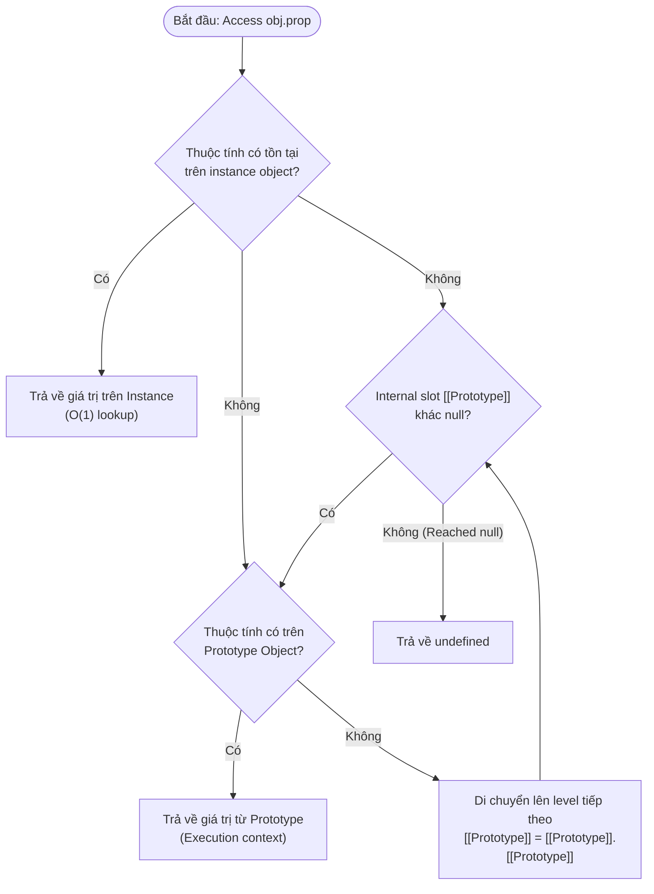
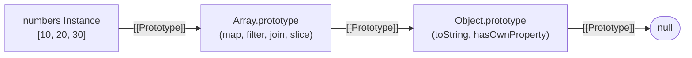
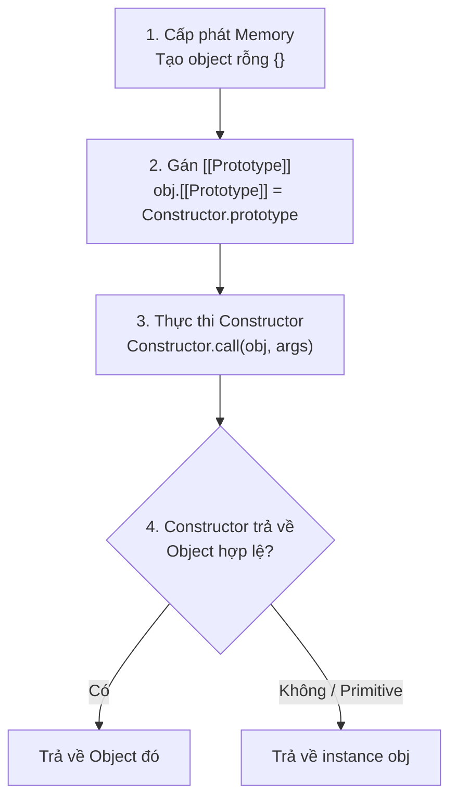
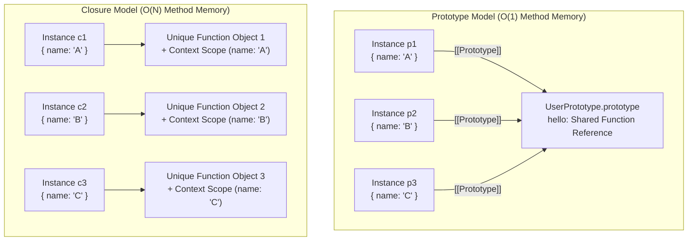
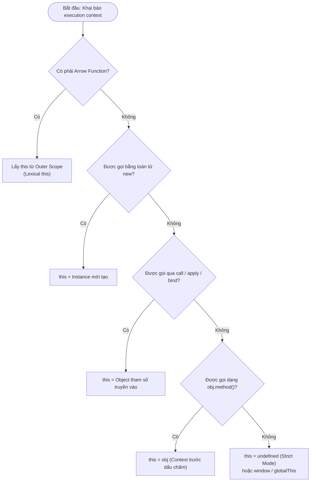
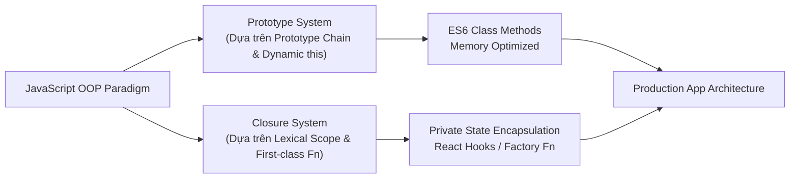

# JavaScript: Prototype vs Closure

## Table of Contents

- [Bối cảnh Kiến trúc và Vấn đề Cốt lõi](#bối-cảnh-kiến-trúc-và-vấn-đề-cốt-lõi)
- [Cơ chế Prototype và Property Lookup](#cơ-chế-prototype-và-property-lookup)
- [Function Constructor và Toán tử new](#function-constructor-và-toán-tử-new)
- [So sánh Phân bổ Memory: Prototype vs Closure](#so-sánh-phân-bổ-memory-prototype-vs-closure)
- [Cơ chế Binding và Rủi ro Mất Context của this](#cơ-chế-binding-và-rủi-ro-mất-context-của-this)
- [Chi phí Bộ nhớ của Arrow Function trong Class](#chi-phí-bộ-nhớ-của-arrow-function-trong-class)
- [Kiến trúc Đa Paradigm trong JavaScript OOP](#kiến-trúc-đa-paradigm-trong-javascript-oop)
- [Bảng So sánh Tổng hợp và Tradeoffs](#bảng-so-sánh-tổng-hợp-và-tradeoffs)
- [Thử nghiệm Phân tích trong Production](#thử-nghiệm-phân-tích-trong-production)

---

## Bối cảnh Kiến trúc và Vấn đề Cốt lõi

Trong các môi trường thực thi JavaScript hiện đại như V8 Engine hay SpiderMonkey, ứng dụng thường xuyên khởi tạo hàng nghìn đến hàng triệu đối tượng dữ liệu và thành phần giao diện. Khi thiết kế mô hình trạng thái và hành vi cho ứng dụng, quyết định kiến trúc cốt lõi là lựa chọn giữa **Prototype Delegation** và **Lexical Closure Encapsulation**.

Khác với các ngôn ngữ biên dịch như C++ hay Java vốn tạo bảng phương thức ảo (vtable) cố định tại thời điểm build, JavaScript là ngôn ngữ dựa trên đối tượng động. Cú pháp `class` ra mắt trong ES6 bản chất chỉ là lớp vỏ cú pháp (syntactic sugar) phủ lên hệ thống Prototype Chain bên dưới. Nếu không nắm vững cơ chế cấp phát bộ nhớ của Engine, việc lạm dụng hoặc phối hợp sai các mô hình này dễ dẫn đến lãng phí Heap memory, gây lag do Garbage Collection (GC) và phát sinh lỗi mất context thực thi ở runtime.

> [!NOTE]
> JavaScript không có mô hình Class-based OOP thực sự. Việc gọi `class` trong mã nguồn sẽ được V8 Engine chuyển đổi thành các Function Constructor và liên kết các đối tượng Prototype ở tầng thấp.

---

## Cơ chế Prototype và Property Lookup

Mỗi đối tượng trong JavaScript đều sở hữu một thuộc tính nội bộ ẩn mang tên `[[Prototype]]` (có thể truy cập thông qua `Object.getPrototypeOf(obj)` hoặc thuộc tính kế thừa `__proto__`). Khi mã nguồn truy vấn một thuộc tính `obj.prop`, Engine sẽ thực hiện quy trình tìm kiếm theo chuỗi liên kết này cho đến khi tìm thấy thuộc tính hoặc chạm tới mốc `null`.

Sơ đồ thể hiện quy trình tra cứu thuộc tính trên chuỗi Prototype:



Bảng phân tích chức năng các thành phần trong chuỗi tra cứu Prototype:

| Thành phần | Vai trò Kiến trúc | Chi tiết Kỹ thuật |
| :--- | :--- | :--- |
| **Instance Object** | Lưu trữ state riêng biệt | Chứa các thuộc tính bản thể được gán trực tiếp qua `this.key = value`. |
| **Prototype Object** | Chia sẻ behavior chung | Đối tượng chứa các phương thức dùng chung. V8 tối ưu hóa truy cập qua **Hidden Classes (Shapes)**. |
| **Prototype Chain** | Chuỗi liên kết tra cứu | Mảng liên kết đơn cấp runtime các đối tượng. Độ dài chuỗi ảnh hưởng trực tiếp đến thời gian lookup. |
| **Root Prototype** | Điểm dừng của tra cứu | `Object.prototype` với `[[Prototype]]` trỏ tới `null`. Tra cứu thất bại trả về `undefined`. |

Khởi tạo một đối tượng đơn giản biểu diễn liên kết cơ bản:

```javascript
const user = {
    name: "Ojou"
};

// Cấu trúc liên kết thực tế:
// user -> Object.prototype -> null
console.log(user.hasOwnProperty("name")); // true (tìm thấy tại Instance)
console.log(user.toString());             // "[object Object]" (ủy quyền cho Object.prototype)
```

Khi thao tác với mảng dữ liệu, tất cả phương thức xử lý chuẩn như `map` hay `filter` đều tập trung tại một đối tượng prototype duy nhất:

```javascript
const numbers = [10, 20, 30];

// Cả map và filter đều được lưu tại Array.prototype duy nhất
const doubled = numbers.map(n => n * 2);
```

Sơ đồ liên kết kế thừa của một mảng cụ thể:



> [!TIP]
> Việc triệu gọi các phương thức trên Prototype không làm nhân bản mã lệnh trong bộ nhớ. Mảng chứa 1.000.000 phần tử cũng chỉ tham chiếu đến duy nhất 1 địa chỉ hàm `map` thuộc `Array.prototype`.

---

## Function Constructor và Toán tử new

Mọi hàm trong JavaScript đều là một đối tượng và tự động sở hữu một thuộc tính mặc định tên là `prototype`. Đối tượng `prototype` này chứa thuộc tính `constructor` trỏ ngược lại chính hàm đó.

Khai báo khởi tạo đối tượng theo pattern truyền thống:

```javascript
function User(name) {
    this.name = name;
}

User.prototype.hello = function() {
    console.log(`Xin chào, ${this.name}`);
};

const user1 = new User("Ojou");
```

Sơ đồ quy trình thực thi khi toán tử `new` được kích hoạt:



Bảng chi tiết các bước hạ cấp bên dưới toán tử `new`:

| Giai đoạn | Thao tác Đáy (Low-level Operation) | Kết quả |
| :--- | :--- | :--- |
| **Alloc** | `const obj = Object.create(null)` | Tạo một vùng nhớ trống trên V8 Heap Space. |
| **Proto Binding** | `Object.setPrototypeOf(obj, User.prototype)` | Gán đối tượng vào cây phân nhánh Hidden Class của `User`. |
| **Context Execution** | `User.apply(obj, arguments)` | Gán ngữ cảnh `this` bằng `obj` và nạp các thuộc tính ban đầu. |
| **Return Evaluation** | `return (result instanceof Object) ? result : obj` | Đảm bảo kết quả đầu ra luôn là một đối tượng hợp lệ. |

---

## So sánh Phân bổ Memory: Prototype vs Closure

Khác biệt cốt lõi về mặt hiệu năng giữa **Prototype Pattern** và **Closure Pattern** xuất hiện khi hệ thống gia tăng số lượng instance được tạo ra.

Mẫu khai báo theo mô hình Prototype:

```javascript
function UserPrototype(name) {
    this.name = name;
}

UserPrototype.prototype.hello = function() {
    console.log(this.name);
};

const p1 = new UserPrototype("A");
const p2 = new UserPrototype("B");
```

Mẫu khai báo theo mô hình Closure:

```javascript
function UserClosure(name) {
    // Phương thức được khởi tạo mới trong mỗi lệnh new
    this.hello = function() {
        console.log(name);
    };
}

const c1 = new UserClosure("A");
const c2 = new UserClosure("B");
```

Sơ đồ so sánh kiến trúc bộ nhớ giữa hai mô hình:



Bảng so sánh định lượng thông số bộ nhớ và thời gian:

| Chỉ số Metric | Prototype Pattern | Closure Pattern |
| :--- | :--- | :--- |
| **Kích thước Instance Offset** | N x (~32 bytes) | N x (~32 bytes + ~64 bytes/method) |
| **Độ phức tạp Bộ nhớ (Methods)** | $O(1)$ - Cố định duy nhất 1 bản sao | $O(N)$ - Tăng tuyến tính theo số lượng Instance |
| **Khả năng Bảo mật Trạng thái** | Thuộc tính công khai (`this.name`) | Dữ liệu ẩn hoàn toàn qua Lexical Context |
| **Tốc độ Khởi tạo Instance** | Tối ưu (Chỉ gán thuộc tính) | Chậm hơn (Phải cấp phát Closure Scope mới) |

> [!WARNING]
> Nếu khởi tạo 100.000 UI Component instances bằng **Closure Pattern**, V8 Engine sẽ phải cấp phát thêm 100.000 Function Objects và 100.000 Scope Contexts tương ứng trên Heap Space, dễ kích hoạt hiện tượng GC Pacing Lag (Garbage Collector làm dừng luồng ứng dụng chính).

---

## Cơ chế Binding và Rủi ro Mất Context của this

Từ khóa `this` trong JavaScript là một dạng **Dynamic Binding**, phụ thuộc hoàn toàn vào vị trí gọi hàm (Call Site) tại thời điểm runtime, không phụ thuộc vào vị trí khai báo hàm.

Tách phương thức ra khỏi instance gây rủi ro mất context:

```javascript
function Button(label) {
    this.label = label;
}

Button.prototype.click = function() {
    console.log(`Clicked ${this.label}`);
};

const btn = new Button("Submit");

// Call site chuẩn: OK
btn.click(); // "Clicked Submit"

// Tách phương thức làm Callback: LỖI
const onClick = btn.click;
onClick(); // TypeError: Cannot read properties of undefined (reading 'label')
```

Sơ đồ quy trình đánh giá giá trị `this` trong Execution Context:



Mô hình **Closure Pattern** triệt tiêu hoàn toàn rủi ro này nhờ việc truy cập biến theo Lexical Scope:

```javascript
function SecureButton(label) {
    // label nằm trong Lexical Scope, không phụ thuộc this
    this.click = function() {
        console.log(`Clicked ${label}`);
    };
}

const secureBtn = new SecureButton("Cancel");
const detachedClick = secureBtn.click;

detachedClick(); // Output: "Clicked Cancel" (Hoạt động ổn định)
```

---

## Chi phí Bộ nhớ của Arrow Function trong Class

Để khắc phục vấn đề mất context của `this` trong ES6 Class mà vẫn giữ cú pháp hiện đại, lập trình viên thường khai báo Arrow Function dạng Class Field. Tuy nhiên, kỹ thuật này làm thay đổi bản chất lưu trữ phương thức từ Prototype sang Instance.

Khai báo Class kết hợp cả 2 dạng phương thức:

```javascript
class DataFetcher {
    constructor(url) {
        this.url = url;
    }

    // Method nằm trên Prototype (Shared)
    async fetchStandard() {
        return fetch(this.url);
    }

    // Arrow Function (Instance Field)
    fetchArrow = async () => {
        return fetch(this.url);
    }
}
```

Mã nguồn tương đương sau khi V8 Engine chuyển đổi bên dưới:

```javascript
class DataFetcherDesugared {
    constructor(url) {
        this.url = url;
        // Arrow function bị đẩy vào Constructor -> Tạo Closure riêng cho MỌI Instance
        this.fetchArrow = async () => {
            return fetch(this.url);
        };
    }

    fetchStandard() {
        return fetch(this.url);
    }
}
```

Bảng so sánh kỹ thuật giữa Regular Method và Class Arrow Field:

| Thuộc tính | Regular Class Method | Class Arrow Field (`prop = () => {}`) |
| :--- | :--- | :--- |
| **Vị trí lưu trữ** | `DataFetcher.prototype` | Trực tiếp trên từng `this` instance |
| **Chia sẻ Bộ nhớ** | Có (1 Function reference duy nhất) | Không (N Function reference cho N instance) |
| **So sánh Instance** | `ins1.fetchStandard === ins2.fetchStandard` (`true`) | `ins1.fetchArrow === ins2.fetchArrow` (`false`) |
| **Giải pháp an toàn `this`** | Cần `.bind(this)` nếu truyền callback | Tự động bind ngữ cảnh theo lexical scope |

> [!IMPORTANT]
> Chỉ áp dụng Arrow Function làm Class Field cho các hàm đóng vai trò **Event Handlers** hoặc **Callbacks** được truyền ra ngoài scope. Đối với các phương thức nghiệp vụ nội bộ, hãy sử dụng Regular Method để duy trì cơ chế dùng chung bộ nhớ trên Prototype.

---

## Kiến trúc Đa Paradigm trong JavaScript OOP

Mô hình đối tượng của JavaScript được thiết kế từ năm 1995 là sự tổng hòa giữa hai trường phái ngôn ngữ:
1. **Prototype System**: Tiếp thu từ ngôn ngữ **Self** (Lập trình hướng đối tượng không cần Class).
2. **First-class Functions & Closures**: Tiếp thu từ ngôn ngữ **Scheme** (Lập trình hàm).

Sơ đồ thể hiện sự giao thoa hai trường phái thiết kế trong JavaScript hiện đại:



Mẫu mã nguồn phối hợp cả hai mô hình trong ES6 Class:

```javascript
class UserStore {
    #privateToken; // Private Field (Dựa trên Encapsulation)

    constructor(token) {
        this.#privateToken = token;
    }

    // Prototype Method: Tiết kiệm memory
    getAuthHeader() {
        return `Bearer ${this.#privateToken}`;
    }

    // Arrow Method / Closure: Dùng cho Event Callback an toàn this
    handleLogout = () => {
        this.#clearSession();
    };

    #clearSession() {
        // Logics dọn dẹp nội bộ
    }
}
```

---

## Bảng So sánh Tổng hợp và Tradeoffs

Bảng tổng hợp tiêu chí kỹ thuật phục vụ việc đánh giá kiến trúc:

| Tiêu chuẩn Đánh giá | Prototype Pattern | Closure Pattern | Class Arrow Fields |
| :--- | :--- | :--- | :--- |
| **Hiệu năng Bộ nhớ (Memory Efficiency)** | **Tối ưu nhất ($O(1)$)** | Tốn bộ nhớ ($O(N)$) | Tốn bộ nhớ ($O(N)$) |
| **Tốc độ Khởi tạo (Instantiation Speed)** | **Tối ưu nhất** | Chậm hơn (~2-3x) | Chậm hơn (~2x) |
| **An toàn Ngữ cảnh `this`** | Rủi ro khi tách hàm | **An toàn tuyệt đối** | **An toàn tuyệt đối** |
| **Tính Đóng gói (Encapsulation / Private)** | Phụ thuộc `#field` mới | **Bảo mật mạnh via Scope** | Phụ thuộc `#field` mới |
| **Khả năng Mở rộng Động (Monkey Patching)** | Cho phép thêm phương thức | Không thể mở rộng động | Không thể mở rộng động |
| **Độ Phức tạp Cú pháp** | Trung bình | Đơn giản | Đơn giản |

---

## Thử nghiệm Phân tích trong Production

Việc lựa chọn mô hình cần dựa trên bài toán cụ thể và yêu cầu tải của hệ thống trong thực tế production.

### Kịch bản 1: Hệ thống Quản lý Session Người dùng (High Instance Volume)

Xét ứng dụng Node.js quản lý 500.000 kết lộ Socket đồng thời trên Server:

```javascript
// Cách 1: Prototype Pattern
function ClientSessionProto(id, socket) {
    this.id = id;
    this.socket = socket;
}
ClientSessionProto.prototype.sendPing = function() {
    this.socket.write(JSON.stringify({ type: "PING", id: this.id }));
};

// Cách 2: Closure Pattern
function ClientSessionClosure(id, socket) {
    this.sendPing = function() {
        socket.write(JSON.stringify({ type: "PING", id }));
    };
}
```

Đánh giá định lượng trên 500.000 Instances:
- **Cách 1 (Prototype)**: Bộ nhớ tiêu thụ cho phương thức `sendPing` là **0 Bytes** tăng thêm (dùng chung 1 reference duy nhất trên `ClientSessionProto.prototype`).
- **Cách 2 (Closure)**: Bộ nhớ tiêu thụ cho phương thức `sendPing` tăng khoảng **~32 MB đến ~48 MB** Heap RAM chỉ để duy trì 500.000 Function references và Scope Objects riêng biệt.

### Kịch bản 2: Module Bảo mật Auth Token (High Security Encapsulation)

Xét module lưu trữ secret token trong Browser SDK:

```javascript
function createAuthManager(initialToken) {
    let authToken = initialToken; // Token được cô lập hoàn toàn trong Heap Closure

    return {
        getToken() {
            return authToken;
        },
        refreshToken(newToken) {
            authToken = newToken;
        }
    };
}

const auth = createAuthManager("secret_token_123");
console.log(auth.authToken); // undefined - Không thể bị scan hay mutate từ DevTools console
```

---

[← Back to README](README.md)
