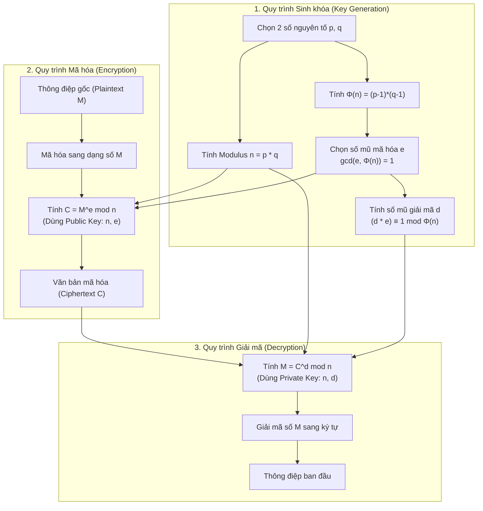

# Thuật toán Mã hóa Bất đối xứng RSA

## Table of Contents

- [Tổng quan về RSA](#tổng-quan-về-rsa)
- [Quy trình Sinh khóa (Key Generation)](#quy-trình-sinh-khóa-key-generation)
- [Hàm Euler Totient Φ(n)](#hàm-euler-totient-φn)
- [Lựa chọn Số mũ Mã hóa (e) và Giải mã (d)](#lựa-chọn-số-mũ-mã-hóa-e-và-giải-mã-d)
- [Nghịch đảo Modulo (Modular Multiplicative Inverse)](#nghịch-đảo-modulo-modular-multiplicative-inverse)
- [Quy trình Mã hóa (Encryption)](#quy-trình-mã-hóa-encryption)
- [Quy trình Giải mã (Decryption)](#quy-trình-giải-mã-decryption)
- [Bảng Tổng hợp Thành phần và Luồng Thuật toán](#bảng-tổng-hợp-thành-phần-và-luồng-thuật-toán)
- [Tổng kết Cặp Khóa Public và Private](#tổng-kết-cặp-khóa-public-và-private)

---

## Tổng quan về RSA

**RSA** là một thuật toán **Mã hóa bất đối xứng** (Asymmetric Encryption) được sử dụng phổ biến trong bảo mật thông tin, chữ ký số và truyền dữ liệu an toàn. Độ an toàn của RSA dựa trên độ khó của bài toán phân tích một số nguyên thành các thừa số nguyên tố lớn.

---

## Quy trình Sinh khóa (Key Generation)

Quy trình tạo cặp khóa trong thuật toán RSA trải qua các bước tính toán toán học nghiêm ngặt:

1. **Chọn hai số nguyên tố lớn**: Chọn hai số nguyên tố $p$ và $q$ ngẫu nhiên và độc lập. Hai số này phải được giữ bí mật tuyệt đối.
2. **Tính Modulus $n$**: Tính tích của hai số nguyên tố:
   $$n = p \times q$$
   Giá trị $n$ này sẽ được dùng làm modulus cho cả khóa công khai (**Public Key**) và khóa bí mật (**Private Key**).

> [!NOTE]
> **Tại sao phải chọn 2 số nguyên tố $p$ và $q$ rất lớn?**
>
> Khi nhân hai số nguyên tố bất kỳ $p$ và $q$, tích $n = p \times q$ chỉ chia hết cho đúng 4 số: $1, p, q, n$.
>
> - Nếu kẻ tấn công (hacker) muốn brute-force phân tích $n$, họ bắt buộc phải tìm ra đúng $p$ hoặc $q$ (trong 4 lựa chọn thì $1$ và $n$ là vô nghĩa).
> - Ngược lại, nếu dùng số hợp số thông thường, ví dụ $3 \times 4 = 12$, số $12$ sẽ chia hết cho $1, 2, 3, 4, 6, 12$ (có tới 6 lựa chọn, rất dễ suy đoán).
> - Vì vậy, hệ thống mã hóa chọn hai số nguyên tố cực lớn nhằm gây khó khăn tối đa cho phần cứng và tốc độ tính toán của kẻ tấn công.

---

## Hàm Euler Totient Φ(n)

Tính giá trị hàm **Euler Totient** $\Phi(n)$ theo công thức:

$$\Phi(n) = \Phi(p \times q) = \Phi(p) \times \Phi(q) = (p - 1) \times (q - 1)$$

Tham khảo chi tiết tại tài liệu [Euler's Totient Function - GeeksforGeeks](https://www.geeksforgeeks.org/dsa/eulers-totient-function/).

### Định nghĩa và Bản chất Toán học

Hàm Euler Totient $\Phi(n)$ dùng để đếm số lượng các số nguyên $x$ thỏa mãn $1 \le x \le n$ sao cho ước số chung lớn nhất $\gcd(x, n) = 1$ (nghĩa là $x$ và $n$ nguyên tố cùng nhau).

Ví dụ với $n = 10$: Các số $x$ thỏa mãn $1 \le x \le 10$ và $\gcd(x, 10) = 1$ là $\{1, 3, 7, 9\}$. Như vậy, $\Phi(10) = 4$.

### Tại sao với số nguyên tố $p$ thì $\Phi(p) = p - 1$?

Vì số nguyên tố $p$ chỉ có 2 ước duy nhất là $1$ và chính nó ($p$). Mọi số nguyên nhỏ hơn $p$ đều không chia hết cho $p$, do đó ước chung lớn nhất của chúng với $p$ luôn luôn là $1$.

Dưới đây là bảng minh họa các ví dụ tính hàm Euler Totient cho số nguyên tố:

| Số nguyên tố $p$ | Các số $x$ thỏa mãn $1 \le x \le p$ và $\gcd(x, p) = 1$ | Kết quả $\Phi(p)$ |
| :--- | :--- | :--- |
| **$p = 7$** | $\{1, 2, 3, 4, 5, 6\}$ | $\Phi(7) = 6 = 7 - 1$ |
| **$p = 5$** | $\{1, 2, 3, 4\}$ | $\Phi(5) = 4 = 5 - 1$ |
| **$p = 3$** | $\{1, 2\}$ | $\Phi(3) = 2 = 3 - 1$ |
| **$p = 2$** | $\{1\}$ | $\Phi(2) = 1 = 2 - 1$ |

> [!TIP]
> Tổng quát: Với bất kỳ số nguyên tố $p$ nào, số lượng các số $x$ ($1 \le x \le p$) thỏa mãn $\gcd(x, p) = 1$ luôn luôn bằng $p - 1$.

---

## Lựa chọn Số mũ Mã hóa (e) và Giải mã (d)

Sau khi tính xong $\Phi(n)$, tiến hành lựa chọn cặp số mũ $e$ (dùng cho mã hóa) và $d$ (dùng cho giải mã).

1. **Chọn số mũ mã hóa $e$ (Encryption Exponent)**:
   - Thỏa mãn điều kiện: $1 < e < \Phi(n)$
   - Thỏa mãn: $\gcd(e, \Phi(n)) = 1$ (nghĩa là $e$ và $\Phi(n)$ là hai số nguyên tố cùng nhau).

2. **Tính số mũ giải mã $d$ (Decryption Exponent)**:
   - Thỏa mãn phương trình đồng dư: $(d \times e) \equiv 1 \pmod{\Phi(n)}$
   - Nghĩa là $d$ là **Nghịch đảo Modulo** (Modular Multiplicative Inverse) của $e$ theo mod $\Phi(n)$.
   - Các phương pháp phổ biến để tính nghịch đảo modulo bao gồm: **Thuật toán Euclid mở rộng** (Extended Euclidean Algorithm), **Định lý Fermat nhỏ** (Fermat's Little Theorem).

> [!NOTE]
> Có thể tồn tại nhiều giá trị $d$ khác nhau thỏa mãn phương trình $(d \times e) \equiv 1 \pmod{\Phi(n)}$. Tuy nhiên, chọn bất kỳ giá trị hợp lệ nào cũng đều cho ra kết quả giải mã chính xác về thông điệp ban đầu.

---

## Nghịch đảo Modulo (Modular Multiplicative Inverse)

Để hiểu rõ cách chọn $e$ và tính $d$, cần nắm vững khái niệm toán học về phép chia dư và nghịch đảo modulo.

### 1. Phép chia lấy dư (Modulo)

Trong lập trình, phép chia lấy dư thường sử dụng toán tử `%`. Trong toán học, ký hiệu này là `mod`.

Ví dụ minh họa phép chia dư trong mã nguồn Python:

```python
# Tính phần dư của 10 chia cho 3
a = 10
b = 3
remainder = a % b  # Ký hiệu toán học: 10 mod 3 = 1
```

### 2. Khái niệm Đồng dư (Congruence)

Ký hiệu $a \equiv b \pmod n$ có nghĩa là $a$ và $b$ khi chia cho $n$ đều có cùng một số dư (nói cách khác, $a$ đồng dư với $b$ theo mod $n$).

**Ví dụ**: $10 \equiv 4 \pmod 6$ vì cả $10$ và $4$ khi chia cho $6$ đều dư $4$.

### 3. Định nghĩa Nghịch đảo Modulo

Nghịch đảo modulo của một số nguyên $a$ theo mod $n$ là một số nguyên $x$ sao cho:

$$(a \times x) \equiv 1 \pmod n$$

Ký hiệu: $x \equiv a^{-1} \pmod n$.

> [!IMPORTANT]
> **Điều kiện tồn tại**: Nghịch đảo modulo của $a$ theo mod $n$ **chỉ tồn tại khi và chỉ khi** $a$ và $n$ nguyên tố cùng nhau, tức là $\gcd(a, n) = 1$.
>
> Nếu $\gcd(a, n) \ne 1$ (ví dụ: tìm nghịch đảo modulo của $2$ theo mod $10$ với $\gcd(2, 10) = 2$), sẽ **không tồn tại** bất kỳ số nguyên $x$ nào thỏa mãn phương trình đồng dư. Đây cũng là lý do vì sao ở quy trình sinh khóa RSA, bước chọn $e$ bắt buộc phải thỏa mãn $\gcd(e, \Phi(n)) = 1$ để đảm bảo tính được số mũ giải mã $d$.

**Ví dụ tính toán**: Tìm nghịch đảo modulo của $3$ theo mod $10$:
- Do $\gcd(3, 10) = 1$, nghịch đảo modulo của $3$ theo mod $10$ chắc chắn tồn tại.
- Ta tìm số $x$ sao cho $(3 \times x) \pmod{10} = 1$.
- Thử với $x = 7$: $3 \times 7 = 21$.
- Ta có $21$ chia $10$ dư $1$ ($21 \pmod{10} = 1$).
- **Kết luận**: $3^{-1} \equiv 7 \pmod{10}$. Nghịch đảo modulo của $3$ theo mod $10$ là $7$.

---

## Quy trình Mã hóa (Encryption)

Để mã hóa một thông điệp văn bản $M$:

1. **Mã hóa ký tự sang số**: Thông điệp $M$ ban đầu được chuyển đổi sang dạng biểu diễn số (numerical representation) bằng các chuẩn mã hóa như ASCII, UTF-8 hoặc các cơ chế mã hóa padding (ví dụ: OAEP). Giá trị số $M$ thu được phải thỏa mãn $0 \le M < n$.
2. **Tính toán Ciphertext**: Sử dụng **Public Key** `(n, e)` để tính văn bản mã hóa $C$ theo công thức toán học:

   $$C = M^e \pmod n$$

   *Trong đó:*
   - $C$ là văn bản đã mã hóa (**Ciphertext**).
   - $M$ là thông điệp gốc dạng số (**Plaintext**).
   - $e$ (Encryption Exponent) và $n$ (Modulus) là hai thành phần của **Public Key**.

---

## Quy trình Giải mã (Decryption)

Để giải mã văn bản mã hóa $C$ và khôi phục thông điệp gốc:

1. **Khôi phục thông điệp dạng số**: Người nhận sử dụng **Private Key** `(n, d)` để giải mã $C$ về giá trị số ban đầu $M$ theo công thức toán học:

   $$M = C^d \pmod n$$

   *Trong đó:*
   - $M$ là giá trị số của thông điệp gốc sau giải mã (**Plaintext**).
   - $C$ là văn bản mã hóa (**Ciphertext**).
   - $d$ (Decryption Exponent) và $n$ (Modulus) là hai thành phần của **Private Key**.

2. **Chuyển đổi số sang văn bản**: Chuyển đổi giá trị số $M$ ngược lại thành chuỗi ký tự ban đầu dựa trên bảng mã mã hóa tương ứng (ASCII/UTF-8).

---

## Bảng Tổng hợp Thành phần và Luồng Thuật toán

Dưới đây biểu diễn sơ đồ luồng tổng thể của thuật toán RSA bao gồm Quy trình Sinh khóa, Mã hóa và Giải mã dữ liệu.

Biểu diễn sơ đồ luồng toàn bộ thuật toán RSA:



Bảng mô tả các thành phần trong thuật toán RSA:

| Thành phần | Vai trò & Mục đích | Chi tiết toán học |
| :--- | :--- | :--- |
| **Số nguyên tố `p`, `q`** | Đầu vào bí mật để khởi tạo hệ thống | Chọn 2 số nguyên tố đủ lớn để tránh tấn công phân tích thừa số. |
| **Modulus `n`** | Số chia công khai trong cả mã hóa & giải mã | `n = p * q`. Thành phần chứa trong cả Public Key và Private Key. |
| **Euler Totient `Φ(n)`** | Không gian nguyên tố cùng nhau | `Φ(n) = (p - 1) * (q - 1)`. Chỉ giữ bí mật để tính toán `d`. |
| **Encryption Exponent `e`** | Số mũ mã hóa (Public Key) | Chọn `e` sao cho `1 < e < Φ(n)` và `gcd(e, Φ(n)) = 1`. |
| **Decryption Exponent `d`** | Số mũ giải mã (Private Key) | Tính `d` thoả mãn `(d * e) ≡ 1 mod Φ(n)` (nghịch đảo modulo). |
| **Thông điệp gốc `M`** | Dữ liệu đầu vào cần bảo vệ | Chuyển đổi văn bản sang dạng biểu diễn số (ASCII/Encoding). |
| **Văn bản mã hóa `C`** | Dữ liệu mã hóa (Ciphertext) | Tính bằng công thức `C = M^e mod n` dùng Public Key `(n, e)`. |
| **Public Key / Private Key** | Cặp khóa mã hóa và giải mã | Public Key `(n, e)` công khai, Private Key `(n, d)` giữ bí mật. |

---

## Tổng kết Cặp Khóa Public và Private

Sau khi hoàn tất toàn bộ quy trình tính toán trên, cặp khóa RSA thu được bao gồm:

- **Public Key (Khóa công khai)**: `(n, e)` — Dùng để mã hóa dữ liệu $C = M^e \pmod n$ hoặc kiểm tra chữ ký số.
- **Private Key (Khóa bí mật)**: `(n, d)` — Dùng để giải mã dữ liệu $M = C^d \pmod n$ hoặc tạo chữ ký số.

---
[← Back to README](README.md)