# Encryption: Tổng quan, Thuật toán và Nền tảng Toán học

---

## Table of Contents

- [1. Tổng quan & Thành phần của Encryption](#1-tổng-quan--thành-phần-của-encryption)
- [2. Mục tiêu của Encryption](#2-mục-tiêu-của-encryption)
- [3. Phân loại Mã hóa](#3-phân-loại-mã-hóa)
- [4. Mã hóa Đối xứng (Symmetric Encryption)](#4-mã-hóa-đối-xứng-symmetric-encryption)
- [5. Mã hóa Bất đối xứng (Asymmetric Encryption)](#5-mã-hóa-bất-đối-xứng-asymmetric-encryption)
- [6. Nền tảng Toán học & Hiệu năng](#6-nền-tảng-toán-học--hiệu-năng)
- [7. Mã hóa Lai (Hybrid Encryption) trong HTTPS/TLS](#7-mã-hóa-lai-hybrid-encryption-trong-httpstls)
- [8. So sánh Symmetric vs Asymmetric Encryption](#8-so-sánh-symmetric-vs-asymmetric-encryption)
- [9. Ưu điểm và Thách thức](#9-ưu-điểm-và-thách-thức)
- [10. Tương lai của Encryption](#10-tương-lai-của-encryption)
- [11. Tổng kết & Ý tưởng Cốt lõi](#11-tổng-kết--ý-tưởng-cốt-lõi)

---

## 1. Tổng quan & Thành phần của Encryption

Trong môi trường lưu trữ và truyền tải thông tin qua mạng Internet, dữ liệu nhạy cảm liên tục đứng trước nguy cơ bị nghe lén hoặc can thiệp trái phép. **Encryption (Mã hóa)** đóng vai trò là cơ chế phòng thủ cốt lõi nhằm chuyển đổi dữ liệu gốc dễ đọc (**Plaintext**) thành chuỗi ký tự ngẫu nhiên không thể đọc (**Ciphertext**) dựa trên các thuật toán toán học và chìa khóa bảo mật (**Encryption Key**).

Chỉ những hệ thống hoặc cá nhân nắm giữ đúng khóa giải mã phù hợp mới khôi phục lại được nội dung dữ liệu ban đầu.

Cơ cấu và thành phần của một quy trình mã hóa chuẩn:

| Thành phần | Vai trò | Chi tiết |
| :--- | :--- | :--- |
| **Plaintext** | Dữ liệu gốc ban đầu | Chuỗi văn bản, file nhị phân hoặc payload API chưa qua mã hóa |
| **Encryption Algorithm** | Thuật toán mã hóa | Tập hợp quy tắc toán học phức tạp biến đổi **Plaintext** thành **Ciphertext** |
| **Encryption Key** | Khóa mã hóa | Chuỗi dữ liệu đầu vào có độ dài bí mật dùng để vận hành thuật toán |
| **Ciphertext** | Dữ liệu sau mã hóa | Trạng thái xáo trộn dữ liệu hoàn toàn, chỉ giải mã được khi có khóa hợp lệ |

Luồng chuyển đổi thông tin qua thuật toán mã hóa:

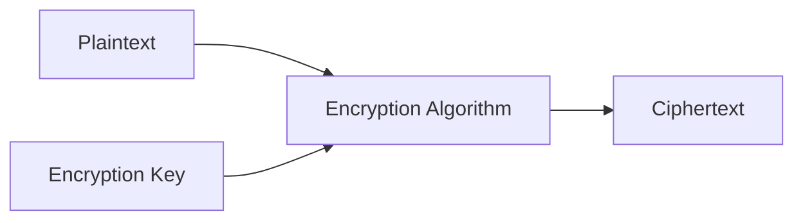

> [!NOTE]
> **Engineering Insight:** Trong các hệ thống sản xuất (Production Systems), việc mã hóa dữ liệu cần tính toán kỹ đến chi phí tài nguyên phần cứng. Phép toán mã hóa tiêu tốn chu kỳ CPU đáng kể, do đó việc chọn đúng thuật toán và triển khai hỗ trợ phần cứng (như tập lệnh `AES-NI` trên chip Intel/AMD) giúp tăng hiệu năng xử lý lên gấp nhiều lần.

---

## 2. Mục tiêu của Encryption

Mật mã học hiện đại không chỉ dừng lại ở việc giấu thông tin mà còn hình thành khung bảo mật toàn diện đáp ứng 5 trụ cột quan trọng:

* **Confidentiality (Tính bảo mật):** Đảm bảo duy nhất thực thể sở hữu khóa giải mã hợp lệ mới đọc được nội dung dữ liệu.
* **Integrity (Tính toàn vẹn):** Giúp phát hiện mọi sự thay đổi hay can thiệp dù là nhỏ nhất trên dữ liệu trong quá trình truyền tải.
* **Authentication (Tính xác thực):** Định danh chính xác nguồn gốc gửi dữ liệu, tránh giả mạo đối tác truyền thông.
* **Non-repudiation (Chống chối bỏ):** Ngăn chặn bên tạo thông điệp phủ nhận hành vi gửi dữ liệu thông qua chữ ký số.
* **Access Control (Kiểm soát truy cập):** Giới hạn quyền hạn đọc/ghi dữ liệu dựa vào phân phối và quản lý danh mục khóa.

Cấu trúc phân rã các mục tiêu an ninh thông tin trong mã hóa:

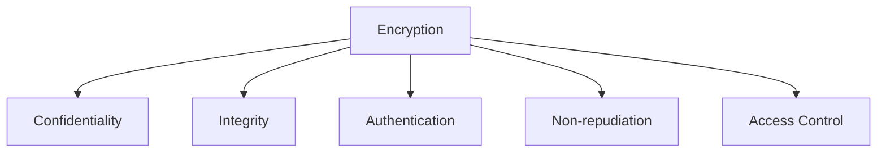

---

## 3. Phân loại Mã hóa

Các thuật toán mật mã được chia làm hai trường phái chính phụ thuộc vào cách thức quản lý và tổ chức chìa khóa: **Symmetric Encryption (Mã hóa đối xứng)** và **Asymmetric Encryption (Mã hóa bất đối xứng)**.

Cây phân nhánh các nhóm thuật toán mật mã phổ biến:

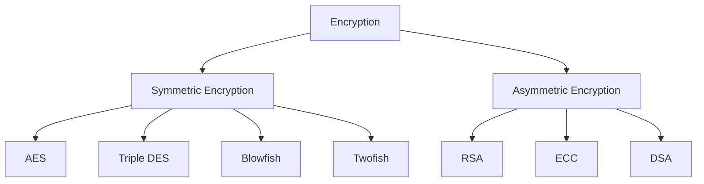

---

## 4. Mã hóa Đối xứng (Symmetric Encryption)

### Bối cảnh & Đặc điểm

Mã hóa đối xứng được tối ưu hóa mạnh mẽ cho tốc độ và khả năng xử lý dữ liệu khối lượng lớn (như mã hóa đĩa cứng, lưu trữ cơ sở dữ liệu hay truyền stream media).

* Khóa mã hóa và giải mã là **hoàn toàn giống nhau** (`Shared Secret Key`).
* Tốc độ mã hóa nhanh, chi phí tính toán thấp.
* Phù hợp để xử lý các file dung lượng lớn từ vài `MB` đến nhiều `GB`.
* Đòi hỏi giải pháp phân phối khóa bí mật ban đầu cực kỳ an toàn giữa các bên.

Luồng tương tác truyền nhận khi hai bên chia sẻ cùng khóa bí mật:

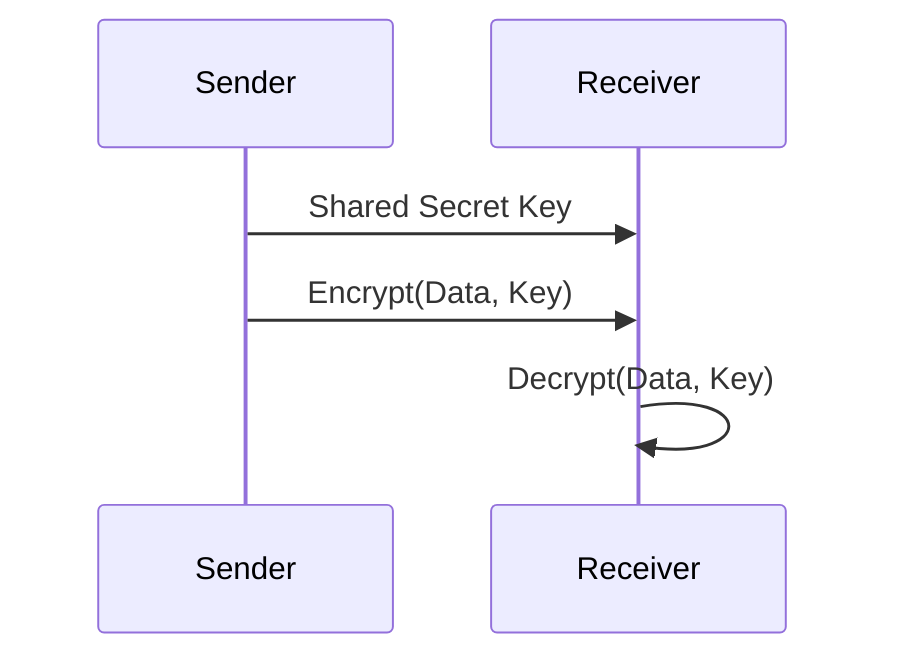

### Các thuật toán tiêu biểu

1. **AES (Advanced Encryption Standard)**
   * Chuẩn mã hóa đối xứng hàng đầu hiện nay.
   * Kích thước khối (Block size): `128-bit`.
   * Độ dài khóa hỗ trợ: `128`, `192`, hoặc `256 bit`.
   * Hỗ trợ tăng tốc bằng phần cứng trên đa số CPU hiện đại.
2. **Triple DES (3DES)**
   * Áp dụng thuật toán `DES` 3 lần liên tiếp để tăng mức độ an toàn.
   * Tốc độ xử lý chậm hơn `AES` đáng kể và đang dần bị ngưng sử dụng trong các tiêu chuẩn mới.
3. **Blowfish**
   * Thuật toán mã hóa khối kiểu `Feistel Cipher`.
   * Độ dài khóa linh hoạt từ `32 bit` đến `448 bit`.
   * Không mất phí bản quyền, áp dụng tự do.
4. **Twofish**
   * Phiên bản cải tiến kế thừa từ `Blowfish` với khóa tối đa `256 bit`.
   * Cấu trúc linh hoạt, tối ưu hiệu năng tốt trên các vi điều khiển và thiết bị nhúng.

> [!TIP]
> **Engineering Insight:** Khi triển khai **AES** trong thực tế, không bao giờ sử dụng chế độ `ECB (Electronic Codebook)` vì các khối dữ liệu trùng nhau sẽ tạo ra ciphertext trùng nhau. Thay vào đó, hãy ưu tiên chọn các chế độ mã hóa xác thực như `AES-GCM (Galois/Counter Mode)` để vừa đảm bảo tính bảo mật vừa đảm bảo tính toàn vẹn dữ liệu.

---

## 5. Mã hóa Bất đối xứng (Asymmetric Encryption)

### Bối cảnh & Đặc điểm

Mã hóa bất đối xứng giải quyết triệt để bài toán phân phối khóa bằng cách tách biệt nhiệm vụ của hai khóa toán học: **Public Key (Khóa công khai)** và **Private Key (Khóa bí mật)**.

* **Public Key:** Có thể công khai cho bất kỳ ai dùng để mã hóa thông điệp hoặc kiểm tra chữ ký.
* **Private Key:** Phải giữ bí mật tuyệt đối, dùng để giải mã hoặc tạo chữ ký số.
* Độ an toàn dựa trên các bài toán toán học siêu khó.
* Thích hợp cho trao đổi khóa, thiết lập kênh truyền an toàn và xác thực danh tính.

Tiến trình truyền nhận thông điệp qua cặp khóa bất đối xứng:

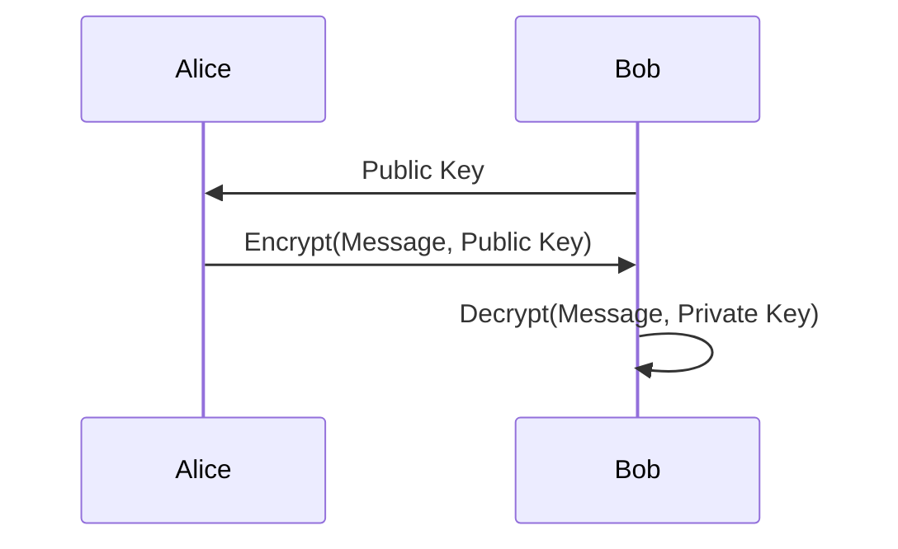

### Các thuật toán tiêu biểu

1. **RSA (Rivest–Shamir–Adleman)**
   * Nền tảng dựa trên bài toán phân tích số nguyên lớn ra thừa số nguyên tố (`Integer Factorization Problem`).
   * Khóa tiêu chuẩn hiện nay tối thiểu là `2048 bit` hoặc `4096 bit`.
2. **ECC (Elliptic Curve Cryptography)**
   * Dựa trên bài toán lôgarit rời rạc trên đường cong Elliptic (`ECDLP`).
   * Cung cấp mức độ bảo mật tương đương `RSA 3072-bit` chỉ với khóa `256-bit`.
   * Giúp tiết kiệm băng thông và bộ nhớ đáng kể, cực kỳ thích hợp cho di động và các thiết bị IoT.
3. **DSA (Digital Signature Algorithm)**
   * Dựa trên bài toán lôgarit rời rạc (`DLP`).
   * Thiết kế chuyên biệt cho việc tạo và xác minh chữ ký số.

---

## 6. Nền tảng Toán học & Hiệu năng

Sự chênh lệch lớn về hiệu năng tính toán giữa Mã hóa Đối xứng và Bất đối xứng xuất phát trực tiếp từ bản chất bài toán toán học mà mỗi phương pháp chọn làm nền tảng.

Mối liên kết từ nền tảng bài toán lý thuyết đến đánh giá hiệu năng và an toàn:

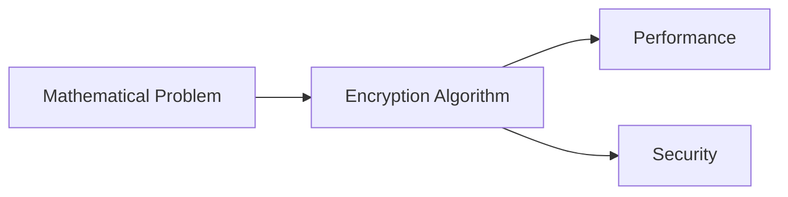

### Bản chất Toán học của Symmetric Encryption (AES)

Các thuật toán mã hóa đối xứng như `AES` không dựa trên một bài toán phân tích số học khó. Thay vào đó, chúng xây dựng trên mạng biến đổi hoán vị (`Substitution-Permutation Network - SPN`) gồm 2 nguyên lý:

* **Confusion (Sự hỗn loạn):** Phá vỡ mối liên hệ giữa khóa bí mật và `Ciphertext`.
* **Diffusion (Sự khuếch tán):** Thay đổi `1 bit` ở `Plaintext` sẽ xáo trộn ngẫu nhiên tới `50%` số bit trong `Ciphertext`.

Các phép toán biến đổi của `AES` diễn ra trên trường hữu hạn $GF(2^8)$ bao gồm: `XOR`, `SubBytes`, `ShiftRows`, `MixColumns`, và `AddRoundKey`. Đây là các phép toán biến đổi bit đơn giản, xử lý với thời gian tuyến tính $O(N)$ nên cực kỳ nhanh.

Chuỗi thao tác biến đổi bit trong một round mã hóa AES:

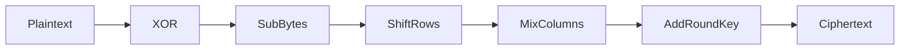

### Bản chất Toán học của Asymmetric Encryption (RSA & ECC)

Mã hóa bất đối xứng sử dụng các phép toán số học mô-đun trên các tập số cực lớn.

> [!NOTE]
> **Bài toán phân tích số nguyên lớn (RSA):**
> Nhân hai số nguyên tố lớn $p$ và $q$ để tạo ra $n = p \times q$ là phép tính đơn giản. Ngược lại, khi cho trước một số nguyên $n$ cực lớn (ví dụ `2048 bit`), việc phân tích ngược lại để tìm $p$ và $q$ đòi hỏi thời gian tính toán vượt quá khả năng của toàn bộ máy tính hiện nay.

> [!NOTE]
> **Bài toán Lôgarit Rời rạc trên Đường cong Elliptic (ECC):**
> Điểm $Q = k \times P$ trên đường cong Elliptic rất dễ tính khi biết $k$ và điểm cơ sở $P$. Tuy nhiên, tìm lại số nguyên $k$ khi chỉ biết $P$ và $Q$ (`ECDLP`) là bài toán đòi hỏi chi phí tính toán siêu mũ.

### So sánh Bài toán Nền tảng & Độ phức tạp Tính toán

Bảng tổng hợp bài toán nền tảng và chi phí tính toán giữa các thuật toán:

| Thuật toán | Bài toán nền tảng | Kích thước khóa điển hình | Chi phí tính toán |
| :--- | :--- | :--- | :--- |
| **AES** | Substitution + Permutation + Arithmetic $GF(2^8)$ | `128 / 192 / 256 bit` | Rất thấp (Tuyến tính $O(N)$) |
| **RSA** | Integer Factorization Problem (IFP) | `2048 / 4096 bit` | Rất cao (Lũy thừa mô-đun) |
| **ECC** | Elliptic Curve Discrete Logarithm Problem (ECDLP) | `256 / 384 bit` | Trung bình |
| **DSA** | Discrete Logarithm Problem (DLP) | `2048 / 3072 bit` | Trung bình |

Phân định bài toán nền tảng tương ứng với các thuật toán mật mã:

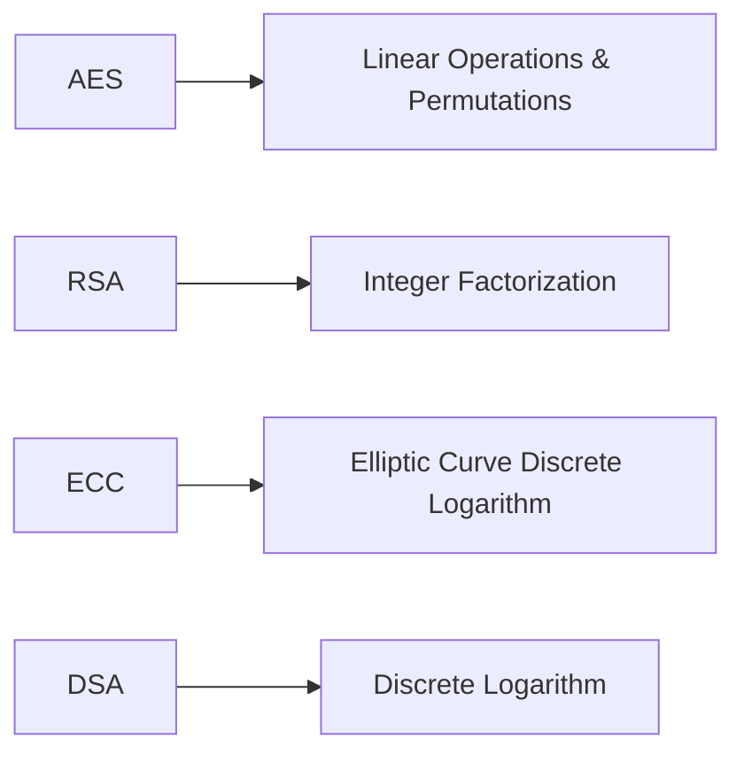

### So sánh tốc độ xử lý giữa AES và RSA

Do phép nhân số nguyên lớn và lũy thừa mô-đun trong `RSA` phức tạp gấp hàng ngàn lần so với phép tra bảng và `XOR` bit của `AES`, tốc độ mã hóa của `AES` vượt trội hoàn toàn.

Tương quan độ phức tạp tính toán giữa phép toán bit AES và lũy thừa mô-đun RSA:

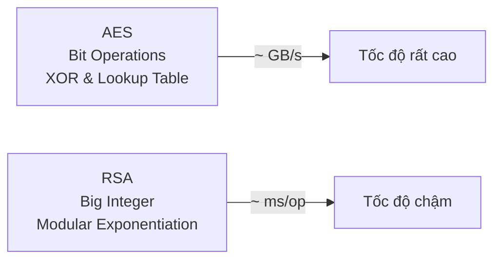

---

## 7. Mã hóa Lai (Hybrid Encryption) trong HTTPS/TLS

Nhằm kết hợp tốc độ tối ưu của mã hóa đối xứng cùng khả năng trao đổi khóa an toàn của mã hóa bất đối xứng, giao thức **HTTPS / TLS** sử dụng kiến trúc **Hybrid Encryption (Mã hóa lai)**.

Mô hình phối hợp trao đổi khóa asymmetric và truyền dữ liệu symmetric:

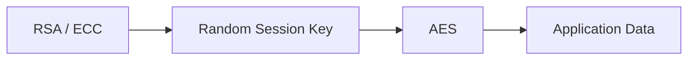

Tóm tắt 5 giai đoạn thiết lập kết nối Hybrid Encryption:

| Giai đoạn | Hành động | Chi tiết kỹ thuật |
| :--- | :--- | :--- |
| **1. Khởi tạo** | Handshake Request | Client kết nối và nhận Public Key (Certificate) từ Server |
| **2. Sinh Session Key** | Client generation | Client khởi tạo một chuỗi ngẫu nhiên làm `Session Key` cho thuật toán đối xứng |
| **3. Mã hóa Khóa** | Asymmetric Encryption | Client dùng Public Key của Server mã hóa `Session Key` và gửi qua mạng |
| **4. Giải mã Khóa** | Server decryption | Server lấy Private Key của mình để giải mã, thu được `Session Key` ban đầu |
| **5. Truyền dữ liệu** | Symmetric Channel | Hai bên dùng `Session Key` cùng thuật toán `AES` để mã hóa toàn bộ dữ liệu ứng dụng |

---

## 8. So sánh Symmetric vs Asymmetric Encryption

Bảng so sánh đa tiêu chí giữa Symmetric và Asymmetric Encryption:

| Tiêu chí | Symmetric Encryption | Asymmetric Encryption |
| :--- | :--- | :--- |
| **Số lượng khóa** | 1 khóa chung (`Shared Secret Key`) | Cặp 2 khóa (`Public Key` & `Private Key`) |
| **Tốc độ xử lý** | Cực nhanh (đạt mức `GB/s`) | Chậm hơn nhiều (khoảng `ms` mỗi thao tác) |
| **Quản lý khóa** | Phức tạp khi truyền khóa ban đầu | Đơn giản, chia sẻ `Public Key` công khai |
| **Kích thước dữ liệu** | Mã hóa khối lượng dữ liệu lớn | Mã hóa dữ liệu nhỏ (`Session Key`, `Chữ ký`) |
| **Ứng dụng chính** | Mã hóa file, đĩa cứng, dữ liệu kênh TLS | Bắt tay TLS, chữ ký số, xác thực danh tính |
| **Thuật toán phổ biến** | AES, 3DES, Blowfish, Twofish | RSA, ECC, DSA |

Đặc tính vận hành cốt lõi của hai trường phái mã hóa:

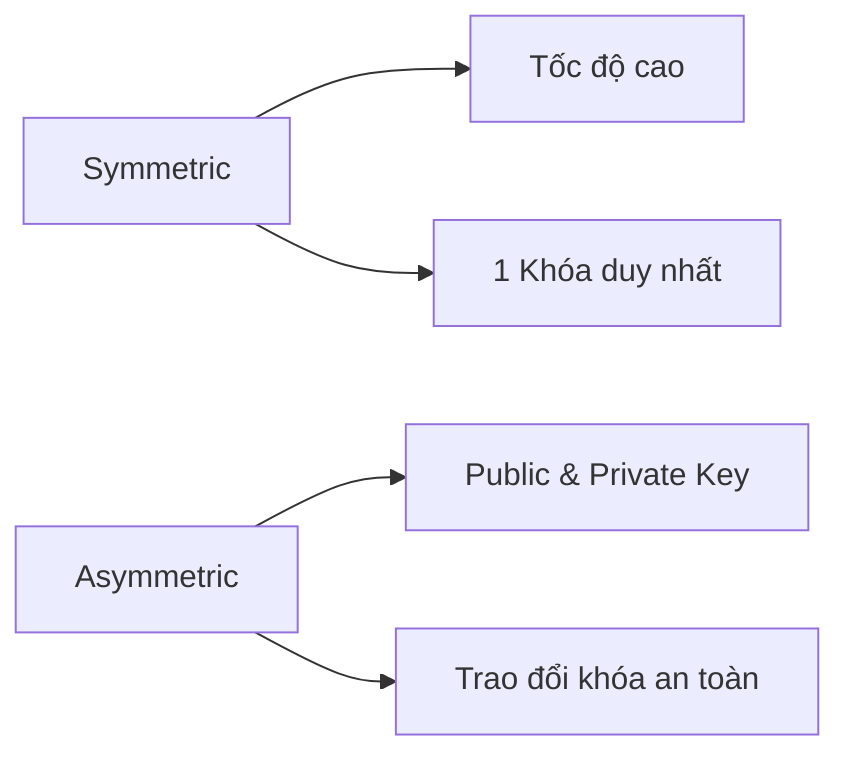

---

## 9. Ưu điểm và Thách thức

### Lợi ích bảo mật

* Bảo vệ dữ liệu trên đường truyền (`Data in Transit`) lẫn dữ liệu lưu trữ trong ổ đĩa/DB (`Data at Rest`).
* Đảm bảo tính riêng tư, ngăn chặn hoàn toàn hành vi nghe lén (`eavesdropping`).
* Đạt các chuẩn tuân thủ an toàn thông tin bắt buộc như `GDPR`, `PCI-DSS`, `HIPAA`.

### Thách thức triển khai

* **Key Management (Quản lý khóa):** Lưu trữ, phân quyền, xoay vòng (`Key Rotation`) và thu hồi khóa là công việc phức tạp.
* **Chi phí tài nguyên:** Tăng tải CPU và tăng độ trễ mạng nếu không chọn đúng thuật toán phù hợp.

Đánh giá hai mặt lợi ích bảo mật và rào cản triển khai:

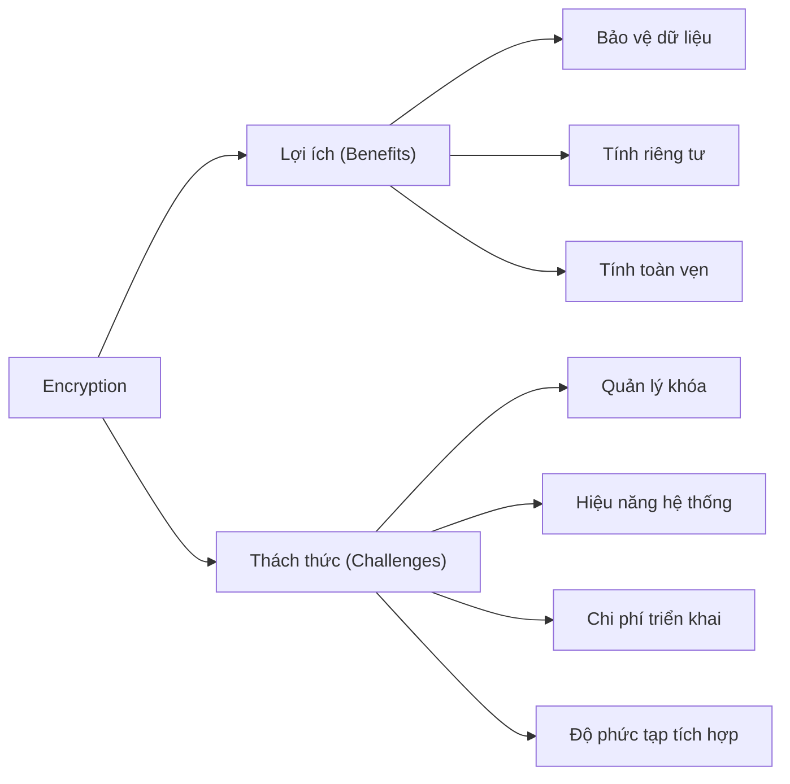

---

## 10. Tương lai của Encryption

Lĩnh vực mật mã học đang chứng kiến những bước phát triển vượt bậc nhằm ứng phó với các hạ tầng điện toán đám mây và máy tính lượng tử:

1. **Bring Your Own Encryption (BYOE):** Mô hình cho phép doanh nghiệp tự quản lý và giữ khóa mã hóa riêng khi lưu trữ trên Cloud.
2. **Homomorphic Encryption (Mã hóa đẳng cấu):** Cho phép tính toán trực tiếp trên dữ liệu đang mã hóa mà không cần giải mã.
3. **Post-Quantum Cryptography (PQC):** Thiết kế các thuật toán mật mã toán học thế hệ mới kháng lại khả năng phá khóa của máy tính lượng tử.
4. **Honey Encryption:** Sinh ra dữ liệu giả có vẻ hợp lý khi kẻ tấn công cố giải mã bằng sai khóa.

Các xu hướng công nghệ mật mã thế hệ mới:

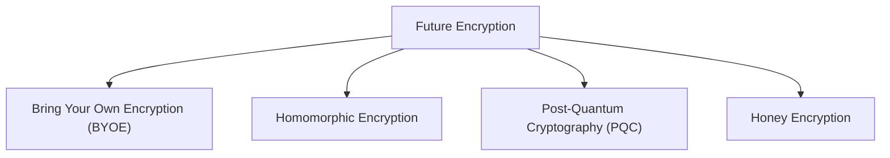

---

## 11. Tổng kết & Ý tưởng Cốt lõi

Kiến trúc tổng thể kết nối toàn bộ hệ thống mật mã học:

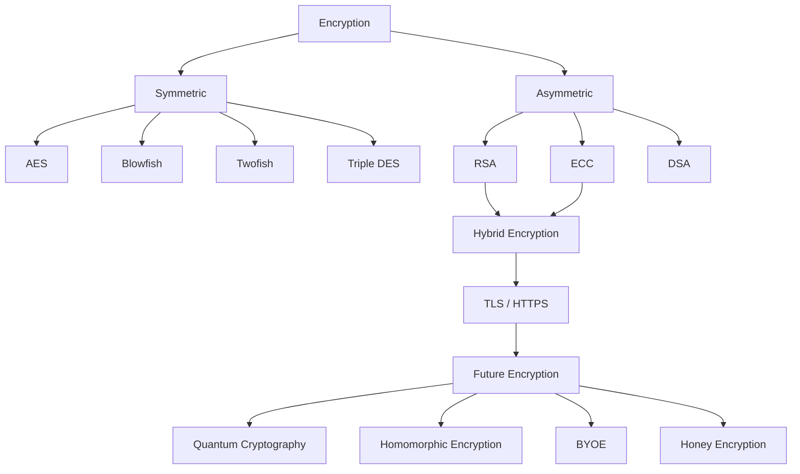

> [!IMPORTANT]
> **Tóm tắt ý tưởng cốt lõi:**
> * **Symmetric Encryption (AES):** Tối ưu hóa bằng **mạng biến đổi hoán vị bit**, đem lại tốc độ cực cao cho khối lượng dữ liệu lớn.
> * **Asymmetric Encryption (RSA/ECC):** Xây dựng trên **độ khó của bài toán số học lớn**, giải quyết hoàn hảo bài toán trao đổi khóa và xác thực danh tính.
> * **Ứng dụng sản xuất:** HTTPS/TLS kết hợp cả hai — mã hóa bất đối xứng để thực hiện trao đổi khóa an toàn lúc bắt tay, sau đó chuyển sang mã hóa đối xứng để truyền tải dữ liệu.

---
[← Back to README](README.md)

