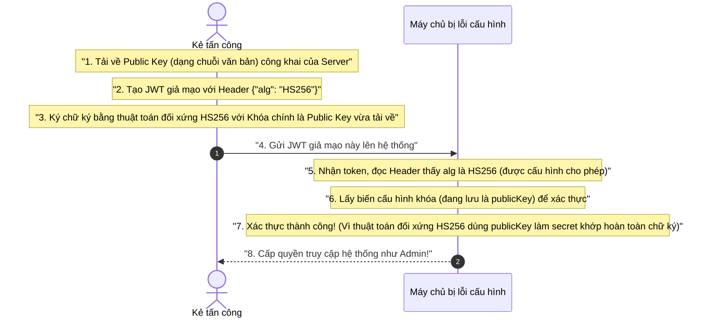

# Tấn công và Phòng thủ trong JWT

Các lỗ hổng liên quan đến **JSON Web Token (JWT)** thường không xuất phát từ bản thân tiêu chuẩn mở RFC 7519, mà chủ yếu phát sinh từ việc triển khai lập trình cẩu thả và cấu hình thiếu an toàn ở phía máy chủ (server-side). Tài liệu này sẽ phân tích chi tiết các kiểu tấn công từ cổ điển đến nâng cao cùng các giải pháp phòng thủ kiên cố tương ứng.

## Mục lục

1. [Tấn công Thuật toán `none`](#1-tấn-công-thuật-toán-none)
2. [Tấn công Lược bỏ Chữ ký (Signature Stripping)](#2-tấn-công-lược-bỏ-chữ-ký-signature-stripping)
3. [Tấn công Bẻ khóa Khóa bí mật yếu](#3-tấn-công-bẻ-khóa-khóa-bí-mật-yếu)
4. [Tấn công Thay thế Thuật toán (Algorithm Confusion)](#4-tấn-công-thay-thế-thuật-toán-algorithm-confusion)
5. [Tấn công nâng cao JWKS Spoofing](#5-tấn-công-nâng-cao-jwks-spoofing)
6. [Tấn công nâng cao `kid` Path Traversal](#6-tấn-công-nâng-cao-kid-path-traversal)
7. [Các Biện pháp Phòng thủ Tổng thể](#7-các-biện-pháp-phòng-thủ-tổng-thể)
8. [Tổng kết](#8-tổng-kết)

---

## 1. Tấn công Thuật toán `none`

Tiêu chuẩn JWT hỗ trợ một thuật toán đặc biệt là `**none**`. Đúng như tên gọi, nếu header của token chỉ định `{"alg": "none"}`, điều đó có nghĩa là token này **không có chữ ký mật mã (unsigned)**.

> [!WARNING]
> Nếu máy chủ được cấu hình lỏng lẻo chấp nhận thuật toán `none`, kẻ tấn công có thể dễ dàng sửa đổi Payload thành bất kỳ dữ liệu nào (ví dụ: đổi quyền thành admin), xóa bỏ Signature và gửi lên. Server sẽ hoàn toàn tin tưởng Payload đó mà bỏ qua việc xác minh chữ ký.

### 1.1. Luồng tấn công mạo danh Admin
Giả sử mục tiêu của kẻ gian là mạo danh người dùng `admin`, trong khi hắn chỉ có tài khoản của người dùng thường `user`.

1.  **Bước 1: Lấy token mẫu:** Kẻ tấn công đăng nhập tài khoản thường và nhận được một JWT hợp lệ.
2.  **Bước 2: Phân tích token:** Giải mã Base64URL để lấy JSON gốc của Header và Payload.
    *   **Header gốc:** `{"alg": "HS256", "typ": "JWT"}`
    *   **Payload gốc:** `{"userID": "user"}`
3.  **Bước 3: Tạo Header giả mạo:** Sửa thuật toán `alg` thành `none`.
    *   **Header mới:** `{"alg": "none", "typ": "JWT"}`
4.  **Bước 4: Tạo Payload giả mạo:** Đổi ID người dùng thành quyền lực tối cao.
    *   **Payload mới:** `{"userID": "admin"}`
5.  **Bước 5: Tạo token giả mạo:** Mã hóa Base64URL Header và Payload mới ghép lại với nhau. Do thuật toán là `none`, phần chữ ký sẽ rỗng nhưng bắt buộc vẫn phải giữ dấu chấm phân tách ở cuối:
    *   **Token giả mạo:** `Base64Url(Header_mới).Base64Url(Payload_mới).`
6.  **Bước 6: Gửi yêu cầu:** Kẻ tấn công đính kèm token này để truy cập tài nguyên bảo mật và thành công vượt qua chốt chặn của server bị lỗi cấu hình.

---

## 2. Tấn công Lược bỏ Chữ ký (Signature Stripping)

Đây là một biến thể nguy hiểm của cuộc tấn công `none`, nhắm vào lỗi logic kiểm tra ở phía máy chủ: Máy chủ *tạo ra* token sử dụng thuật toán an toàn (như `HS256`) nhưng logic *xác thực* lại chấp nhận linh hoạt cả `HS256` lẫn `none` dựa vào khai báo của client.

Kẻ tấn công chủ động "lược bỏ" chữ ký hợp lệ và thay đổi header để đánh lừa máy chủ.

> [!NOTE]
> **Tại sao máy chủ lại chấp nhận token rỗng chữ ký trong khi nó vốn dùng HS256?**
> Lỗi nghiêm trọng nằm ở chỗ nhà phát triển cho phép thư viện JWT tự động quyết định thuật toán dựa trên khai báo từ Header của Client truyền lên, thông qua một danh sách các thuật toán được phép (whitelist) chứa cả `none`.

Ví dụ mã nguồn NodeJS cấu hình xác thực bị lỗi bảo mật nghiêm trọng:
```javascript
// api.js - Danh sách thuật toán được phép chứa cả thuật toán 'none' nguy hiểm
const allowedAlgs = ['none', 'HS256'];

// Thư viện JWT đọc 'alg' trực tiếp từ token của hacker gửi lên
// Đối chiếu thấy 'none' nằm trong whitelist allowedAlgs và bỏ qua verify Signature
const decoded = jwt.verify(token, secret, { algorithms: allowedAlgs });
```

---

## 3. Tấn công Bẻ khóa Khóa bí mật yếu

Cuộc tấn công này nhắm vào các ứng dụng sử dụng thuật toán đối xứng như `HS256`. Nếu khóa bí mật chung (Shared Secret Key) được chọn quá ngắn hoặc dễ đoán (ví dụ: "123456", "secret", "admin123"), kẻ tấn công có thể bẻ khóa bằng phương pháp **Vét cạn (Brute-force)** hoặc **Tấn công Từ điển (Dictionary Attack)** ngoại tuyến (offline) cực kỳ nhanh chóng.

### 3.1. Tiến trình bẻ khóa ngoại tuyến
1.  **Bước 1: Lấy token HS256:** Kẻ tấn công lấy một JWT hợp lệ bất kỳ phát ra từ server.
2.  **Bước 2: Chạy công cụ Brute-force:** Hắn nạp token vào một công cụ bẻ khóa hiệu năng cao như `jwt-cracker` hoặc `hashcat` cùng với một file từ điển mật khẩu phổ biến.

Ví dụ lệnh chạy công cụ vét cạn khóa bí mật của JWT với tập ký tự định sẵn:
```bash
# Ví dụ lệnh chạy vét cạn khóa bí mật với chuỗi ký tự mẫu
jwt-cracker <token_HS256_nhận_được> abcdef123456 6
```

3.  **Bước 3: Tái tạo chữ ký:** Công cụ tự động mã hóa băm Header và Payload với từng từ trong từ điển cho đến khi chữ ký tạo ra trùng khớp với Signature trong token.
4.  **Kết quả:** Khi khóa bí mật bị tìm ra, kẻ tấn công có toàn quyền tự ký bất kỳ token nào để mạo danh bất cứ ai trong hệ thống.

---

## 4. Tấn công Thay thế Thuật toán (Algorithm Confusion)

Đây là cuộc tấn công vô cùng tinh vi, còn được gọi là **Tấn công Nhầm lẫn Thuật toán (Algorithm Confusion Attack)**. Kẻ tấn công đánh tráo cơ chế từ thuật toán bất đối xứng `RS256` sang thuật toán đối xứng `HS256` nhằm đánh lừa máy chủ.

> [!IMPORTANT]
> **Bối cảnh của lỗ hổng:**
> *   Máy chủ sử dụng thuật toán bất đối xứng `RS256` để ký và xác thực token.
> *   Nó dùng **Private Key** để *ký* (tuyệt mật trên server) và dùng **Public Key** để *xác thực* (được chia sẻ công khai qua mạng). Kẻ tấn công dễ dàng tải được Public Key này về.

### 4.1. Luồng tấn công Algorithm Confusion (Sequence Diagram)

Dưới đây là sơ đồ mô tả chi tiết cách kẻ tấn công biến Khóa công khai (Public Key) thành Khóa bí mật chung (Shared Secret) để lừa server:



### 4.2. Bảng phân tích chi tiết lỗ hổng Algorithm Confusion

| Thành phần/Bước | Vai trò/Mô tả | Chi tiết |
| :--- | :--- | :--- |
| **Public Key** | Khóa xác thực công khai của RS256 | Kẻ tấn công tải về và sử dụng nó như một **Shared Secret Key** (khóa đối xứng) để tự tay ký một JWT mới bằng thuật toán `HS256`. |
| **Header tráo đổi** | Đổi thuật toán từ RS256 sang HS256 | Kẻ tấn công khai báo `"alg": "HS256"` trong Header của JWT giả mạo để ép server chuyển chế độ xác thực đối xứng. |
| **Lỗi logic phía Server** | Dùng chung một biến khóa cho cả hai thuật toán | Server được cấu hình chấp nhận cả `RS256` và `HS256`, đồng thời truyền trực tiếp biến `publicKey` vào hàm verify của thư viện mà không phân biệt thuật toán. |

### 4.3. Minh họa lỗi code và giải pháp vá lỗ hổng
Ví dụ mã nguồn NodeJS bị lỗi cấu hình Algorithm Confusion:
```javascript
// CODE LỖI BẢO MẬT: Chấp nhận cả 2 thuật toán và dùng chung 1 biến publicKey cho verify
const allowedAlgs = ['RS256', 'HS256'];

// Thư viện sẽ đọc alg: HS256 từ client và coi biến publicKey như Shared Secret đối xứng
const decoded = jwt.verify(token, publicKey, { algorithms: allowedAlgs });
```

Ví dụ mã nguồn NodeJS được cấu hình đúng để vá lỗ hổng triệt để:
```javascript
// CODE ĐÃ VÁ LỖI: Buộc chỉ định duy nhất thuật toán RS256 khi xác thực bằng Public Key
const decoded = jwt.verify(token, publicKey, { algorithms: ['RS256'] });
```

---

## 5. Tấn công nâng cao JWKS Spoofing

Trong mô hình Microservices sử dụng thuật toán bất đối xứng `RS256`, các Resource Server cần tải Public Key từ Authorization Server để xác thực token. Tiêu chuẩn JWT cho phép đặt đường dẫn tải key này trong trường `jku` (JWK Set URL) hoặc `x5u` của Header.

> [!WARNING]
> Nếu Resource Server được lập trình tự động gửi HTTP Request để tải Public Key từ bất kỳ URL nào nằm trong trường `jku` mà client gửi lên mà không kiểm tra tên miền tin cậy (domain whitelist), kẻ tấn công sẽ thực hiện cuộc tấn công **JWKS Spoofing**.

### 5.1. Luồng tấn công JWKS Spoofing
1.  **Tạo khóa giả:** Kẻ tấn công sinh ra một cặp khóa Public/Private Key giả của riêng hắn.
2.  **Đăng tải Public Key giả:** Hắn đăng tải Public Key giả này lên một server do hắn kiểm soát (ví dụ: `https://hacker.com/keys.json`).
3.  **Tạo JWT giả mạo:** Hắn tạo ra một JWT với Payload mạo danh Admin, đặt Header chứa đường dẫn tải khóa giả của hắn:
    ```json
    {
      "alg": "RS256",
      "jku": "https://hacker.com/keys.json"
    }
    ```
4.  **Ký token:** Hắn ký chữ ký số của JWT này bằng **Private Key giả** của hắn rồi gửi lên máy chủ mục tiêu.
5.  **Server bị lừa:** Resource Server nhận token, đọc header thấy `jku`, lập tức gửi request đến `https://hacker.com/keys.json` để tải Public Key về rồi dùng nó xác thực chữ ký. Chữ ký hoàn toàn khớp và máy chủ cấp quyền Admin cho hacker!

---

## 6. Tấn công nâng cao `kid` Path Traversal

Trường Header `kid` (Key ID) được sử dụng để chỉ định ID của khóa cần dùng trong trường hợp hệ thống có nhiều khóa xác thực khác nhau. Một số hệ thống triển khai logic tìm kiếm khóa bằng cách đọc trực tiếp `kid` để lấy đường dẫn file khóa trên đĩa cứng (disk storage).

> [!WARNING]
> Nếu lập trình viên nối chuỗi trực tiếp giá trị `kid` vào đường dẫn thư mục lưu khóa mà không lọc đầu vào, kẻ tấn công có thể thực hiện cuộc tấn công **Path Traversal** nhằm thay đổi tệp tin khóa xác thực thành một file có nội dung đoán trước được hoặc file trống trong hệ điều hành.

### 6.1. Tiến trình tấn công
1.  **Tiêm đường dẫn khóa hệ thống:** Kẻ tấn công tạo một JWT giả mạo và đặt `kid` trỏ đến file rỗng hoặc file rác của hệ điều hành, ví dụ:
    ```json
    {
      "alg": "HS256",
      "kid": "../../../../../dev/null"
    }
    ```
2.  **Server đọc khóa:** Resource Server nhận token, nối chuỗi và cố gắng đọc file khóa tại `/path/to/keys/../../../../../dev/null`. Trong môi trường Linux, `/dev/null` là một tệp tin luôn luôn trống (rỗng).
3.  **Đánh tráo khóa thành rỗng:** Khóa dùng để verify lúc này sẽ có giá trị là chuỗi trống hoặc rỗng (`null`).
4.  **Giả mạo chữ ký:** Kẻ tấn công dùng khóa đối xứng là chuỗi trống hoặc null để ký chữ ký số cho JWT giả và vượt qua chốt chặn an toàn thành công.

---

## 7. Các Biện pháp Phòng thủ Tổng thể

Để bảo vệ ứng dụng của bạn an toàn tuyệt đối trước mọi nguy cơ tấn công JWT, hãy áp dụng nghiêm ngặt các biện pháp phòng thủ sau:

*   **Chống thuật toán `none` & Lược bỏ Chữ ký:**
    *   **Tuyệt đối không** cấu hình đưa `none` vào danh sách các thuật toán được phép (whitelist) khi xác thực.
    *   Sử dụng thư viện JWT phiên bản mới nhất (các phiên bản hiện đại của các thư viện lớn đều tự động cấm thuật toán `none` theo mặc định).
*   **Chống Tấn công Thay thế (Algorithm Confusion):**
    *   Khi xác thực JWT bằng Public Key, **bắt buộc** phải chỉ định tường minh duy nhất một thuật toán bất đối xứng được phép dùng là `['RS256']`.
*   **Phòng thủ JWKS Spoofing:**
    *   **Không bao giờ** tải Public Key tự động từ URL do client cung cấp mà không xác minh tên miền.
    *   Chỉ cho phép tải Public Key từ một danh sách tên miền đáng tin cậy được cấu hình cứng (whitelist), ví dụ: `auth.yourcompany.com`.
*   **Phòng thủ `kid` Path Traversal:**
    *   **Thực hiện làm sạch đầu vào (Sanitize)** giá trị của `kid` trước khi truy xuất tệp tin. Chỉ cho phép các ký tự chữ cái và chữ số, cấm tuyệt đối các ký tự đặc biệt như `/`, `\`, hoặc dấu chấm liên tiếp `..`.
*   **Quản lý Khóa Mật mã:**
    *   Luôn sử dụng khóa đối xứng `HS256` có độ dài tối thiểu **256-bit** được tạo ngẫu nhiên bằng bộ sinh số ngẫu nhiên an toàn mật mã.

---

## 8. Tổng kết

*   Hầu hết các vụ tấn công hack JWT thành công là do **lỗi cấu hình lỏng lẻo** hoặc **lỗi logic code** ở phía máy chủ, không phải do tiêu chuẩn JWT bị lỗi.
*   **Quy tắc vàng:** Không bao giờ tin cậy hoàn toàn vào các tham số Header (như `alg`, `jku`, `kid`) do Client gửi lên. Máy chủ phải luôn chủ động định đoạt và kiểm soát chặt chẽ các tham số này.
*   Vá lỗ hổng bảo mật triệt để bằng cách áp dụng cấu hình whitelist thuật toán, bảo vệ nghiêm ngặt khóa bí mật và làm sạch mọi đầu vào của dữ liệu Header trước khi xử lý.

---
[← Quay lại mục lục](README.md)
