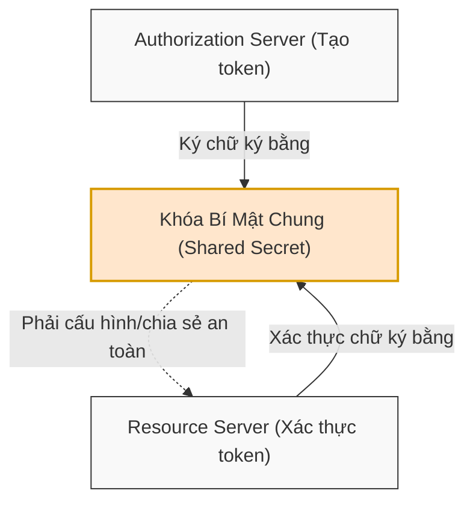
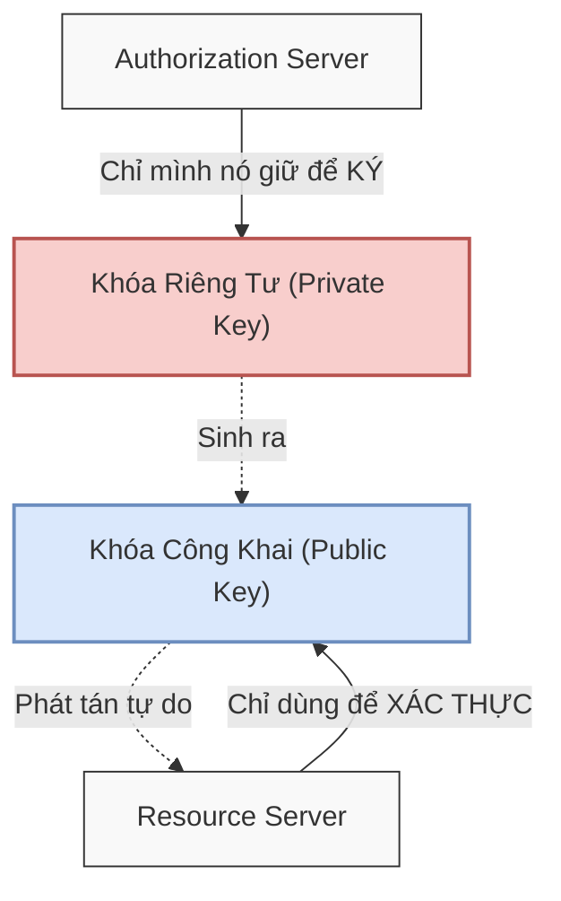

# Phân tích Chuyên sâu về JWT

Tài liệu này sẽ đi sâu phân tích cấu trúc kỹ thuật chi tiết của từng thành phần trong **JSON Web Token (JWT)** bao gồm Header, Payload, và Signature (Chữ ký), đồng thời phân tích sâu cơ chế hoạt động, ưu nhược điểm của hai thuật toán ký phổ biến nhất hiện nay: `HS256` (Khóa đối xứng) và `RS256` (Khóa bất đối xứng).

## Mục lục

1. [Header (Phần đầu)](#1-header-phần-đầu)
2. [Payload (Phần dữ liệu)](#2-payload-phần-dữ-liệu)
3. [Signature (Chữ ký)](#3-signature-chữ-ký)
4. [Thuật toán HS256 (Khóa Đối xứng)](#4-thuật-toán-hs256-khóa-đối-xứng)
5. [Thuật toán RS256 (Khóa Bất đối xứng)](#5-thuật-toán-rs256-khóa-bất-đối-xứng)
6. [So sánh HS256 và RS256](#6-so-sánh-hs256-và-rs256)
7. [Tổng kết](#7-tổng-kết)

---

## 1. Header (Phần đầu)

**Header** là phần đầu tiên của JWT, chứa siêu dữ liệu (metadata) định nghĩa cấu hình và thuật toán của token.

Sau khi giải mã chuỗi mã hóa Base64URL, Header mẫu có dạng JSON văn bản gốc như sau:

```json
{
  "alg": "HS256",
  "typ": "JWT"
}
```

*   `**typ**` (Type): Khai báo kiểu token. Theo tiêu chuẩn, giá trị này luôn là `"JWT"`.
*   `**alg**` (Algorithm): Chỉ định thuật toán mật mã dùng để tạo chữ ký số bảo mật cho token. Các thuật toán phổ biến gồm `HS256`, `RS256`, `ES256`, hoặc thậm chí là `none`.

> [!IMPORTANT]
> Thông tin thuật toán ký `alg` trong Header cực kỳ quan trọng. Khi kiểm tra JWT, **Resource Server (Máy chủ tài nguyên)** sẽ đọc trường này để biết chính xác phải áp dụng thuật toán mật mã nào để đối chiếu và xác thực chữ ký của token đó. Tuy nhiên, việc tin cậy mù quáng vào trường `alg` từ phía client chính là nguồn gốc của các lỗ hổng bảo mật nghiêm trọng.

---

## 2. Payload (Phần dữ liệu)

**Payload** là phần thứ hai của JWT, chứa các thông tin thực tế cần truyền tải qua mạng dưới dạng các **claims (tuyên bố)**.

Dưới đây là một ví dụ JSON của Payload sau khi giải mã Base64URL:

```json
{
  "sub": "1234567890",
  "name": "John Doe",
  "isAdmin": true,
  "iss": "https://auth.company.com",
  "exp": 1789645200,
  "iat": 1789641600
}
```

Các Claims trong Payload được chia làm hai loại chính:

### 2.1. Tuyên bố Tùy chỉnh (Custom Claims)
Là các trường thông tin tự định nghĩa bởi nhà phát triển nhằm phục vụ logic nghiệp vụ riêng của ứng dụng (ví dụ: `name`, `isAdmin`, `userID`, `roles`).

### 2.2. Tuyên bố Đăng ký (Registered Claims)
Là các trường chuẩn hóa được định nghĩa sẵn trong đặc tả [RFC 7519](https://tools.ietf.org/html/rfc7519). Chúng không bắt buộc nhưng được khuyến nghị sử dụng nghiêm ngặt để tăng tính an toàn và tương thích hệ thống:

*   `**sub**` (Subject): Định danh duy nhất cho chủ thể của token (ví dụ: ID của người dùng).
*   `**iss**` (Issuer): Định danh của máy chủ đã phát hành token (ví dụ: domain của Authorization Server).
*   `**exp**` (Expiration Time): Thời điểm token hết hạn (tính bằng giây từ Epoch). Máy chủ sẽ từ chối mọi token có thời gian hiện tại vượt quá mốc này.
*   `**iat**` (Issued At): Thời điểm token được phát hành (tính bằng giây từ Epoch).
*   `**nbf**` (Not Before): Thời điểm token bắt đầu có hiệu lực. Server sẽ từ chối token nếu thời điểm hiện tại trước mốc `nbf`.
*   `**aud**` (Audience): Đối tượng nhận token. Xác định rõ Resource Server nào được phép chấp nhận token này.
*   `**jti**` (JWT ID): Mã định danh duy nhất cho chính token này. Thường được sử dụng để chống lại các cuộc tấn công phát lại (**Replay Attacks**) bằng cách lưu danh sách các token đã sử dụng một lần.

---

## 3. Signature (Chữ ký)

**Chữ ký (Signature)** là chốt chặn an ninh quan trọng nhất của JWT, đảm bảo dữ liệu truyền tải không bị thay đổi và xác nhận nguồn gốc tin cậy của token.

> [!NOTE]
> Công thức toán học chuẩn xác để tạo ra chữ ký của một JWT:
> ```text
> Signature = Thuật_Toán_Ký(Base64URL(Header) + "." + Base64URL(Payload), Khóa_Bí_Mật)
> ```

Khi nhận được token, Resource Server sẽ trích xuất Header và Payload, tự tính toán lại chữ ký số bằng khóa của nó theo công thức trên rồi so sánh với phần Signature đi kèm trong token. Nếu trùng khớp, dữ liệu được xác nhận an toàn tuyệt đối.

---

## 4. Thuật toán HS256 (Khóa Đối xứng)

**HS256** (HMAC-SHA256) là một thuật toán mật mã **đối xứng (Symmetric-key)**. Thuật toán này sử dụng **một khóa bí mật duy nhất** (Shared Secret) cho cả hai nhiệm vụ: Máy chủ xác thực dùng để ký (tạo chữ ký) và Máy chủ tài nguyên dùng để xác thực chữ ký đó.

### 4.1. Sơ đồ cơ chế phân phối và xác thực khóa HS256



### 4.2. Luồng hoạt động kỹ thuật
1.  **Đăng nhập thành công:** Authorization Server dùng **Shared Secret** được định cấu hình trên máy chủ để thực hiện băm HMAC-SHA256 trên chuỗi Header và Payload, sinh ra Signature và trả về JWT cho Client.
2.  **Yêu cầu API:** Client đính kèm JWT này gửi lên các Resource Servers khác nhau.
3.  **Xác thực:** Mỗi Resource Server phải được định cấu hình **cùng một Shared Secret** đó để giải và kiểm tra chữ ký số của JWT.

### 4.3. Các điểm yếu chí mạng về bảo mật (Nhược điểm)
*   **Nguy cơ rò rỉ khóa khi chia sẻ:** Khóa mật mã bí mật chung phải được định cấu hình trên tất cả các API Server (Resource Servers). Số lượng API Server càng nhiều, rủi ro lộ khóa khi cấu hình hoặc vận chuyển càng lớn.
*   **Mất kiểm soát toàn cục:** Nếu chỉ **một** Resource Server nhỏ bị hacker tấn công xâm nhập và lấy được Shared Secret, kẻ tấn công lập tức có khả năng tự ký (tạo giả mạo) bất kỳ token nào với quyền admin cho toàn bộ các hệ thống còn lại.

---

## 5. Thuật toán RS256 (Khóa Bất đối xứng)

**RS256** (RSA-SHA256) sử dụng thuật toán mật mã **bất đối xứng (Asymmetric-key)**. Nó sử dụng một cặp khóa toán học liên kết với nhau: **Khóa riêng tư (Private Key)** để ký tạo chữ ký và **Khóa công khai (Public Key)** dùng để xác minh chữ ký đó.

### 5.1. Sơ đồ cơ chế phân tách vai trò khóa RS256



### 5.2. Luồng hoạt động kỹ thuật
1.  **Tạo chữ ký:** Authorization Server nắm giữ **Private Key** (tuyệt mật). Khi Client đăng nhập thành công, máy chủ dùng Private Key để ký tạo JWT.
2.  **Xác thực:** Các Resource Server không cần biết Private Key. Chúng chỉ cần cấu hình hoặc tải về **Public Key** của Authorization Server từ xa (qua JWKS) để xác thực chữ ký của JWT nhận được.

> [!TIP]
> **Giải pháp khi Resource Server bị hacker xâm nhập:**
> Nhờ cơ chế bất đối xứng, nếu hacker chiếm quyền kiểm soát một Resource Server, hắn chỉ có thể lấy được **Public Key** (vốn đã được công khai). Hacker hoàn toàn **không thể** tự tạo hay giả mạo chữ ký của JWT mới vì hắn không có Private Key (vẫn đang nằm an toàn tuyệt mật sau lớp lửa phòng thủ của Authorization Server).

### 5.3. Lợi ích vượt trội của RS256
*   **An toàn tuyệt đối cho khóa ký:** Private Key không bao giờ phải chia sẻ qua mạng hay cấu hình ở các server khác. Nó được bảo vệ tập trung tại một nơi duy nhất.
*   **Kiến trúc phân tán tối ưu:** Rất phù hợp cho mô hình Microservices, nơi hàng chục API Server chỉ cần biết Public Key để xác thực token mà không lo ngại rủi ro rò rỉ khóa ký.

---

## 6. So sánh HS256 và RS256

Dưới đây là bảng phân tích so sánh chi tiết hai thuật toán để hỗ trợ việc lựa chọn giải pháp phù hợp cho kiến trúc hệ thống:

| Đặc điểm | **HS256 (Đối xứng)** | **RS256 (Bất đối xứng)** |
| :--- | :--- | :--- |
| **Loại khóa** | **Khóa bí mật chung** (Shared Secret) duy nhất. | **Cặp khóa Public/Private** liên kết toán học. |
| **Bảo mật Khóa ký** | Thấp. Khóa bí mật phải chia sẻ cấu hình cho nhiều server. | Rất cao. **Private Key** ký chỉ nằm tại Auth Server. |
| **Quyền tạo Token** | Bất kỳ server nào nắm giữ Shared Secret đều ký được. | Chỉ duy nhất Auth Server (giữ Private Key) mới ký được. |
| **Độ an toàn hệ thống** | Thấp. Một server lộ khóa dẫn đến sụp đổ toàn bộ hệ thống. | Cao. Lộ Public Key ở API server không ảnh hưởng khả năng tạo token giả. |
| **Độ phức tạp & Hiệu năng** | Đơn giản, tính toán băm nhanh, tốn ít tài nguyên CPU. | Phức tạp hơn, tính toán RSA chậm hơn HS256 một chút. |
| **Ứng dụng tối ưu** | Các ứng dụng nhỏ, nguyên khối (Monolith) hoặc API nội bộ. | Hệ thống phân tán lớn, Microservices, Single Sign-On (SSO). |

---

## 7. Tổng kết

*   **Header** định nghĩa thuật toán (`alg`) để hướng dẫn Resource Server cách giải mã chữ ký.
*   **Payload** mang dữ liệu thực tế thông qua các Claims (đặc biệt khuyến nghị áp dụng các Registered Claims tiêu chuẩn như `sub`, `exp`, `jti` để tăng độ an toàn).
*   `**HS256**` là lựa chọn nhanh, đơn giản nhưng tiềm ẩn rủi ro rò rỉ khóa rất cao trong hệ thống lớn do dùng chung một khóa bí mật.
*   `**RS256**` là tiêu chuẩn vàng cho các hệ thống hiện đại, sử dụng cặp khóa bất đối xứng giúp phân tách vai trò rõ ràng giữa máy chủ tạo token (Auth) và máy chủ xác thực (API Server).

---
[← Quay lại mục lục](README.md)
