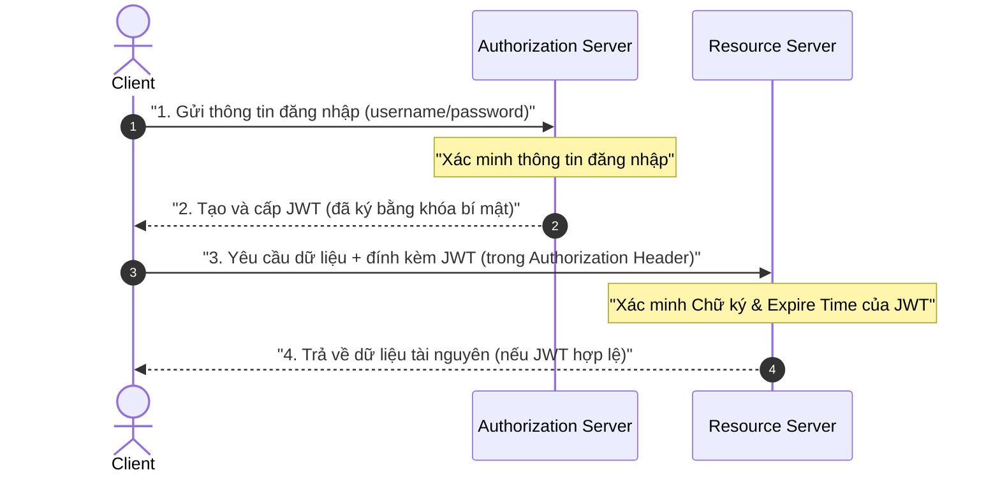

# Tìm hiểu về JSON Web Token (JWT)

**JSON Web Token** (thường được viết tắt là **JWT**) là một tiêu chuẩn mở được định nghĩa trong [RFC 7519](https://tools.ietf.org/html/rfc7519). Nó định nghĩa một cách thức nhỏ gọn (compact) và khép kín (self-contained) để truyền tải thông tin một cách an toàn giữa các bên dưới dạng một đối tượng JSON.

Nói một cách đơn giản, **JWT** là một định dạng chuẩn hóa được sử dụng để truyền thông tin an toàn giữa hai bên.

> [!IMPORTANT]
> Khi nói "truyền thông tin an toàn", điều đó không có nghĩa là JWT chứa thông tin bí mật. Ý nghĩa của nó là bạn có thể sử dụng JWT để xác định xem người yêu cầu một thông tin cụ thể có được **ủy quyền (authorized)** để truy cập thông tin đó hay không.

Vì vậy, JWT có hai đặc tính chính:
*   Trao đổi thông tin.
*   Đảm bảo thông tin được trao đổi giữa các bên đã được ủy quyền.

## Mục lục

1.  [Cấu trúc của JWT](#1-cấu-trúc-của-jwt)
2.  [Base64URL Encoding là gì?](#2-base64url-encoding-là-gì)
3.  [Giải mã Header và Payload](#3-giải-mã-header-và-payload)
4.  [JWT hoạt động như thế nào?](#4-jwt-hoạt-động-như-thế-nào)
5.  [Tổng kết](#5-tổng-kết)

---

## 1. Cấu trúc của JWT

Một JWT về cơ bản chứa ba phần, được ngăn cách bởi hai dấu chấm (`.`).

> [!NOTE]
> Công thức cấu tạo cơ bản của một chuỗi JWT:
> ```text
> Header.Payload.Signature
> ```

Đây là một ví dụ về một JWT thực tế:
*   **Phần 1: Header (Phần đầu):** `eyJhbGciOiJIUzI1NiIsInR5cCI6IkpXVCJ9`
*   **Phần 2: Payload (Phần dữ liệu):** `eyJzdWIiOiIxMjM0NTY3ODkwIiwibmFtZSI6IkpvaG4gRG9lIiwiaWF0IjoxNTE2MjM5MDIyfQ`
*   **Phần 3: Signature (Chữ ký):** `SflKxwRJSMeKKF2QT4fwpMeJf36POk6yJV_adQssw5c`

> [!IMPORTANT]
> Hai phần đầu tiên (Header và Payload) **không được mã hóa bảo mật (encrypted)**, chúng chỉ đơn giản là được **mã hóa (encoded)** bằng **Base64URL**. Điều này có nghĩa là bất kỳ ai cũng có thể giải mã và đọc được nội dung của chúng một cách dễ dàng.

> [!TIP]
> **Sự khác biệt cốt lõi giữa Encode và Encrypt:**
> *   **Encode (Mã hóa biểu diễn):** Chỉ chuyển đổi định dạng dữ liệu để truyền tải thuận tiện hơn qua mạng (ví dụ: Base64URL giúp loại bỏ các ký tự đặc biệt). Quá trình này hoàn toàn không có tính bảo mật.
> *   **Encrypt (Mã hóa bảo mật):** Sử dụng các thuật toán mật mã phức tạp cùng khóa bí mật để biến đổi dữ liệu thành dạng không thể đọc được. Chỉ những ai có khóa giải mã mới xem được nội dung gốc.
> 
> **Kết luận:** Vì JWT chỉ **encode** Header và Payload, tuyệt đối không được lưu trữ thông tin nhạy cảm (như mật khẩu, khóa bí mật) vào Payload.

Phần thứ ba, **Signature (Chữ ký)**, được tạo ra bằng các thuật toán mật mã (ví dụ: `HS256`, `RS256`) để đảm bảo tính toàn vẹn của token (rằng Header và Payload không bị thay đổi trên đường truyền).

---

## 2. Base64URL Encoding là gì?

Bạn có thể đã quen thuộc với **Base64**, một phương thức phổ biến để chuyển đổi dữ liệu nhị phân sang định dạng văn bản để truyền đi. Tuy nhiên, Base64 truyền thống chứa các ký tự đặc biệt như `+`, `/` hoặc ký tự đệm `=`, vốn có thể gây ra sự cố phân tích cú pháp khi truyền qua URL hoặc đặt trong HTTP headers.

**Base64URL Encoding** là một biến thể của Base64 được thiết kế đặc biệt để giải quyết triệt để vấn đề này, và đây chính là định dạng chuẩn bắt buộc được JWT sử dụng.

### 2.1. So sánh chi tiết giữa Base64 và Base64URL

| Tính năng | **Base64 (Truyền thống)** | **Base64URL (Sử dụng trong JWT)** |
| :--- | :--- | :--- |
| **Ký tự `+`** | Sử dụng bình thường | Thay thế bằng ký tự `-` (dấu gạch nối) |
| **Ký tự `/`** | Sử dụng bình thường | Thay thế bằng ký tự `_` (dấu gạch dưới) |
| **Ký tự đệm (`=`)** | Thường xuất hiện ở cuối để căn lề | Bị loại bỏ hoàn toàn (không bắt buộc) |

> [!NOTE]
> Đây là lý do tại sao một chuỗi JWT chuẩn sẽ không bao giờ chứa các ký tự `+`, `/` hay `=`. Điều này giúp token an toàn tuyệt đối khi truyền trực tiếp trên URL hay cookie mà không cần qua bước URL-encode bổ sung.

---

## 3. Giải mã Header và Payload

Vì Header và Payload chỉ được mã hóa Base64URL, chúng ta có thể dễ dàng giải mã chúng bằng các công cụ trực tuyến hoặc câu lệnh lập trình đơn giản để thu về chuỗi văn bản thuần (clear text).

### 3.1. Header

Header thường chứa siêu dữ liệu mô tả thuật toán ký (`alg`) và loại token (`typ`).

Ví dụ dòng mô tả Header giải mã từ mã Base64URL:
*   **Encoded:** `eyJhbGciOiJIUzI1NiIsInR5cCI6IkpXVCJ9`
*   **Decoded (JSON văn bản gốc):**

```json
{
  "alg": "HS256",
  "typ": "JWT"
}
```

### 3.2. Payload

Payload chứa các **claims (tuyên bố)**. Đây là các thông tin về thực thể người dùng cùng các dữ liệu bổ sung cần thiết.

Ví dụ mô tả Payload giải mã từ mã Base64URL:
*   **Encoded:** `eyJzdWIiOiIxMjM0NTY3ODkwIiwibmFtZSI6IkpvaG4gRG9lIiwiaWF0IjoxNTE2MjM5MDIyfQ`
*   **Decoded (JSON văn bản gốc):**

```json
{
  "sub": "1234567890",
  "name": "John Doe",
  "iat": 1516239022
}
```

> [!IMPORTANT]
> **Nếu ai cũng đọc được Payload, vậy tính bảo mật nằm ở đâu?**
> Bảo mật của JWT không nằm ở việc che giấu thông tin (confidentiality), mà nằm ở việc **Xác thực (Authentication)** và **Đảm bảo tính toàn vẹn (Integrity)**. Chữ ký (Signature) ở phần 3 chính là chiếc niêm phong mật mã. Nếu bất kỳ ai cố tình sửa đổi dù chỉ 1 ký tự trong Header hoặc Payload, chữ ký sẽ lập tức bị sai lệch và máy chủ sẽ từ chối token đó ngay.

---

## 4. JWT hoạt động như thế nào?

Dưới đây là mô tả luồng xác thực và ủy quyền tiêu biểu sử dụng JWT để bảo vệ API trong kiến trúc hiện đại.

### 4.1. Sơ đồ trình tự hoạt động của JWT (Sequence Diagram)

Dưới đây là sơ đồ mô tả luồng giao tiếp 6 bước giữa Client, Máy chủ xác thực (Authorization Server) và Máy chủ API (Resource Server):



### 4.2. Bảng phân tích chi tiết các bước hoạt động

| Thành phần/Bước | Vai trò/Mô tả | Chi tiết |
| :--- | :--- | :--- |
| **Bước 1: Client Xác thực** | Client gửi thông tin đăng nhập | Client (Web/Mobile) gửi `username` và `password` lên Authorization Server qua kênh truyền bảo mật HTTPS. |
| **Bước 2: Xác minh đăng nhập** | Máy chủ kiểm tra danh tính | Authorization Server xác minh thông tin đăng nhập đối chiếu với Cơ sở dữ liệu. |
| **Bước 3: Cấp JWT** | Tạo sinh mã JWT trả về | Nếu thông tin chính xác, Authorization Server dùng **khóa bí mật (signing key)** để ký tạo JWT và trả về cho Client. |
| **Bước 4: Gửi yêu cầu với JWT** | Client yêu cầu tài nguyên API | Client lưu token và đính kèm vào mỗi yêu cầu HTTP gửi đến Resource Server thông qua HTTP Header `Authorization: Bearer <JWT>`. |
| **Bước 5: Xác minh JWT** | Kiểm tra chữ ký và hạn dùng | Resource Server nhận yêu cầu, trích xuất JWT và tiến hành xác minh chữ ký số bằng khóa tương ứng để đảm bảo token chưa bị sửa đổi và chưa hết hạn (`exp`). |
| **Bước 6: Trả về dữ liệu** | Phản hồi tài nguyên hợp lệ | Nếu JWT hợp lệ, Resource Server tin tưởng thông tin người dùng trong Payload và trả về dữ liệu API yêu cầu. |

> [!TIP]
> **Kẻ tấn công (Attacker) muốn giả mạo JWT thì phải làm sao?**
> Do kẻ tấn công không thể có được **khóa bí mật (signing key)** dùng để ký ở Bước 3, hắn không thể tự tạo ra một chữ ký hợp lệ cho Payload giả mạo. Mọi nỗ lực chỉnh sửa Payload của kẻ tấn công đều dẫn đến việc kiểm tra chữ ký ở Bước 5 thất bại thảm hại. Để tấn công, kẻ gian chỉ có thể đánh cắp token đang hoạt động của người dùng (Token Theft) hoặc xâm nhập trực tiếp để lấy cắp khóa bí mật trên server.

---

## 5. Tổng kết

*   **JWT** là một tiêu chuẩn mở (RFC 7519) dùng để truyền tải thông tin an toàn dưới dạng đối tượng JSON.
*   Mục tiêu chính là **Xác thực** và **Bảo vệ tính toàn vẹn** dữ liệu, không dùng để che giấu thông tin nhạy cảm.
*   Cấu trúc gồm 3 phần phân tách bởi dấu chấm: `Header.Payload.Signature`.
*   Header và Payload được mã hóa **Base64URL** (loại bỏ ký tự đặc biệt giúp truyền an toàn trên web).
*   **Signature (Chữ ký số)** là chốt chặn bảo mật quan trọng nhất, được ký bằng thuật toán mật mã và khóa bí mật của server nhằm chống giả mạo dữ liệu.

---
[← Quay lại mục lục](README.md)
