# Phân biệt Kênh Truyền dữ liệu: Front Channel và Back Channel

Tài liệu này phân tích chi tiết hai phương thức truyền tải dữ liệu cốt lõi trong giao thức OAuth 2.0: **Front Channel (Kênh trước)** và **Back Channel (Kênh sau)**, đồng thời vạch rõ lý do tại sao sự phân tách này là chìa khóa để bảo vệ tuyệt mật Access Token khỏi các lỗ hổng trình duyệt.

## Mục lục

1. [Tổng quan về hai kênh truyền dữ liệu](#1-tổng-quan-về-hai-kênh-truyền-dữ-liệu)
2. [Sơ đồ so sánh cơ chế hoạt động](#2-sơ-đồ-so-sánh-cơ-chế-hoạt-động)
3. [Kênh sau (Back Channel) - Con đường An toàn tuyệt đối](#3-kênh-sau-back-channel---con-đường-an-toàn-tuyệt-đối)
4. [Kênh trước (Front Channel) - Con đường Gián tiếp và Thách thức bảo mật](#4-kênh-trước-front-channel---con-đường-gián-tiếp-và-thách-thức-bảo-mật)
5. [Tác động thực tế trong thiết kế OAuth 2.0](#5-tác-động-thực-tế-trong-thiết-kế-oauth-20)
6. [Lưu ý quan trọng về ứng dụng JavaScript (Client-side)](#6-lưu-ý-quan-trọng-về-ứng-dụng-javascript-client-side)
7. [Tổng kết](#7-tổng-kết)

---

## 1. Tổng quan về hai kênh truyền dữ liệu

Trong bất kỳ kiến trúc phân tán nào, việc truyền dữ liệu giữa các hệ thống riêng biệt luôn đòi hỏi các con đường giao tiếp khác nhau. Trong đặc tả OAuth 2.0, dữ liệu (bao gồm Authorization Code, Access Token, Client Credentials) được phân luồng di chuyển qua hai kênh truyền đặc thù:
*   **Back Channel (Kênh sau):** Giao tiếp trực tiếp máy-chủ-tới-máy-chủ (Server-to-Server).
*   **Front Channel (Kênh trước):** Giao tiếp gián tiếp thông qua trình duyệt của người dùng (User Agent) làm trung gian chuyển tiếp.

---

## 2. Sơ đồ so sánh cơ chế hoạt động

Dưới đây là sơ đồ so sánh trực quan cách thức dữ liệu di chuyển qua hai kênh trong kiến trúc OAuth:

```mermaid
graph TD
    classDef default fill:#f9f9f9,stroke:#333,stroke-width:1px;
    classDef secure fill:#dae8fc,stroke:#6c8ebf,stroke-width:2px;
    classDef unsecure fill:#f8cecc,stroke:#b85450,stroke-width:2px;

    subgraph FrontChannel ["KÊNH TRƯỚC (FRONT CHANNEL)"]
        ClientApp1["OAuth Client (Ứng dụng)"] -->|1. Redirect via URL Query| Browser["User Agent (Trình duyệt)"]
        Browser -->|2. Gửi request kèm dữ liệu| AuthServer1["Authorization Server"]
        
        style ClientApp1 fill:#f8cecc,stroke:#b85450,stroke-width:1px
        style Browser fill:#ffe6cc,stroke:#d79b00,stroke-width:2px
        style AuthServer1 fill:#f8cecc,stroke:#b85450,stroke-width:1px
    end

    subgraph BackChannel ["KÊNH SAU (BACK CHANNEL)"]
        ClientApp2["OAuth Client (Web Server/JS)"] ====>|HTTPS POST Trực tiếp - Tuyệt mật| AuthServer2["Authorization Server"]
        
        style ClientApp2 fill:#dae8fc,stroke:#6c8ebf,stroke-width:2px
        style AuthServer2 fill:#dae8fc,stroke:#6c8ebf,stroke-width:2px
    end
```

### Bảng giải thích chi tiết cơ chế kênh truyền

| Thành phần/Bước | Vai trò/Mô tả | Chi tiết |
| :--- | :--- | :--- |
| **Front Channel** | Truyền gián tiếp qua thanh địa chỉ | Dữ liệu được nối vào Query Parameters của URL chuyển hướng (`HTTP 302 Redirect`). Dữ liệu này hiển thị công khai trên thanh địa chỉ và lịch sử trình duyệt. |
| **Back Channel** | Truyền trực tiếp qua kênh HTTPS mã hóa | Dữ liệu được gửi qua một request HTTPS POST trực tiếp từ máy khách tới API endpoint của máy chủ. Kết nối được bảo vệ bằng SSL/TLS. |
| **Mức độ Tin cậy** | Phân tách bảo mật | Phía nhận dữ liệu ở kênh sau luôn xác thực được chứng chỉ số của phía gửi. Kênh trước hoàn toàn không có cơ chế này, nhãn địa chỉ có thể bị giả mạo dễ dàng. |

---

## 3. Kênh sau (Back Channel) - Con đường An toàn tuyệt đối

**Kênh sau (Back Channel)** hoạt động giống như việc bạn tự tay trao tận mắt một gói hàng bảo mật cho đối tác. Bạn nhìn thấy họ, họ nhìn thấy bạn, và không một ai ở giữa có thể nghe lén hay tráo đổi gói hàng.

### Ưu điểm vượt trội về bảo mật:
*   **Xác thực nguồn gốc (Authentication):** Sử dụng giao thức HTTPS giúp Client luôn kiểm tra và xác thực được tính chính danh của Authorization Server thông qua chứng chỉ số TLS/SSL.
*   **Mã hóa đầu cuối (Encryption):** Dữ liệu truyền tải được mã hóa hoàn toàn trong suốt quá trình di chuyển qua mạng. Không một nút mạng trung gian nào có thể đọc trộm hay sửa đổi dữ liệu.
*   **Tính toàn vẹn dữ liệu (Integrity):** Đảm bảo phản hồi của máy chủ gửi về cho Client là chính xác, trọn vẹn và không bị giả mạo.

---

## 4. Kênh trước (Front Channel) - Con đường Gián tiếp và Thách thức bảo mật

**Kênh trước (Front Channel)** hoạt động giống như việc bạn gửi một bức thư qua đường bưu điện (với bưu điện ở đây là trình duyệt của người dùng). Bạn đưa thư cho bưu tá, và hy vọng họ sẽ chuyển đến đúng địa chỉ.

### Các rủi ro chí mạng của Kênh trước:
*   **Nguy cơ lộ lọt dữ liệu:** Dữ liệu nằm trực tiếp trên URL chuyển hướng, do đó nó sẽ bị ghi lại trong **lịch sử trình duyệt (Browser History)**, lưu trong log của các máy chủ Proxy/CDN trung gian, hoặc bị đọc bởi các **Browser Extensions** độc hại cài đặt trên máy người dùng.
*   **Nguy cơ bị can thiệp và sửa đổi (Interception):** Các cuộc tấn công XSS (Cross-Site Scripting) có thể cho phép hacker cài cắm mã độc JavaScript để đọc toàn bộ dữ liệu chạy trên thanh địa chỉ trước khi trình duyệt thực hiện chuyển hướng.
*   **Không thể xác thực nguồn gốc:** Máy chủ nhận yêu cầu từ một redirect URL hoàn toàn không thể chắc chắn request đó có thực sự được phát ra từ ứng dụng khách hợp pháp hay không, vì bất kỳ ai cũng có thể giả mạo URL redirect.

---

## 5. Tác động thực tế trong thiết kế OAuth 2.0

Sự hiểu biết sâu sắc về Front và Back Channel quyết định trực tiếp đến sự tiến hóa của các thiết kế luồng trong đặc tả OAuth 2.0:

### 5.1. Implicit Flow (Đã bị khai tử)
Trong thời kỳ sơ khai của Web, trình duyệt chưa hỗ trợ cơ chế CORS (Cross-Origin Resource Sharing), ngăn cản ứng dụng JavaScript (Client-side) gửi các POST request (kênh sau) đến tên miền khác. Do đó, đặc tả OAuth 2.0 cũ đã thiết kế **Implicit Flow** - cho phép trả thẳng `Access Token` từ Auth Server về Client qua Kênh trước (URL Redirect).
> [!WARNING]
> Việc trả thẳng Access Token qua Kênh trước (Implicit Flow) cực kỳ mất an toàn và đã bị **khai tử (deprecated)** hoàn toàn trong các khuyến nghị bảo mật mới nhất (OAuth 2.1).

### 5.2. Authorization Code Flow (Tiêu chuẩn Hiện đại)
Giải pháp tối ưu là sử dụng kết hợp cả hai kênh:
1.  **Front Channel:** Dùng để chuyển hướng người dùng sang Auth Server xác thực và đồng ý cấp quyền. Auth Server chỉ trả về một mã tạm thời gọi là `Authorization Code` (thời hạn dưới 1 phút, chỉ dùng 1 lần) qua kênh trước.
2.  **Back Channel:** Ứng dụng khách nhận được Code, lập tức thực hiện một request HTTPS POST trực tiếp từ backend (hoặc qua AJAX/Fetch bảo mật) để đổi lấy `Access Token`. Toàn bộ Access Token nhạy cảm được bảo vệ nghiêm ngặt bên trong Kênh sau.

---

## 6. Lưu ý quan trọng về ứng dụng JavaScript (Client-side)

> [!IMPORTANT]
> **Kênh sau (Back Channel) không có nghĩa là bắt buộc phải có máy chủ Backend!**
> Nhiều nhà phát triển lầm tưởng rằng ứng dụng chạy hoàn toàn trên trình duyệt bằng JavaScript (như ReactJS, Angular SPA) thì không thể sử dụng Kênh sau. Đây là một quan niệm sai lầm.
> *   Khi mã JavaScript của SPA thực hiện một lệnh gọi `fetch()` hoặc `axios.post()` trực tiếp đến API của Authorization Server, đó hoàn toàn là một kết nối **Kênh sau**.
> *   Kết nối này vẫn đảm bảo mã hóa HTTPS mã nguồn bảo mật và xác thực chứng chỉ đích, hoàn toàn khác với việc truyền dữ liệu qua thanh địa chỉ trình duyệt (Kênh trước).

---

## 7. Tổng kết

*   **Nguyên tắc vàng:** Bất cứ khi nào có thể, hãy luôn ưu tiên truyền tải các thông tin nhạy cảm (Access Token, Client Secret, Refresh Token) qua **Back Channel**.
*   **Hạn chế Kênh trước:** Chỉ sử dụng **Front Channel** cho các bước trung gian bắt buộc có sự tham gia xác thực của người dùng (như gửi yêu cầu đăng nhập ban đầu và nhận Authorization Code tạm thời).
*   **Vá bảo mật:** Loại bỏ hoàn toàn *Implicit Flow* khỏi hệ thống và chuyển đổi sang *Authorization Code Flow kết hợp PKCE* để tận dụng tối đa sức mạnh bảo mật của Kênh sau trên môi trường trình duyệt hiện đại.

---
[← Quay lại mục lục](../README.md)
