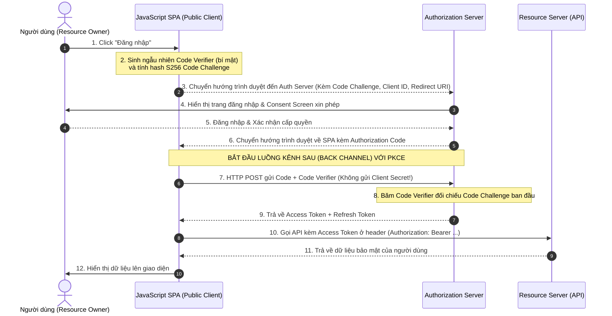
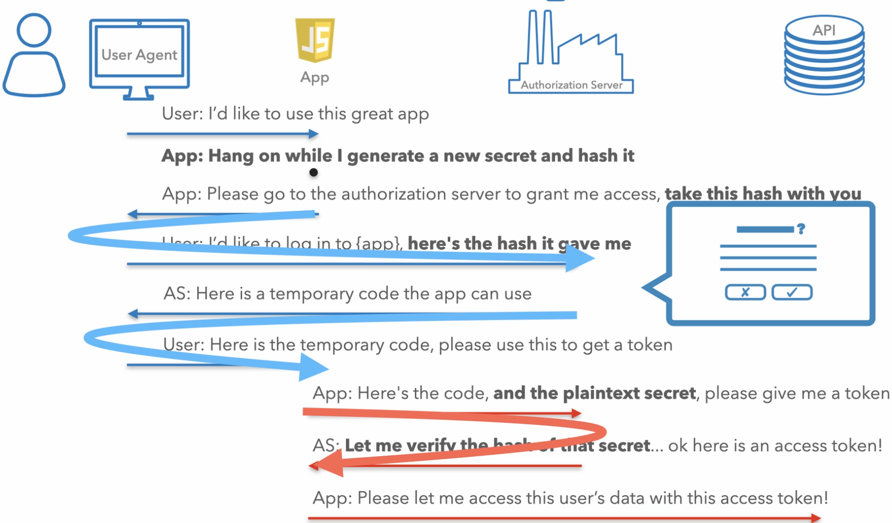

# Luồng Mã Ủy quyền cho Single Page Application (SPA)

Tài liệu này phân tích chi tiết quy trình thực thi **Authorization Code Flow kết hợp PKCE** dành cho ứng dụng Single Page Application (SPA) chạy hoàn toàn trên trình duyệt (Public Client), giải pháp tối ưu loại bỏ Client Secret mà vẫn đảm bảo an toàn tuyệt đối trước các nguy cơ đánh chặn.

## Mục lục

1. [Tại sao cần PKCE cho ứng dụng SPA?](#1-tại-sao-cần-pkce-cho-ứng-dụng-spa)
2. [Sơ đồ Luồng hoạt động trình tự PKCE cho SPA](#2-sơ-đồ-luồng-hoạt-động-trình-tự-pkce-cho-spa)
3. [Phân tích chi tiết Từng bước của Luồng PKCE](#3-phân-tích-chi-tiết-từng-bước-của-luồng-pkce)
4. [So sánh: Luồng Web Server (Confidential) vs Luồng SPA (Public)](#4-so-sánh-luồng-web-server-confidential-vs-luồng-spa-public)
5. [Chi tiết các Tham số Kỹ thuật trong Requests](#5-chi-tiết-các-tham-số-kỹ-thuật-trong-requests)
6. [Tổng kết](#6-tổng-kết)

---

## 1. Tại sao cần PKCE cho ứng dụng SPA?

Như đã tìm hiểu ở bài học trước, ứng dụng JavaScript SPA chạy trên trình duyệt là **Public Client** - hoàn toàn không có khả năng bảo mật `Client Secret`. 

Nếu sử dụng luồng Authorization Code Flow truyền thống mà không có Client Secret:
*   Mã ủy quyền (**Authorization Code**) trả về trình duyệt qua URL redirect có thể bị rò rỉ (qua lịch sử duyệt web, tiện ích mở rộng extension, hoặc lỗ hổng XSS).
*   Do không yêu cầu Client Secret ở bước đổi code, kẻ tấn công chiếm được Authorization Code có thể dễ dàng gửi POST request lên Auth Server để lấy Access Token của người dùng.

Để vá lỗ hổng chí mạng này, **PKCE (Proof Key for Code Exchange - RFC 7636)** được tích hợp làm lớp lá chắn động bảo vệ quá trình trao đổi code mà không cần đến sự hiện diện của Client Secret.

---

## 2. Sơ đồ Luồng hoạt động trình tự PKCE cho SPA

Dưới đây là sơ đồ trình tự thể hiện chi tiết cách thức mã hóa băm PKCE bảo vệ an toàn luồng trao đổi token chạy hoàn toàn bằng JavaScript trên trình duyệt của người dùng:



### Bảng giải thích chi tiết luồng PKCE

| Thành phần/Bước | Vai trò/Mô tả | Chi tiết |
| :--- | :--- | :--- |
| **Bước 2** | Khởi tạo cặp Khóa PKCE | Trình duyệt SPA tự sinh ngẫu nhiên một chuỗi bí mật bảo mật cao dùng một lần (`Code Verifier`), mã hóa băm SHA256 thành `Code Challenge` để gửi đi. |
| **Bước 6** | Trả Authorization Code | Mã Code được gửi trả về SPA qua Kênh trước (Front Channel Redirect), xuất hiện trên URL của trình duyệt. |
| **Bước 7 & 8** | Xác thực Kênh sau không Secret | SPA gửi POST request trực tiếp (Back Channel) đổi Code, gửi kèm theo chuỗi gốc `Code Verifier`. Auth Server tự thực hiện băm và đối sánh trước khi cấp token. |

---

## 3. Phân tích chi tiết Từng bước của Luồng PKCE

### Bước 3.1: Khởi động luồng và Sinh khóa bí mật PKCE
Khi người dùng kích hoạt đăng nhập, ứng dụng JavaScript chạy trên trình duyệt tự sinh ra một mã bí mật dùng một lần duy nhất cho phiên đăng nhập này, gọi là **Code Verifier**. 

Mã này sau đó được băm một chiều bằng thuật toán SHA256 và mã hóa Base64URL để tạo thành **Code Challenge**.

### Bước 3.2: Chuyển hướng người dùng qua Front Channel
SPA chuyển hướng trình duyệt đến Authorization Endpoint kèm theo các tham số bao gồm `client_id`, `redirect_uri`, `scope`, `code_challenge` và `code_challenge_method=S256`.



### Bước 3.3: Xác thực và Trả Mã ủy quyền (Authorization Code)
Người dùng thực hiện đăng nhập và chấp thuận quyền trên giao diện của Auth Server. Auth Server chuyển hướng trình duyệt quay trở lại SPA kèm theo **Authorization Code** tạm thời trên URL.

### Bước 3.4: Đổi Mã lấy Token qua Back Channel
Mã JavaScript trong SPA bắt được Authorization Code từ URL, lập tức thực hiện một request HTTPS POST trực tiếp (Back Channel) đến cổng Auth Server để đổi lấy Access Token.

> [!IMPORTANT]
> **Điểm khác biệt chí mạng:**
> Request đổi token này **tuyệt đối không gửi Client Secret** (do SPA không có secret). Thay vào đó, SPA gửi kèm theo chuỗi văn bản gốc **Code Verifier**.
> *   Auth Server tự thực hiện băm SHA256 chuỗi `Code Verifier` nhận được và đối chiếu với `Code Challenge` mà Client đã khai báo ở Bước 3.2.
> *   Nếu khớp khớp, Auth Server phát hành Access Token.
> *   Nếu một kẻ tấn công đánh cắp được Authorization Code trên trình duyệt, hắn cố tình gửi request đổi token sẽ **bị từ chối lập tức** vì hắn không thể biết chuỗi bí mật `Code Verifier` gốc nằm trong RAM của SPA hợp pháp.

---

## 4. So sánh: Luồng Web Server (Confidential) vs Luồng SPA (Public)

Dưới đây là bảng so sánh trực quan sự khác biệt kỹ thuật cốt lõi giữa hai luồng:

| Tiêu chí | **Web Server Flow (Confidential)** | **SPA Flow (Public)** |
| :--- | :--- | :--- |
| **Client Secret** | **Bắt buộc** (Gửi qua Back Channel). | **Tuyệt đối không sử dụng**. |
| **PKCE** | **Khuyến nghị mạnh mẽ** (OAuth 2.1 bắt buộc). | **Bắt buộc 100%**. |
| **Xác thực Client** | Thực hiện được (Auth Server tin tưởng Client nhờ Secret). | Không thể thực hiện (Chỉ dựa vào tính duy nhất của Redirect URI). |
| **Nơi lưu trữ Token** | Lưu an toàn trên Server Session / Database. | Lưu trữ trên trình duyệt (RAM, Cookie HttpOnly, LocalStorage). |

---

## 5. Chi tiết các Tham số Kỹ thuật trong Requests

### 5.1. Request xin mã ủy quyền qua Front Channel (GET)
```text
https://auth.company.com/authorize?
    response_type=code
    &client_id=spa-react-client-456
    &redirect_uri=https://my-spa.com/callback
    &scope=openid profile email
    &state=secureState123
    &code_challenge=E9Melhoa2OwvFrGMTJguCH5yOFDpwUYzFxSAXwT4_o
    &code_challenge_method=S256
```

### 5.2. Request đổi Code lấy Token qua Back Channel (POST)
```http
POST /token HTTP/1.1
Host: auth.company.com
Content-Type: application/x-www-form-urlencoded

grant_type=authorization_code
&code=SplxlOBeZQQYbYS6WxSbIA
&redirect_uri=https://my-spa.com/callback
&client_id=spa-react-client-456
&code_verifier=dBjftJeZ4CVP-mB92K27uhbUJU1p1r_wW1gFWFOyXfc
```

---

## 6. Tổng kết

*   **Authorization Code Flow kết hợp PKCE** là chuẩn bảo mật cao nhất hiện nay dành cho SPA, thay thế hoàn toàn *Implicit Flow* cũ.
*   **Loại bỏ Secret:** PKCE giải quyết xuất sắc bài toán xác thực giao dịch đổi code mà hoàn toàn không cần lưu trữ hay gửi Client Secret nhạy cảm.
*   **Thách thức kế tiếp:** Sau khi lấy được Access Token an toàn về trình duyệt, việc lưu trữ token ở đâu trong trình duyệt để chống lại lỗ hổng XSS sẽ được phân tích sâu ở bài học tiếp theo.

---
[← Quay lại mục lục](../README.md)
