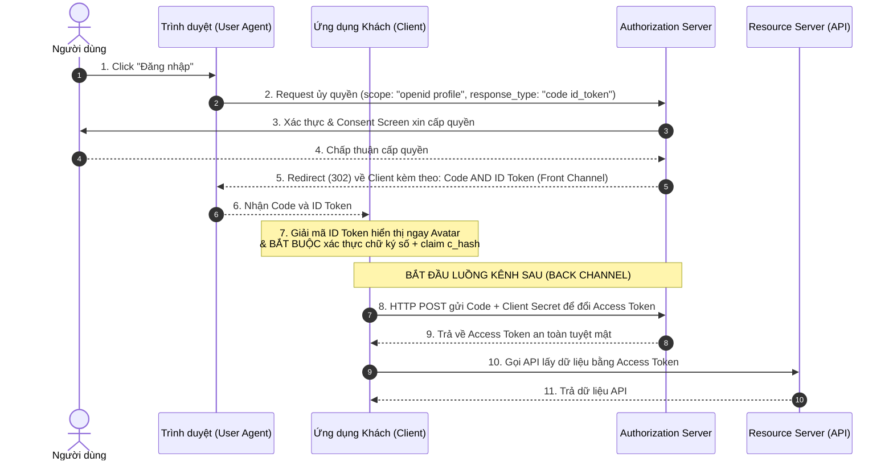

# Luồng Hỗn hợp trong OpenID Connect (OIDC Hybrid Flow)

Tài liệu này phân tích sâu cơ chế vận hành của luồng hỗn hợp **OIDC Hybrid Flow**, sự kết hợp của các `response_types` phức tạp, vai trò mật mã học của claim `c_hash` trong việc chống tấn công chèn mã ủy quyền (Code Injection), và khuyến nghị bảo mật hiện đại thay thế.

## Mục lục

1. [Giới thiệu về Hybrid Flows trong OIDC](#1-giới-thiệu-về-hybrid-flows-trong-oidc)
2. [Các Loại response_type trong OAuth và OIDC](#2-các-loại-response_type-trong-oauth-và-oidc)
3. [Các Chế độ Hybrid trong OIDC](#3-các-chế-độ-hybrid-trong-oidc)
4. [Nguy cơ Bảo mật khi Dùng response_type chứa "token"](#4-nguy-cơ-bảo-mật-khi-dùng-response_type-chứa-token)
5. [Sơ đồ Trình tự Luồng response_type=code id_token](#5-sơ-đồ-trình-tự-luồng-responsetypecode-id_token)
6. [Vai trò của c_hash Claim chống Code Injection](#6-vai-trò-của-c_hash-claim-chống-code-injection)
7. [Khuyến nghị Bảo mật Hiện đại: PKCE thay thế Hybrid](#7-khuyến-nghị-bảo-mật-hiện-đại-pkce-thay-thế-hybrid)
8. [Tổng kết](#8-tổng-kết)

---

## 1. Giới thiệu về Hybrid Flows trong OIDC

Trong kiến trúc ứng dụng Web phức tạp, có những thời điểm ứng dụng khách (Client) có nhu cầu tối ưu hóa hiệu năng cực cao: muốn lấy thông tin định danh cá nhân người dùng thật nhanh ở kênh trước (Front Channel) để kết xuất ngay giao diện, nhưng vẫn muốn giữ quá trình cấp phát Access Token nhạy cảm an toàn ở kênh sau (Back Channel). 

Để giải quyết bài toán này, đặc tả OpenID Connect định nghĩa cơ chế **Hybrid Flow (Luồng hỗn hợp)** - cho phép trả về các loại token khác nhau ở các bước chuyển tiếp khác nhau trong cùng một luồng giao dịch.

---

## 2. Các Loại response_type trong OAuth và OIDC

Tham số `response_type` khai báo ở GET request ban đầu báo cho Auth Server biết Client mong muốn nhận lại dữ liệu gì ở URL redirect:
*   `response_type=code`: Chỉ nhận Authorization Code (Luồng Code tiêu chuẩn).
*   `response_type=token`: Chỉ nhận Access Token qua Front Channel (Implicit Flow - Đã bị cấm).
*   `response_type=id_token`: Chỉ nhận ID Token qua Front Channel (OIDC Implicit).

---

## 3. Các Chế độ Hybrid trong OIDC

Luồng hỗn hợp Hybrid Flow được kích hoạt khi chúng ta kết hợp nhiều giá trị cách nhau bởi dấu cách (` ` hoặc `%20`) trong tham số `response_type`:
*   `response_type=code id_token`: Trả về đồng thời **Authorization Code** và **ID Token** tại Front Channel.
*   `response_type=code token`: Trả về **Authorization Code** và **Access Token** tại Front Channel.
*   `response_type=code id_token token`: Trả về cả 3 dữ liệu tại Front Channel.

---

## 4. Nguy cơ Bảo mật khi Dùng response_type chứa "token"

> [!WARNING]
> **Cấm tuyệt đối các response_type chứa chữ "token":**
> Các nhóm làm việc của đặc tả OAuth và OIDC khuyến cáo **không bao giờ sử dụng** các chế độ hybrid chứa chữ `token` (như `code token` hay `code id_token token`). 
> Nguyên nhân là do chúng trả về thẳng Access Token nhạy cảm qua Kênh trước (Front Channel URL Redirect) - môi trường cực kỳ kém an toàn trên trình duyệt.

Nếu loại bỏ hoàn toàn các luồng chứa `token` kém an toàn, luồng hỗn hợp duy nhất còn lại có thể cân nhắc sử dụng là **`response_type=code id_token`**.

---

## 5. Sơ đồ Trình tự Luồng response_type=code id_token

Dưới đây là sơ đồ trình tự thể hiện chi tiết cách luồng hỗn hợp an toàn trả về ID Token sớm ở kênh trước và Access Token muộn ở kênh sau:



---

## 6. Vai trò của c_hash Claim chống Code Injection

Khi nhận được đồng thời `ID Token` và `Authorization Code` qua Front Channel ở Bước 5 & 6, làm thế nào Client có thể tin tưởng mã `code` nhận được là sạch và không bị kẻ tấn công đánh tráo trên trình duyệt?

Đặc tả OIDC giải quyết bằng cách đưa thêm một claim đặc biệt gọi là **`c_hash` (Code Hash)** vào bên trong Payload của ID Token:

```text
c_hash = Base64URL( Tả_nửa_phần_đầu( SHA256( authorization_code ) ) )
```

> [!IMPORTANT]
> **Quy trình bắt buộc đối với lập trình viên Client:**
> Khi nhận được ID Token và Code ở kênh trước:
> 1.  Client giải mã ID Token, tự thực hiện tính toán hash SHA256 của chuỗi `code` nhận được.
> 2.  Cắt lấy nửa số byte phần đầu (128 bit đầu tiên) của chuỗi hash đó và mã hóa Base64URL.
> 3.  Đối chiếu khớp 100% với claim `c_hash` nằm trong ID Token.
> 4.  **Nếu không khớp:** Hủy bỏ toàn bộ giao dịch ngay lập tức vì mã Code đã bị kẻ tấn công giả mạo hoặc tiêm vào (Code Injection Attack).

---

## 7. Khuyến nghị Bảo mật Hiện đại: PKCE thay thế Hybrid

Mặc dù giải thuật `c_hash` của Hybrid Flow rất thông minh, tuy nhiên nó đặt ra gánh nặng lập trình cực kỳ lớn lên vai nhà phát triển ứng dụng khách (họ bắt buộc phải tự viết code mã hóa, băm SHA256 và đối khớp thủ công một cách chính xác). Nếu lập trình viên lười biếng bỏ qua bước này, hệ thống sẽ mở toang cửa cho tin tặc.

Do đó, các khuyến nghị bảo mật OAuth hiện đại nhất đưa ra lời khuyên:

> [!TIP]
> **Chuyển đổi sang Authorization Code Flow kết hợp PKCE:**
> *   Thay vì dùng Hybrid Flow phức tạp, hãy sử dụng **Authorization Code Flow tiêu chuẩn kết hợp PKCE** với tham số `response_type=code` và scope `openid`.
> *   Cơ chế PKCE giúp chốt chặn và xác thực mã ủy quyền **tự động ở phía Authorization Server** mà không cần lập trình viên Client phải tự tính toán khớp `c_hash` thủ công.
> *   Client nhận đồng thời cả Access Token và ID Token qua kết nối Kênh sau HTTPS cực kỳ an toàn, loại bỏ hoàn toàn việc phải viết mã xác thực chữ ký JWT phức tạp.

---

## 8. Tổng kết

*   **Hybrid Flow (`code id_token`)** cung cấp giải pháp lấy thông tin danh tính sớm ở kênh trước và Access Token an toàn ở kênh sau.
*   **Bảo vệ bằng `c_hash`:** Claim `c_hash` là vũ khí mật mã tối quan trọng để tự Client phát hiện tấn công Code Injection khi chạy trên Kênh trước.
*   **Khuyến nghị tối ưu:** Hãy luôn ưu tiên lựa chọn **Authorization Code Flow kết hợp PKCE** để tận dụng tối đa khả năng bảo mật tự động của server, giúp mã nguồn Client luôn ngắn gọn, sạch sẽ và an toàn nhất.

---
[← Quay lại mục lục](../README.md)
