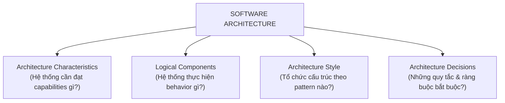
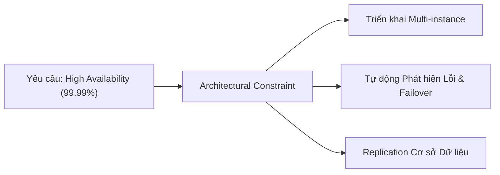
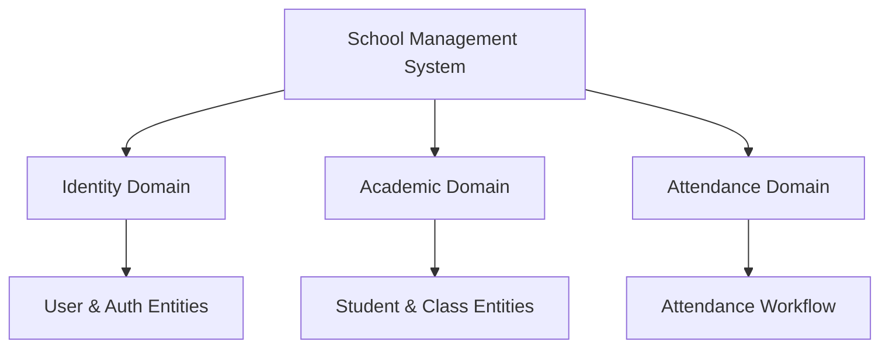
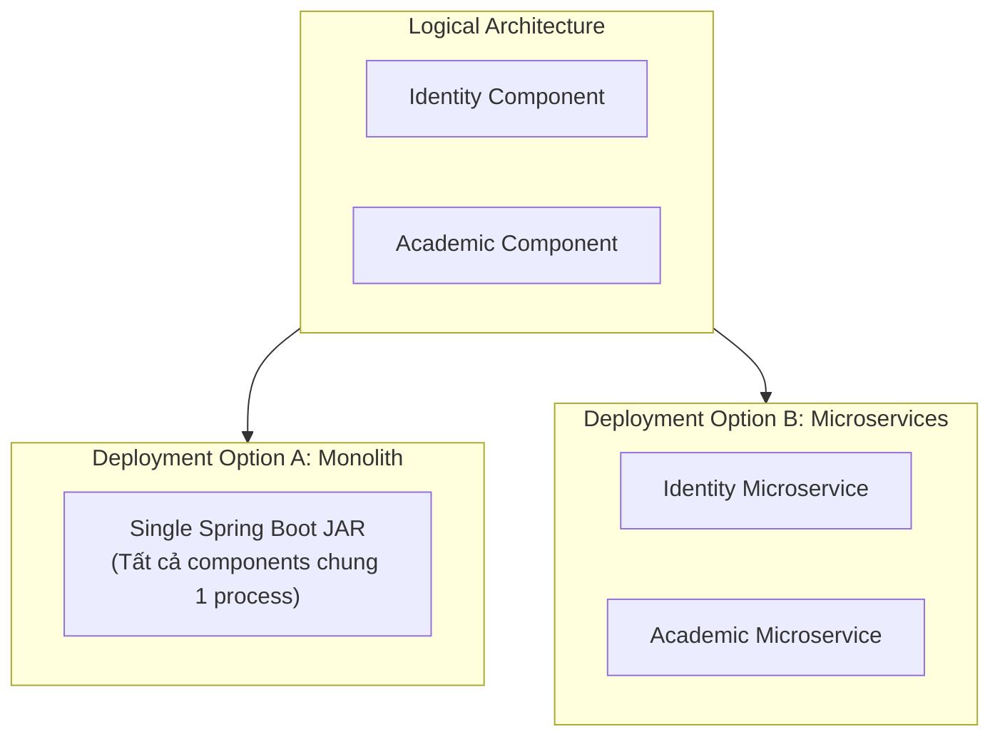
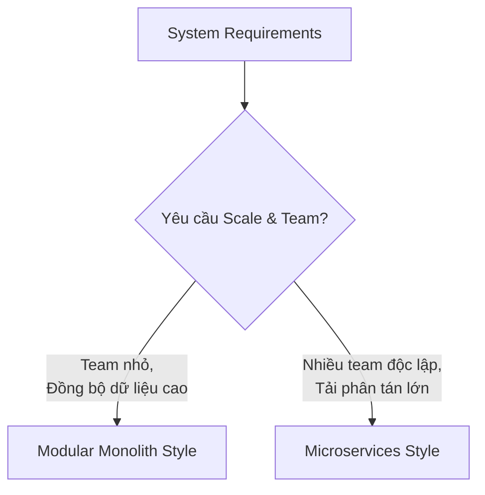
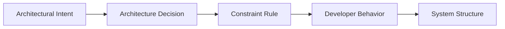
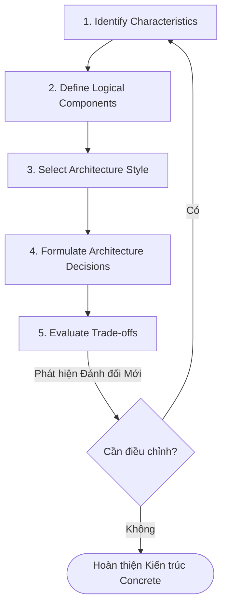

# Bốn Chiều Của Kiến Trúc Phần Mềm (The Four Dimensions of Software Architecture)

## Table of Contents

- [Tổng quan về 4 Dimensions](#tổng-quan-về-4-dimensions)
- [Dimension 1: Architecture Characteristics](#dimension-1-architecture-characteristics)
- [Dimension 2: Logical Components](#dimension-2-logical-components)
- [Dimension 3: Architecture Style](#dimension-3-architecture-style)
- [Dimension 4: Architecture Decisions](#dimension-4-architecture-decisions)
- [Chuỗi Tương tác và Vòng lặp Suy luận Kiến trúc](#chuỗi-tương-tác-và-vòng-lặp-suy-luận-kiến-trúc)
- [Mô hình Tư duy Cốt lõi](#mô-hình-tư-duy-cốt-lõi)
- [Tài liệu Tham khảo](#tài-liệu-tham-khảo)


---

## Tổng quan về 4 Dimensions

Kiến trúc phần mềm không đơn thuần là một sơ đồ hộp-và-đường-nối (boxes and lines diagram). Đó là sự kết hợp có chủ đích giữa 4 chiều chính: **Architecture Characteristics**, **Logical Components**, **Architecture Style**, và **Architecture Decisions**.

Bốn dimensions này trả lời các nhóm câu hỏi cốt lõi để định hình cấu trúc và hành vi hệ thống:



Bảng tổng hợp vai trò của 4 Dimensions:

| Dimension | Đối tượng Trọng tâm | Câu hỏi Cốt lõi | Sản phẩm Đầu ra |
| :--- | :--- | :--- | :--- |
| **Architecture Characteristics** | Quality Attributes (-ilities) | Hệ thống cần hỗ trợ những năng lực gì để thành công? | Success criteria (Availability, Latency, Scalability) |
| **Logical Components** | Business Responsibilities | Hành vi nghiệp vụ được phân chia thành những mô-đun nào? | Domain models, Services, Workflows |
| **Architecture Style** | Structural Pattern | Nên sắp xếp hình thái cấu trúc tổng thể như thế nào? | Monolith, Microservices, Event-Driven |
| **Architecture Decisions** | Governance & Constraints | Những quy tắc nào bắt buộc lập trình viên phải tuân thủ? | Architectural Rules, ADRs, Dependency constraints |

---

## Dimension 1: Architecture Characteristics

Architecture characteristics (thường gọi là các **"-ilities"**) mô tả những năng lực phi chức năng mà kiến trúc bắt buộc phải hỗ trợ. Các đặc tính này đóng vai trò là tiêu chí đánh giá thành công (success criteria) của hệ thống.

Một số characteristics phổ biến bao gồm: `Availability`, `Reliability`, `Scalability`, `Performance`, `Security`, `Maintainability`, `Testability`, `Deployability`, `Observability`.



> [!NOTE]
> Architecture characteristics chỉ xác định **năng lực cần đạt được**, không quyết định trực tiếp công nghệ cụ thể. Việc thực thi năng lực đó là trách nhiệm của các decisions và phong cách kiến trúc.

---

## Dimension 2: Logical Components

Nếu characteristics định nghĩa **capabilities**, thì logical components định nghĩa **behavior** của ứng dụng. Đây là cách kiến trúc sư phân chia các trách nhiệm nghiệp vụ thành các khối logic.

Logical components bao gồm: Domains, Entities, Services, Workflows, và Business Capabilities.



Cần phân biệt rõ ràng giữa **Logical Component** và **Deployment Component**:



> [!IMPORTANT]
> Cùng một mô hình phân rã logic có thể được hiện thực hóa bằng nhiều hình thái triển khai hạ tầng khác nhau. Điều này giúp tách biệt giữa **Hệ thống làm gì** và **Hệ thống được triển khai như thế nào**.

---

## Dimension 3: Architecture Style

Sau khi đã làm rõ đặc tính cần đạt và phân rã các khối logic, kiến trúc sư chọn **Architecture Style** làm điểm xuất phát cho cấu trúc hệ thống.

Một số phong cách kiến trúc phổ biến: `Layered`, `Modular Monolith`, `Microservices`, `Event-Driven`, `Hexagonal (Ports & Adapters)`, `Service-Based`.



> [!TIP]
> Architecture style không nên được lựa chọn dựa trên sở thích cá nhân hay xu hướng công nghệ. Nó phải là kết quả của việc tìm ra con đường thực thi phù hợp nhất với các characteristics và cấu trúc logic đã xác định.

---

## Dimension 4: Architecture Decisions

Architecture style mới chỉ cung cấp hình thái cấu trúc ban đầu. **Architecture decisions** định nghĩa các quy tắc (rules) và ràng buộc (constraints) bắt buộc đội ngũ phát triển phải tuân theo.

Ví dụ trong kiến trúc Layered Architecture (Presentation → Service → Business → Database), kiến trúc sư có thể đưa ra quyết định:

```mermaid
graph TD
    accTitle: Quyết định Ràng buộc Truy cập trong Layered Architecture
    accDescr: Sơ đồ thể hiện Presentation Layer bị cấm truy cập trực tiếp vào Database

    presLayer["Presentation Layer (Controllers)"] --> servLayer["Application Service Layer"]
    servLayer --> bizLayer["Business / Domain Layer"]
    bizLayer --> dbLayer[("Database Layer")]

    presLayer -- "❌ BỊ CẤM (Decision Rule)" -.-X dbLayer
```

Architecture decisions biến định hướng kiến trúc thành các quy tắc thực tế điều hướng hành vi của lập trình viên:



---

## Chuỗi Tương tác và Vòng lặp Suy luận Kiến trúc

Bốn chiều không hoạt động cô lập mà tạo thành một chuỗi suy luận liên tục có tính vòng lặp (iterative refinement):



---

## Mô hình Tư duy Cốt lõi

Có thể cô đọng toàn bộ 4 Dimensions bằng 4 câu hỏi định hướng:

1. **WHAT MUST IT SUPPORT?** → Architecture Characteristics
2. **WHAT DOES IT DO?** → Logical Components
3. **HOW IS IT STRUCTURED?** → Architecture Style
4. **WHAT RULES APPLY?** → Architecture Decisions

> [!IMPORTANT]
> **Software Architecture = Capabilities + Behavior + Structural Style + Governance Decisions.** Một thiết kế kiến trúc hoàn chỉnh bắt buộc phải bao quát đầy đủ 4 chiều này.

---

## Tài liệu Tham khảo

- 📘 **[Fundamentals of Software Architecture (2nd Edition)](../../../library/fundamentals_of_software_architecture_2nd.epub)** – Mark Richards & Neal Ford *(Part I: Architectural Foundations & Dimensions)*.
- 📕 **[Clean Architecture: A Craftsman's Guide to Software Structure and Design](../../../library/clean_architecture_a_acraftsman_guide.pdf)** – Robert C. Martin *(Part V: Architecture & Components)*.

---
[← Back to README](README.md)

