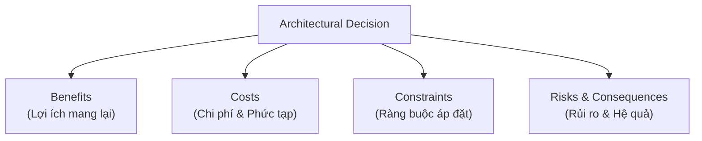
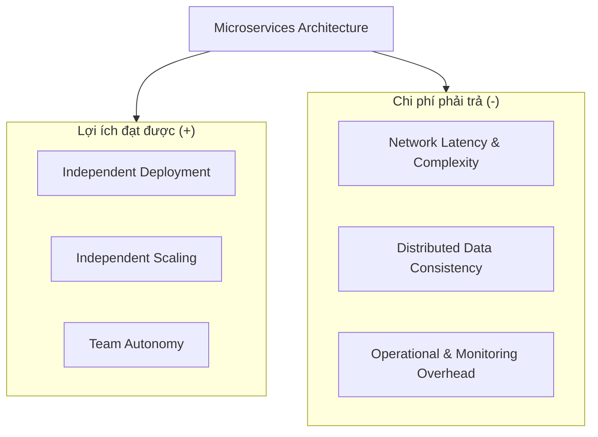
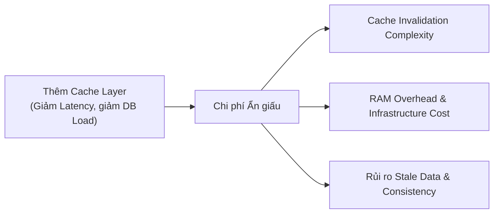
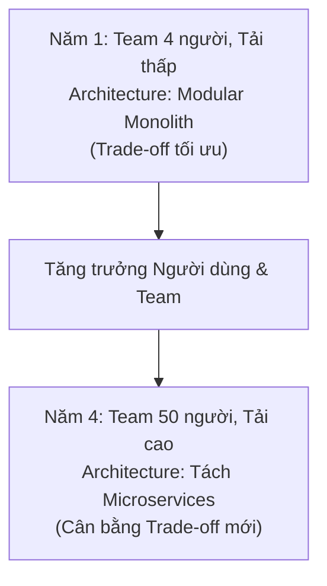
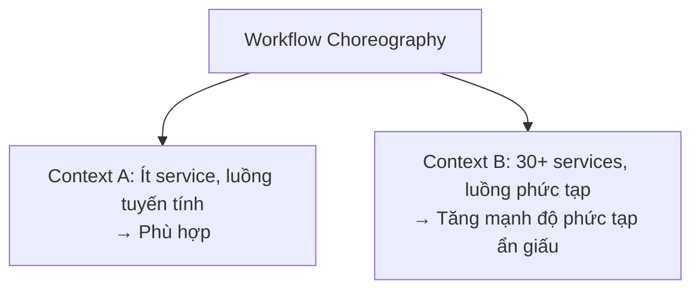
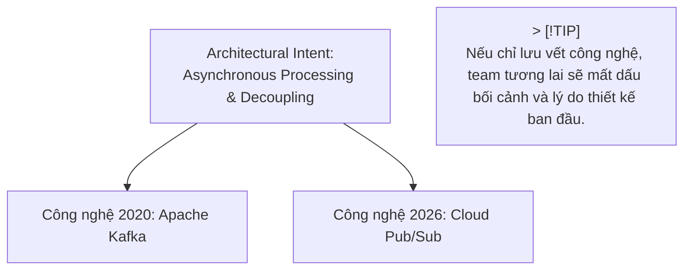
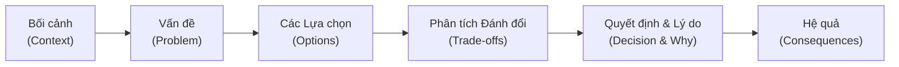

# Các Quy Luật Trong Kiến Trúc Phần Mềm (Laws of Software Architecture)

## Table of Contents

- [Tổng quan về các Quy luật Kiến trúc](#tổng-quan-về-các-quy-luật-kiến-trúc)
- [Quy luật Thứ nhất: Mọi thứ đều là sự Đánh đổi](#quy-luật-thứ-nhất-mọi-thứ-đều-là-sự-đánh-đổi)
- [Hệ quả 1: Đánh đổi Ẩn giấu](#hệ-quả-1-đánh-đổi-ẩn-giấu)
- [Hệ quả 2: Phân tích Đánh đổi là Tiến trình Liên tục](#hệ-quả-2-phân-tích-đánh-đổi-là-tiến-trình-liên-tục)
- [Không có Lựa chọn Mặc định Tuyệt đối](#không-có-lựa-chọn-mặc-định-tuyệt-đối)
- [Quy luật Thứ hai: Tại sao Quan trọng hơn Như thế nào](#quy-luật-thứ-hai-tại-sao-quan-trọng-hơn-như-thế-nào)
- [Bảo tồn Lý do Ra Quyết định (Preserving the Why)](#bảo-tồn-lý-do-ra-quyết-định-preserving-the-why)
- [Quy trình Phân tích và Đóng gói Quyết định](#quy-trình-phân-tích-và-đóng-gói-quyết-định)
- [Tài liệu Tham khảo](#tài-liệu-tham-khảo)

---

## Tổng quan về các Quy luật Kiến trúc

Kiến trúc phần mềm phụ thuộc rất mạnh vào bối cảnh (context), ràng buộc (constraints) và sự đánh đổi (trade-offs). Do đó, có rất ít nguyên lý có thể xem là quy luật phổ quát. Tuy nhiên, hai quy luật dưới đây được đúc kết bởi Mark Richards và Neal Ford nhằm định hướng cho mọi tư duy kiến trúc:

1. **First Law:** Everything in software architecture is a trade-off. (Mọi thứ trong kiến trúc phần mềm đều là sự đánh đổi).
2. **Second Law:** Why is more important than how. (Tại sao lại quan trọng hơn Như thế nào).

---

## Quy luật Thứ nhất: Mọi thứ đều là sự Đánh đổi

> [!IMPORTANT]
> **First Law of Software Architecture:** Everything in software architecture is a trade-off.

Không có quyết định kiến trúc nào hoàn toàn tốt hoặc hoàn toàn xấu. Mỗi quyết định đều tối ưu hóa một số thuộc tính chất lượng nhưng đồng thời bắt buộc phải chấp nhận chi phí, rủi ro hoặc sự suy giảm ở các khía cạnh khác.

Sơ đồ phân tích thành tố của một quyết định kiến trúc:

Ví dụ cụ thể khi đánh giá việc áp dụng Microservices:

Do đó, câu hỏi chuẩn xác của kiến trúc sư không phải là *"Công nghệ X có tốt không?"*, mà là: **"Trong bối cảnh hiện tại, lợi ích của X có đủ lớn để bù đắp cho chi phí và rủi ro mà nó tạo ra hay không?"**

---

## Hệ quả 1: Đánh đổi Ẩn giấu

> [!WARNING]
> **Corollary 1:** If you think you've discovered something that isn't a trade-off, more likely you just haven't identified the trade-off yet.

Nếu một quyết định dường như chỉ mang lại lợi ích tuyệt đối mà không có điểm bất lợi, điều đó có nghĩa là các chi phí ẩn giấu chưa được phát hiện.

Xem xét ví dụ về việc triển khai Caching để tăng tốc độ truy vấn:

---

## Hệ quả 2: Phân tích Đánh đổi là Tiến trình Liên tục

> [!NOTE]
> **Corollary 2:** You can't just do trade-off analysis once and be done with it.

Phân tích đánh đổi không phải là công việc làm một lần rồi kết thúc. Theo thời gian, bối cảnh kinh doanh, quy mô người dùng, hạ tầng và năng lực đội ngũ đều thay đổi, làm thay đổi cán cân đánh đổi.

---

## Không có Lựa chọn Mặc định Tuyệt đối

Các tổ chức thường có xu hướng tạo ra các quy tắc áp đặt cứng nhắc như *"Luôn dùng Microservices"*, *"Luôn dùng Event-Driven"* hoặc *"Luôn dùng REST"*. Tuy nhiên, **Default không phải là Universal Law**.

Một pattern phù hợp trong bối cảnh A có thể gây ra thảm họa độ phức tạp trong bối cảnh B:

---

## Quy luật Thứ hai: Tại sao Quan trọng hơn Như thế nào

> [!IMPORTANT]
> **Second Law of Software Architecture:** Why is more important than how.

**Tại sao** hệ thống lại được thiết kế như vậy quan trọng hơn nhiều so với việc **nó được triển khai bằng công nghệ gì**.

So sánh hai cách ghi nhận thông tin kiến trúc:

| Cách tiếp cận | Nội dung Ghi nhận | Giá trị Kiến trúc |
| :--- | :--- | :--- |
| **Chỉ ghi nhận "HOW"** | *"Hệ thống dùng Kafka."* | Rất thấp. Khi công nghệ thay đổi, đội ngũ không hiểu lý do thiết kế tồn tại. |
| **Ghi nhận "WHY" & "HOW"** | *"Tách xử lý bất đồng bộ qua Message Queue để giảm latency phản hồi API cho người dùng và đảm bảo khả năng mở rộng độc lập."* | Rất cao. Bảo tồn được ý định kiến trúc (architectural intent) ngay cả khi thay thế Kafka bằng NATS hay RabbitMQ. |

---

## Bảo tồn Lý do Ra Quyết định (Preserving the Why)

Công nghệ sẽ lỗi thời theo thời gian, nhưng các ràng buộc và ý định kiến trúc cốt lõi thường tồn tại lâu dài hơn:

---

## Quy trình Phân tích và Đóng gói Quyết định

Để áp dụng 2 quy luật kiến trúc vào thực tế, mọi quyết định kiến trúc nên được đóng gói theo cấu trúc Architecture Decision Record (ADR) tiêu chuẩn:

### Nguyên tắc Kết luận

Một quyết định kiến trúc tốt không phải là một quyết định không có nhược điểm. Một quyết định kiến trúc tốt là quyết định mà:

> **Các đánh đổi đã được nhận diện và chấp nhận một cách có chủ đích dựa trên bối cảnh thực tế.**

---

## Tài liệu Tham khảo

- 📘 **[Fundamentals of Software Architecture (2nd Edition)](../../../library/fundamentals_of_software_architecture_2nd.epub)** – Mark Richards & Neal Ford *(Chapter 2: Architectural Laws & Trade-off Analysis)*.
- 📕 **[Clean Architecture: A Craftsman's Guide to Software Structure and Design](../../../library/clean_architecture_a_acraftsman_guide.pdf)** – Robert C. Martin *(Part III: Design Principles - SOLID & Boundary Trade-offs)*.

---
[← Back to README](README.md)

