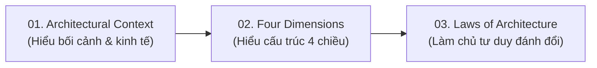

# Software Architecture Fundamentals - Kiến Trúc Phần Mềm Cơ Bản

## Table of Contents

- [Giới thiệu](#giới-thiệu)
- [Nguồn Tham khảo Chính](#nguồn-tham-khảo-chính)
- [Danh mục Tài liệu](#danh-mục-tài-liệu)
- [Định hướng Học tập](#định-hướng-học-tập)

---

## Giới thiệu

Thư mục **`00_fundamental`** tổng hợp các kiến thức nền tảng nhất về Kiến trúc Phần mềm (Software Architecture), dựa trên các nghiên cứu và đúc kết từ các tài liệu kinh điển trong thư viện.

Mục tiêu của phần này là xây dựng tư duy kiến trúc đúng đắn: hiểu rõ bối cảnh kỹ thuật/kinh tế, nắm vững 4 chiều cấu thành kiến trúc và tuân thủ các quy luật đánh đổi trong thiết kế hệ thống.

---

## Nguồn Tham khảo Chính

Nội dung trong mục này được tổng hợp và trích xuất từ 2 cuốn sách gốc thuộc thư viện [`/library`](../../../library/README.md):

1. 📘 **[Fundamentals of Software Architecture (2nd Edition)](../../../library/fundamentals_of_software_architecture_2nd.epub)** - Mark Richards & Neal Ford  
   *Nguồn gốc chính của các lý thuyết về bối cảnh kiến trúc, 4 Dimensions và 2 Quy luật Kiến trúc Phần mềm.*
2. 📕 **[Clean Architecture: A Craftsman's Guide to Software Structure and Design](../../../library/clean_architecture_a_acraftsman_guide.pdf)** - Robert C. Martin (Uncle Bob)  
   *Nguồn bổ trợ về tư duy tổ chức mô-đun, ranh giới hệ thống (architectural boundaries) và quy tắc phụ thuộc (Dependency Rule).*

---

## Danh mục Tài liệu

| Bài học | Chủ đề Trọng tâm | Mô tả Chi tiết |
| :--- | :--- | :--- |
| **[01. Bối cảnh Kiến trúc](01_architectural_context.md)** | Architectural Context & Economics | Tác động của chi phí hạ tầng, mã nguồn mở, DevOps và tính khả thi kinh tế của các phong cách kiến trúc. |
| **[02. 4 Chiều Kiến trúc](02_four_dimensions.md)** | The 4 Dimensions | Phân tích 4 thành tố: Characteristics (-ilities), Logical Components, Architecture Style và Architecture Decisions. |
| **[03. Các Quy luật Kiến trúc](03_laws_of_architecture.md)** | Laws of Architecture | Quy luật đánh đổi (1st Law), hệ quả ẩn giấu, tiến trình đánh giá liên tục và nguyên tắc *Why > How* (2nd Law). |

---

## Định hướng Học tập

Để đạt hiệu quả tốt nhất, khuyến nghị đọc tài liệu theo đúng thứ tự tiến trình suy luận kiến trúc:

---
[← Quay lại Software Architecture](../README.md)
