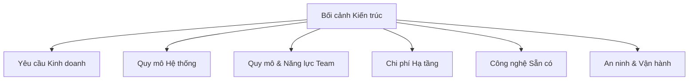
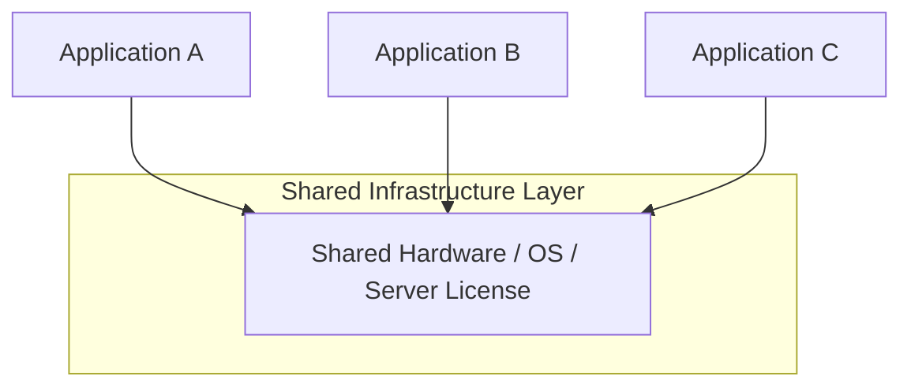
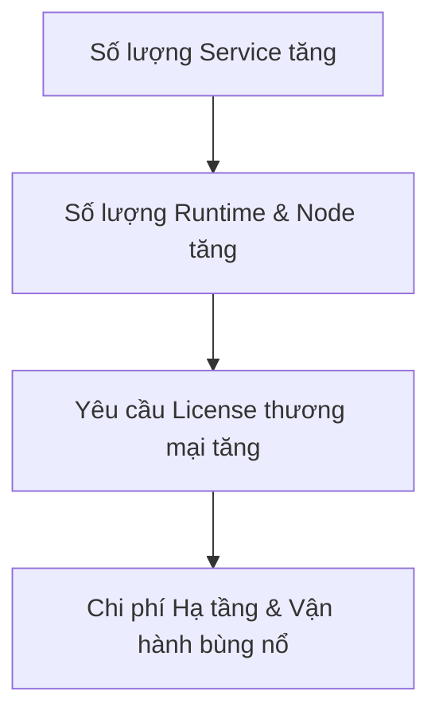
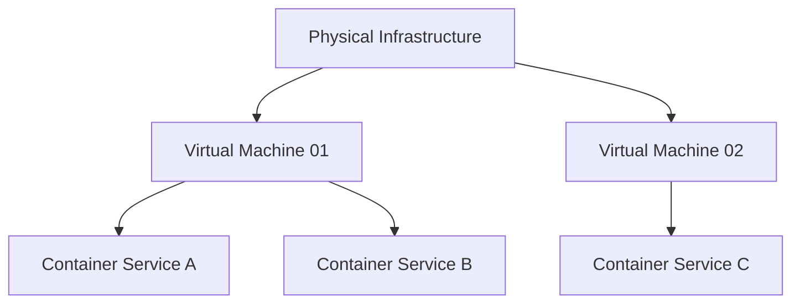
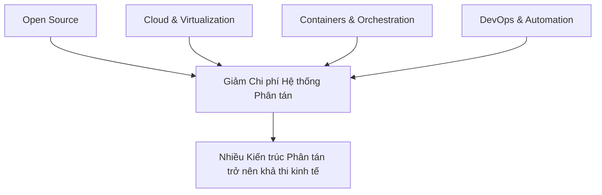

# Bối Cảnh Trong Kiến Trúc Phần Mềm

## Table of Contents

- [Khái niệm Bối cảnh Kiến trúc](#khái-niệm-bối-cảnh-kiến-trúc)
- [Tác động của Chi phí Hạ tầng](#tác-động-của-chi-phí-hạ-tầng)
- [Rào cản Kinh tế của Microservices trong Quá khứ](#rào-cản-kinh-tế-của-microservices-trong-quá-khứ)
- [Tác động của Mã nguồn Mở đến Hạ tầng](#tác-động-của-mã-nguồn-mở-đến-hạ-tầng)
- [Vai trò của Automation và DevOps](#vai-trò-của-automation-và-devops)
- [Sự Tương tác của Các Yếu tố Hiện đại](#sự-tương-tác-của-các-yếu-tố-hiện-đại)
- [Đánh giá Kiến trúc dựa trên Trade-off](#đánh-giá-kiến-trúc-dựa-trên-trade-off)

---

## Khái niệm Bối cảnh Kiến trúc

Kiến trúc phần mềm không tồn tại độc lập trong môi trường lý thuyết. Mọi quyết định kiến trúc đều được hình thành dựa trên các ràng buộc kỹ thuật, ngân sách vận hành và năng lực tổ chức tại thời điểm thiết kế.

Một thiết kế chỉ có thể hiểu đúng khi đặt vào bối cảnh thời đại sinh ra nó. Chẳng hạn, ở cuối thế kỷ 20, mục tiêu hàng đầu là tối ưu hóa việc dùng chung tài nguyên hạ tầng vì chi phí phần cứng, hệ điều hành và cơ sở dữ liệu thương mại vô cùng đắt đỏ.

> [!IMPORTANT]
> **Một kiến trúc không thể được đánh giá đơn thuần qua việc nó "trông hiện đại" hay "đúng sách giáo khoa". Quyết định kiến trúc phải được đánh giá tương quan với bối cảnh cụ thể của hệ thống.**



Quy trình ra quyết định kiến trúc hiệu quả luôn bắt đầu từ việc phân tích kỹ lưỡng các ràng buộc này thay vì chạy theo framework hay công nghệ thời thượng.

---

## Tác động của Chi phí Hạ tầng

Trong các thập niên trước, phần cứng và giấy phép phần mềm thương mại chiếm tỷ trọng ngân sách rất lớn. Việc vận hành từng ứng dụng trên một máy chủ riêng biệt gây lãng phí tài nguyên và vượt quá khả năng chi trả.

Mô hình chia sẻ hạ tầng ra đời nhằm giải quyết bài toán kinh tế đó:



| Tiêu chí | Hạ tầng Phân tán | Hạ tầng Chia sẻ |
| :--- | :--- | :--- |
| **Chi phí License** | Cao (tăng theo số node triển khai) | Tối ưu (dùng chung bản quyền thương mại) |
| **Tận dụng CPU/RAM** | Thấp (phân mảnh tài nguyên) | Cao (tập trung workload) |
| **Độ phức tạp Vận hành** | Phức tạp khi quản lý thủ công | Đơn giản hơn do tập trung đầu mối |

> [!NOTE]
> Việc lựa chọn hạ tầng chia sẻ vào thời kỳ đó là quyết định hoàn toàn đúng đắn dựa trên chỉ số tài chính thực tế, không phải là sự hạn chế về tư duy kỹ thuật.

---

## Rào cản Kinh tế của Microservices trong Quá khứ

**Microservices** đòi hỏi mức độ cô lập cao giữa các dịch vụ độc lập. Nếu áp dụng microservices vào năm 2002, chi phí sở hữu sẽ bùng nổ do yêu cầu hàng chục license hệ điều hành, cơ sở dữ liệu thương mại và server vật lý riêng biệt.



Sự vắng mặt của microservices ở đầu những năm 2000 không phải vì thiếu ý tưởng thiết kế, mà do tính khả thi kinh tế chưa cho phép.

### Mở rộng: Bài học từ Lịch sử Công nghiệp

Lịch sử công nghiệp ô tô cũng chứng kiến quy luật tương tự về những kiến trúc xuất hiện sớm nhưng bị bối cảnh hạ tầng cản trở:

#### Động cơ Điện

- **Xuất hiện sớm (Thế kỷ 19):** Đến năm 1900, xe điện chiếm gần 1/3 tổng số ô tô tại Mỹ vì chạy êm và không mùi khói.
- **Biến mất vì bối cảnh:** Xe chạy xăng (ICE) ra đời cùng dòng Ford Model T sản xuất hàng loạt giá rẻ, dầu mỏ dồi dào, trong khi ắc quy chì quá nặng và mạng lưới điện chưa phủ rộng.
- **Tái sinh nhờ bối cảnh hiện đại:** Xe điện bùng nổ trở lại khi pin Lithium-ion đạt mật độ năng lượng cao, công nghệ bán dẫn công suất hoàn thiện và mạng lưới trạm sạc phủ rộng.

#### Động cơ Hybrid

- **Xuất hiện năm 1900:** Ferdinand Porsche sáng tạo xe Hybrid đầu tiên (Lohner-Porsche Mixte-Break) dùng động cơ xăng làm máy phát cấp điện cho bánh xe.
- **Rào cản bối cảnh:** Hệ thống quá cồng kềnh, pin yếu và đặc biệt thiếu bộ điều khiển vi xử lý (ECU) để tự động phối hợp giữa xăng và điện.
- **Bùng nổ cùng Toyota Prius (1997):** Khi máy tính nhúng siêu nhỏ giá rẻ ra đời và thuật toán quản lý pin hoàn thiện, Hybrid nhanh chóng chiếm lĩnh thị trường.

---

## Tác động của Mã nguồn Mở đến Hạ tầng

Sự bùng nổ của phần mềm mã nguồn mở như Linux, PostgreSQL, Nginx, Docker và Kubernetes đã tái định hình nền kinh tế hạ tầng. Chi phí bản quyền phần mềm giảm xuống xấp xỉ 0 USD, cho phép chia tách tài nguyên ở mức ảo hóa nhẹ qua container:



Nhờ mô hình này, việc tạo ra hàng chục service độc lập không còn phát sinh chi phí license, mở đường cho các kiến trúc phân tán phát triển.

---

## Vai trò của Automation và DevOps

Mã nguồn mở giải quyết bài toán bản quyền, nhưng số lượng service tăng lên lại đẩy chi phí vận hành tăng cao. Nếu triển khai và giám sát thủ công, hệ thống sẽ gặp nghẽn nghiêm trọng.

Vấn đề này được giải quyết bằng tự động hóa quy trình và phong trào **DevOps**:


### Lịch sử Ra đời của DevOps

- **Tháng 6/2009:** Tại hội nghị O'Reilly Velocity, John Allspaw và Paul Hammond từ Flickr trình bày tham luận kinh điển *"10+ Deploys per Day: Dev and Ops Cooperation at Flickr"*, chứng minh Dev và Ops hoàn toàn có thể hợp tác triển khai liên tục mà không gây gián đoạn hệ thống.
- **Tháng 10/2009:** Patrick Debois tổ chức hội nghị **DevOpsDays** đầu tiên tại Ghent (Bỉ) và chính thức đặt ra thuật ngữ **"DevOps"**.

> [!TIP]
> DevOps không đơn thuần là công cụ (Jenkins, GitHub Actions, Prometheus). DevOps là sự chuyển dịch văn hóa và năng lực vận hành giúp giảm rào cản chi phí quản trị của hệ thống phân tán.

---

## Sự Tương tác của Các Yếu tố Hiện đại

Sự khả thi của các kiến trúc hiện đại là tổng hòa của nhiều tiến bộ công nghệ kết hợp với phương pháp vận hành:



Tuy nhiên, "Hiện đại" không đồng nghĩa với "Tốt hơn". Với một đội ngũ 3 kỹ sư xây dựng hệ thống phục vụ 10.000 người dùng với nghiệp vụ CRUD thông thường, việc áp dụng microservices là một dạng **over-engineering**.

Cấu trúc **Modular Monolith** trong ngữ cảnh đó mang lại hiệu quả vượt trội hơn:

```text
Cấu trúc ứng dụng Modular Monolith đơn lẻ triển khai trên Spring Boot
```

```text
Spring Boot Monolith Application
│
├── Identity Module
├── Authentication Module
├── Student Domain Module
└── Academic Domain Module
```

---

## Đánh giá Kiến trúc dựa trên Trade-off

Thay vì tìm kiếm một thiết kế hoàn hảo lý thuyết, kiến trúc sư cần phân tích sự tương thích giữa bối cảnh và các lựa chọn:

| Bối cảnh Hệ thống | Kiến Trúc Gợi Ý | Rationale & Trade-off |
| :--- | :--- | :--- |
| **Team nhỏ, domain đơn giản** | **Modular Monolith** | Tối ưu tốc độ phát triển, latency cực thấp, vận hành tinh gọn. |
| **Ranh giới domain rõ ràng, quy mô team lớn** | **Microservices** | Triển khai và scale độc lập, nhưng tăng độ trễ mạng và độ phức tạp dữ liệu. |
| **Ngân sách hạ tầng giới hạn nghiêm ngặt** | **Monolith** | Tối ưu hóa việc tận dụng tài nguyên phần cứng. |
| **Năng lực DevOps tự động hóa mạnh mẽ** | **Event-Driven / Phân tán** | Khai thác tối đa năng lực mở rộng đàn hồi và khả năng chịu lỗi. |

---

[← Back to README](README.md)
