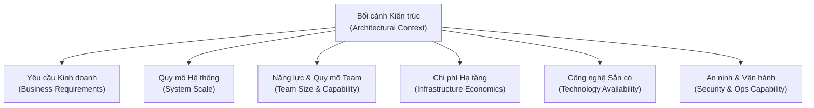
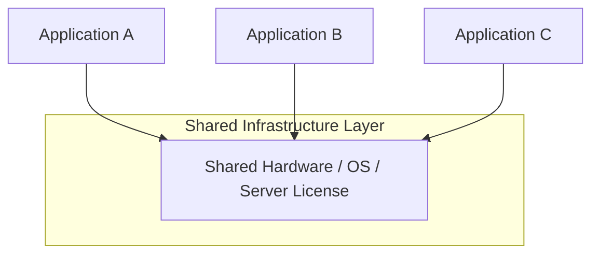
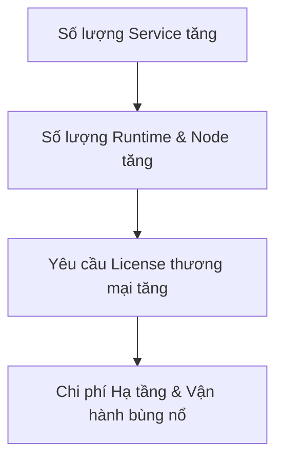
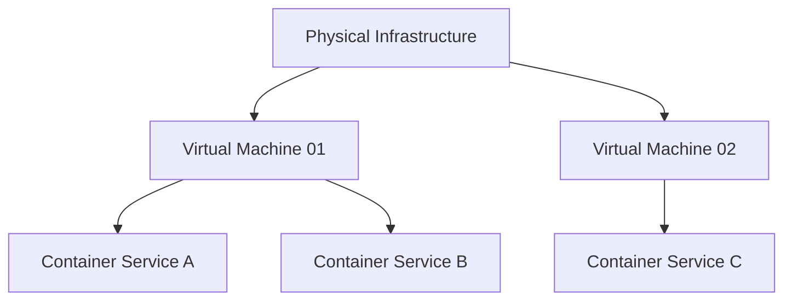
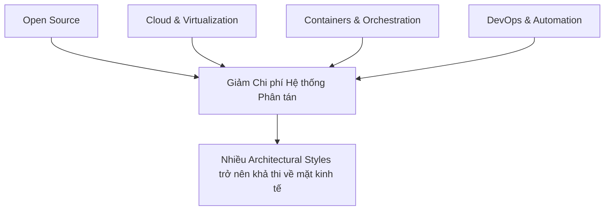

# Bối Cảnh Trong Kiến Trúc Phần Mềm (Architectural Context)

## Table of Contents

- [Khái niệm Bối cảnh Kiến trúc](#khái-niệm-bối-cảnh-kiến-trúc)
- [Tác động của Chi phí Hạ tầng](#tác-động-của-chi-phí-hạ-tầng)
- [Rào cản Kinh tế của Microservices trong Quá khứ](#rào-cản-kinh-tế-của-microservices-trong-quá-khứ)
- [Tác động của Mã nguồn Mở đến Hạ tầng](#tác-động-của-mã-nguồn-mở-đến-hạ-tầng)
- [Vai trò của Automation và DevOps](#vai-trò-của-automation-và-devops)
- [Sự Tương tác của Các Yếu tố Hiện đại](#sự-tương-tác-của-các-yếu-tố-hiện-đại)
- [Đánh giá Kiến trúc dựa trên Trade-off](#đánh-giá-kiến-trúc-dựa-trên-trade-off)

---


## Khái niệm Bối cảnh Kiến trúc

Kiến trúc phần mềm không tồn tại độc lập trong một môi trường lý thuyết. Mọi quyết định kiến trúc (architectural decision) đều được hình thành dựa trên các ràng buộc kỹ thuật, ngân sách vận hành và năng lực tổ chức tại thời điểm thiết kế. 

Giống như nghệ thuật kiến trúc xây dựng, một thiết kế chỉ có thể hiểu đúng khi đặt vào context của thời đại đó. Chẳng hạn, ở cuối thế kỷ 20, mục tiêu hàng đầu là tối ưu hóa việc dùng chung tài nguyên hạ tầng (shared infrastructure) vì chi phí hệ điều hành, ứng dụng và cơ sở dữ liệu thương mại rất đắt đỏ.

> [!IMPORTANT]
> **Một kiến trúc không thể được đánh giá đơn thuần qua việc nó "trông hiện đại" hay "đúng sách giáo khoa". Architectural decision phải được đánh giá tương quan với bối cảnh cụ thể của hệ thống.**

Sơ đồ sau đây tổng hợp các yếu tố ràng buộc trực tiếp hình thành nên bối cảnh kiến trúc:



Quy trình ra quyết định kiến trúc hiệu quả luôn bắt đầu từ việc phân tích kỹ lưỡng các ràng buộc này thay vì chọn ngay một framework hay pattern thời thượng.

---

## Tác động của Chi phí Hạ tầng

Trong các thập niên trước, phần cứng và giấy phép phần mềm (commercial licensing) chiếm tỷ trọng chi phí rất lớn. Việc vận hành từng ứng dụng trên một máy chủ riêng biệt gây lãng phí tài nguyên và chi phí vượt khả năng chi trả.

Mô hình chia sẻ hạ tầng được thiết kế để giải quyết bài toán kinh tế này:



Bảng so sánh chỉ số giữa hai mô hình hạ tầng:

| Tiêu chí | Hạ tầng Phân tán (Triển khai riêng) | Hạ tầng Chia sẻ (Shared Infrastructure) |
| :--- | :--- | :--- |
| **Chi phí License** | Cao (tỷ lệ thuận theo số node) | Tối ưu (dùng chung license thương mại) |
| **Tận dụng CPU/RAM** | Thấp (phân mảnh tài nguyên) | Cao (tập trung workload) |
| **Độ phức tạp Vận hành** | Phức tạp khi quản lý thủ công | Đơn giản hơn do tập trung |

> [!NOTE]
> Việc lựa chọn hạ tầng chia sẻ vào thời kỳ đó là một quyết định kiến trúc hoàn toàn đúng đắn dựa trên các chỉ số tài chính thực tế, không phải là một hạn chế kỹ thuật thuần túy.

---

## Rào cản Kinh tế của Microservices trong Quá khứ

Microservices yêu cầu mức độ cô lập (isolation) cao giữa các dịch vụ độc lập. Nếu áp dụng microservices vào năm 2002, chi phí sở hữu phần mềm (TCO) sẽ bùng nổ do yêu cầu hàng chục license hệ điều hành, cơ sở dữ liệu thương mại và server phần cứng riêng biệt.

Bản chất rào cản kinh tế của kiến trúc phân tán trong quá khứ được thể hiện qua sơ đồ sau:



Do đó, sự vắng mặt của microservices ở đầu những năm 2000 không phải vì thiếu ý tưởng thiết kế, mà do tính khả thi về mặt kinh tế (economic feasibility) chưa cho phép.

### Mở rộng: Bài học từ Lịch sử Công nghiệp

Tương tự như Microservices trong ngành phần mềm, lịch sử công nghiệp ô tô cũng chứng kiến câu chuyện tương tự về các kiến trúc xuất hiện sớm nhưng bị bối cảnh hạ tầng và kinh tế cản trở:

#### Động cơ Điện (Electric Vehicles)

*   **Ý tưởng thế kỷ 19:** Xe điện không phải phát minh mới của Tesla. Từ những năm 1830–1880, xe điện đã xuất hiện. Đến năm 1900, xe điện chiếm gần 1/3 tổng số ô tô chạy trên đường phố Mỹ vì vận hành êm ái, không mùi hôi.
*   **Sự sụp đổ do bối cảnh (Đầu thế kỷ 20):** Xe điện biến mất hoàn toàn khi xe chạy xăng (ICE) ra đời. Bối cảnh lúc đó ủng hộ xe xăng: dầu mỏ phát hiện vô tận và cực rẻ, dòng xe Model T của Ford sản xuất hàng loạt hạ giá thành thảm hại, ắc quy chì thời đó quá nặng và phạm vi hoạt động quá ngắn, mạng lưới điện chưa phủ rộng.
*   **Sự tái sinh nhờ bối cảnh hiện đại (Thế kỷ 21):** Xe điện quay trở lại không phải vì nguyên lý động cơ điện thay đổi, mà vì yếu tố hạ tầng xung quanh đã thay đổi: Pin Lithium-ion (mật độ năng lượng cao), công nghệ bán dẫn công suất (Power Electronics), mạng lưới trạm sạc phủ rộng và áp lực cắt giảm khí thải.

#### Động cơ Hybrid (Động cơ lai Xăng - Điện)

*   **Xuất hiện năm 1900:** Ferdinand Porsche đã sáng tạo ra chiếc xe Hybrid đầu tiên (Lohner-Porsche Mixte-Break) dùng động cơ xăng làm máy phát điện cấp nguồn cho các động cơ điện gắn ở bánh xe.
*   **Rào cản bối cảnh:** Thời điểm đó, hệ thống quá cồng kềnh, trọng lượng xe quá nặng do pin kém, và quan trọng nhất là thiếu các bộ vi xử lý (ECU) để điều phối việc khi nào dùng xăng, khi nào dùng điện. Chi phí sản xuất đắt đỏ khiến dự án phá sản về mặt thương mại.
*   **Bùng nổ cùng Toyota Prius (1997):** Khi máy tính nhúng (Microcontrollers) trở nên siêu nhỏ và rẻ, thuật toán quản lý pin (BMS) đủ thông minh để chuyển đổi linh hoạt giữa điện và xăng, kết hợp với giá nhiên liệu tăng cao, Hybrid mới trở thành mô hình kiến trúc thống trị thị trường chuyển tiếp.

---

## Tác động của Mã nguồn Mở đến Hạ tầng

Sự bùng nổ của phần mềm mã nguồn mở (Open Source Software - OSS) như Linux, PostgreSQL, Nginx, Docker và Kubernetes đã tái định hình toàn bộ nền kinh tế hạ tầng. Chi phí bản quyền phần mềm giảm xuống xấp xỉ 0 USD, cho phép chia tách tài nguyên ở mức ảo hóa nhẹ (containerization).

Sơ đồ biểu diễn các tầng cô lập hạ tầng hiện đại:



Nhờ mô hình này, việc tạo ra hàng chục microservice độc lập không còn kéo theo chi phí license tương ứng, mở đường cho các architectural styles phân tán phát triển.

---

## Vai trò của Automation và DevOps

Mã nguồn mở giải quyết chi phí bản quyền, nhưng số lượng service tăng lên lại đẩy chi phí vận hành (operational cost) lên cao. Nếu thực hiện triển khai và theo dõi thủ công, hệ thống sẽ gặp bottleneck nghiêm trọng.

Vấn đề này được giải quyết bằng cuộc cách mạng DevOps và tự động hóa quy trình phần mềm:


### Lịch sử Ra đời của Phong trào DevOps

Trước khi phong trào hình thành, những thảo luận ban đầu về việc xóa bỏ rào cản bức tường ngăn cách giữa Development (Dev) và Operations (Ops) đã xuất hiện rải rác từ năm 2007–2008. Tuy nhiên, phải đến năm **2009**, khái niệm **DevOps** mới chính thức được định hình và đặt tên thông qua hai cột mốc lịch sử quan trọng:

*   **Bài thuyết trình truyền cảm hứng (tháng 6/2009):** tại hội nghị O'Reilly Velocity, John Allspaw và Paul Hammond từ Flickr đã trình bày bài tham luận kinh điển *"10+ Deploys per Day: Dev and Ops Cooperation at Flickr"*. Bài thuyết trình này đã tạo nên một làn sóng tư tưởng mạnh mẽ, chứng minh rằng Dev và Ops hoàn toàn có thể hợp tác để triển khai liên tục mà không gây sụp đổ hệ thống.
*   **Sự kiện đặt tên chính thức (tháng 10/2009):** Lấy cảm hứng từ bài thuyết trình của Flickr, Patrick Debois đã đứng ra tổ chức hội nghị **DevOpsDays** đầu tiên tại Ghent, Bỉ. Chính Patrick Debois là người đã ghép hai từ "Development" và "Operations" để tạo ra thuật ngữ **"DevOps"**, đánh dấu cột mốc ra đời chính thức của phong trào.

> [!TIP]
> DevOps không đơn thuần là tập hợp công cụ (Jenkins, GitHub Actions, Prometheus). DevOps là sự chuyển dịch văn hóa và năng lực vận hành làm giảm rào cản chi phí quản trị của các kiến trúc phân tán.


---

## Sự Tương tác của Các Yếu tố Hiện đại

Sự phổ biến của các kiến trúc hiện đại không đến từ một công nghệ riêng lẻ mà là tổng hòa của nhiều tiến bộ công nghệ và phương pháp vận hành:



Tuy nhiên, "Hiện đại" không đồng nghĩa với "Tốt hơn". Với một đội ngũ 3 lập trình viên xây dựng hệ thống phục vụ 10,000 người dùng với nghiệp vụ CRUD cơ bản, việc áp dụng microservices là một dạng quá tay (over-engineering).

Cấu trúc Modular Monolith trong ngữ cảnh đó mang lại hiệu quả cao hơn hẳn:

```text
Cấu trúc ứng dụng Modular Monolith đơn lẻ triển khai trên Spring Boot
```

```text
Spring Boot Monolith Application
│
├── Identity Module
├── Authentication Module
├── Student Domain Module
└── Academic Domain Module
```

---

## Đánh giá Kiến trúc dựa trên Trade-off

Thay vì tìm kiếm một kiến trúc tuyệt đối, nhà kiến trúc cần phân tích sự phù hợp giữa ngữ cảnh và các lựa chọn thiết kế:

| Bối cảnh Hệ thống (Context) | Lựa chọn Kiến trúc Gợi ý | Rationale & Trade-off |
| :--- | :--- | :--- |
| **Team nhỏ, domain đơn giản** | Modular Monolith | Tối ưu tốc độ phát triển, latency thấp, vận hành đơn giản. |
| **Ranh giới Domain rõ ràng, quy mô team lớn** | Microservices | Độc lập deploy/scale, nhưng tăng độ phức tạp mạng và data consistency. |
| **Hạ tầng bị giới hạn ngân sách nghiêm ngặt** | Shared Infrastructure / Monolith | Tối ưu chi phí tài nguyên phần cứng tối đa. |
| **Năng lực DevOps mạnh mẽ** | Distributed / Event-Driven | Khai thác tối đa khả năng mở rộng tự động và fault tolerance. |

---
[← Back to README](README.md)

