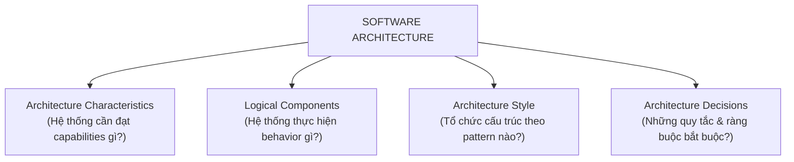
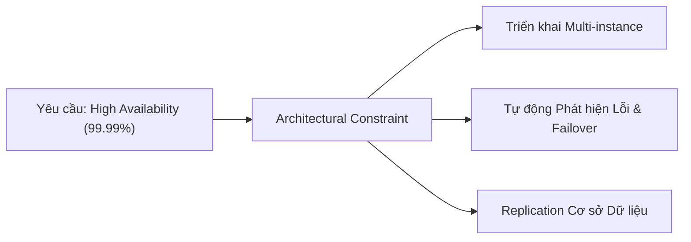
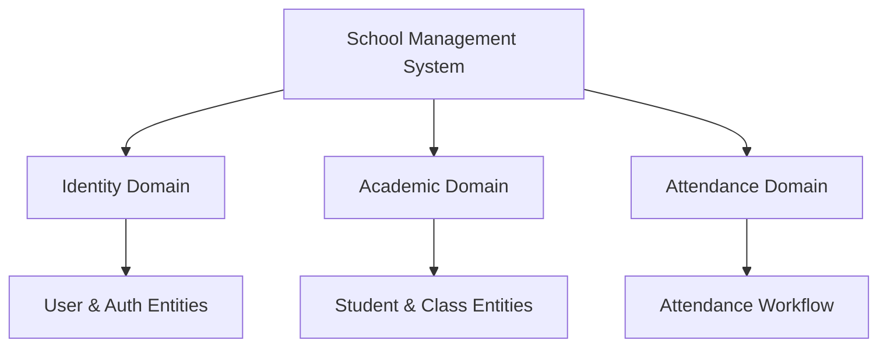
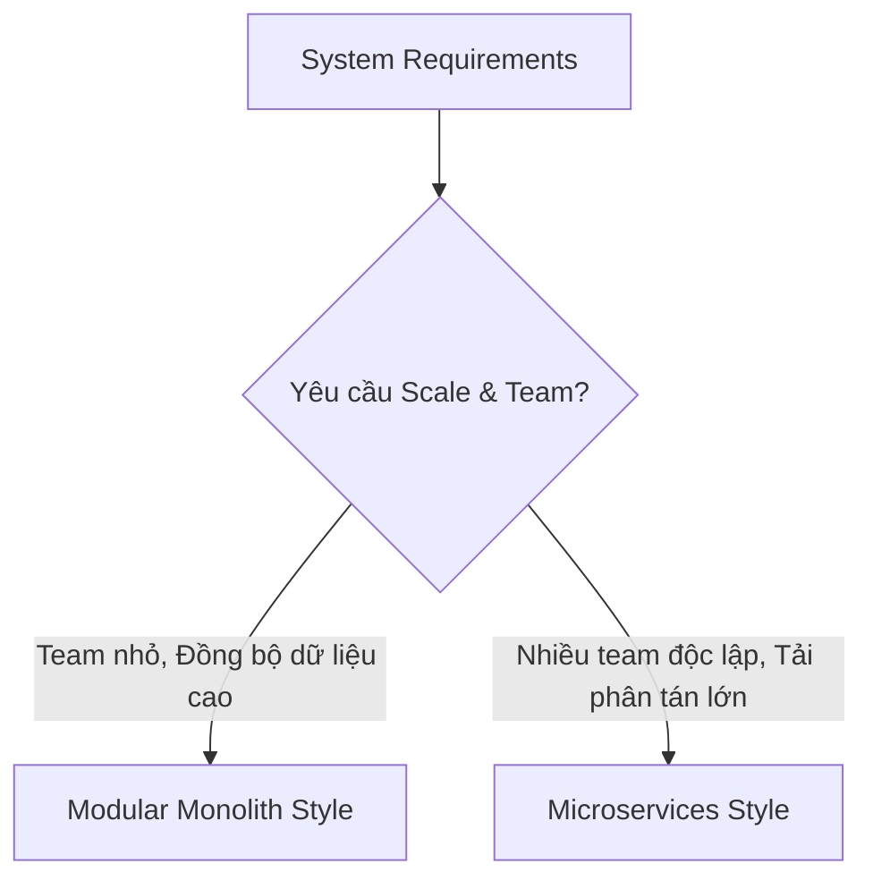

# Bốn Chiều Của Kiến Trúc Phần Mềm (The Four Dimensions of Software Architecture)

## Table of Contents

- [Tổng quan về 4 Dimensions](#tổng-quan-về-4-dimensions)
- [Dimension 1: Architecture Characteristics](#dimension-1-architecture-characteristics)
- [Dimension 2: Logical Components](#dimension-2-logical-components)
- [Dimension 3: Architecture Style](#dimension-3-architecture-style)
- [Dimension 4: Architecture Decisions](#dimension-4-architecture-decisions)
- [Chuỗi Tương tác và Vòng lặp Suy luận Kiến trúc](#chuỗi-tương-tác-và-vòng-lặp-suy-luận-kiến-trúc)
- [Mô hình Tư duy Cốt lõi](#mô-hình-tư-duy-cốt-lõi)

---

## Tổng quan về 4 Dimensions

Kiến trúc phần mềm không đơn thuần là một sơ đồ hộp-và-đường-nối (boxes and lines diagram). Đó là sự kết hợp có chủ đích giữa 4 chiều chính: **Architecture Characteristics**, **Logical Components**, **Architecture Style**, và **Architecture Decisions**.

Bốn dimensions này trả lời các nhóm câu hỏi cốt lõi để định hình cấu trúc và hành vi hệ thống:

Bảng tổng hợp vai trò của 4 Dimensions:

| Dimension | Đối tượng Trọng tâm | Câu hỏi Cốt lõi | Sản phẩm Đầu ra |
| :--- | :--- | :--- | :--- |
| **Architecture Characteristics** | Quality Attributes (-ilities) | Hệ thống cần hỗ trợ những năng lực gì để thành công? | Success criteria (Availability, Latency, Scalability) |
| **Logical Components** | Business Responsibilities | Hành vi nghiệp vụ được phân chia thành những mô-đun nào? | Domain models, Services, Workflows |
| **Architecture Style** | Structural Pattern | Nên sắp xếp hình thái cấu trúc tổng thể như thế nào? | Monolith, Microservices, Event-Driven |
| **Architecture Decisions** | Governance & Constraints | Những quy tắc nào bắt buộc lập trình viên phải tuân thủ? | Architectural Rules, ADRs, Dependency constraints |

---

## Dimension 1: Architecture Characteristics

Architecture characteristics (thường gọi là các **"-ilities"**) mô tả những năng lực phi chức năng mà kiến trúc bắt buộc phải hỗ trợ. Các đặc tính này đóng vai trò là tiêu chí đánh giá thành công (success criteria) của hệ thống.

Một số characteristics phổ biến bao gồm: `Availability`, `Reliability`, `Scalability`, `Performance`, `Security`, `Maintainability`, `Testability`, `Deployability`, `Observability`.

> [!NOTE]
> Architecture characteristics chỉ xác định **năng lực cần đạt được**, không quyết định trực tiếp công nghệ cụ thể. Việc thực thi năng lực đó là trách nhiệm của các decisions và phong cách kiến trúc.

---

## Dimension 2: Logical Components

Nếu characteristics định nghĩa **capabilities**, thì logical components định nghĩa **behavior** của ứng dụng. Đây là cách kiến trúc sư phân chia các trách nhiệm nghiệp vụ thành các khối logic.

Logical components bao gồm: Domains, Entities, Services, Workflows, và Business Capabilities.

Cần phân biệt rõ ràng giữa **Logical Component** và **Deployment Component**:

- **Logical Component**: Đại diện cho sự phân chia trách nhiệm nghiệp vụ và thiết kế miền (*Domain Boundaries*). Đây là câu trả lời cho câu hỏi *"Hệ thống làm gì?"* và hoàn toàn độc lập với hạ tầng vật lý.
- **Deployment Component**: Đại diện cho đơn vị đóng gói và phân phối vật lý khi triển khai thực tế (*Packaging & Runtime Unit*). Đây là câu trả lời cho câu hỏi *"Hệ thống được vận hành như thế nào?"*.

Bảng đối chiếu giữa Logical Component và các hình thái Deployment Component:

| Khía cạnh | Logical Component | Deployment Option A: Monolith | Deployment Option B: Microservices |
| :--- | :--- | :--- | :--- |
| **Bản chất** | Khối logic nghiệp vụ (`Identity`, `Academic`) | Toàn bộ logic đóng gói chung vào một artifact duy nhất | Mỗi miền logic được tách thành một artifact và process riêng |
| **Đơn vị Thực thi** | Packages, Namespaces, Modules trong codebase | Một tiến trình duy nhất (ví dụ: file JAR/Docker container chạy chung memory) | Nhiều tiến trình độc lập phân tán qua network (mỗi dịch vụ một container/VM) |
| **Giao tiếp Nội bộ** | In-memory function call, method invocation | Giao tiếp cục bộ qua RAM, tốc độ cao, zero network overhead | Gọi qua giao thức mạng (HTTP/REST, gRPC, Message Broker) |
| **Ranh giới Dữ liệu** | Logical schema hoặc Domain Models | Chung một cơ sở dữ liệu vật lý (Single Shared DB) | Cơ sở dữ liệu phân tán riêng biệt cho từng service (Database-per-service) |
| **Tính Độc lập** | Độc lập về mặt khái niệm và thiết kế | Cùng scale, cùng deploy và cùng fail nếu process sập | Scale độc lập, deploy độc lập và cô lập lỗi giữa các miền |

> [!IMPORTANT]
> Cùng một mô hình phân rã logic có thể được hiện thực hóa bằng nhiều hình thái triển khai hạ tầng khác nhau. Điều này giúp tách biệt giữa **Hệ thống làm gì** và **Hệ thống được triển khai như thế nào**.

---

## Dimension 3: Architecture Style

Sau khi đã làm rõ đặc tính cần đạt và phân rã các khối logic, kiến trúc sư chọn **Architecture Style** làm điểm xuất phát cho cấu trúc hệ thống.

Một số phong cách kiến trúc phổ biến: `Layered`, `Modular Monolith`, `Microservices`, `Event-Driven`, `Hexagonal (Ports & Adapters)`, `Service-Based`.

> [!TIP]
> Architecture style không nên được lựa chọn dựa trên sở thích cá nhân hay xu hướng công nghệ. Nó phải là kết quả của việc tìm ra con đường thực thi phù hợp nhất với các characteristics và cấu trúc logic đã xác định.

---

## Dimension 4: Architecture Decisions

Architecture style mới chỉ cung cấp hình thái cấu trúc ban đầu.

**Architecture decisions** định nghĩa các quy tắc (*rules*) và ràng buộc (*constraints*) bắt buộc đội ngũ phát triển phải tuân theo nhằm bảo toàn tính toàn vẹn của hệ thống.

Một quyết định kiến trúc tiêu biểu thường nhằm ngăn chặn hiện tượng xói mòn cấu trúc (*architectural erosion*). 

Chẳng hạn trong mô hình **Layered Architecture**, luồng giao tiếp tiêu chuẩn bắt buộc phải đi tuần tự: `Presentation Layer` $\rightarrow$ `Application Service Layer` $\rightarrow$ `Business/Domain Layer` $\rightarrow$ `Database Layer`.

Tại đây, một quy tắc bất biến (*architectural constraint*) được xác lập: **Presentation Layer bị cấm hoàn toàn việc gọi trực tiếp xuống Database Layer**. 

Mọi truy vấn bắt buộc phải đi qua các lớp trung gian để đảm bảo validation, kiểm soát transaction và thực thi trọn vẹn business logic.

Chuỗi chuyển hóa từ ý định kiến trúc sang cấu trúc thực tế của hệ thống diễn ra qua các giai đoạn sau:

| Giai đoạn chuyển hóa | Bản chất & Vai trò | Ví dụ thực tế |
| :--- | :--- | :--- |
| **Architectural Intent** | Định hướng chất lượng hoặc mục tiêu cần bảo vệ | Ngăn chặn rò rỉ logic nghiệp vụ và tối ưu hóa quản lý kết nối cơ sở dữ liệu. |
| **Architecture Decision** | Lựa chọn giải pháp kỹ thuật cụ thể dưới dạng quy tắc | Ban hành quyết định đóng gói truy cập dữ liệu (Data Access Encapsulation). |
| **Constraint Rule** | Ràng buộc kỹ thuật có thể đo lường và kiểm soát | Báo lỗi biên dịch hoặc CI check thất bại nếu Controller import trực tiếp Repository/DAO. |
| **Developer Behavior** | Định hình thói quen và cách viết code của đội ngũ | Lập trình viên viết service interface và inject qua Dependency Injection thay vì truy vấn trực tiếp. |
| **System Structure** | Cấu trúc hệ thống thực tế được hình thành nhất quán | Mã nguồn duy trì tính tách biệt lớp (*Layered Isolation*), dễ kiểm thử đơn vị và dễ tái cấu trúc. |

---

## Chuỗi Tương tác và Vòng lặp Suy luận Kiến trúc

Bốn chiều của kiến trúc phần mềm không vận hành như những khối độc lập mà kết nối chặt chẽ theo một quy trình suy luận liên tục có tính phản hồi và vòng lặp (*iterative refinement*).

Bảng ánh xạ luồng tương tác và tác động phản hồi giữa các Dimension:

| Bước Thực Hiện | Chiều Kiến Trúc Tương Ứng | Mục Tiêu & Trọng Tâm | Tác Động Đầu Ra Đến Chiều Tiếp Theo | Điểm Đánh Đổi / Vòng Lặp Phản Hồi |
| :--- | :--- | :--- | :--- | :--- |
| **Bước 1** | **Architecture Characteristics** | Xác định các chỉ số chất lượng và năng lực phi chức năng cốt lõi | Thiết lập tiêu chuẩn kỹ thuật và tiêu chí đánh giá thành công | Chi phí hạ tầng và độ phức tạp vận hành tăng theo chỉ số cam kết. |
| **Bước 2** | **Logical Components** | Phân rã bài toán nghiệp vụ thành các miền logic và workflow | Xác định ranh giới module và trách nhiệm làm nền tảng tổ chức | Ranh giới thiết kế sai dẫn đến coupling chéo giữa các miền dữ liệu. |
| **Bước 3** | **Architecture Style** | Lựa chọn hình thái cấu trúc tổng thể phù hợp với đặc tính hệ thống | Thiết lập khung cấu trúc và mô hình kết nối vật lý | Thay đổi phong cách cấu trúc làm thay đổi bản chất bài toán nhất quán dữ liệu. |
| **Bước 4** | **Architecture Decisions** | Ban hành các quy tắc và ràng buộc kỹ thuật bắt buộc tuân thủ | Thiết lập rào chắn định hướng hành vi lập trình của đội ngũ | Ràng buộc quá mức có thể làm suy giảm tốc độ phát triển mã nguồn. |
| **Bước 5** | **Trade-off Evaluation** | Đánh giá toàn diện các đánh đổi phát sinh trong thiết kế tổng thể | Phê duyệt kiến trúc hoàn chỉnh hoặc kích hoạt điều chỉnh | Kích hoạt lại vòng lặp từ Bước 1 hoặc Bước 3 nếu phát sinh trade-off vượt ngưỡng chấp nhận. |

---

## Mô hình Tư duy Cốt lõi

Có thể cô đọng toàn bộ 4 Dimensions bằng 4 câu hỏi định hướng:

1. **WHAT MUST IT SUPPORT?** → Architecture Characteristics
2. **WHAT DOES IT DO?** → Logical Components
3. **HOW IS IT STRUCTURED?** → Architecture Style
4. **WHAT RULES APPLY?** → Architecture Decisions

> [!IMPORTANT]
> **Software Architecture = Capabilities + Behavior + Structural Style + Governance Decisions.** Một thiết kế kiến trúc hoàn chỉnh bắt buộc phải bao quát đầy đủ 4 chiều này.

---
[← Back to README](README.md)
