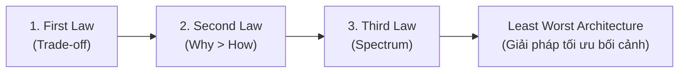
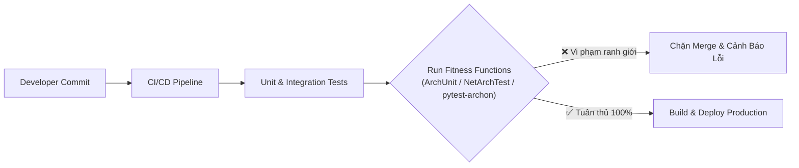
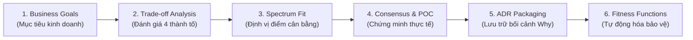

# Quy Luật Kiến Trúc & Kỳ Vọng Năng Lực

## Table of Contents

- [Ba Quy Luật Kiến Trúc Bất Biến](#ba-quy-luật-kiến-trúc-bất-biến)
- [Quang Phổ Quyết Định Kiến Trúc](#quang-phổ-quyết-định-kiến-trúc)
- [Tám Kỳ Vọng Năng Lực Cốt Lõi](#tám-kỳ-vọng-năng-lực-cốt-lõi)
- [Kiểm Soát Xói Mòn Bằng Fitness Functions](#kiểm-soát-xói-mòn-bằng-fitness-functions)
- [Quy Trình Ra Quyết Định Thực Chiến](#quy-trình-ra-quyết-định-thực-chiến)

---

## Ba Quy Luật Kiến Trúc Bất Biến

Theo ấn phẩm kinh điển *Fundamentals of Software Architecture* của Mark Richards và Neal Ford, mọi quyết định thiết kế hệ thống đều chịu sự chi phối của 3 quy luật nền tảng:

### 1. First Law: **"Everything in software architecture is a trade-off."**

Không tồn tại "viên đạn bạc" (**silver bullet**) hay thiết kế hoàn mỹ tuyệt đối trong kỹ nghệ phần mềm. Bất kỳ quyết định nào mang lại lợi ích ở một khía cạnh đều kéo theo chi phí, ràng buộc hoặc suy giảm ở các thuộc tính chất lượng khác:

- **Microservices:** Đem lại khả năng mở rộng và triển khai độc lập, nhưng đánh đổi bằng độ trễ mạng (`latency`), chi phí hạ tầng và độ phức tạp quản trị dữ liệu phân tán.
- **Tái sử dụng mã nguồn:** Tiết kiệm công sức lập trình ban đầu nhưng dễ tạo ra **Coupling** nguy hiểm. Việc chia sẻ code an toàn cho hạ tầng kỹ thuật ổn định (logging, metrics), nhưng là rủi ro nghiêm trọng nếu áp dụng cho domain logic biến động cao.

> [!IMPORTANT]
> Mục tiêu tối thượng của kiến trúc sư không phải là tìm kiếm giải pháp hoàn hảo lý thuyết, mà là lựa chọn phương án **least worst architecture**—giải pháp tương thích tối ưu nhất với các ràng buộc thực tế.

### 2. Second Law: **"Why is more important than how."**

Chi tiết kỹ thuật triển khai (**How**) thay đổi và lỗi thời rất nhanh theo sự phát triển của công nghệ. Ngược lại, lý do và bối cảnh kỹ thuật (**Why**) định hình ý định thiết kế mới là tài sản cốt lõi cần được bảo tồn dài hạn:

- **Thiếu Why:** Ghi nhận *"Hệ thống dùng Apache Kafka"* chỉ mô tả công cụ; khi Kafka cần được thay thế, đội ngũ kế thừa không rõ tiêu chuẩn bắt buộc cần đáp ứng.
- **Giữ vững Why:** Ghi nhận *"Dùng message queue bất đồng bộ để phân tách tải, đảm bảo p99 latency của API thanh toán dưới 200ms khi lưu lượng tăng đột biến"* giúp đội ngũ tự tin chuyển sang `RabbitMQ`, `NATS` hoặc `Cloud Pub/Sub` mà không làm sai lệch ý định ban đầu.

Công cụ chuẩn mực để lưu trữ **Why** là **ADR (Architecture Decision Record)**, ghi lại: Bối cảnh, Quyết định, Các phương án thay thế bị loại trừ và hệ quả đánh đổi chấp nhận.

### 3. Third Law: **"Most architecture decisions exist on a spectrum between extremes."**

Các quyết định kiến trúc thực tế hiếm khi là những lựa chọn nhị phân tuyệt đối (0 hoặc 1, đen hoặc trắng), mà luôn phân bổ trên một dải quang phổ liên tục giữa hai cực đối lập.

---

## Quang Phổ Quyết Định Kiến Trúc

Nhiệm vụ của người kiến trúc sư là định vị chính xác điểm cân bằng thực tế trên dải quang phổ dựa trên quy mô lưu lượng, năng lực đội ngũ và giới hạn ngân sách:

| Dải Phổ Kiến Trúc | Cực A (Phi tập trung / Độc lập) | Điểm Cân Bằng Trung Gian | Cực B (Tập trung / Gắn kết) |
| :--- | :--- | :--- | :--- |
| **Decoupling** | **Service level:** Độc lập tiến trình qua mạng (`gRPC`, `HTTP/REST`) | **Deployment level:** Đóng gói thư viện chia sẻ hoặc shared packages | **Source level:** Module hóa trong cùng bộ nhớ monolith, gọi hàm nội bộ |
| **Distributed Workflow** | **Choreography:** Phân tán hoàn toàn theo Domain Events, khớp nối lỏng | **Hybrid Mediation:** Kết hợp Domain Events và Orchestrator cục bộ | **Orchestration:** Quản lý tập trung qua Workflow Engine chuyên dụng |
| **Governance** | **Kiểm soát vi mô:** Áp đặt cứng nhắc từng cú pháp, tước quyền tự chủ | **Cân bằng & Trao quyền:** Thiết lập rào chắn kiến trúc, trao quyền triển khai | **Tháp ngà lý thuyết:** Đưa khuyến nghị chung chung, buông lỏng kiểm soát |

---

## Tám Kỳ Vọng Năng Lực Cốt Lõi

Vai trò kiến trúc sư không được đo lường bằng chức danh, mà qua năng lực đáp ứng **8 kỳ vọng cốt lõi** được chuẩn hóa từ *Fundamentals of Software Architecture*:

| Nhóm Năng Lực | Kỳ Vọng Trọng Tâm | Nguyên Tắc & Hành Động Cốt Lõi |
| :--- | :--- | :--- |
| **Ra Quyết Định & Phân Tích** | **1. Make Architecture Decisions** | Ưu tiên **Guide thay vì Specify**: Thiết lập nguyên tắc định hướng bao quát, chỉ áp đặt công nghệ bắt buộc khi liên quan trực tiếp đến thuộc tính sống còn (`scalability`, `security`). |
| | **2. Continually Analyze Architecture** | Đánh giá liên tục sức sống hệ thống (**Architecture Vitality**) và ngăn chặn hiện tượng suy thoái cấu trúc xuyên suốt toàn bộ delivery pipeline. |
| **Tri Thức & Xu Hướng** | **3. Keep Current with Trends** | Duy trì quy tắc 20 phút mỗi ngày để cập nhật công nghệ và chủ động vận hành **Personal Tech Radar** (Adopt, Trial, Assess, Hold). |
| | **4. Understand Diverse Technologies** | Ưu tiên **Technical Breadth hơn Technical Depth**: Nắm vững trade-off và bối cảnh ứng dụng của nhiều giải pháp thay vì đào sâu duy nhất một công nghệ sở trường. |
| **Nghiệp Vụ & Lãnh Đạo** | **5. Know the Business Domain** | Nói chung ngôn ngữ với stakeholder; chuyển dịch mục tiêu kinh doanh (**Time to Market**) thành các thuộc tính kỹ thuật tương ứng: deployability, maintainability, testability. |
| | **6. Possess Interpersonal Skills** | Thực hành **Elastic Leadership**; xóa bỏ tư duy tháp ngà (**Armchair Architect**) và kiểm soát vi mô độc đoán (**Control-Freak Architect**). |
| **Quản Trị & Thực Thi** | **7. Ensure Compliance** | Ngăn ngừa độ lệch giữa thiết kế ban đầu (**As-designed**) và thực tế triển khai (**As-built**) bằng cơ chế kiểm thử tự động hóa. |
| | **8. Navigate Organizational Politics** | Vận dụng nguyên lý **"Demonstration Defeats Discussion"**: Dùng Proof-of-Concept (POC) và số liệu định lượng thay cho tranh luận cảm tính; áp dụng nguyên tắc 4C (*Communication, Collaboration, Clear, Concise*). |

---

## Kiểm Soát Xói Mòn Bằng Fitness Functions

Đưa ra quyết định kiến trúc mới chỉ là một nửa chặng đường; nửa chặng đường còn lại là đảm bảo đội ngũ tuân thủ. Nếu thiếu cơ chế bảo vệ, áp lực tiến độ sẽ dẫn đến vi phạm ranh giới (ví dụ: Presentation gọi trực tiếp Database), biến hệ thống thành một khối hỗn độn (**Big Ball of Mud**).

Giải pháp hiện đại là chuyển hóa các quy tắc kiến trúc thành các bài kiểm thử tự động **Fitness Functions** chạy ngay trong đường ống CI/CD:

Các công cụ như `ArchUnit` (Java), `NetArchTest` (.NET) hoặc `pytest-archon` (Python) đóng vai trò là rào chắn tự động, loại bỏ việc phụ thuộc vào hoạt động review thủ công dễ bỏ sót.

---

## Quy Trình Ra Quyết Định Thực Chiến

Tư duy kiến trúc được hiện thực hóa qua chu trình khép kín 6 bước:

1. **Business Goals:** Chuyển hóa yêu cầu nghiệp vụ thành thuộc tính chất lượng định lượng (ví dụ: SLA khả dụng 99.95%, thời gian phản hồi API < 150ms).
2. **Trade-off Analysis:** Phân tích toàn diện 4 khía cạnh: Lợi ích, Chi phí, Ràng buộc và Rủi ro.
3. **Spectrum Fit:** Tránh định kiến nhị phân; lựa chọn điểm cân bằng kỹ thuật phù hợp nhất với hạ tầng và năng lực đội ngũ.
4. **Consensus & POC:** Xây dựng Proof-of-Concept nhỏ để chứng minh tính khả thi, thuyết phục các bên liên quan dựa trên số liệu đo lường thực tế.
5. **ADR Packaging:** Ban hành tài liệu Architecture Decision Record đầy đủ lý do cốt lõi (**Why**) và các phương án đã bị loại bỏ.
6. **Fitness Functions:** Viết bài kiểm thử kiến trúc tự động hóa tích hợp vào CI/CD để vĩnh viễn bảo vệ quyết định khỏi hiện tượng xói mòn cấu trúc (**Architectural Drift**).

---

[← Back to README](README.md)
