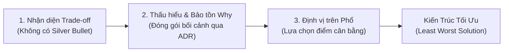

# Các Quy Luật Trong Kiến Trúc Phần Mềm (Laws of Software Architecture)

## Table of Contents

- [Tổng quan về Ba Quy Luật](#tổng-quan-về-ba-quy-luật)
- [1. Mọi Thứ Đều Là Trade-off](#1-mọi-thứ-đều-là-trade-off)
- [Trade-off Ẩn Giấu](#trade-off-ẩn-giấu)
- [Trade-off Phải Được Đánh Giá Liên Tục](#trade-off-phải-được-đánh-giá-liên-tục)
- [Không Có Lựa Chọn Mặc Định Tuyệt Đối](#không-có-lựa-chọn-mặc-định-tuyệt-đối)
- [2. Tại Sao Quan Trọng Hơn Như Thế Nào](#2-tại-sao-quan-trọng-hơn-như-thế-nào)
- [Bảo Tồn Lý Do Ra Quyết Định (Preserving the Why)](#bảo-tồn-lý-do-ra-quyết-định-preserving-the-why)
- [3. Quyết Định Kiến Trúc Tồn Tại Trên Một Phổ](#3-quyết-định-kiến-trúc-tồn-tại-trên-một-phổ)
- [Một Số Phổ Kiến Trúc Phổ Biến](#một-số-phổ-kiến-trúc-phổ-biến)
- [Quy Trình Ra Quyết Định Kiến Trúc](#quy-trình-ra-quyết-định-kiến-trúc)
- [Kết Luận](#kết-luận)

---

## Tổng quan về Ba Quy Luật

Theo tài liệu kinh điển *Fundamentals of Software Architecture*, có 3 quy luật nền tảng giúp kiến trúc sư đánh giá hệ thống và ra quyết định chính xác:

1. **First Law:** **"Everything in software architecture is a trade-off."** (*Mọi thứ trong kiến trúc phần mềm đều là một sự đánh đổi*).
2. **Second Law:** **"Why is more important than how."** (*Tại sao lại quan trọng hơn như thế nào*).
3. **Third Law:** **"Most architecture decisions exist on a spectrum between extremes."** (*Hầu hết các quyết định kiến trúc tồn tại trên một phổ trung gian giữa các cực*).

---

## 1. Mọi Thứ Đều Là Trade-off

Không tồn tại giải pháp hoàn hảo tuyệt đối hay "viên đạn bạc" (**silver bullet**) trong kiến trúc phần mềm. Mọi quyết định đưa ra đều mang lại lợi ích nhất định, nhưng đồng thời tạo ra chi phí, ràng buộc hoặc rủi ro đối với các thuộc tính chất lượng khác.

Một quyết định kiến trúc cần được phân tích toàn diện qua 4 thành tố:

**Benefits → Costs → Constraints → Risks & Consequences**

Ví dụ thực tế về sự đánh đổi trong thiết kế:
- **Microservices:** Tăng khả năng mở rộng độc lập và cô lập lỗi, nhưng phải đánh đổi bằng độ phức tạp vận hành tăng cao, độ trễ mạng và thách thức quản lý dữ liệu phân tán.
- **Point-to-Point Queue:** Tăng khả năng kiểm soát đích đến và bảo mật luồng thông tin thầu, nhưng kém linh hoạt khi cần mở rộng thêm các consumer mới.
- **Pub-Sub Topic:** Giảm khớp nối (**coupling**) và dễ dàng gắn thêm consumer phân tích, nhưng tiềm ẩn rủi ro lộ dữ liệu hoặc bị nghe lén (*wiretap*).

> [!IMPORTANT]
> Mục tiêu cốt lõi của kiến trúc sư không phải là tìm kiếm giải pháp hoàn mỹ trên lý thuyết, mà là lựa chọn phương án **"least worst"** phù hợp và tối ưu nhất với bối cảnh thực tế.

---

## Trade-off Ẩn Giấu

> [!WARNING]
> Nếu một giải pháp có vẻ chỉ mang lại toàn bộ lợi ích mà không có khuyết điểm, khả năng cao là các trade-off và chi phí tiềm ẩn của nó chưa được nhận diện đầy đủ.

Trường hợp điển hình là **Tái sử dụng mã nguồn (Code Reuse)**:
- Tái sử dụng code giúp tiết kiệm thời gian phát triển và tránh trùng lặp logic, nhưng cái giá phải trả là tạo ra **khớp nối (coupling)**.
- Việc chia sẻ mã nguồn phù hợp và an toàn với các thành phần hạ tầng kỹ thuật ổn định (logging, utilities, framework), nhưng tiềm ẩn rủi ro cao nếu áp dụng cho **domain logic** có độ biến động lớn (*highly volatile*).

---

## Trade-off Phải Được Đánh Giá Liên Tục

> [!NOTE]
> Phân tích trade-off không phải là hoạt động chỉ làm một lần trong giai đoạn thiết kế ban đầu, mà là một **quá trình liên tục** xuyên suốt vòng đời phát triển phần mềm.

Một kiến trúc tối ưu ở thời điểm hiện tại hoàn toàn có thể biến thành một phản mẫu (*antipattern*) khi:
- Quy mô hệ thống và lưu lượng tải tăng trưởng đột biến.
- Số lượng người dùng mở rộng.
- Đội ngũ kỹ sư phát triển thay đổi quy mô hoặc cơ cấu tổ chức.
- Công nghệ nền tảng và mục tiêu kinh doanh dịch chuyển.

---

## Không Có Lựa Chọn Mặc Định Tuyệt Đối

Tuyệt đối tránh áp đặt máy móc các quy tắc mặc định cho toàn bộ dự án, chẳng hạn như *"luôn dùng REST"* hay *"luôn dùng Choreography"*.

- **Kiến trúc phải thích ứng với bối cảnh (Context):** Mỗi bài toán nghiệp vụ đều có tập biến số và ràng buộc riêng biệt.
- **Sẵn sàng thích ứng:** Ưu tiên xây dựng kiến trúc có khả năng lặp (*iterative architecture*) và dễ thay đổi để chủ động ứng phó trước các yếu tố chưa biết (**unknown unknowns**) trong tương lai.

---

## 2. Tại Sao Quan Trọng Hơn Như Thế Nào

> [!IMPORTANT]
> **Second Law of Software Architecture:** **"Why is more important than how."**

- **How (Như thế nào):** Cho biết hệ thống vận hành ra sao ở mức mã nguồn và cấu hình công nghệ.
- **Why (Tại sao):** Giải thích bối cảnh, lý do và động lực kỹ thuật đằng sau quyết định đó.

Khi công nghệ thay đổi, nếu tài liệu chỉ ghi nhận *"Hệ thống sử dụng Apache Kafka"* (**How**), đội ngũ kế thừa sẽ gặp nhiều khó khăn khi cần đánh giá công nghệ thay thế tương đương.

Ngược lại, khi nắm rõ lý do:

> *"Sử dụng hàng đợi giao tiếp bất đồng bộ nhằm giảm tải trực tiếp cho cơ sở dữ liệu và đảm bảo thời gian phản hồi API ổn định dưới 200ms khi lưu lượng tăng đột biến."*

thì ngay cả khi thay thế công nghệ sang `RabbitMQ`, `Cloud Pub/Sub` hay `NATS`, ý định kiến trúc (**architectural intent**) ban đầu vẫn được bảo toàn nguyên vẹn.

---

## Bảo Tồn Lý Do Ra Quyết Định (Preserving the Why)

Công cụ chuẩn mực và hiệu quả nhất để lưu trữ lý do ra quyết định là **Tài liệu Quyết định Kiến trúc (ADRs - Architecture Decision Records)**.

ADRs ghi nhận tập trung:
- **Context (Bối cảnh):** Hoàn cảnh thực tế và các ràng buộc kỹ thuật tại thời điểm ra quyết định.
- **Decision (Quyết định):** Giải pháp kiến trúc được lựa chọn.
- **Alternatives (Các phương án thay thế):** Các lựa chọn khác đã được cân nhắc và lý do bị loại bỏ.
- **Consequences (Hệ quả & Trade-off):** Tác động tích cực cũng như hạn chế chấp nhận đánh đổi.

Nhờ có ADRs, các thế hệ kỹ sư tiếp nối dễ dàng thấu hiểu ý định thiết kế ban đầu và giảm thiểu nguy cơ xói mòn kiến trúc (**architectural drift**).

---

## 3. Quyết Định Kiến Trúc Tồn Tại Trên Một Phổ

> [!IMPORTANT]
> **Third Law of Software Architecture:** **"Most architecture decisions exist on a spectrum between extremes."**

Hầu hết các quyết định trong thế giới thực không phải là những lựa chọn nhị phân tuyệt đối giữa hai thái cực (đen hoặc trắng):
- **Monolith ↔ Microservices**
- **REST ↔ Messaging**
- **Choreography ↔ Orchestration**

Thay vào đó, luôn tồn tại nhiều phương án cân bằng trung gian phù hợp với từng giai đoạn phát triển.

Để định vị chính xác vị trí của một quyết định trên phổ thiết kế, cần phân tích 3 tiêu chí:
1. **Tính chất tác động:** Mang tính chiến lược (**Strategic**) hay chiến thuật (**Tactical**).
2. **Mức độ nỗ lực (Level of Effort):** Khối lượng công việc cần thiết để tái cấu trúc nếu đảo ngược quyết định.
3. **Mức độ ảnh hưởng của Trade-off:** Tác động sâu rộng đến các thuộc tính chất lượng (**quality attributes**) của toàn hệ thống.

---

## Một Số Phổ Kiến Trúc Phổ Biến

Trong thực tế thiết kế, các quyết định thường trải dài trên 3 dải phổ chính:

| Dải phổ Kiến trúc | Thái cực A (Phi tập trung / Tách biệt) | Điểm Cân bằng Trung gian | Thái cực B (Tập trung / Gắn kết) |
| :--- | :--- | :--- | :--- |
| **Decoupling (Phân rã liên kết)** | **Source level:** Module hóa trong cùng bộ nhớ, gọi hàm nội bộ | **Deployment level:** Đóng gói thư viện chia sẻ hoặc shared packages | **Service level:** Tách thành các tiến trình chạy độc lập qua mạng |
| **Distributed Workflow (Điều phối luồng)** | **Choreography:** Dựa trên sự kiện phân tán, khớp nối lỏng | **Hybrid Mediation:** Kết hợp Domain Events và bộ điều phối cục bộ | **Orchestration:** Quản lý tập trung qua Workflow Engine |
| **Governance (Quản trị đội ngũ)** | **Kiểm soát quá mức:** Ràng buộc cứng nhắc mọi chi tiết triển khai | **Cân bằng & Trao quyền:** Thiết lập ranh giới rõ ràng, giữ quyền tự chủ | **Thiếu định hướng:** Tháp ngà lý thuyết hoặc buông lỏng chuẩn mực |

> [!TIP]
> Điểm tối ưu kiến trúc không nằm ở việc cố gắng tiến về một thái cực cực đoan, mà nằm tại **vị trí cân bằng phù hợp nhất với bối cảnh và ràng buộc hiện tại**.

---

## Quy Trình Ra Quyết Định Kiến Trúc

Quy trình tư duy và đóng gói quyết định kiến trúc chuẩn mực được thực hiện qua 6 bước:

**Business Goals → Trade-off Criteria → Comparison Matrix → Collaboration → ADR → Fitness Functions**

1. **Dịch chuyển Mục tiêu Kinh doanh:** Chuyển hóa các yêu cầu kinh doanh thành đặc tính kỹ thuật cốt lõi.
2. **Xác định Tiêu chí Trade-off theo Context:** Thiết lập thang đánh giá dựa trên nguồn lực, đội ngũ và hạ tầng hiện hữu.
3. **Xây dựng Ma trận So sánh:** Đánh giá khách quan ưu/nhược điểm giữa các phương án khả thi.
4. **Hợp tác và Thuyết phục:** Trình bày lý do kỹ thuật thay vì áp đặt mệnh lệnh, thúc đẩy văn hóa đồng thuận kỹ thuật.
5. **Ghi nhận bằng ADR:** Lưu trữ bối cảnh, quyết định và các hệ quả vào tài liệu ADR chuẩn mực.
6. **Tự động hóa bằng Fitness Functions:** Tích hợp các bài kiểm thử kiến trúc (như `ArchUnit`, `NetArchTest`) vào CI/CD để tự động giám sát tuân thủ.

---

## Kết Luận

Một quyết định kiến trúc xuất sắc không bao giờ là một giải pháp hoàn hảo không tì vết trên lý thuyết. Trong thế giới kỹ thuật thực tế, đó luôn là quyết định mà mọi sự đánh đổi (**trade-off**) đã được nhận diện rõ ràng, phân tích thấu đáo và được toàn bộ đội ngũ chấp nhận một cách có chủ đích dựa trên bối cảnh và ràng buộc cụ thể của hệ thống.

Để làm chủ vai trò kiến trúc sư, ba quy luật nền tảng cần được chuyển hóa thành một khung tư duy hành động xuyên suốt:

Kiến trúc sư hiện đại không tìm kiếm sự bất biến, mà xây dựng một hệ thống có khả năng tiến hóa và thích ứng linh hoạt. Bằng cách thấu hiểu sâu sắc lý do đằng sau mỗi quyết định và luôn cân nhắc vị trí tối ưu trên dải quang phổ giải pháp, đội ngũ phát triển sẽ tự tin dẫn dắt hệ thống vượt qua mọi thách thức kỹ thuật và biến động kinh doanh trong tương lai.

---
[← Back to README](README.md)
