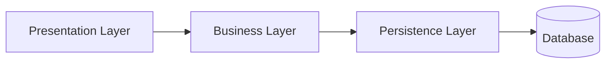
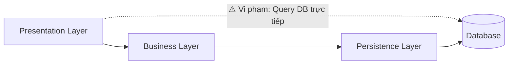
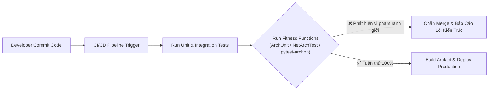
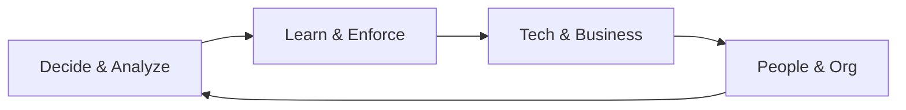

# 8 Kỳ Vọng Đối Với Một Kiến Trúc Sư Phần Mềm (Expectations of an Architect)

## Table of Contents

- [Tổng quan về Vai trò và Kỳ vọng](#tổng-quan-về-vai-trò-và-kỳ-vọng)
- [1. Make Architecture Decisions](#1-make-architecture-decisions)
- [2. Continually Analyze the Architecture](#2-continually-analyze-the-architecture)
- [3. Keep Current with Latest Trends](#3-keep-current-with-latest-trends)
- [4. Ensure Compliance with Decisions](#4-ensure-compliance-with-decisions)
- [5. Understand Diverse Technologies](#5-understand-diverse-technologies)
- [6. Know the Business Domain](#6-know-the-business-domain)
- [7. Possess Interpersonal Skills](#7-possess-interpersonal-skills)
- [8. Understand and Navigate Organizational Politics](#8-understand-and-navigate-organizational-politics)
- [Kết Luận](#kết-luận)

---

## Tổng quan về Vai trò và Kỳ vọng

Thay vì định nghĩa kiến trúc sư phần mềm bằng một chức danh công việc cố định, cách tiếp cận thực tế và hiệu quả hơn là nhìn vào **8 kỳ vọng năng lực cốt lõi** mà họ cần đáp ứng—từ việc định hình kỹ thuật, tối ưu quy trình đến lãnh đạo và điều phối trong tổ chức.

---

## 1. Make Architecture Decisions

Kiến trúc sư chịu trách nhiệm đưa ra các **quyết định và nguyên tắc kiến trúc** nhằm định hướng và dẫn dắt đội ngũ phát triển:

- **Guide thay vì Specify:** Ưu tiên thiết lập các nguyên tắc định hướng rộng (như *"mọi frontend phải sử dụng reactive framework"*) thay vì áp đặt cứng nhắc một công nghệ cụ thể, tạo không gian tự chủ kỹ thuật cho đội ngũ.
- **Chỉ định cụ thể khi cần thiết:** Chỉ can thiệp sâu và bắt buộc sử dụng một công nghệ nhất định khi điều đó mang tính sống còn để bảo vệ các thuộc tính chất lượng then chốt như `performance`, `scalability` hoặc `availability`.

---

## 2. Continually Analyze the Architecture

Kiến trúc phần mềm không phải là một bản thiết kế bất biến được phê duyệt một lần rồi lưu trữ. Kiến trúc sư cần liên tục đánh giá và phân tích:

- **Architecture Vitality:** Đo lường sức sống và mức độ tương thích của cấu trúc hiện tại trước sự tăng trưởng của dữ liệu và thay đổi của môi trường.
- **Structural Decay:** Ngăn chặn kịp thời hiện tượng suy thoái cấu trúc do các bản vá lỗi vội vã hoặc các vi phạm ranh giới module tích tụ.
- **Holistic View:** Đánh giá toàn diện toàn bộ vòng đời phân phối phần mềm—từ coding, automated testing đến release pipeline.

> [!NOTE]
> Một hệ thống không thực sự linh hoạt (**agile**) nếu mã nguồn có thể thay đổi trong vài giờ nhưng quy trình kiểm thử và phát hành lại mất hàng tuần hay hàng tháng.

---

## 3. Keep Current with Latest Trends

Để các quyết định kiến trúc mang lại giá trị bền vững và tránh nguy cơ đầu tư vào công nghệ thoái trào, kiến trúc sư cần liên tục cập nhật các xu hướng công nghệ mới.

Hai phương pháp thực hành hiệu quả:
- **Quy tắc 20 phút (20-Minute Rule):** Dành ít nhất 20 phút mỗi ngày để tìm hiểu một công nghệ, mô hình hoặc bài toán kiến trúc mới.
- **Personal Technology Radar:** Chủ động phân loại các công nghệ quan tâm vào 4 nhóm: **Adopt** (áp dụng), **Trial** (thử nghiệm), **Assess** (đánh giá), và **Hold** (tạm hoãn).

Mục tiêu không phải là trở thành chuyên gia trong mọi công nghệ, mà là mở rộng nhận thức về các lựa chọn giải pháp và trade-off tương ứng.

---

## 4. Ensure Compliance with Decisions

Đưa ra quyết định và quy tắc kiến trúc mới chỉ là một nửa chặng đường; nửa chặng đường quan trọng còn lại là đảm bảo đội ngũ phát triển thực sự tuân thủ các quyết định đó.

### Nguy Cơ Xói Mòn Ranh Giới Kiến Trúc

Khi các ranh giới kiến trúc và hướng phụ thuộc bị phá vỡ âm thầm do áp lực tiến độ, kiến trúc thực tế triển khai (*As-built*) sẽ nhanh chóng sai lệch so với thiết kế ban đầu (*As-designed*), dần biến hệ thống thành một khối hỗn loạn (**Big Ball of Mud**):

#### 1. Kiến Trúc Thiết Kế Chuẩn (As-Designed)
Tuân thủ nghiêm ngặt ranh giới phân tầng: Presentation chỉ giao tiếp qua Business Layer.

#### 2. Xói Mòn Thực Tế Khi Thiếu Kiểm Soát (As-Built Drift)
Lập trình viên gọi trực tiếp vào Database để tối ưu tiến độ, phá vỡ tính đóng gói và ranh giới bảo trì.

### Quản Trị Tuân Thủ Bằng Automated Fitness Functions

Giải pháp hiệu quả nhất để ngăn chặn tình trạng trên là biến các quy tắc kiến trúc thành các bài kiểm thử tự động (**Fitness Functions**) và tích hợp trực tiếp vào đường ống CI/CD:

Sử dụng các thư viện như `ArchUnit` (Java), `NetArchTest` (.NET), hoặc `pytest-archon` (Python) giúp kiến trúc sư thiết lập các rào chắn tự động (*automated guardrails*), bảo vệ toàn vẹn cấu trúc hệ thống một cách liên tục mà không phụ thuộc vào hoạt động review thủ công.

---

## 5. Understand Diverse Technologies

Sự chuyển dịch quan trọng nhất từ một kỹ sư phần mềm cấp cao sang vai trò kiến trúc sư là sự ưu tiên về **Technical Breadth (Bề rộng kiến thức) hơn Technical Depth (Độ sâu chuyên môn)**.

Kiến trúc sư không nhất thiết phải nắm từng dòng lệnh hay cú pháp chi tiết của mọi framework, nhưng cần hiểu đủ rộng để phân tích:
- **Ưu điểm và Nhược điểm** của từng phương án kỹ thuật.
- **Trade-off cốt lõi** giữa các giải pháp cạnh tranh.
- **Bối cảnh phù hợp (Context)** để ứng dụng thành công từng công nghệ.

---

## 6. Know the Business Domain

Một kiến trúc phần mềm hoàn hảo về mặt kỹ thuật sẽ trở nên vô nghĩa nếu không giải quyết hiệu quả bài toán nghiệp vụ.

Hiểu sâu sắc về domain giúp kiến trúc sư:
- Giao tiếp mạch lạc và nói chung ngôn ngữ với các bên liên quan (**stakeholders**) và ban lãnh đạo.
- Xây dựng uy tín và sự tin cậy trong các quyết định chiến lược.
- Chuyển dịch chính xác các **mục tiêu kinh doanh (Business Goals)** thành **thuộc tính kỹ thuật (Technical Characteristics)**.

> [!TIP]
> Ví dụ chuyển dịch: Mục tiêu kinh doanh **Time to Market** sẽ định hình các thuộc tính kiến trúc ưu tiên gồm **deployability, maintainability và testability**.

---

## 7. Possess Interpersonal Skills

Kiến trúc phần mềm cốt lõi là câu chuyện về con người và sự hợp tác. Kiến trúc sư cần phát triển năng lực lãnh đạo co giãn (**Elastic Leadership**), linh hoạt điều chỉnh mức độ can thiệp dựa trên:
- Mức độ gắn kết và quy mô của đội ngũ (**team size & familiarity**).
- Trình độ và kinh nghiệm thực chiến của kỹ sư.
- Độ phức tạp và thời hạn của dự án (**project complexity & duration**).

Ba phong cách thường gặp:
- **Control-Freak Architect:** Kiểm soát vi mô quá mức, tước bỏ quyền tự chủ của kỹ sư.
- **Armchair Architect:** Tháp ngà lý thuyết, xa rời thực tế dự án và mã nguồn.
- **Effective Architect:** Thiết lập ranh giới kiến trúc rõ ràng, hướng dẫn định hướng và trao quyền thực thi cho đội ngũ.

---

## 8. Understand and Navigate Organizational Politics

Các quyết định kiến trúc quan trọng luôn tác động đến nhiều phòng ban, phân bổ ngân sách và tiến độ dự án, do đó gần như luôn gặp phải sự phản biện hoặc thách thức chính trị trong tổ chức.

Bốn chiến thuật điều hướng và đàm phán hiệu quả:
1. **Demonstration Defeats Discussion:** Sử dụng Proof-of-Concept (POC) và số liệu đo lường định lượng thay cho các cuộc tranh luận cảm tính.
2. **Explain Why First:** Luôn trình bày bối cảnh và lý do kỹ thuật trước khi ban hành yêu cầu bắt buộc.
3. **Let Developers Discover:** Tạo điều kiện để đội ngũ kỹ sư tự trải nghiệm, đánh giá và chứng minh giải pháp thay thế.
4. **Áp dụng nguyên tắc 4C:** **Communication** (Giao tiếp), **Collaboration** (Hợp tác), **Clear** (Rõ ràng), và **Concise** (Súc tích).

---

## Kết Luận

Một kiến trúc sư phần mềm thành công cần duy trì sự cân bằng hài hòa giữa 8 trụ cột năng lực cốt lõi:

Nói ngắn gọn, kiến trúc sư không chỉ dừng lại ở vai trò người thiết kế cấu trúc hệ thống, mà còn là người **ra quyết định, quản trị trade-off, dẫn dắt con người và làm cầu nối chuyển dịch công nghệ phục vụ mục tiêu kinh doanh**.

---
[← Back to README](README.md)
