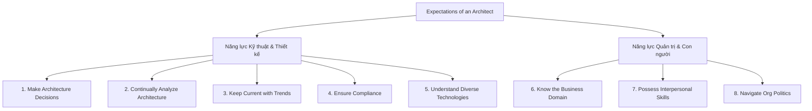
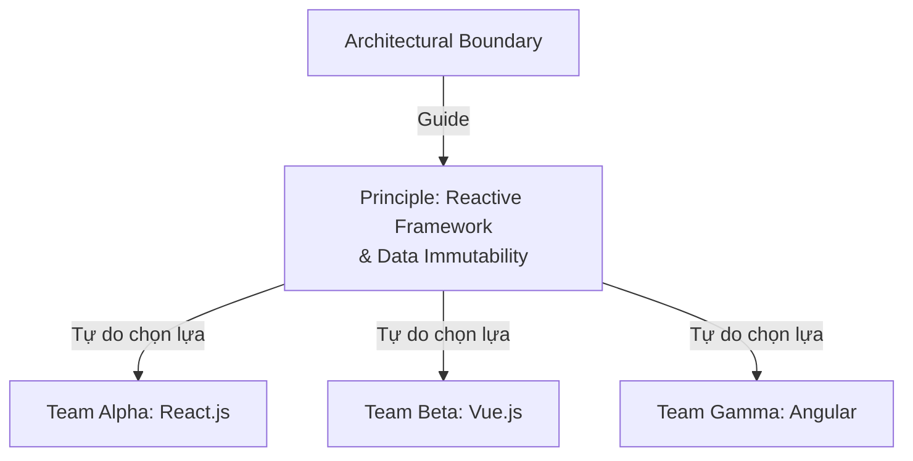
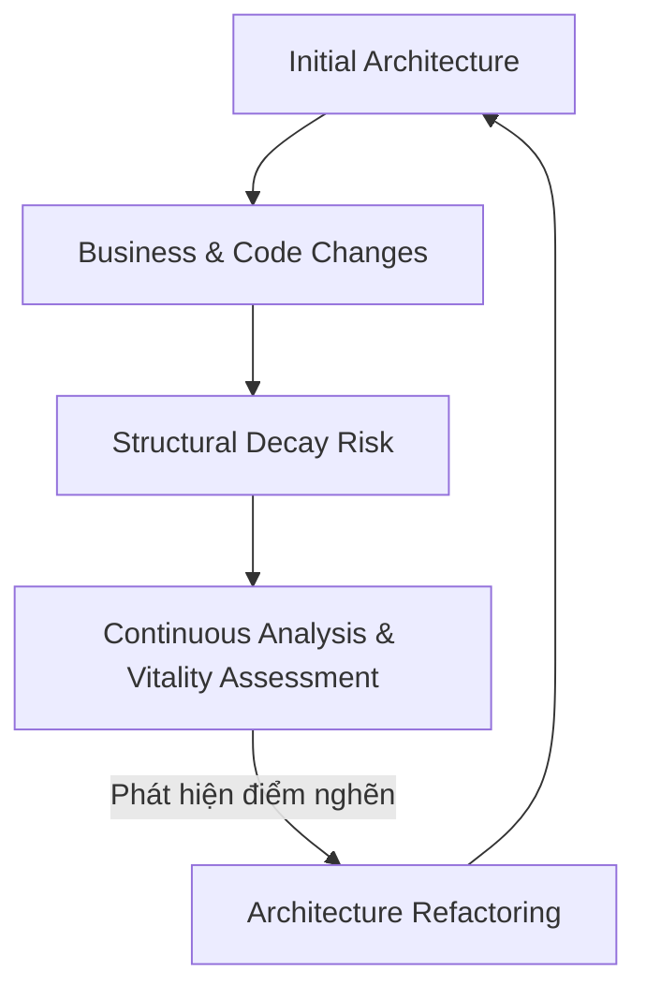
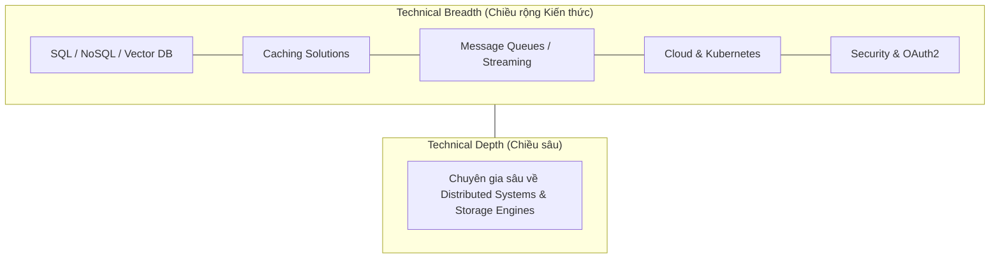
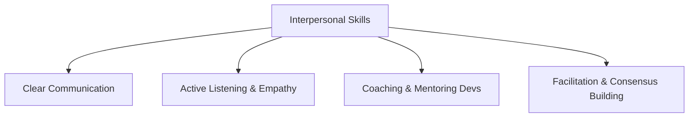
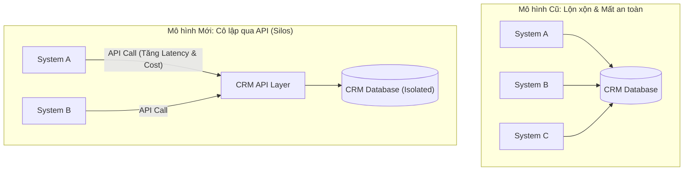

# 8 Kỳ Vọng Đối Với Một Kiến Trúc Sư Phần Mềm (Expectations of an Architect)

## Table of Contents

- [Tổng quan về Vai trò và Kỳ vọng](#tổng-quan-về-vai-trò-và-kỳ-vọng)
- [1. Make Architecture Decisions](#1-make-architecture-decisions)
- [2. Continually Analyze the Architecture](#2-continually-analyze-the-architecture)
- [3. Keep Current with Latest Trends](#3-keep-current-with-latest-trends)
- [4. Ensure Compliance with Decisions](#4-ensure-compliance-with-decisions)
- [5. Understand Diverse Technologies](#5-understand-diverse-technologies)
- [6. Know the Business Domain](#6-know-the-business-domain)
- [7. Possess Interpersonal Skills](#7-possess-interpersonal-skills)
- [8. Understand and Navigate Organizational Politics](#8-understand-and-navigate-organizational-politics)
- [Bảng Ma Trận Năng Lực Kiến Trúc Sư](#bảng-ma-trận-năng-lực-kiến-trúc-sư)

---

## Tổng quan về Vai trò và Kỳ vọng

Vai trò của một software architect có thể trải rộng từ một lập trình viên chuyên gia xuất sắc cho đến người định hình chiến lược công nghệ toàn diện cho doanh nghiệp. Do tính đa dạng này, việc định nghĩa một chức danh cố định cho kiến trúc sư thường không khả thi. Tuy nhiên, điều có thể xác định rõ ràng chính là những **kỳ vọng cốt lõi (core expectations)** đặt lên vai họ.

Dù giữ bất kỳ danh xưng công việc nào, một kiến trúc sư phần mềm luôn được kỳ vọng phải đáp ứng 8 trụ cột năng lực chính:

Trở thành một kiến trúc sư thành công đòi hỏi sự cân bằng tinh tế giữa technical breadth, tư duy nghiệp vụ và kỹ năng mềm xử lý xung đột trong tổ chức.

---

## 1. Make Architecture Decisions

Một kiến trúc sư được kỳ vọng xác định các decisions và design principles nhằm **guide (định hướng)** thay vì **specify (áp đặt chi tiết)** cho các lựa chọn công nghệ của team phát triển.

### Guide vs Specify

Từ khóa quan trọng nhất trong kỳ vọng này là **Guide**. Ví dụ: Việc quyết định sử dụng React.js cho dự án frontend là một technical decision. Thay vì đưa ra lựa chọn đóng khung đó, kiến trúc sư nên đưa ra nguyên tắc kiến trúc: *"Mọi ứng dụng web frontend phải sử dụng một reactive framework"*. Nguyên tắc này mở ra không gian cho team phát triển tự do đánh giá và lựa chọn giữa Angular, React, Vue hoặc Svelte dựa trên năng lực hiện có của team.

Tuy nhiên, trong một số trường hợp đặc biệt, kiến trúc sư bắt buộc phải chỉ định chính xác một công nghệ cụ thể nhằm bảo toàn một đặc tính kiến trúc sống còn (architectural characteristic) như scalability, performance, hoặc availability.

> [!IMPORTANT]
> **Quy tắc cốt lõi:** Hãy luôn tự hỏi: *"Quyết định này đang định hướng cho team đưa ra lựa chọn công nghệ đúng đắn, hay đang tước bỏ quyền lựa chọn kỹ thuật của họ?"*

---

## 2. Continually Analyze the Architecture

Kiến trúc phần mềm không phải là một bản vẽ cố định được phê duyệt một lần rồi cất vào ngăn kéo. Kiến trúc sư được kỳ vọng liên tục phân tích kiến trúc hiện tại, đánh giá môi trường công nghệ và đề xuất giải pháp cải tiến.

### Architecture Vitality & Structural Decay

Khái niệm **Architecture Vitality** (Sức sống kiến trúc) đo lường mức độ phù hợp của một kiến trúc được thiết kế từ 3-5 năm trước so với bối cảnh kinh doanh và công nghệ hiện tại. Khi các lập trình viên liên tục thay đổi mã nguồn dưới áp lực tiến độ mà thiếu đi sự giám sát kiến trúc, hệ thống sẽ rơi vào **Structural Decay** (suy hao cấu trúc).

Một khía cạnh thường bị các kiến trúc sư bỏ quên khi phân tích hệ thống là **môi trường Testing và Release**. Việc tối ưu hóa coding agility sẽ trở nên vô nghĩa nếu quy trình kiểm thử mất nhiều tuần và quy trình release mất nhiều tháng. Kiến trúc sư phải phân tích toàn diện toàn bộ software delivery pipeline.

> [!NOTE]
> Phân tích kiến trúc liên tục là cơ chế phòng ngự duy nhất giúp doanh nghiệp tránh khỏi việc phải đập đi xây lại toàn bộ hệ thống (legacy rewrite) sau mỗi vài năm.

---

## 3. Keep Current with Latest Trends

Để đưa ra các quyết định có giá trị trường tồn và không bị lỗi thời sau một thời gian ngắn, kiến trúc sư phải liên tục cập nhật các xu hướng công nghệ và công nghiệp mới nhất.

### Tầm nhìn Xu hướng và Tác động Lớn

Các quyết định kiến trúc thường mang tính dài hạn và rất tốn kém nếu phải thay đổi. Việc hiểu rõ xu hướng giúp kiến trúc sư đón đầu làn sóng mới thay vì đầu tư vào các công nghệ đang ở giai đoạn thoái trào.

Chẳng hạn, trong thập kỷ qua, các kiến trúc sư đã phải chuyển dịch tư duy từ On-premise sang Cloud-native và Serverless. Ở thời điểm hiện tại, sự bùng nổ của **Generative AI** và **Multi-region Distributed Systems** đang thay đổi hoàn toàn cách thiết kế lưu trữ, caching và xử lý luồng dữ liệu.

---

## 4. Ensure Compliance with Decisions

Đặt ra nguyên tắc và quyết định kiến trúc chỉ là một nửa chặng đường. Nửa chặng đường còn lại — và thường khó khăn hơn — là đảm bảo các team phát triển thực sự **tuân thủ (compliance)** các quy định đó.

### Rủi ro Vi phạm Ranh giới Kiến trúc

Hãy xét một ví dụ thực tế: Trong Layered Architecture, kiến trúc sư đưa ra quy định nghiêm ngặt: 

> *"Presentation Layer không được truy cập trực tiếp vào Database mà phải đi qua Business Layer và Service Layer"*. 

Quy định này nhằm đảm bảo khi schema database thay đổi, Presentation Layer không bị ảnh hưởng.

Tuy nhiên, một lập trình viên UI cần gấp tính năng và quyết định viết truy vấn SQL trực tiếp từ Presentation Layer để tối ưu thời gian. Nếu kiến trúc sư không có cơ chế giám sát tuân thủ, các vi phạm này sẽ lan rộng, làm phá vỡ tính đóng gói và phá hủy đặc tính Maintainability của hệ thống.

### Quản trị bằng Automated Fitness Functions

Phương pháp hiện đại nhất để đảm bảo tuân thủ không phải là đi đọc lại từng dòng code (code review thủ công), mà là xây dựng các **Automated Fitness Functions**. Sử dụng các thư viện như ArchUnit (Java), NetArchTest (.NET), hoặc pytest-archon (Python) giúp biến các quy định kiến trúc thành các unit test tự động thực thi trong CI/CD pipeline.

> [!WARNING]
> Nếu kiến trúc sư không kiểm soát sự tuân thủ, kiến trúc thực tế được triển khai (As-built Architecture) sẽ nhanh chóng sai lệch hoàn toàn so với kiến trúc được thiết kế trên giấy (As-designed Architecture).

---

## 5. Understand Diverse Technologies

Một kiến trúc sư không bắt buộc phải là chuyên gia thượng thừa trong từng ngôn ngữ hay framework, nhưng họ bắt buộc phải có sự am hiểu rộng lớn về nhiều nền tảng và môi trường khác nhau.

### Mô hình T-Shaped Architect: Technical Breadth vs Depth

Lập trình viên thường tập trung vào **Technical Depth** (chiều sâu kỹ thuật) — hiểu rất sâu về một ngôn ngữ hoặc một framework cụ thể. Ngược lại, kiến trúc sư phải dịch chuyển trọng tâm sang **Technical Breadth** (chiều rộng kỹ thuật) — biết sự tồn tại, ưu nhược điểm và ngữ cảnh áp dụng của hàng loạt công nghệ khác nhau.

Việc am hiểu 10 giải pháp Caching khác nhau (Redis, Memcached, Hazelcast, Dragonfly, v.v.) với ưu nhược điểm cụ thể sẽ giúp kiến trúc sư chọn đúng giải pháp cho bài toán hơn là việc chỉ biết duy nhất một công nghệ nhưng ở trình độ chuyên gia tuyệt đối.

---

## 6. Know the Business Domain

Những kiến trúc sư xuất sắc nhất không chỉ giỏi công nghệ mà còn là những người am hiểu sâu sắc **business domain** của bài toán họ đang giải quyết.

### Ngôn ngữ Chung với Stakeholders

Nếu một kiến trúc sư làm việc tại một ngân hàng lớn nhưng không hiểu các thuật ngữ tài chính cơ bản như *Aleatory contracts*, *Rates rally*, hay *Nonpriority debt*, họ sẽ không thể giao tiếp hiệu quả với các Giám đốc Nghiệp vụ và C-level.

Khả năng dịch chuyển linh hoạt giữa ngôn ngữ kỹ thuật và ngôn ngữ kinh doanh giúp kiến trúc sư xây dựng niềm tin mãnh liệt từ ban lãnh đạo, đảm bảo kiến trúc sinh ra để phục vụ chiến lược kinh doanh chứ không phải để thỏa mãn sự tò mò kỹ thuật.

> [!NOTE]
> **Định luật Conway (Conway's Law):**
> *"Organizations which design systems are constrained to produce designs which are copies of the communication structures of these organizations."*
> 
> **Giải thích:** Cấu trúc team và cách thức giao tiếp giữa các bộ phận trong doanh nghiệp sẽ quyết định trực tiếp đến kiến trúc phần mềm được tạo ra. Am hiểu nghiệp vụ và cấu trúc tổ chức là chìa khóa để kiến trúc sư tái cấu trúc luồng giao tiếp (Inverse Conway Maneuver), giúp hình thành kiến trúc phần mềm tối ưu.

---

## 7. Possess Interpersonal Skills

Kiến trúc phần mềm không chỉ là câu chuyện của các dòng code hay sơ đồ khối; nó là câu chuyện về **con người**. 

Như tác gia Gerald Weinberg từng khẳng định: 

>*"Dù họ có nói với bạn điều gì đi nữa, cuối cùng đó vẫn luôn là vấn đề con người"*.

### Technical Leadership & Mentoring

Một kiến trúc sư có tư tư duy kỹ thuật thiên tài nhưng thiếu kỹ năng giao tiếp và lãnh đạo sẽ không thể thuyết phục team đi theo tầm nhìn của mình. Lãnh đạo ở đây không xuất phát từ quyền lực chức danh (title authority) mà xuất phát từ sự ảnh hưởng, khả năng coaching, mentoring và truyền cảm hứng.

---

## 8. Understand and Navigate Organizational Politics

Chính trị doanh nghiệp (organizational politics) và kỹ năng đàm phán (negotiation skills) là những yếu tố quyết định sự sống còn đối với một kiến trúc sư. Hầu như mọi quyết định kiến trúc quan trọng đều sẽ bị thách thức bởi các bên liên quan.

### Bài học Thực chiến: Xung đột Chính trị trong Bài toán CRM Database Silos

Hãy phân tích một kịch bản thực tế điển hình về xung đột chính trị và đàm phán kiến trúc trong doanh nghiệp:

#### Bối cảnh Xung đột
Kiến trúc sư chịu trách nhiệm cho hệ thống CRM phát hiện ra rằng hệ thống liên tục gặp sự cố hiệu năng, mất an toàn dữ liệu và không thể thay đổi database schema. Nguyên nhân gốc rễ là có **hơn 15 hệ thống vệ tinh khác trong công ty đang truy cập trực tiếp vào Database của CRM** để đọc và ghi dữ liệu.

Kiến trúc sư đưa ra quyết định kiến trúc: **Cô lập Database thành các Silo độc lập (Application Database Silos)**. Từ nay, không bất kỳ hệ thống nào được truy cập trực tiếp vào CRM Database; mọi giao tiếp phải đi qua Remote API Call (gRPC/REST) do team CRM quản lý.

#### Phản ứng và Xung đột Chính trị từ các Bên

| Bên liên quan (Stakeholders) | Nguyên nhân Phản đối / Xung đột | Động cơ Chính trị |
| :--- | :--- | :--- |
| **Product Owners hệ thống vệ tinh** | Phản đối gay gắt vì dự án của họ bị tốn thêm ngân sách và thời gian để sửa code gọi API thay vì query DB. | Lo ngại chậm deadline và vượt ngân sách năm. |
| **Development Teams đối tác** | Than phiền vì API call chậm hơn direct SQL query và gây phức tạp trong việc join dữ liệu. | Thói quen viết code dễ dàng, ngại refactor. |
| **Project Managers / PMO** | Lo ngại rủi ro làm gián đoạn các tính năng nghiệp vụ đang chạy. | Ưu tiên ổn định tiến độ ngắn hạn. |

#### Chiến lược Điều hướng & Đàm phán của Kiến trúc sư
Để quyết định này được phê duyệt và thực thi mà không gây rạn nứt tổ chức, kiến trúc sư phải áp dụng nghệ thuật đàm phán:
1. **Dựa trên Số liệu định lượng (Quantifiable Data)**: Chứng minh rằng tình trạng sập DB CRM hàng tuần đang gây thiệt hại $50,000 cho công ty mỗi giờ down-time.
2. **Lộ trình Đệm (Phased Migration Strategy)**: Không cắt kết nối DB đột ngột mà cung cấp giai đoạn đệm 6 tháng, hỗ trợ team bạn viết API wrapper.
3. **Thỏa hiệp Kỹ thuật (Trade-off Compromise)**: Cung cấp Read-Replica hoặc Change Data Capture (CDC) qua Event Stream (Kafka) cho các hệ thống cần báo cáo dữ liệu lớn mà không bắt họ gọi REST API nối tiếp.

> [!CAUTION]
> Kiến trúc sư xuất thân từ developer thường quen với việc tự mình đưa ra quyết định code mà không cần hỏi ý kiến ai. Nhưng ở vị trí kiến trúc sư, bạn phải chấp nhận rằng **mọi quyết định kiến trúc lớn đều phải chiến đấu và đàm phán mới có được sự phê duyệt**.

---

## Bảng Ma Trận Năng Lực Kiến Trúc Sư

Bảng dưới đây tổng hợp 8 kỳ vọng và thách thức thực tế tương ứng đối với kiến trúc sư:

| Kỳ vọng (Expectation) | Thách thức Thực tế (Challenge) |
| :--- | :--- |
| **1. Make Decisions** | Bị sa lầy vào chi tiết kỹ thuật quá sớm |
| **2. Analyze Architecture** | Áp lực bàn giao ngắn hạn liên tục đè bẹp phân tích |
| **3. Keep Current** | Bội thực trước quá nhiều công nghệ mới |
| **4. Ensure Compliance** | Lập trình viên cố tình vi phạm quy định |
| **5. Diverse Technologies** | Giới hạn kiến thức ở một vài công nghệ |
| **6. Know Business** | Rào cản ngôn ngữ chuyên ngành nghiệp vụ |
| **7. Interpersonal Skills** | Xung đột quan điểm kỹ thuật giữa các developer |
| **8. Navigate Politics** | Sự phản đối từ các bên lợi ích chồng chéo |

---
[← Back to README](README.md)