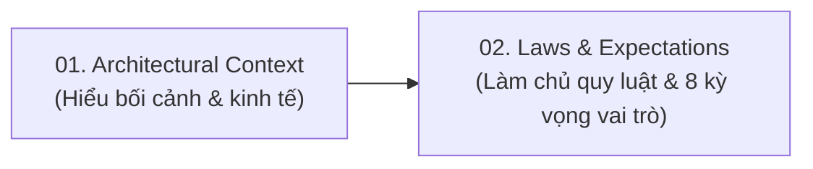

# Software Architecture Fundamentals - Kiến Trúc Phần Mềm Cơ Bản

## Table of Contents

- [Abstract](#abstract)
- [Danh mục Tài liệu](#danh-mục-tài-liệu)
- [Định hướng Học tập](#định-hướng-học-tập)

---

## Abstract

Kiến trúc phần mềm là bước tiến tự nhiên cho bất kỳ ai muốn vượt qua ranh giới lập trình cục bộ để thấu hiểu bức tranh toàn cảnh của hệ thống. Dù bạn là một kỹ sư muốn nâng tầm sự nghiệp, một quản lý dự án cần hiểu cơ chế vận hành hệ thống, hay một "kiến trúc sư bất đắc dĩ" đang gánh vác các quyết định kỹ thuật quan trọng, việc làm chủ tư duy kiến trúc là chìa khóa để điều hướng sự phức tạp.

Trọng tâm cốt lõi của vai trò kiến trúc sư là khả năng phân tích sâu sắc các hệ thống phần mềm và đưa ra các quyết định **Trade-off** mang tính sống còn – ngay cả trong điều kiện thông tin không đầy đủ. Trong kỷ nguyên trí tuệ nhân tạo, kiến trúc sư giữ vững vị thế khó bị thay thế nhờ khả năng thấu hiểu bối cảnh đa biến và đưa ra những lựa chọn chiến lược mà máy móc không thể tự động hóa.

Mọi kiến trúc phần mềm đều là sản phẩm của chính **bối cảnh** sinh ra nó. Những gì từng là bất khả thi hoặc quá đắt đỏ trong quá khứ – như việc vận hành các dịch vụ phân tán độc lập với database riêng vào những năm 2000 – ngày nay đã trở thành tiêu chuẩn nhờ vào sự trỗi dậy của **Open Source** và cuộc cách mạng thực hành **DevOps**.

Để hiện thực hóa các quyết định kỹ thuật bền vững, kiến trúc sư phải vận hành trên nền tảng của **Ba Quy luật Kiến trúc** bất biến: nhận diện sâu sắc mọi **Trade-off** để tìm ra giải pháp tối ưu bối cảnh (**least worst architecture**), coi trọng lý do và động lực kỹ thuật hơn công nghệ triển khai (**Why > How**) thông qua **ADR**, và định vị điểm cân bằng thực tế trên dải quang phổ giải pháp. Những quy luật này được chuyển hóa thành hành động thông qua **8 Kỳ vọng Năng lực**—từ việc mở rộng **Technical Breadth**, tự động hóa kiểm thử ranh giới với **Fitness Functions** trên CI/CD, đến nghệ thuật **Elastic Leadership** và đàm phán bằng thực chứng: **"Demonstration Defeats Discussion"**.

---

## Danh mục Tài liệu

1. **[01. Bối cảnh Kiến trúc](01_architectural_context.md)**: Phân tích các ràng buộc kinh tế hạ tầng, cuộc cách mạng mã nguồn mở và DevOps đã biến các phong cách kiến trúc phân tán từ bất khả thi trở thành tiêu chuẩn hiện đại.
2. **[02. Quy luật Kiến trúc & Kỳ vọng Năng lực](02_laws_and_expectations.md)**: Hệ thống 3 quy luật Trade-off bất biến, dải quang phổ quyết định kiến trúc, khung 8 kỳ vọng vai trò và cơ chế ngăn ngừa xói mòn cấu trúc bằng Fitness Functions.

---

## Định hướng Học tập

Để tiếp thu kiến thức nền tảng một cách hệ thống, khuyến nghị tiếp cận các chủ đề theo đúng tiến trình tư duy kiến trúc:

---

[← Quay lại Software Architecture](../README.md)
