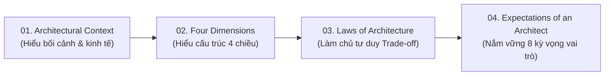

# Software Architecture Fundamentals - Kiến Trúc Phần Mềm Cơ Bản

## Table of Contents

- [Giới thiệu](#giới-thiệu)
- [Danh mục Tài liệu](#danh-mục-tài-liệu)
- [Định hướng Học tập](#định-hướng-học-tập)

---

## Giới thiệu

Thư mục **`00_introduction`** tổng hợp các kiến thức nền tảng nhất về Kiến trúc Phần mềm (Software Architecture), dựa trên các nghiên cứu và đúc kết từ các tài liệu kinh điển trong thư viện.

Mục tiêu của phần này là xây dựng tư duy kiến trúc đúng đắn: hiểu rõ bối cảnh kỹ thuật/kinh tế, nắm vững 4 chiều cấu thành kiến trúc, tuân thủ các quy luật Trade-off trong thiết kế hệ thống và đáp ứng 8 kỳ vọng vai trò đối với một kiến trúc sư phần mềm.

---

## Danh mục Tài liệu

| Bài học | Chủ đề Trọng tâm | Mô tả Chi tiết |
| :--- | :--- | :--- |
| **[01. Bối cảnh Kiến trúc](01_architectural_context.md)** | Architectural Context & Economics | Tác động của chi phí hạ tầng, mã nguồn mở, DevOps và tính khả thi kinh tế của các phong cách kiến trúc. |
| **[02. 4 Chiều Kiến trúc](02_four_dimensions.md)** | The 4 Dimensions | Phân tích 4 thành tố: Characteristics (-ilities), Logical Components, Architecture Style và Architecture Decisions. |
| **[03. Các Quy luật Kiến trúc](03_laws_of_architecture.md)** | Laws of Architecture | Quy luật Trade-off (1st Law), hệ quả ẩn giấu, nguyên tắc *Why > How* (2nd Law) và phổ quyết định trung gian (3rd Law). |
| **[04. 8 Kỳ vọng đối với Kiến trúc sư](04_expectations_of_an_architect.md)** | Expectations of an Architect | 8 trụ cột năng lực cốt lõi: Ra quyết định, phân tích liên tục, tuân thủ, đa dạng công nghệ, am hiểu nghiệp vụ, kỹ năng mềm và điều hướng chính trị tổ chức. |

---

## Định hướng Học tập

Để đạt hiệu quả tốt nhất, khuyến nghị đọc tài liệu theo đúng thứ tự tiến trình suy luận kiến trúc:

---
[← Quay lại Software Architecture](../README.md)
