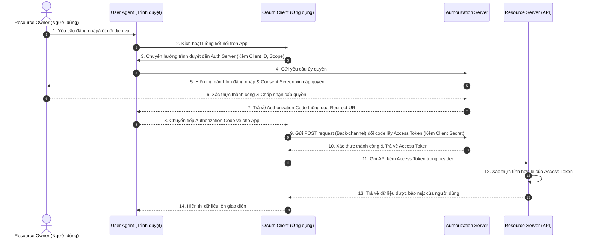

# Các Vai trò trong OAuth 2.0

Tài liệu này phân tích chi tiết 5 vai trò logic cốt lõi trong giao thức **OAuth 2.0**, cơ chế tương tác giữa chúng và lý do tại sao mô hình này mang lại mức độ bảo mật vượt trội so với các cơ chế xác thực truyền thống.

## Mục lục

1. [Tổng quan](#1-tổng-quan)
2. [Các vai trò chính trong đặc tả OAuth 2.0](#2-các-vai-trò-chính-trong-đặc-tả-oauth-20)
3. [Sơ đồ Luồng hoạt động giữa các Vai trò](#3-sơ-đồ-luồng-hoạt-động-giữa-các-vai-trò)
4. [Lưu ý quan trọng về thiết kế hệ thống](#4-lưu-ý-quan-trọng-về-thiết-kế-hệ-thống)
5. [Tại sao OAuth 2.0 an toàn hơn các phương pháp cũ?](#5-tại-sao-oauth-20-an-toàn-hơn-các-phương-pháp-cũ)
6. [Tổng kết](#6-tổng-kết)

---

## 1. Tổng quan

Trước khi có sự ra đời của **OAuth 2.0**, các phương pháp xác thực API truyền thống như xác thực bằng tài khoản/mật khẩu trực tiếp hoặc chia sẻ session cookie thường đòi hỏi ứng dụng khách phải biết thông tin đăng nhập của người dùng. Điều này dẫn đến các rủi ro bảo mật nghiêm trọng: ứng dụng khách có thể lưu trữ mật khẩu dưới dạng bản rõ, hoặc lạm dụng quyền hạn của người dùng để thực hiện các hành động phá hoại.

OAuth 2.0 giải quyết triệt để vấn đề này bằng cách giới thiệu cơ chế ủy quyền sử dụng **Access Token (Mã truy cập)** có thời hạn ngắn và giới hạn phạm vi quyền, đồng thời phân tách rõ ràng các vai trò logic trong kiến trúc hệ thống.

---

## 2. Các vai trò chính trong đặc tả OAuth 2.0

Đặc tả tiêu chuẩn RFC 6749 định nghĩa rõ ràng 5 vai trò logic tham gia vào quy trình ủy quyền bảo mật:

| Vai trò OAuth | Thuật ngữ thông thường | Mô tả nhiệm vụ |
| :--- | :--- | :--- |
| **Resource Owner** | Người dùng (User) | Người sở hữu tài nguyên dữ liệu và có quyền cho phép hoặc từ chối ứng dụng truy cập dữ liệu của mình. |
| **User Agent** | Trình duyệt (Browser) / Thiết bị | Công cụ trung gian mà Người dùng sử dụng để tương tác với Ứng dụng khách và Máy chủ ủy quyền (ví dụ: Google Chrome, Safari). |
| **OAuth Client** | Ứng dụng (App) | Phần mềm yêu cầu truy cập tài nguyên thay mặt cho Người dùng. Có thể chạy trên Server (Web App) hoặc Browser (SPA) hoặc Thiết bị di động. |
| **Resource Server** | Máy chủ Tài nguyên (API) | Nơi lưu trữ dữ liệu được bảo vệ của người dùng, sẵn sàng nhận diện và xác thực Access Token để trả về dữ liệu. |
| **Authorization Server** | Máy chủ Ủy quyền (Auth Server) | Nơi xác thực danh tính Người dùng, xin cấp quyền (Consent) và phát hành Access Token an toàn cho Ứng dụng khách. |

---

## 3. Sơ đồ Luồng hoạt động giữa các Vai trò

Dưới đây là sơ đồ sequence thể hiện sự phối hợp nhịp nhàng giữa 5 vai trò trong một quy trình ủy quyền tiêu chuẩn:

### Bảng giải thích chi tiết các bước trong luồng

| Thành phần/Bước | Vai trò/Mô tả | Chi tiết |
| :--- | :--- | :--- |
| **Bước 3 & 7 & 8** | Luồng Front-channel (Kênh trước) | Dữ liệu được truyền gián tiếp qua thanh địa chỉ trình duyệt (`User Agent`), giúp bảo vệ an toàn danh tính và thực hiện xác thực trực tiếp giữa người dùng và Auth Server. |
| **Bước 9 & 10** | Luồng Back-channel (Kênh sau) | Khóa bí mật (`Client Secret`) và `Authorization Code` được gửi trực tiếp qua kết nối HTTPS bảo mật từ Web Server của App tới Auth Server, hoàn toàn không đi qua trình duyệt của người dùng. |
| **Bước 11 & 12 & 13** | Xác thực Token & Cấp tài nguyên | `Resource Server` độc lập xác minh chữ ký số của token (nếu là JWT) hoặc gọi trực tiếp đến `Authorization Server` để đối chiếu hiệu lực trước khi trả dữ liệu. |

---

## 4. Lưu ý quan trọng về thiết kế hệ thống

> [!IMPORTANT]
> **Các vai trò trong OAuth 2.0 là khái niệm logic, không nhất thiết phải là các máy chủ vật lý độc lập:**
> *   Trong các ứng dụng nguyên khối (Monolithic Architecture) quy mô vừa và nhỏ, **Authorization Server** và **Resource Server** có thể được tích hợp chung trên cùng một máy chủ vật lý và chung cơ sở dữ liệu.
> *   Trong các hệ thống phân tán lớn (Microservices Architecture), nhiều API dịch vụ khác nhau (đóng vai trò là các **Resource Servers**) sẽ được bảo vệ tập trung bởi một **Authorization Server** duy nhất (ví dụ: Keycloak, Okta) nằm phía sau một API Gateway.

---

## 5. Tại sao OAuth 2.0 an toàn hơn các phương pháp cũ?

*   **Không chia sẻ thông tin đăng nhập:** Ứng dụng khách (`OAuth Client`) tuyệt đối không bao giờ được nhìn thấy hay lưu trữ tên đăng nhập/mật khẩu của người dùng. Mật khẩu chỉ được nhập trực tiếp tại giao diện bảo mật của `Authorization Server`.
*   **Giới hạn phạm vi quyền hạn (Principle of Least Privilege):** Thay vì có toàn quyền kiểm soát tài khoản, `Access Token` phát ra chỉ cho phép ứng dụng khách thực hiện một số hành động giới hạn (thông qua `Scopes`) và tự động hết hạn sau một khoảng thời gian ngắn cấu hình trước.
*   **Khả năng thu hồi (Revocation):** Người dùng hoặc quản trị viên hệ thống có thể chủ động hủy hiệu lực của một `Access Token` cụ thể bất cứ lúc nào từ xa mà không cần phải thay đổi mật khẩu của tài khoản.

---

## 6. Tổng kết

*   Hiểu rõ 5 vai trò logic trong OAuth 2.0 là bước đầu tiên cực kỳ quan trọng để xây dựng tư duy bảo mật hệ thống đúng chuẩn.
*   Sự phân tách rạch ròi giữa các kênh truyền dữ liệu (**Front-channel** và **Back-channel**) giúp giảm thiểu tối đa nguy cơ bị nghe lén và giả mạo ứng dụng.
*   Trong các bài học tiếp theo, chúng ta sẽ đi sâu phân loại các kiểu ứng dụng khách (**Confidential Client** vs **Public Client**) để hiểu rõ lý do vì sao mỗi loại ứng dụng lại bắt buộc phải áp dụng các cơ chế bảo mật khác nhau.

---
[← Quay lại mục lục](README.md)
