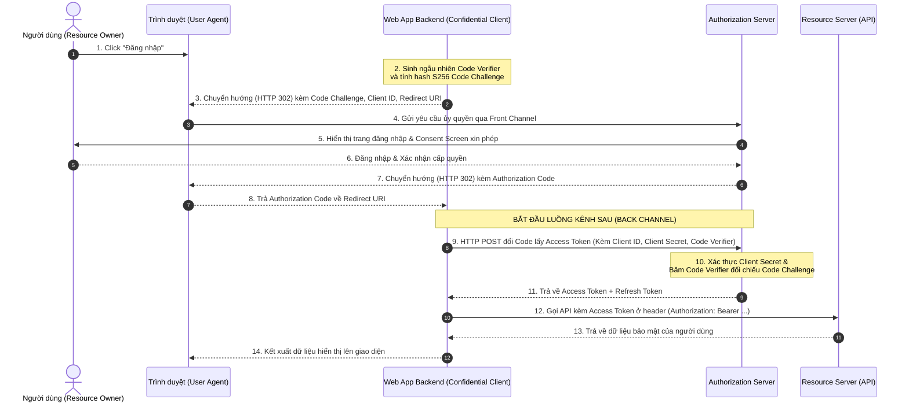
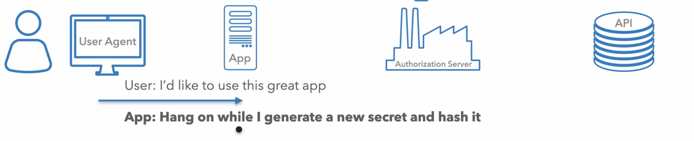
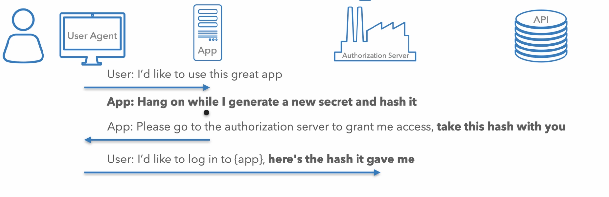
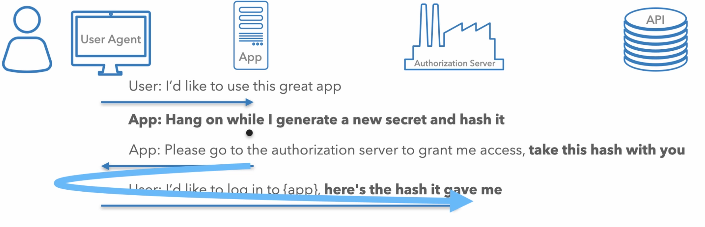
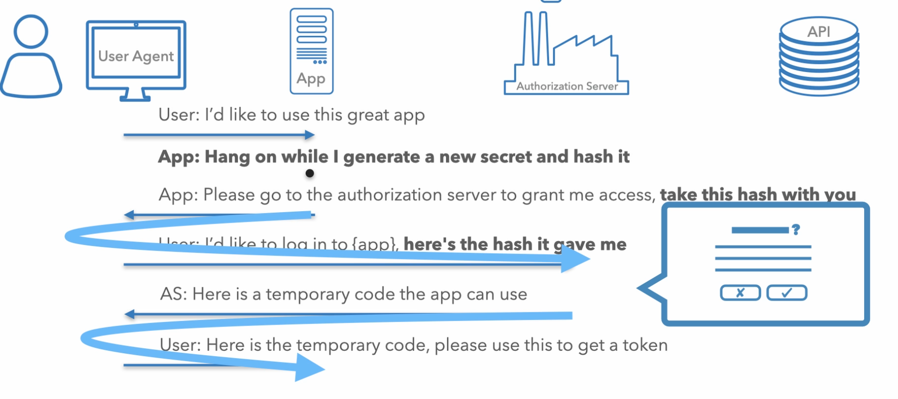
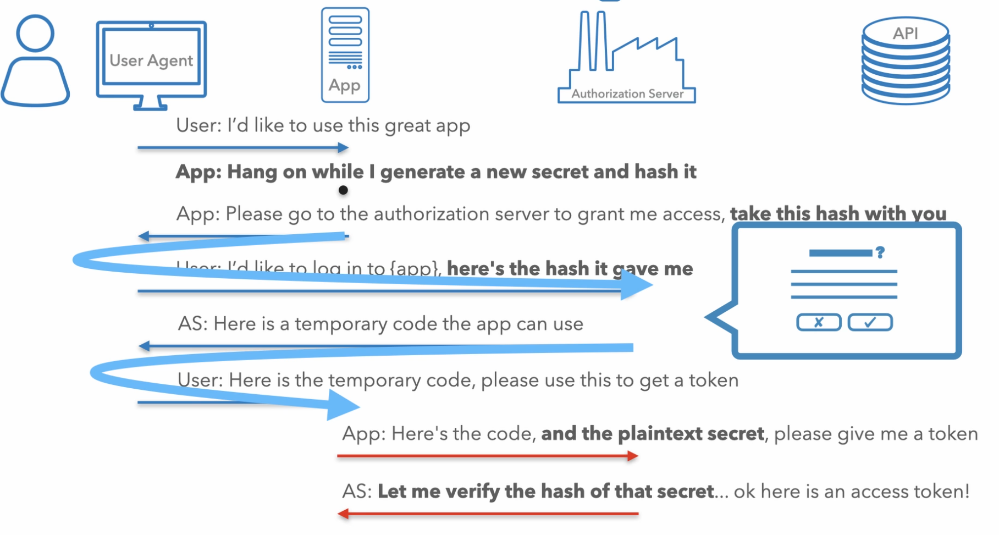
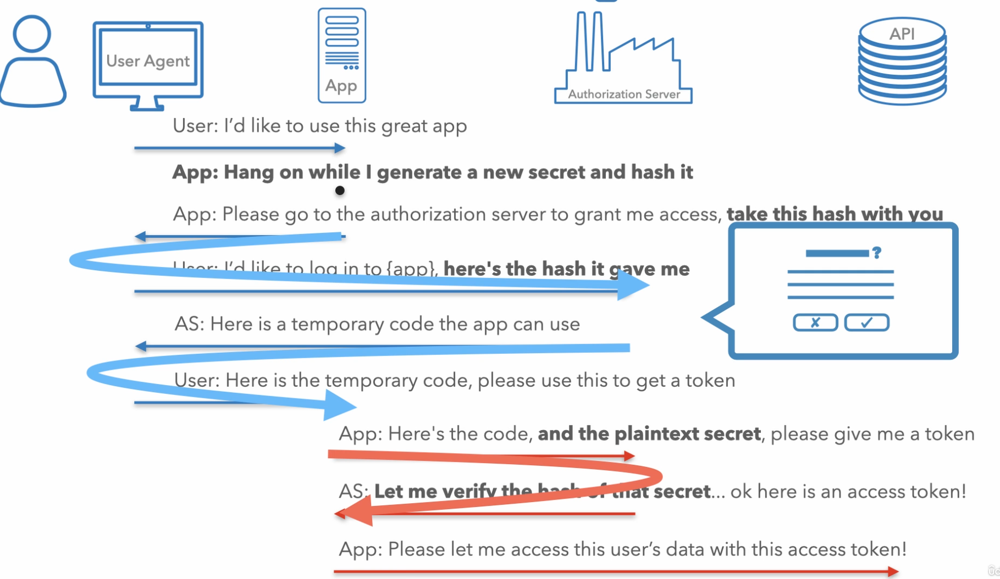

# Luồng Mã Ủy quyền cho Web Application (Server-Side)

Tài liệu này phân tích chi tiết quy trình thực thi **Authorization Code Flow** (Luồng Mã Ủy quyền) kết hợp cơ chế mở rộng **PKCE** dành cho ứng dụng Web chạy trên môi trường máy chủ (Confidential Client), giúp bảo vệ token tuyệt mật qua kết nối kênh sau.

## Mục lục

1. [Tổng quan về Authorization Code Flow cho Web Application](#1-tổng-quan-về-authorization-code-flow-cho-web-application)
2. [Sơ đồ Luồng hoạt động trình tự toàn diện](#2-sơ-đồ-luồng-hoạt-động-trình-tự-toàn-diện)
3. [Phân tích chi tiết Từng bước Thực hiện](#3-phân-tích-chi-tiết-từng-bước-thực-hiện)
4. [Tìm hiểu sâu về cơ chế PKCE cho Web Server](#4-tìm-hiểu-sâu-về-cơ-chế-pkce-cho-web-server)
5. [Chi tiết các Tham số Kỹ thuật trong Requests](#5-chi-tiết-các-tham-số-kỹ-thuật-trong-requests)
6. [Cơ chế sử dụng Refresh Token](#6-cơ-chế-sử-dụng-refresh-token)
7. [Tổng kết](#7-tổng-kết)

---

## 1. Tổng quan về Authorization Code Flow cho Web Application

Đối với các ứng dụng Web truyền thống chạy trên máy chủ backend (như Java Spring Boot, NodeJS, .NET), mã nguồn và khóa bí mật (`Client Secret`) được lưu trữ hoàn toàn an toàn đằng sau tường lửa. 

Mục tiêu tối thượng của **Authorization Code Flow** là:
*   Chèn người dùng vào giữa quá trình đăng nhập qua trình duyệt để xác thực tập trung.
*   **Chỉ truyền tải Access Token qua kết nối Kênh sau (Back Channel)** trực tiếp giữa Web Server của bạn và Authorization Server, tuyệt đối không để token xuất hiện hoặc bị lưu lại trên trình duyệt của người dùng.

---

## 2. Sơ đồ Luồng hoạt động trình tự toàn diện

Dưới đây là sơ đồ trình tự tích hợp đầy đủ cơ chế Front-channel (giao tiếp qua trình duyệt) và Back-channel (giao tiếp trực tiếp máy chủ) kèm theo tính năng bảo vệ chống giả mạo mã **PKCE**:



### Bảng giải thích chi tiết luồng hoạt động

| Thành phần/Bước | Vai trò/Mô tả | Chi tiết |
| :--- | :--- | :--- |
| **Bước 2 & 3** | Khởi tạo PKCE trên Server | Web App Backend tự sinh ra chuỗi bí mật tạm thời `Code Verifier` cho riêng request này, mã hóa băm SHA256 thành `Code Challenge` gửi đi ở kênh trước. |
| **Bước 7 & 8** | Authorization Code (Mã ủy quyền) | Là một chiếc vé tạm thời chỉ dùng **một lần**, có thời hạn cực ngắn (thường dưới 1 phút) được gửi qua kênh trước. Kẻ tấn công nếu có đánh cắp được cũng không thể sử dụng. |
| **Bước 9 & 10** | Xác thực Kênh sau | App Server trực tiếp thực hiện gửi POST request lên Auth Server. Auth Server kiểm tra đồng thời tính hợp lệ của `Client Secret` và đối chiếu khớp hash PKCE trước khi phát hành token. |

---

## 3. Phân tích chi tiết Từng bước Thực hiện

Hãy cùng đi sâu vào từng bước vận hành thực tế của luồng này:

### Bước 3.1: Khởi động luồng và Sinh khóa bí mật PKCE
Khi người dùng nhấn nút Đăng nhập trên trình duyệt, ứng dụng Web Backend của bạn sẽ sinh ra một chuỗi văn bản ngẫu nhiên có độ bảo mật cao (chứa từ 43 đến 128 ký tự), gọi là **PKCE Code Verifier**. 



Web App Server sẽ tự tính toán băm SHA256 một chiều của chuỗi này tạo thành **Code Challenge**, đồng thời lưu trữ chuỗi gốc `Code Verifier` an toàn vào bộ nhớ session server của riêng phiên làm việc này.

### Bước 3.2: Chuyển hướng người dùng qua Front Channel
Ứng dụng chuyển hướng trình duyệt của người dùng đến cổng Authorization Server bằng cách đính kèm các tham số công khai bao gồm `client_id`, `redirect_uri`, `scope` và `code_challenge`.



> [!NOTE]
> **Front Channel là gì?**
> Kênh trước (Front Channel) là con đường sử dụng chính thanh địa chỉ của trình duyệt của người dùng để chuyển tiếp thông điệp. Vì là kênh chuyển tiếp công khai, các thông tin gửi đi tại đây bắt buộc chỉ là thông tin không nhạy cảm (như hash của PKCE thay vì chuỗi mật mã gốc).



### Bước 3.3: Người dùng Xác thực và Nhận Mã Ủy quyền (Authorization Code)
Người dùng thực hiện đăng nhập tài khoản trực tiếp trên máy chủ Auth Server và phê duyệt cấp quyền cho ứng dụng. 

Khi hoàn tất, Auth Server tạo ra một chiếc vé dùng một lần gọi là **Authorization Code** và chuyển hướng trình duyệt của người dùng quay trở lại `redirect_uri` của ứng dụng kèm theo mã này trên query string.



### Bước 3.4: Đổi Mã lấy Token qua Back Channel
Ngay khi ứng dụng Web Backend nhận được Authorization Code từ request chuyển hướng của trình duyệt, nó lập tức đứng ra thiết lập kết nối máy-chủ-tới-máy-chủ (**Back Channel**) để gửi một POST request HTTPS trực tiếp đến Auth Server.

Request này gửi đi các thông tin tuyệt mật bao gồm: `Authorization Code`, `client_id`, `client_secret` (mật khẩu ứng dụng) và chuỗi gốc `code_verifier` ban đầu.



Auth Server kiểm tra xác thực `client_secret`, băm chuỗi `code_verifier` đối chiếu khớp với `code_challenge` ban đầu. Nếu trùng khớp, Auth Server phát hành Access Token gửi về trực tiếp cho Backend của bạn.

### Bước 3.5: Gọi API lấy dữ liệu bảo mật
Sau khi nhận được Access Token, ứng dụng khách lưu trữ token này an toàn trên server backend và đính kèm nó vào Header để gọi các API bảo mật của Resource Server mà người dùng hoàn toàn không nhìn thấy token.



---

## 4. Tìm hiểu sâu về cơ chế PKCE cho Web Server

Ban đầu, cơ chế **PKCE** (RFC 7636) được thiết kế đặc thù dành riêng cho các Public Client (như Mobile App) vốn không thể bảo vệ Client Secret. Tuy nhiên, khuyến nghị bảo mật OAuth hiện đại nhất hiện nay (OAuth 2.1) quy định:

> [!IMPORTANT]
> **Bắt buộc phải áp dụng PKCE cho cả các Confidential Client có Client Secret:**
> Cơ chế PKCE giúp ngăn chặn triệt để cuộc tấn công nguy hiểm **Authorization Code Injection Attack** (hoán đổi mã ủy quyền của nạn nhân để đăng nhập tài khoản của họ vào phiên làm việc của kẻ tấn công) mà chốt chặn Client Secret thông thường không thể phát hiện và xử lý được.

---

## 5. Chi tiết các Tham số Kỹ thuật trong Requests

### 5.1. Request xin mã ủy quyền ban đầu (GET)
Client chuyển hướng trình duyệt người dùng đến Authorization Endpoint:
```text
https://auth.company.com/authorize?
    response_type=code
    &client_id=web-app-client-123
    &redirect_uri=https://web-app.com/callback
    &scope=read:profile write:orders
    &state=xyzSecureState987
    &code_challenge=E9Melhoa2OwvFrGMTJguCH5yOFDpwUYzFxSAXwT4_o
    &code_challenge_method=S256
```

### 5.2. Request đổi Code lấy Token (POST)
Client gửi POST request (body dạng `application/x-www-form-urlencoded`) trực tiếp đến Token Endpoint qua Back Channel:
```http
POST /token HTTP/1.1
Host: auth.company.com
Content-Type: application/x-www-form-urlencoded

grant_type=authorization_code
&code=SplxlOBeZQQYbYS6WxSbIA
&redirect_uri=https://web-app.com/callback
&client_id=web-app-client-123
&client_secret=super-secret-password-xyz
&code_verifier=dBjftJeZ4CVP-mB92K27uhbUJU1p1r_wW1gFWFOyXfc
```

---

## 6. Cơ chế sử dụng Refresh Token

Nếu trong phản hồi Auth Server trả về kèm theo một `**Refresh Token**`, ứng dụng của bạn có thể sử dụng nó để tự động xin Access Token mới khi Access Token cũ hết hạn mà không làm gián đoạn trải nghiệm của người dùng.

Request làm mới token (POST):
```http
POST /token HTTP/1.1
Host: auth.company.com
Content-Type: application/x-www-form-urlencoded

grant_type=refresh_token
&refresh_token=tGzv3JOkF0XG5Qx2TlKWIA
&client_id=web-app-client-123
&client_secret=super-secret-password-xyz
```

---

## 7. Tổng kết

*   **Authorization Code Flow** là tiêu chuẩn vàng an toàn nhất cho các ứng dụng Server-side Web App.
*   **Bảo vệ hai lớp:** Kết hợp chặt chẽ việc kiểm tra `Client Secret` trên kênh sau và cơ chế băm đối sánh `PKCE` giúp loại bỏ hoàn toàn các lỗ hổng tấn công trung gian.
*   **Nhiệm vụ tiếp theo:** Trong bài học kế tiếp, chúng ta sẽ khảo sát cách thức điều chỉnh luồng này để chạy trực tiếp trên môi trường trình duyệt cho ứng dụng Single Page Application (SPA) khi hoàn toàn thiếu vắng Client Secret.

---
[← Quay lại mục lục](README.md)
