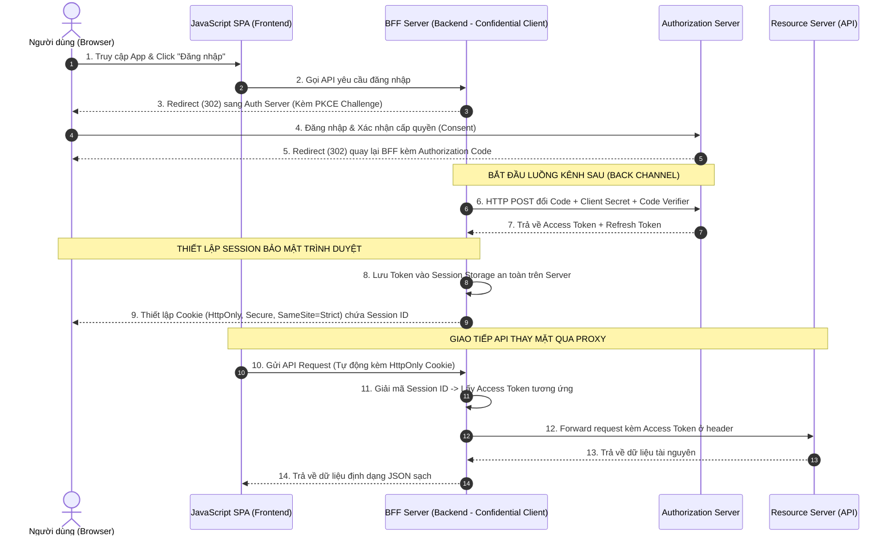

# Mô hình Backend-for-Frontend (BFF) bảo vệ Trình duyệt

Tài liệu này phân tích kiến trúc **Backend-for-Frontend (BFF)** - giải pháp bảo mật tối tân nhất dành cho ứng dụng Single Page Application (SPA), giúp loại bỏ hoàn toàn Access Token ra khỏi phạm vi hoạt động của JavaScript và bảo vệ người dùng trước các lỗ hổng tấn công trình duyệt.

## Mục lục

1. [Giới thiệu](#1-giới-thiệu)
2. [Rủi ro Cố hữu khi Lưu Token trong JavaScript](#2-rủi-ro-cố-hữu-khi-lưu-token-trong-javascript)
3. [Giải pháp: Kiến trúc Backend-for-Frontend (BFF)](#3-giải-pháp-kiến-trúc-backend-for-frontend-bff)
4. [Sơ đồ & Quy trình hoạt động chi tiết](#4-sơ-đồ--quy-trình-hoạt-động-chi-tiết)
5. [Ưu điểm vượt trội của Mô hình BFF](#5-ưu-điểm-vượt-trội-của-mô-hình-bff)
6. [Tổng kết](#6-tổng-kết)

---

## 1. Giới thiệu

Trong các bài học trước, chúng ta đã khảo sát các giải pháp lưu trữ Access Token trực tiếp bằng JavaScript trên trình duyệt (LocalStorage, RAM, Service Worker). Mặc dù có cải thiện tính bảo mật, các phương án này đều phải đánh đổi bằng độ phức tạp lập trình và không thể kháng cự 100% lỗ hổng XSS.

Kiến trúc **Backend-for-Frontend (BFF)** ra đời như một cuộc cách mạng: thay vì tìm cách bảo vệ token trên trình duyệt, chúng ta **giữ sạch trình duyệt bằng cách không bao giờ cung cấp token cho JavaScript**.

---

## 2. Rủi ro Cố hữu khi Lưu Token trong JavaScript

Bất kỳ vùng nhớ nào mà mã JavaScript của SPA có quyền đọc ghi trực tiếp (như LocalStorage, SessionStorage, RAM) đều có thể bị đọc trộm bởi hacker nếu ứng dụng bị dính lỗ hổng bảo mật XSS (qua thư viện bên thứ ba, tiện ích extension độc hại).

> [!IMPORTANT]
> **Nguyên tắc bảo mật vàng:**
> Nếu JavaScript của ứng dụng không bao giờ nhìn thấy và không bao giờ nắm giữ Access Token, thì hacker khai thác lỗi XSS cũng hoàn toàn **bất lực** không thể lấy trắp được token của hệ thống.

---

## 3. Giải pháp: Kiến trúc Backend-for-Frontend (BFF)

Mô hình BFF bổ sung một máy chủ backend trung gian (BFF Server) nằm giữa ứng dụng Frontend SPA và thế giới API bên ngoài:

*   **Đóng vai trò Proxy:** SPA không gọi trực tiếp API của Resource Server. Mọi request API từ trình duyệt bắt buộc phải gửi qua BFF Server.
*   **Quản lý OAuth tập trung:** BFF Server (đóng vai trò Confidential Client) trực tiếp thực thi toàn bộ luồng Authorization Code Flow, nhận Access Token/Refresh Token và lưu trữ chúng tuyệt mật trong session an toàn trên bộ nhớ server.
*   **Thiết lập Cookie bảo mật:** BFF trả về trình duyệt một mã Session ID duy nhất thông qua **HttpOnly Secure Cookie**.

---

## 4. Sơ đồ & Quy trình hoạt động chi tiết

Dưới đây là sơ đồ trình tự thể hiện chi tiết cách thức vận hành của mô hình BFF bảo mật tối cao:

### Bảng phân tích chi tiết quy trình BFF

1.  **Giai đoạn Đăng nhập (Bước 2 - 7):** Toàn bộ luồng đổi code lấy token được thực hiện hoàn toàn ở Kênh sau (Back-channel) trực tiếp giữa BFF và Auth Server. Trình duyệt JavaScript hoàn toàn không được can thiệp hay nhìn thấy mã Access Token này.
2.  **Thiết lập Cookie (Bước 9):** BFF trả về một Cookie mã hóa Session ID. Thuộc tính `HttpOnly` ngăn chặn hoàn toàn JavaScript của SPA đọc cookie này, triệt tiêu 100% rủi ro rò rỉ session ID do XSS.
3.  **Proxy API (Bước 10 - 14):** Khi SPA gọi API, trình duyệt tự động đính kèm cookie session lên BFF. BFF đứng ra tra cứu Access Token tương ứng trong bộ nhớ RAM/Redis của mình, gắn Access Token vào Header và thay mặt SPA gọi Resource Server thực tế.

---

## 5. Ưu điểm vượt trội của Mô hình BFF

> [!TIP]
> **Lá chắn kép chống XSS và CSRF:**
> Để chống lại nguy cơ bị tấn công **CSRF (Cross-Site Request Forgery)** khi sử dụng cookie bảo mật, bạn bắt buộc phải cấu hình cookie session với các cờ bảo mật cao cấp:
> *   `HttpOnly`: Ngăn chặn mã độc XSS đọc cookie.
> *   `Secure`: Chỉ cho phép truyền cookie qua HTTPS mã hóa.
> *   `SameSite=Strict` hoặc `SameSite=Lax`: Chặn đứng trình duyệt tự động gửi kèm cookie khi có request phát ra từ website bên thứ ba, triệt tiêu nguy cơ bị tấn công CSRF.

*   **Bảo vệ Client Secret:** BFF Server hoạt động trên môi trường đóng, cho phép cấu hình là **Confidential Client** để sử dụng `Client Secret` nhằm xác thực ứng dụng chặt chẽ hơn.
*   **Đơn giản hóa Frontend:** Mã nguồn SPA JavaScript của bạn hoàn toàn sạch sẽ, không cần viết logic băm PKCE phức tạp, không cần quản lý thời gian sống của token, chỉ cần thực hiện gọi API thông thường thông qua cookie session.

---

## 6. Tổng kết

*   Mô hình **Backend-for-Frontend (BFF)** hiện là giải pháp bảo mật tối tân và được khuyến nghị mạnh mẽ nhất trong đặc tả *OAuth for Browser-Based Apps* mới để bảo vệ SPA.
*   **Hạn chế:** Đòi hỏi bạn phải duy trì và vận hành một máy chủ backend động (NodeJS, .NET, Java), không phù hợp với các ứng dụng SPA host tĩnh hoàn toàn trên AWS S3 hay GitHub Pages.
*   **Chuyên đề tiếp theo:** Chúng ta đã khép lại phần nghiên cứu sâu về các luồng OAuth. Trong mô-đun cuối cùng, chúng ta sẽ chuyển hướng sang tìm hiểu **OpenID Connect (OIDC)** để khám phá cách thức xác thực danh tính người dùng bằng **ID Token**.

---
[← Quay lại mục lục](README.md)
