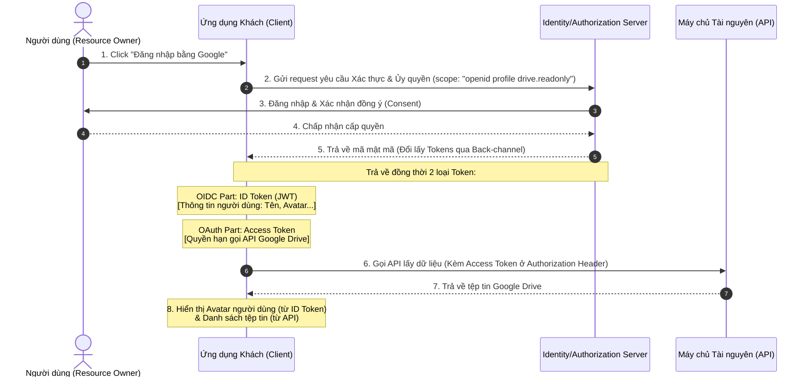

# OAuth vs OpenID Connect – Tổng hợp

Tài liệu này cung cấp cái nhìn tổng quan, phân tích so sánh và phân biệt sâu sắc giữa hai tiêu chuẩn bảo mật phổ biến nhất hiện nay: **OAuth 2.0** và **OpenID Connect (OIDC)**.

## Mục lục

1. [Tư duy Cốt lõi](#1-tư-duy-cốt-lõi)
2. [Sơ đồ Luồng hoạt động phân tách Vai trò](#2-sơ-đồ-luồng-hoạt-động-phân-tách-vai-trò)
3. [Hình mẫu ví dụ "Thẻ phòng Khách sạn"](#3-hình-mẫu-ví-dụ-thẻ-phòng-khách-sạn)
4. [So sánh trong Kiến trúc Phần mềm](#4-so-sánh-trong-kiến-trúc-phần-mềm)
5. [Bảng đối chiếu kỹ thuật chi tiết](#5-bảng-đối-chiếu-kỹ-thuật-chi-tiết)
6. [Phân tích Thuật ngữ & Cách ghi nhớ](#6-phân-tích-thuật-ngữ--cách-ghi-nhớ)
7. [Tổng kết](#7-tổng-kết)

---

## 1. Tư duy Cốt lõi

Để hiểu rõ sự khác biệt giữa hai giao thức này, hãy ghi nhớ định nghĩa ngắn gọn sau:

*   **OAuth 2.0**: Chỉ tập trung vào **Ủy quyền (Authorization)**. Nó chỉ quan tâm đến việc *“Ứng dụng khách có quyền thao tác những tài nguyên gì?”* mà hoàn toàn không cần biết người dùng cụ thể là ai.
*   **OpenID Connect (OIDC)**: Tập trung vào **Xác thực Danh tính (Authentication)**. Đây là một lớp mở rộng xây dựng trực tiếp trên nền tảng của OAuth 2.0, giúp bổ sung thông tin nhận dạng người dùng để ứng dụng biết *“Đây là ai?”*.

---

## 2. Sơ đồ Luồng hoạt động phân tách Vai trò

Dưới đây là sơ đồ trình bày cách OIDC kết hợp song song cùng OAuth 2.0 để giải quyết cả hai bài toán: Xác định danh tính (ID Token) và Ủy quyền truy cập API (Access Token).

### Bảng giải thích chi tiết luồng hoạt động

| Thành phần/Bước | Vai trò/Mô tả | Chi tiết |
| :--- | :--- | :--- |
| **Bước 2 & 5** | Phạm vi yêu cầu (`scopes`) và Cấp phát Token | Bằng cách yêu cầu scope chuẩn `openid`, server sẽ phát hành **ID Token** (danh tính). Đồng thời scope `drive.readonly` yêu cầu phát hành **Access Token** (phân quyền). |
| **ID Token (OIDC)** | Xác định danh tính người dùng | Chứa các thông tin cá nhân dưới dạng JSON Web Token (JWT) đã được ký số, giúp App hiển thị tên và ảnh đại diện của người dùng ngay lập tức mà không cần gọi thêm API. |
| **Access Token (OAuth)** | Thẻ thông hành truy cập tài nguyên | Một chuỗi ký tự ngẫu nhiên (hoặc JWT) được App gửi lên API của Resource Server để thực hiện thao tác đọc/ghi tệp tin của người dùng. |

---

## 3. Hình mẫu ví dụ "Thẻ phòng Khách sạn"

Hãy hình dung quy trình này giống như việc bạn đi thuê phòng ở một khách sạn cao cấp:

| Thành phần | Trong khách sạn | Trong OAuth/OIDC |
| :--- | :--- | :--- |
| **Quầy lễ tân** | Nhân viên kiểm tra CMND/Hộ chiếu của bạn để xác minh danh tính, sau đó cấp thẻ từ. | **Authorization Server** (Xác thực người dùng và cấp phát Token). |
| **Thẻ phòng từ** | Thẻ chỉ có chức năng mở các cửa phòng được phân quyền (phòng ngủ, phòng gym, thang máy) nhưng trên thẻ **không ghi** tên bạn là ai. | **Access Token** (Chỉ chứa quyền hạn truy cập API, không chứa danh tính người dùng). |
| **Khóa cửa phòng** | Thiết bị khóa chỉ kiểm tra xem thẻ từ có mã hợp lệ để mở cửa hay không, thiết bị hoàn toàn không quan tâm bạn là ai. | **Resource Server / API** (Nhận access token để trả về dữ liệu bảo mật). |
| **Hồ sơ đăng ký** | Tên, hình ảnh, quốc tịch của bạn được ghi nhận tại quầy lễ tân khi làm thủ tục check-in. | **ID Token** (OIDC - Chứa thông tin nhận dạng người dùng như `sub`, `name`, `email`). |

> [!NOTE]
> Trong mô hình **OAuth 2.0**, cánh cửa API chỉ cần kiểm tra xem chiếc thẻ truy cập (Access Token) có hợp lệ hay không.
> Trong mô hình **OIDC**, ngoài chiếc thẻ mở cửa, ứng dụng khách còn nhận được một thẻ danh tính (ID Token) để biết chính xác người đang tương tác là ai.

---

## 4. So sánh trong Kiến trúc Phần mềm

*   **OAuth 2.0**: Giả sử Ứng dụng vẽ sơ đồ Mindmap muốn xuất file và lưu trực tiếp lên tài khoản Google Drive của bạn. Ứng dụng này chỉ cần nhận **Access Token** từ Google để gọi API lưu file. Nó hoàn toàn không cần biết tên đầy đủ hay địa chỉ email của bạn làm gì.
*   **OIDC (OpenID Connect)**: Giả sử bạn truy cập một diễn đàn công nghệ và muốn đăng nhập nhanh bằng tài khoản Google. Diễn đàn cần biết tên, email và avatar của bạn để tạo tài khoản cục bộ và hiển thị trên giao diện. Lúc này diễn đàn bắt buộc phải sử dụng **OIDC** để nhận **ID Token** chứa danh tính của bạn.

---

## 5. Bảng đối chiếu kỹ thuật chi tiết

Dưới đây là bảng so sánh tóm tắt các khía cạnh kỹ thuật cốt lõi giữa OAuth 2.0 và OpenID Connect:

| Đặc điểm | **OAuth 2.0** | **OpenID Connect (OIDC)** |
| :--- | :--- | :--- |
| **Mục tiêu tối thượng** | **Ủy quyền (Authorization)** - Cấp quyền truy cập API. | **Xác thực (Authentication)** - Nhận dạng người dùng. |
| **Vị trí Kiến trúc** | Giao thức nền tảng độc lập. | Lớp mở rộng (Layer) nằm ngay **trên** OAuth 2.0. |
| **Token chính phát ra** | **Access Token** (Thường là chuỗi ngẫu nhiên hoặc JWT). | **ID Token** (Bắt buộc là định dạng JWT bảo mật). |
| **Cách truyền đạt** | Client gửi token đến Resource Server (API) để xác thực. | Client trực tiếp giải mã token để lấy thông tin hiển thị UI. |
| **Các Scope tiêu chuẩn** | Tùy biến theo API của hệ thống (ví dụ: `read`, `write`). | Có các scope chuẩn hóa quốc tế: `openid`, `profile`, `email`. |

---

## 6. Phân tích Thuật ngữ & Cách ghi nhớ

Để tránh nhầm lẫn giữa hai thuật ngữ này, chúng ta có thể phân tách ý nghĩa ngôn từ như sau:

### 6.1. Thuật ngữ OAuth
*   `**O**` = **Open** (Mở): Giao thức tiêu chuẩn mở, dùng chung toàn cầu.
*   `**Auth**` = **Authorization** (Ủy quyền/Phân quyền): Tập trung vào quyền hạn truy cập tài nguyên.

### 6.2. Thuật ngữ OIDC
*   `**OpenID**` = Định danh mở: Ti chuẩn xác thực danh tính người dùng toàn cầu.
*   `**Connect**` = Kết nối: Liên kết danh tính đó trực tiếp với ứng dụng khách.

> [!TIP]
> **Mẹo ghi nhớ nhanh:**
> *   OAuth chứa chữ **"Auth"** $\rightarrow$ Chỉ quan tâm đến **Authorization** (Phân quyền truy cập API).
> *   OIDC chứa chữ **"ID"** $\rightarrow$ Chỉ quan tâm đến **Identity** (Danh tính người dùng: Bạn là ai).

---

## 7. Tổng kết

*   **OAuth 2.0** là nền tảng cốt lõi giải quyết bài toán cấp quyền truy cập tài nguyên API giữa các hệ thống mà không làm lộ mật khẩu người dùng.
*   **OpenID Connect** là mảnh ghép hoàn hảo bổ sung lớp xác thực danh tính người dùng dựa trên chính cơ sở hạ tầng an toàn của OAuth 2.0.
*   Hiểu rõ và phân biệt chính xác hai giao thức này giúp kiến trúc sư phần mềm thiết kế luồng đăng nhập SSO và phân quyền API cực kỳ chuẩn xác, tránh các lỗ hổng bảo mật nghiêm trọng do nhầm lẫn vai trò của token.

---
[← Quay lại mục lục](README.md)
