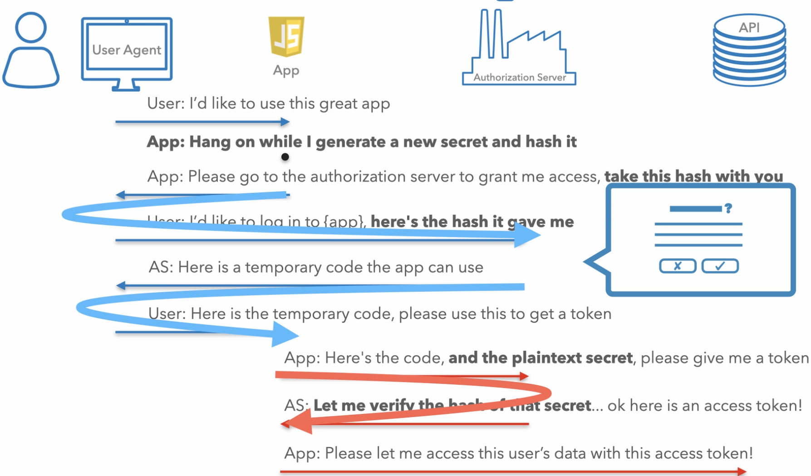

[Về root](../README.md)

# Mục lục

-   [Tổng quan về Authorization Code Flow cho SPA](#tổng-quan-về-authorization-code-flow-cho-spa)
-   [Các vai trò trong flow](#các-vai-trò-trong-flow)
-   [Quy trình chi tiết Authorization Code Flow](#quy-trình-chi-tiết-authorization-code-flow)
-   [Giới thiệu về PKCE](#giới-thiệu-về-pkce)
-   [Các tham số và giá trị trong request](#các-tham-số-và-giá-trị-trong-request)
-   [Trao đổi authorization code lấy access token](#trao-đổi-authorization-code-lấy-access-token)
-   [Tổng kết](#tổng-kết)

---

## Tổng quan về Authorization Code Flow cho SPA

Trong bài học này, chúng ta sẽ đi từng bước qua một quy trình authorization code flow hoàn chỉnh dành cho **single-page applications** chạy trên trình duyệt.

Ví dụ này sẽ sử dụng các URL mẫu thay vì server thực tế.

Chúng ta cũng sẽ đề cập đến một số điểm khác biệt mà bạn có thể gặp phải với các OAuth server ngoài thực tế. Ở cuối phần này, bạn sẽ có cơ hội tự thử nghiệm với một OAuth server thực tế. Khi xây dựng một ứng dụng JavaScript, hãy nhớ rằng bạn không thể triển khai bất kỳ thông tin xác thực nào như **client secret**.

Vì vậy, khi bạn đăng ký ứng dụng tại OAuth server, nếu server cho phép bạn khai báo loại ứng dụng đang xây dựng, thì nó sẽ không cung cấp **client secret** vì biết rằng bạn không thể sử dụng nó.

Với các ứng dụng JavaScript, bạn sẽ thực hiện flow chỉ với **client ID** mà không có **client secret**. Đầu tiên, chúng ta sẽ đi qua tóm tắt flow, sau đó từng bước chi tiết.

## Các vai trò trong flow

Ở phía trên, chúng ta có các vai trò đã định nghĩa trước đó.

Trong trường hợp này, người dùng sử dụng trình duyệt để truy cập ứng dụng, ứng dụng này chạy trong trình duyệt sau khi tải mã nguồn về.

Mặc dù điều này có vẻ hoàn toàn khác với ứng dụng chạy trên server, nhưng chúng ta vẫn nói về vai trò của từng thành phần.

Các vai trò này giống với ví dụ ứng dụng Web server ở phần trước.

Ứng dụng này chạy trên trình duyệt và cần một **access token** từ OAuth server để có thể gửi request tới API.

Mục tiêu cuối cùng là chuyển **access token** từ server tới ứng dụng. Lý tưởng nhất là ứng dụng nhận **access token** qua **back channel** để tránh xuất hiện trên thanh địa chỉ.

Dù là ứng dụng JavaScript trên trình duyệt, chúng ta vẫn có **back channel**. Trong trường hợp này, nghĩa là mã trong ứng dụng JavaScript tự gửi request tới OAuth server, thay vì truyền dữ liệu qua thanh địa chỉ.

Bạn có thể xem lại bài học về **front channel** và **back channel** để hiểu rõ hơn về sự khác biệt giữa hai cách truyền dữ liệu này.
[Front Channel vs Back Channel](../api_security_concepts/front_channel_&_back_channel.md)

## Quy trình chi tiết Authorization Code Flow

Quy trình bắt đầu khi người dùng nhấn nút đăng nhập, giống như việc người dùng nói: "Tôi muốn sử dụng ứng dụng này".

Trước khi ứng dụng chuyển hướng người dùng, nó sẽ tạo ra một chuỗi bí mật mới cho flow này. Đây không phải là **client secret**.

Đây là một chuỗi ngẫu nhiên mà ứng dụng tạo ra, phải khác nhau mỗi lần bắt đầu flow. Chuỗi này gọi là **PKCE code verifier**.

Ứng dụng giữ lại **code verifier** trong trình duyệt, thường lưu vào **LocalStorage** hoặc **SessionStorage**, sau đó tính toán hash của nó gọi là **code challenge**. Hash là thao tác một chiều, nên nếu ai đó biết giá trị hash thì không thể đảo ngược để tìm ra chuỗi bí mật.

Ứng dụng lấy hash này và đưa vào URL mà nó xây dựng, yêu cầu trình duyệt chuyển hướng tới OAuth server.

Ứng dụng chuyển hướng người dùng tới server với nhiều thông tin trong query string, bao gồm hash, **client ID**, **redirect URL** và **scope**.

Người dùng đến server, chuyển thông điệp mà ứng dụng gửi.

Đây là thông điệp đầu tiên gửi qua **front channel**. **Front channel** sử dụng thanh địa chỉ trình duyệt để truyền thông điệp giữa hai thành phần.

Thực chất, ứng dụng đang yêu cầu một số thông tin từ người dùng, nhưng thay vì gửi trực tiếp, nó chuyển yêu cầu cho trình duyệt của người dùng chuyển tới OAuth server.

Vì đây là request qua **front channel**, ứng dụng chỉ gửi hash của chuỗi bí mật thay vì gửi trực tiếp chuỗi bí mật.

Người dùng đến OAuth server, server yêu cầu đăng nhập, thực hiện xác thực đa yếu tố nếu cần.

Server yêu cầu xác nhận người dùng đang đăng nhập vào ứng dụng này.

Nếu đồng ý, server cần gửi người dùng trở lại ứng dụng và kèm theo **authorization code** tạm thời.

Server lấy **redirect URL** của ứng dụng, thêm **authorization code** vào query string, chuyển hướng trình duyệt người dùng về ứng dụng.

Đây là thông điệp thứ hai gửi qua **front channel**.

Thực chất, OAuth server chuyển **authorization code** về ứng dụng thông qua trình duyệt người dùng.

Vì là request qua **front channel**, OAuth server không thể chắc chắn rằng ứng dụng đã nhận được code.

Do đó, **authorization code** chỉ hợp lệ cho một lần sử dụng và phải được đổi trong thời gian ngắn, thường dưới một phút.

Khi ứng dụng có **authorization code**, nó sẽ gửi request qua **back channel** để đổi lấy **access token**.

Request này được gửi từ mã JavaScript của ứng dụng tới server, khác với request qua **front channel**.

Ứng dụng vẫn không có **client secret**, nhưng có chuỗi bí mật gốc đã tạo ở đầu flow.

Server kiểm tra request, xác nhận code vừa được cấp, chưa sử dụng, dành cho **client ID** này.

Server tính toán hash của **code verifier** trong request, so sánh với hash đã nhận trước đó. Nếu khớp, server biết rằng thành phần đổi **authorization code** chính là thành phần đã bắt đầu flow.

Server tạo **access token** và trả về trong response.

Flow hoàn tất, ứng dụng có thể gửi request tới API với **access token**.

## Giới thiệu về PKCE

Bước tính hash này là phần mở rộng **PKCE**.

**PKCE** ban đầu được phát triển cho ứng dụng di động để bảo vệ **authorization code**, vì không có **client secret** trên mobile.

Tuy nhiên, **PKCE** cũng bảo vệ khỏi một số tấn công ngay cả khi có **client secret**. Nó cũng hoạt động tốt trên trình duyệt với JavaScript.

## Các tham số và giá trị trong request

Chúng ta sẽ đi lại flow này từng bước, lần này xem xét các tham số và giá trị thực tế trong request.

Trước khi ứng dụng gửi người dùng tới OAuth server, nó tạo chuỗi ngẫu nhiên gọi là **code verifier**, có độ dài từ 43 đến 128 ký tự.

Ứng dụng tính toán hash SHA256 của chuỗi này, sau đó mã hóa bằng **base64-URL**. **Base64-URL-encoding** là base64-encoding với bộ ký tự hơi khác.

Bạn có thể dùng hàm base64 encode trong JavaScript rồi chuyển thành **Base64-URL-encode** bằng cách thay đổi một số ký tự.

Khi đã sẵn sàng, bạn xây dựng link để chuyển người dùng tới OAuth server.

Bạn sẽ tìm **authorization endpoint** bằng cách xem tài liệu của OAuth server hoặc sử dụng **metadata URL** của server để lấy thông tin từ mã nguồn.

Sau đó, bạn lấy URL này, thêm các thành phần query string, bắt đầu với `response_type=code`, thông báo cho server rằng bạn đang thực hiện authorization code flow. Tiếp theo, thêm **client ID** để OAuth server biết ứng dụng nào gửi request.

Bạn cũng cần thêm **redirect URL** của ứng dụng, phải trùng với một trong các URL đã đăng ký khi tạo ứng dụng.

Bạn cần xác định **scope** muốn yêu cầu từ API dựa trên API bạn truy cập.

Ví dụ: `photos`.

Tham số **state** ban đầu dùng để bảo vệ CSRF, nhưng **PKCE** cũng cung cấp bảo vệ này, nên bạn có thể dùng **state** để lưu trạng thái ứng dụng, ví dụ trang sẽ chuyển hướng sau khi đăng nhập như "card" hoặc "checkout".

Lưu ý: chỉ nên dùng cách này nếu chắc chắn server hỗ trợ **PKCE**. Nếu server không hỗ trợ **PKCE**, bạn vẫn cần tạo **state** là giá trị ngẫu nhiên. Nếu server không hỗ trợ **PKCE**, có thể bạn cũng không thể dùng authorization code flow cho SPA.

Cuối cùng, thêm **code challenge** (hash của **code verifier**) và phương thức hash sử dụng, ví dụ `S256` cho SHA256.

Tổng hợp các tham số này thành URL, chuyển hướng người dùng tới URL đó. Ứng dụng sẽ không thấy người dùng cho đến khi họ quay lại **redirect URL** với **authorization code**.

Người dùng đăng nhập và phê duyệt request tại OAuth server, server tạo **authorization code** dùng một lần, chuyển hướng người dùng về ứng dụng.

Có thể xảy ra lỗi, server sẽ chuyển hướng về ứng dụng với mã lỗi thay vì **authorization code**. Nếu thành công, người dùng sẽ trở lại ứng dụng tại **redirect URL**, kèm theo **authorization code** trong query string và giá trị **state** bạn đã đặt.

Kiểm tra lại giá trị **state** khớp, sau đó bạn sẵn sàng đổi **authorization code** lấy **access token**.

## Trao đổi authorization code lấy access token

Ở bước này, ứng dụng sẽ gửi request HTTPS qua **back channel** từ JavaScript tới **token endpoint** của server.

Đây là endpoint riêng biệt, bạn cũng cần tra cứu.

Request này là POST với body dạng form-encoded truyền thống.

Lưu ý: vì là POST request, nếu **token endpoint** nằm trên domain khác với ứng dụng, OAuth server cần cấu hình CORS đúng để cho phép request từ domain ứng dụng.

Các tham số trong request này gồm: `grant_type=authorization_code`, thông báo cho server bạn đang thực hiện authorization code flow.

Bạn sẽ dùng **authorization code** nhận được trong query string, cùng với **redirect URI** đã dùng trong request trước.

Vì dùng **PKCE**, bạn cần gửi **code verifier** (chuỗi plaintext đã tạo ở đầu flow).

Bạn không có **client secret**, nhưng vẫn cần gửi **client ID**.

Nếu mọi thứ hợp lệ, authorization server sẽ trả về **access token**. Ngoài ra còn có thời gian hết hạn token và có thể có **refresh token**. Ứng dụng hoàn tất flow và có thể dùng **access token** để gửi request tới API.

## Tổng kết

Đó là quy trình authorization code flow cho ứng dụng JavaScript, bao gồm bước sử dụng **PKCE** để bảo vệ flow.
