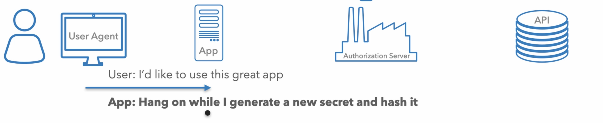
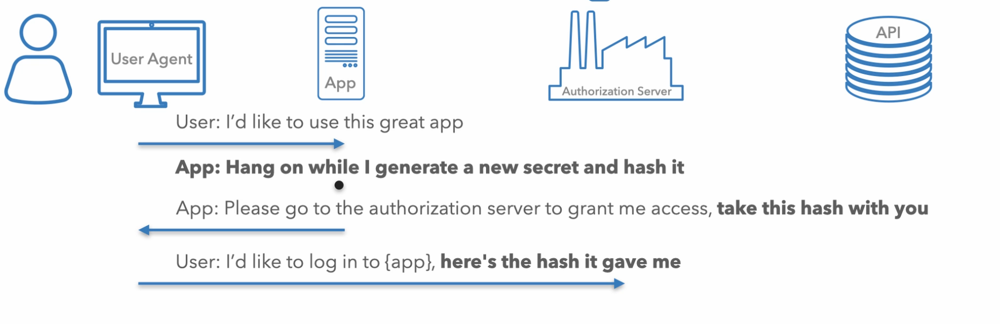
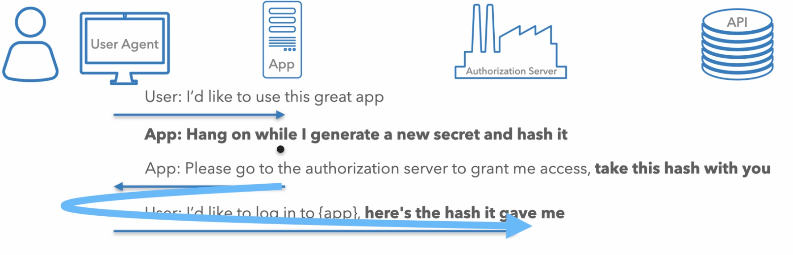
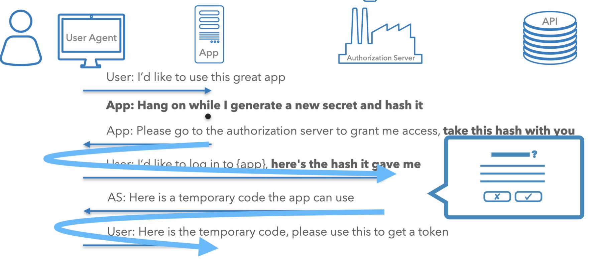
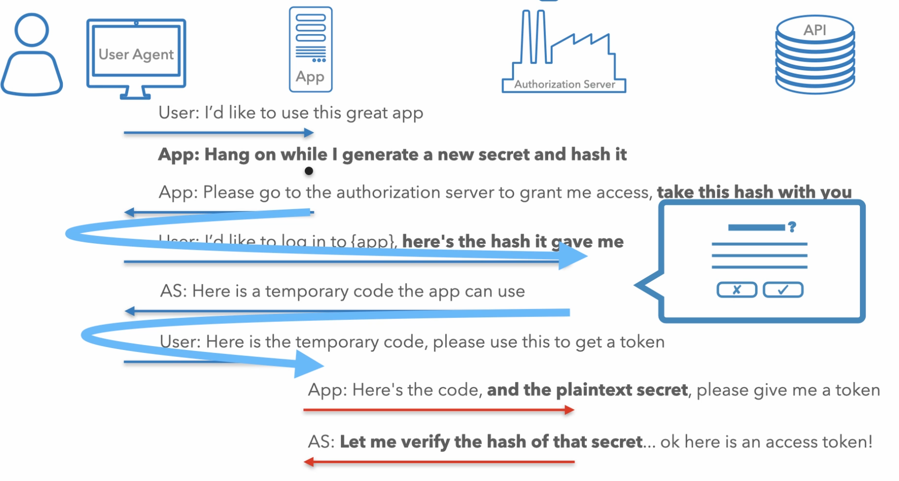
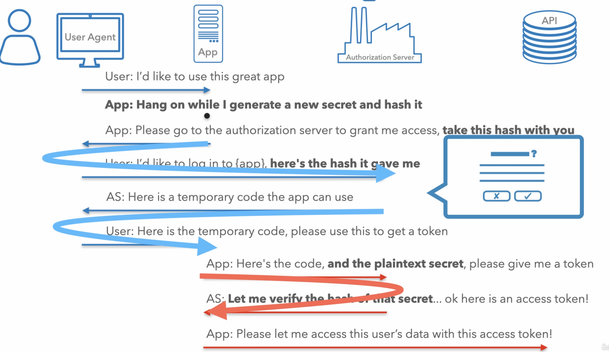

#[Về root](../README.md)

# Mục lục

-   [Tổng quan về Authorization Code Flow cho Web Application](#tổng-quan-về-authorization-code-flow-cho-web-application)
-   [Các bước thực hiện Authorization Code Flow](#các-bước-thực-hiện-authorization-code-flow)
-   [Giới thiệu về PKCE](#giới-thiệu-về-pkce)
-   [Chi tiết các tham số và giá trị sử dụng trong request](#chi-tiết-các-tham-số-và-giá-trị-sử-dụng-trong-request)
-   [Sử dụng Refresh Token](#sử-dụng-refresh-token)
-   [Lưu ý về PKCE cho confidential client](#lưu-ý-về-pkce-cho-confidential-client)

---

## Tổng quan về Authorization Code Flow cho Web Application

Trong bài học này, chúng ta sẽ đi từng bước qua một quy trình authorization code flow hoàn chỉnh cho web application. Ví dụ này sẽ minh họa với các URL mẫu, đồng thời đề cập đến một số điểm khác biệt bạn có thể gặp với các OAuth server ngoài thực tế.

Kết thúc phần này, bạn sẽ có cơ hội tự thử nghiệm với một OAuth server thực tế. Sau khi đăng ký ứng dụng với OAuth server và có client ID cùng secret, bạn đã sẵn sàng bắt đầu flow.

Đầu tiên, chúng ta sẽ đi qua tóm tắt quy trình, sau đó từng bước chi tiết. Ở phía trên là các vai trò đã định nghĩa trước đó.

Người dùng sử dụng trình duyệt để truy cập ứng dụng, ứng dụng này cần access token từ OAuth server để thực hiện các request tới API.

Mục tiêu cuối cùng là chuyển access token từ server đến ứng dụng. Lý tưởng nhất là ứng dụng nhận access token qua back channel, giúp token không xuất hiện trên trình duyệt.

Với ứng dụng chạy trên web server, nếu access token được truyền qua back channel, trình duyệt sẽ không thấy access token, đây là lựa chọn an toàn nhất.

## Các bước thực hiện Authorization Code Flow

Quy trình bắt đầu khi người dùng nhấn nút đăng nhập, nghĩa là họ muốn sử dụng ứng dụng.

Trước khi app redirect người dùng, nó tạo ra một secret mới cho flow này (không phải client secret). Đây là một chuỗi ngẫu nhiên app tạo ra, khác nhau mỗi lần bắt đầu flow.

Chuỗi này gọi là PKCE Code Verifier.

App giữ code verifier trên server và tính toán hash của nó, gọi là Code Challenge. Hash là thao tác một chiều, biết giá trị hash không thể suy ra secret ban đầu.

App đưa hash này vào URL để chuyển hướng trình duyệt tới server, kèm theo các tham số như hash, client ID, redirect URL và scope.

Người dùng sẽ đến server với thông điệp app gửi.

Đây là thông điệp đầu tiên gửi qua front channel.

Front channel sử dụng thanh địa chỉ trình duyệt để gửi thông điệp giữa hai máy tính khác nhau. App yêu cầu một số thông tin từ server, nhưng thay vì gửi trực tiếp, nó nhờ người dùng chuyển tiếp tới OAuth server.

Vì đây là request qua front channel, không thể đảm bảo không bị nghe lén, nên app chỉ gửi hash của secret thay vì secret thật.

Người dùng đến OAuth server, server yêu cầu đăng nhập, thực hiện xác thực đa yếu tố nếu cần, rồi xác nhận đăng nhập vào app.

Nếu đồng ý, server sẽ gửi người dùng trở lại app kèm theo authorization code dùng một lần.

Server lấy redirect URI của app, thêm authorization code vào query string và chuyển hướng trình duyệt về app.

Đây là thông điệp thứ hai qua front channel.

Vì là front channel, server không thể chắc chắn code đã đến app, nên authorization code chỉ dùng một lần và phải sử dụng trong thời gian ngắn (thường dưới một phút).

Sau khi app nhận authorization code từ request của trình duyệt, app sẽ gửi request back channel tới OAuth server để đổi lấy access token. Request này gửi từ server của app tới OAuth server, không qua trình duyệt.

Request này bao gồm authorization code, client ID, client secret và PKCE secret (code verifier) ban đầu.

Server kiểm tra request, xác nhận code chưa dùng, đúng client, đúng client secret, và so sánh hash của code verifier với code challenge ban đầu. Nếu khớp, server tạo access token và trả về.

Kết thúc flow, app có thể sử dụng access token để gọi API.

## Giới thiệu về PKCE

Bạn có thể nhận thấy các tham số Code Challenge và Code Verifier đến từ extension PKCE.

PKCE ban đầu phát triển cho mobile app, nhưng hiện tại được khuyến nghị cho mọi loại ứng dụng, kể cả khi có client secret.

Lý do là vì vẫn có thể xảy ra tấn công hoán đổi authorization code, khiến đăng nhập vào tài khoản của người khác mà app và server không biết. Đây gọi là authorization code injection attack. PKCE giúp ngăn chặn tấn công này, nên được khuyến nghị cho cả confidential client.

## Chi tiết các tham số và giá trị sử dụng trong request

Trước khi app chuyển hướng người dùng tới OAuth server, nó tạo một chuỗi ngẫu nhiên gọi là code verifier (43-128 ký tự). Sau đó, tính hash SHA256 của chuỗi này và base64 URL encode kết quả.

Sau đó, xây dựng link gửi người dùng tới OAuth server, tìm authorization endpoint qua tài liệu hoặc metadata URL.

Thêm các tham số vào query string:

-   `response_type=code`: báo server sử dụng authorization code flow.
-   `client_id`: xác định app gửi request.
-   `redirect_uri`: phải trùng với URI đã đăng ký.
-   `scope`: quyền truy cập API.
-   `state`: ban đầu dùng cho CSRF protection, nhưng PKCE cũng bảo vệ nên có thể dùng lưu trạng thái app (ví dụ trang cần redirect sau đăng nhập). Chỉ nên dùng cách này nếu chắc chắn server hỗ trợ PKCE, nếu không thì phải là giá trị ngẫu nhiên.
-   `code_challenge`: hash của code verifier.
-   `code_challenge_method=S256`: dùng SHA256.

Tạo URL với các tham số trên và chuyển hướng người dùng tới server để đăng nhập.

Sau khi người dùng đăng nhập và đồng ý, OAuth server tạo authorization code dùng một lần và chuyển hướng về app.

Nếu có lỗi, server sẽ redirect về app với error code thay vì authorization code.

Khi nhận được authorization code, kiểm tra lại state để bảo vệ CSRF, sau đó đổi authorization code lấy access token bằng request back channel tới token endpoint (cần tra cứu endpoint này).

Request này là POST với body dạng form-encoded, gồm các tham số:

-   `grant_type=authorization_code`
-   `code`: authorization code nhận được
-   `redirect_uri`: giống lúc request
-   `code_verifier`: secret ban đầu
-   `client_id` và `client_secret`: thông tin app

Một số server yêu cầu client ID và secret trong body, số khác yêu cầu trong header (Basic OAuth header), cần kiểm tra tài liệu server.

Nếu thành công, server trả về access token, thời gian hết hạn và có thể cả refresh token.

## Sử dụng Refresh Token

Nếu nhận được refresh token, khi access token hết hạn, app có thể dùng refresh token để lấy access token mới mà không cần thực hiện lại toàn bộ flow.

Request này cũng là POST tới token endpoint, với `grant_type=refresh_token` và kèm refresh token trong body, cùng client ID và secret.

Nếu refresh token còn hiệu lực, server trả về access token mới và có thể cả refresh token mới. Nếu không, app phải thực hiện lại flow từ đầu.

## Lưu ý về PKCE cho confidential client

Một số OAuth server ngoài thực tế chưa hỗ trợ PKCE cho confidential client do khuyến nghị này còn mới. Trong trường hợp đó, nên đề xuất server bổ sung PKCE.

Tuy nhiên, bạn vẫn có thể gửi tham số PKCE trong request, server sẽ bỏ qua nếu không nhận ra. Như vậy, bạn có thể xây dựng OAuth client hỗ trợ PKCE ngay hôm nay, và khi server cập nhật, không cần sửa lại ứng dụng.

Trong bài học tiếp theo, chúng ta sẽ thử nghiệm authorization code flow với một OAuth server thực tế.
