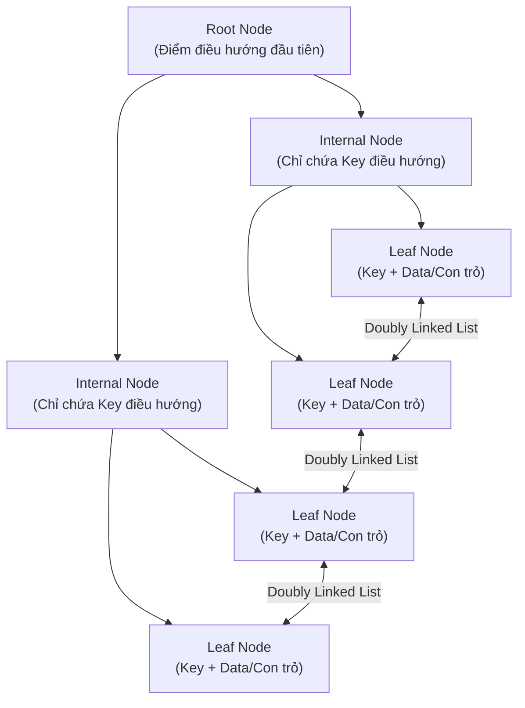
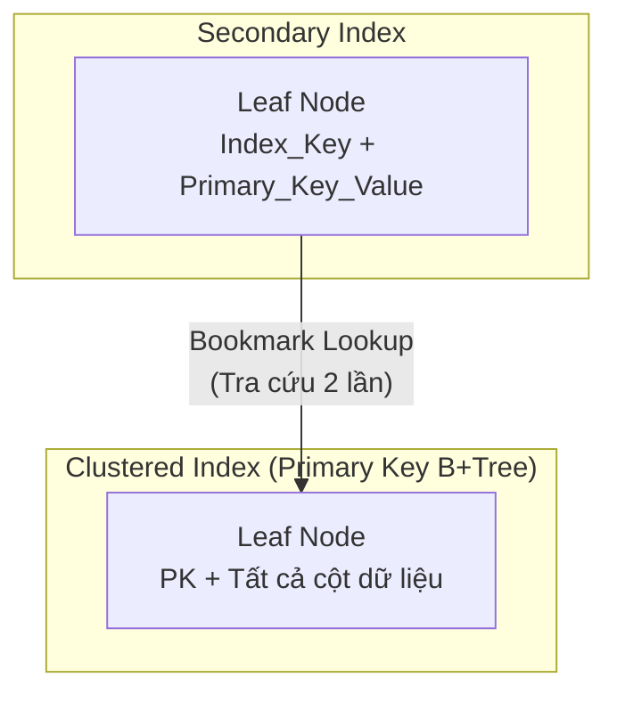

# Chương 2. Index Internals & Covering Index

## Table of Contents

- [Cấu trúc Dữ liệu B+Tree trong CSDL](#cấu-trúc-dữ-liệu-btree-trong-csdl)
- [Clustered Index vs Secondary Index](#clustered-index-vs-secondary-index)
- [Tối ưu hóa B-Tree Index trong PostgreSQL (v12 - v17)](#tối-ưu-hóa-b-tree-index-trong-postgresql-v12---v17)
- [Covering Index và Index-Only Scan](#covering-index-và-index-only-scan)

---

## Cấu trúc Dữ liệu B+Tree trong CSDL

Hầu hết các CSDL quan hệ sử dụng **B+Tree** làm cấu trúc chỉ mục tiêu chuẩn. Cấu trúc B+Tree gồm 3 tầng:



| Thành phần | Vai trò/Mô tả | Details |
| :--- | :--- | :--- |
| **Root Node** | Điểm điều hướng đầu tiên của mọi truy vấn B+Tree. | Chỉ có duy nhất 1 Root Node per Index. |
| **Internal Nodes** | Chỉ chứa Key và con trỏ điều hướng tới cấp tiếp theo — không chứa Data. | Giúp giữ chiều cao cây B+Tree thấp ($O(\log N)$). |
| **Leaf Nodes** | Chứa Key và dữ liệu thực tế (hoặc con trỏ tới dữ liệu). Nối nhau bằng **Doubly Linked List**. | Giúp **Range Scan** đạt hiệu năng cao. |

---

## Clustered Index vs Secondary Index

### Trong MySQL InnoDB

Bảng chính **chính là Clustered Index** — toàn bộ dữ liệu được sắp xếp và lưu trữ trong B+Tree theo thứ tự Primary Key.



| Thành phần | Mô tả | Details |
| :--- | :--- | :--- |
| **Clustered Index** | Leaf Node chứa **toàn bộ dữ liệu** của tất cả các cột trong dòng. | Index-Organized Table (IOT). |
| **Secondary Index** | Leaf Node chỉ chứa `(Index_Key, Primary_Key_Value)`. | Kích thước gọn nhẹ. |
| **Bookmark Lookup** | Tìm `Primary_Key` trên Secondary Index, rồi tra lần 2 trên Clustered Index để lấy full row. | Tốn 2 lần duyệt cây B+Tree nếu không cover. |

### Trong PostgreSQL

Dữ liệu nằm ở **bảng Heap độc lập**. Tất cả Index (chính hay phụ) đều có vai trò kỹ thuật ngang nhau.

* Leaf Node của Index trong Postgres chứa `(Index_Key, ctid)`.
* `ctid` chỉ thẳng tới vị trí `(Block_Number, Offset)` trong Heap Table.
* **Điểm yếu:** Khi tuple đổi vị trí (do `UPDATE` tạo tuple mới), `ctid` thay đổi $\rightarrow$ Postgres buộc phải cập nhật `ctid` mới lên **tất cả** Secondary Index của bảng đó (trừ khi đạt điều kiện HOT).

### Bảng So sánh Cấu trúc Index

| Tiêu chí | MySQL InnoDB | PostgreSQL | Details |
| :--- | :--- | :--- | :--- |
| **Cấu trúc lưu trữ chính** | Clustered Index (B+Tree) | Heap Table (độc lập) | Khác biệt kiến trúc nền tảng. |
| **Leaf Node của Primary Index** | Chứa full row data | Chứa `(Index_Key, ctid)` | MySQL tập trung dữ liệu tại PK. |
| **Leaf Node của Secondary Index** | Chứa `(Index_Key, Primary_Key)` | Chứa `(Index_Key, ctid)` | Postgres lưu con trỏ vật lý `ctid`. |
| **UPDATE ảnh hưởng Secondary Index** | Chỉ khi Primary Key thay đổi | Luôn phải cập nhật `ctid` (trừ khi đạt HOT) | MySQL tránh Write Amplification khi UPDATE. |

---

## Tối ưu hóa B-Tree Index trong PostgreSQL (v12 - v17)

Để khắc phục nhược điểm Index phình to và Write Amplification, PostgreSQL đã giới thiệu các cải tiến kiến trúc B-Tree Index quan trọng:

### 1. B-Tree Index Deduplication (PostgreSQL 12+)

Tính năng **Deduplication** tự động gộp các key trùng lặp trong trang B-Tree Index thành một danh sách các `ctid` đi kèm, thay vì lưu lặp lại key đó cho từng bản ghi:

```text
Trước PG 12: [KeyA, ctid1], [KeyA, ctid2], [KeyA, ctid3]  -> Tốn 3 x Key Space
Từ PG 12+:   [KeyA -> ctid1, ctid2, ctid3]                -> Tiết kiệm 30% - 50% RAM/Disk
```

### 2. On-the-fly B-Tree Index Vacuuming (PostgreSQL 14+)

Từ Postgres 14, khi một câu lệnh `SELECT` duyệt B-Tree Index và phát hiện các dead index tuples, Postgres có khả năng **xóa sạch dead index tuples ngay trong quá trình thực thi truy vấn**, giúp Index luôn gọn gàng mà không phải chờ Autovacuum chạy qua.

| Tính năng | Phiên bản | Tác dụng | Details |
| :--- | :---: | :--- | :--- |
| **B-Tree Deduplication** | Postgres 12+ | Giảm **30% - 50%** dung lượng đĩa cho các Secondary Index không phải UNIQUE. | Tự động kích hoạt cho B-Tree. |
| **On-the-fly Index Clean** | Postgres 14+ | Loại bỏ dead tuples trực tiếp khi `SELECT` đi qua Index Page. | Giảm thiểu Index Bloat đáng kể. |
| **Covering Index `INCLUDE`** | Postgres 11+ | Lưu payload phụ ở Leaf Node, loại bỏ Bookmark Lookup/Heap Scan. | Tối ưu hóa Index-Only Scan. |

---

## Covering Index và Index-Only Scan

**Covering Index** là trạng thái tối ưu tuyệt đối của truy vấn: CSDL lấy được **toàn bộ dữ liệu cần thiết ngay tại Leaf Node của Index** mà không phải tốn Disk I/O để nhảy về bảng chính (Heap Scan hoặc Clustered Index Lookup).

### Công thức kích hoạt Covering Index

Tất cả cột mà truy vấn cần phải **nằm hoàn toàn bên trong** tập hợp các cột của Index:

```text
SELECT_columns ∪ WHERE_columns ∪ ORDER_BY_columns ∪ GROUP_BY_columns ⊆ Index_columns
```

### Triển khai trên PostgreSQL — Từ khóa `INCLUDE`

Từ Postgres 11, từ khóa `INCLUDE` cho phép tách biệt rõ ràng giữa **Key dùng để tìm kiếm** và **Payload mang theo**:

```sql
-- Tạo Covering Index mang theo payload status và total_amount
CREATE INDEX idx_orders_user ON orders(user_id)
INCLUDE (status, total_amount);
```

* `user_id`: Nằm ở các nút B+Tree, dùng để định vị nhanh.
* `status`, `total_amount`: Chỉ nằm ở Leaf Node làm payload, không tốn tài nguyên so sánh hoặc sắp xếp B+Tree.

> [!IMPORTANT]
> Để kích hoạt **Index-Only Scan**, Postgres bắt buộc phải kiểm tra **Visibility Map (VM)**. Nếu VM xác nhận Data Page là `ALL-VISIBLE` (tất cả tuple đã committed, không có dead tuple), Postgres mới bỏ qua Heap Page. Nếu chưa `ALL-VISIBLE`, Postgres vẫn phải đọc Heap Page để kiểm tra `xmin`/`xmax`.

### Triển khai trên MySQL — Composite Index

MySQL không có từ khóa `INCLUDE`. Thay vào đó, ta tạo **Composite Index** chứa tất cả các cột cần thiết:

```sql
-- Composite Index phủ toàn bộ cột cần thiết trong truy vấn
CREATE INDEX idx_orders_user_status_total
ON orders(user_id, status, total_amount);
```

Khi chạy `EXPLAIN`, cột `Extra` xuất hiện từ khóa **`Using index`** — xác nhận MySQL đã loại bỏ được bước Bookmark Lookup về Clustered Index.

---

[← Back to README](README.md)
