# Encryption: Tổng quan, Thuật toán và Nền tảng Toán học

## Mục lục

- [1. Tổng quan & Thành phần của Encryption](#1-tổng-quan--thành-phần-của-encryption)
- [2. Mục tiêu của Encryption](#2-mục-tiêu-của-encryption)
- [3. Phân loại Mã hóa](#3-phân-loại-mã-hóa)
- [4. Mã hóa Đối xứng (Symmetric Encryption)](#4-mã-hóa-đối-xứng-symmetric-encryption)
- [5. Mã hóa Bất đối xứng (Asymmetric Encryption)](#5-mã-hóa-bất-đối-xứng-asymmetric-encryption)
- [6. Nền tảng Toán học & Hiệu năng](#6-nền-tảng-toán-học--hiệu-năng)
- [7. Mã hóa Lai (Hybrid Encryption) trong HTTPS/TLS](#7-mã-hóa-lai-hybrid-encryption-trong-httpstls)
- [8. So sánh Symmetric vs Asymmetric Encryption](#8-so-sánh-symmetric-vs-asymmetric-encryption)
- [9. Ưu điểm và Thách thức](#9-ưu-điểm-và-thách-thức)
- [10. Tương lai của Encryption](#10-tương-lai-của-encryption)
- [11. Tổng kết & Ý tưởng Cốt lõi](#11-tổng-kết--ý-tưởng-cốt-lõi)

---

## 1. Tổng quan & Thành phần của Encryption

**Encryption (Mã hóa)** là quá trình chuyển đổi dữ liệu có thể đọc được (**Plaintext**) thành dữ liệu không thể đọc (**Ciphertext**) bằng một thuật toán mã hóa và khóa (Key).

Chỉ những thực thể sở hữu khóa giải mã phù hợp mới có thể khôi phục lại dữ liệu ban đầu.

Bảng bên dưới mô tả các thành phần cơ bản trong một quy trình mã hóa:

| Thành phần/Bước | Vai trò/Mô tả | Chi tiết |
| :--- | :--- | :--- |
| **Plaintext** | Dữ liệu gốc ban đầu | Dữ liệu dạng văn bản hoặc nhị phân chưa qua xử lý mã hóa |
| **Encryption Algorithm** | Thuật toán mã hóa | Tập hợp các quy tắc toán học để biến đổi Plaintext thành Ciphertext |
| **Encryption Key** | Khóa mã hóa | Chuỗi dữ liệu đầu vào kết hợp cùng thuật toán để thực hiện mã hóa/giải mã |
| **Ciphertext** | Dữ liệu sau mã hóa | Dữ liệu đã bị xáo trộn, không thể đọc nếu không có khóa giải mã |

Sơ đồ dưới đây thể hiện luồng xử lý cơ bản của quá trình mã hóa dữ liệu:

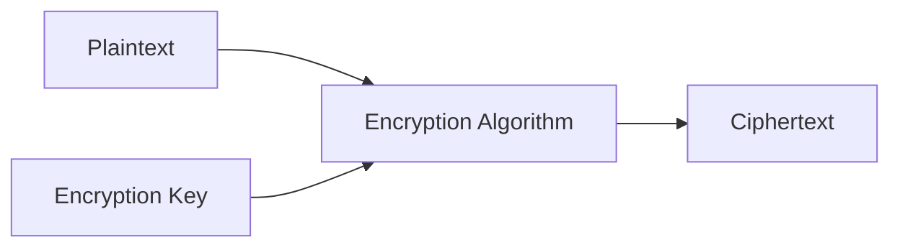

---

## 2. Mục tiêu của Encryption

Mã hóa đóng vai trò nền tảng trong an toàn thông tin, đáp ứng 5 mục tiêu bảo mật cốt lõi:

* **Confidentiality (Tính bảo mật):** Đảm bảo chỉ người có thẩm quyền (sở hữu khóa) mới đọc được dữ liệu.
* **Integrity (Tính toàn vẹn):** Phát hiện mọi sự thay đổi hoặc can thiệp trái phép vào dữ liệu.
* **Authentication (Tính xác thực):** Xác minh danh tính của thực thể gửi hoặc tạo ra dữ liệu.
* **Non-repudiation (Chống chối bỏ):** Ngăn chặn việc thực thể phủ nhận hành vi đã gửi hoặc tạo dữ liệu.
* **Access Control (Kiểm soát truy cập):** Giới hạn quyền tiếp cận dữ liệu dựa trên việc phân phối khóa.

Sơ đồ mindmap tổng hợp các mục tiêu bảo mật:

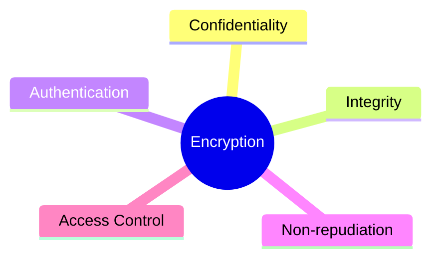

---

## 3. Phân loại Mã hóa

Các thuật toán mã hóa hiện đại được chia thành hai nhóm chính dựa trên cơ chế sử dụng khóa: **Symmetric Encryption (Mã hóa đối xứng)** và **Asymmetric Encryption (Mã hóa bất đối xứng)**.

Sơ đồ phân loại tổng quan các thuật toán mã hóa phổ biến:

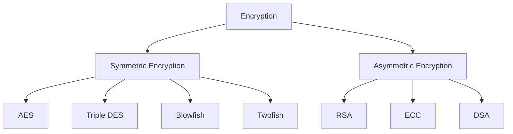

---

## 4. Mã hóa Đối xứng (Symmetric Encryption)

### Đặc điểm

* Sử dụng **cùng một khóa** cho cả hai quá trình mã hóa và giải mã.
* Tốc độ xử lý và hiệu năng rất cao.
* Thích hợp mã hóa lượng dữ liệu lớn (file, truyền tải mạng).
* Đòi hỏi cơ chế truyền và quản lý khóa bí mật (Shared Secret Key) an toàn giữa các bên.

Sơ đồ tuần tự minh họa luồng trao đổi dữ liệu mã hóa đối xứng:

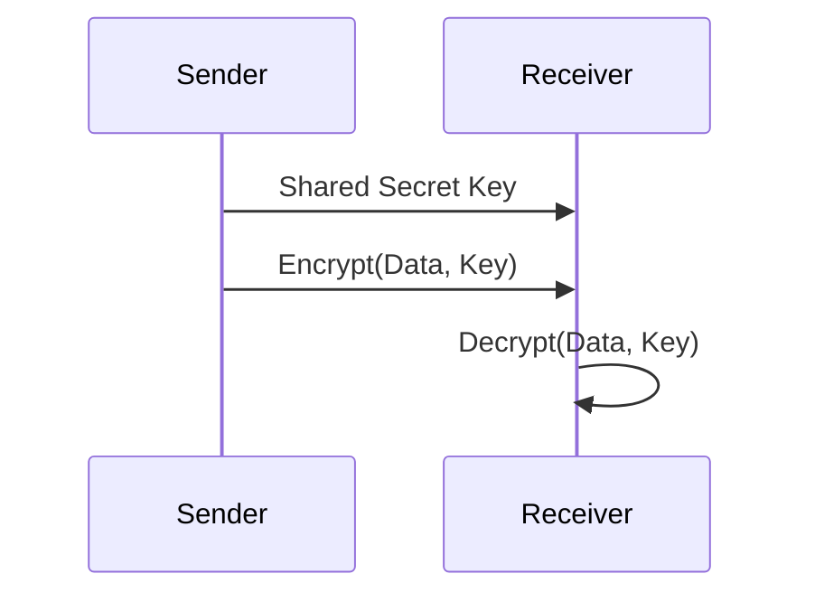

### Các thuật toán phổ biến

1. **AES (Advanced Encryption Standard)**
   * Chuẩn mã hóa đối xứng hiện đại và phổ biến nhất.
   * Kích thước khối (Block size): `128-bit`.
   * Độ dài khóa (Key length): `128`, `192`, hoặc `256 bit`.
   * Tốc độ xử lý tối ưu, hỗ trợ phần cứng tốt.
2. **Triple DES (3DES)**
   * Phiên bản cải tiến thực hiện thuật toán DES 3 lần liên tiếp.
   * Mức độ bảo mật cao hơn DES nguyên bản nhưng tốc độ chậm.
   * Hiện tại đã bị thay thế hầu hết bởi AES.
3. **Blowfish**
   * Thuật toán mã hóa khối dạng Feistel Cipher.
   * Độ dài khóa linh hoạt từ `32 bit` đến `448 bit`.
   * Miễn phí bản quyền, sử dụng tự do.
4. **Twofish**
   * Thuật toán kế nhiệm Blowfish với độ dài khóa lên tới `256 bit`.
   * Tối ưu hóa hiệu năng cao cho cả thiết bị phần mềm lẫn phần cứng.

---

## 5. Mã hóa Bất đối xứng (Asymmetric Encryption)

### Đặc điểm

* Sử dụng **cặp khóa bất đối xứng**: **Public Key (Khóa công khai)** và **Private Key (Khóa bí mật)**.
* Public Key dùng để mã hóa dữ liệu (hoặc xác minh chữ ký).
* Private Key giữ bí mật, dùng để giải mã (hoặc tạo chữ ký số).
* Thích hợp cho bài toán trao đổi khóa an toàn, xác thực danh tính và chữ ký số.

Sơ đồ tuần tự truyền tin sử dụng cặp khóa bất đối xứng:

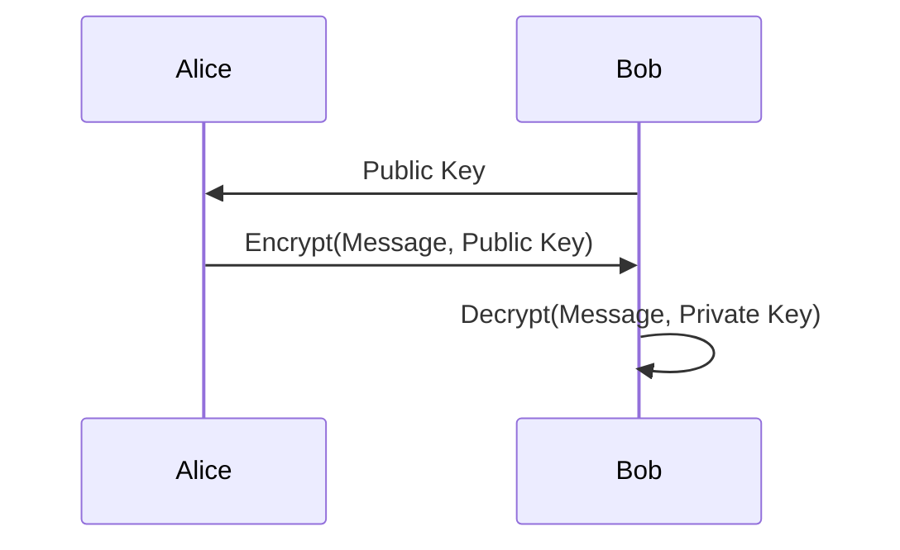

### Các thuật toán phổ biến

1. **RSA (Rivest–Shamir–Adleman)**
   * Dựa trên bài toán phân tích số nguyên lớn ra thừa số nguyên tố (Integer Factorization Problem).
   * Thuật toán mã hóa bất đối xứng lâu đời và phổ biến nhất.
2. **ECC (Elliptic Curve Cryptography)**
   * Dựa trên bài toán lôgarit rời rạc trên đường cong Elliptic (ECDLP).
   * Cung cấp độ bảo mật tương đương RSA nhưng với kích thước khóa nhỏ hơn đáng kể.
   * Tối ưu hiệu năng, đặc biệt phù hợp cho thiết bị di động và IoT.
3. **DSA (Digital Signature Algorithm)**
   * Dựa trên bài toán lôgarit rời rạc (Discrete Logarithm Problem).
   * Chuyên biệt cho việc tạo và xác minh chữ ký số, không dùng để mã hóa nội dung dữ liệu.

---

## 6. Nền tảng Toán học & Hiệu năng

Sự khác biệt cốt lõi về hiệu năng giữa Mã hóa Đối xứng và Bất đối xứng xuất phát từ **bài toán toán học nền tảng** mà chúng áp dụng.

Sơ đồ mối quan hệ giữa bài toán toán học, thuật toán, hiệu năng và độ bảo mật:

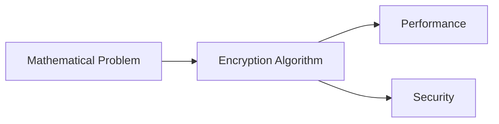

### Bản chất Toán học của Symmetric Encryption (AES)

Các thuật toán như AES **không dựa vào một bài toán số học "khó" kinh điển** (như phân tích số nguyên tố). Thay vào đó, chúng áp dụng các nguyên lý thiết kế mật mã học:

* **Confusion (Sự hỗn loạn):** Làm phức tạp mối quan hệ giữa Key và Ciphertext.
* **Diffusion (Sự khuếch tán):** Thay đổi 1 bit của Plaintext sẽ dẫn tới sự thay đổi ngẫu nhiên của 50% các bit trong Ciphertext.
* **Substitution & Permutation (Thế & Hoán vị):** Thay thế giá trị byte và hoán vị vị trí các bit liên tục qua nhiều vòng (rounds).

Các phép toán chính trong AES bao gồm: `XOR`, `SubBytes`, `ShiftRows`, `MixColumns`, `AddRoundKey` trên trường hữu hạn $GF(2^8)$. Đây là các phép toán biến đổi bit có độ phức tạp tuyến tính, cực kỳ nhanh và dễ tối ưu bằng tập lệnh xử lý của CPU.

Sơ đồ các bước toán học biến đổi từng vòng trong AES:

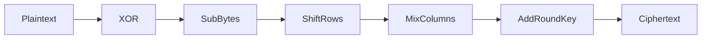

### Bản chất Toán học của Asymmetric Encryption (RSA & ECC)

Ngược lại, các thuật toán bất đối xứng dựa trên những bài toán toán học được chứng minh là cực kỳ khó giải theo thời gian tính toán.

> [!NOTE]
> **Bài toán phân tích số nguyên lớn (RSA):**
> Cho $n = p \times q$. Việc tính tích $n$ từ hai số nguyên tố lớn $p, q$ rất dễ. Tuy nhiên, khi chỉ biết $n$, việc tìm lại $p$ và $q$ là cực kỳ khó (không khả thi về mặt tính toán với công nghệ hiện tại khi $n \ge 2048\text{ bit}$).

> [!NOTE]
> **Bài toán Lôgarit Rời rạc trên Đường cong Elliptic (ECC):**
> Cho điểm $P$ trên đường cong và $Q = k \times P$. Tính $Q$ khi biết $k$ và $P$ rất nhanh, nhưng tìm lại số nguyên $k$ khi chỉ có $P$ và $Q$ (ECDLP) đòi hỏi chi phí tính toán khổng lồ.

### So sánh Bài toán Nền tảng & Độ phức tạp Tính toán

Bảng tổng hợp bài toán nền tảng và chi phí tính toán giữa các thuật toán:

| Thuật toán | Bài toán nền tảng | Kích thước khóa điển hình | Chi phí tính toán |
| :--- | :--- | :--- | :--- |
| **AES** | Substitution + Permutation + Arithmetic $GF(2^8)$ | `128 / 192 / 256 bit` | Rất thấp (Tuyến tính) |
| **RSA** | Integer Factorization Problem (IFP) | `2048 / 4096 bit` | Rất cao (Số nguyên lớn) |
| **ECC** | Elliptic Curve Discrete Logarithm Problem (ECDLP) | `256 / 384 bit` | Trung bình |
| **DSA** | Discrete Logarithm Problem (DLP) | `2048 / 3072 bit` | Trung bình |

Sơ đồ phân loại bài toán toán học cho từng thuật toán:

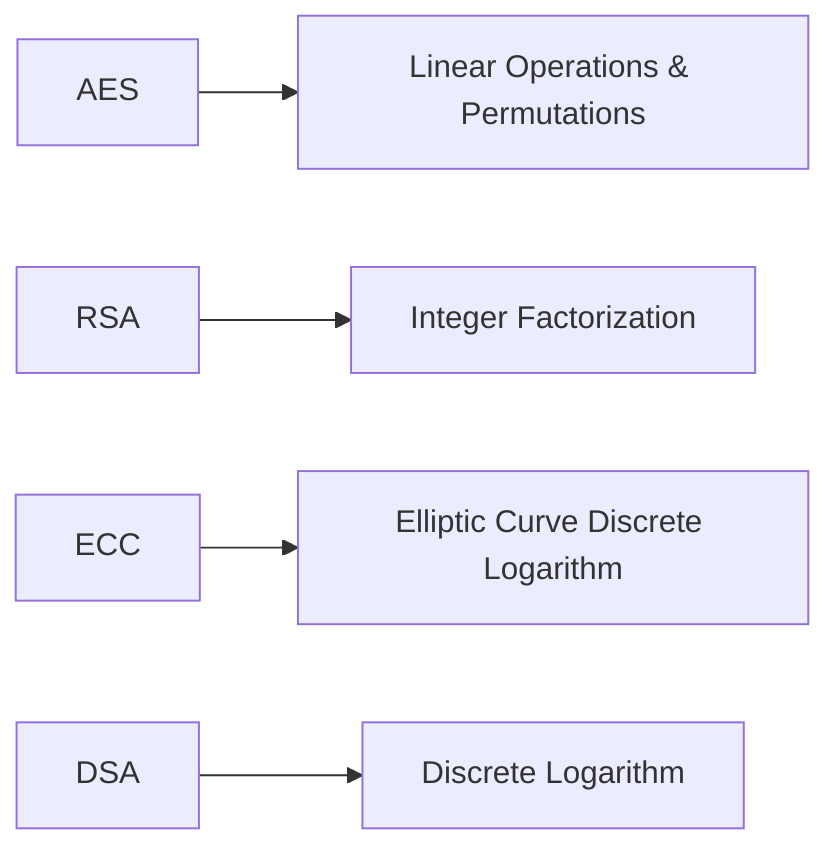

### Vì sao RSA chậm hơn AES?

RSA phải thực hiện các phép lũy thừa theo mô-đun (Modular Exponentiation) và nhân số nguyên lớn trên các chuỗi 2048–4096 bit. Phép toán này đòi hỏi chi phí CPU lớn hơn gấp hàng nghìn lần so với các phép biến đổi bit đơn giản (`XOR`, `Shift`, `Lookup Table`) của AES.

Sơ đồ so sánh khối lượng tính toán giữa AES và RSA:

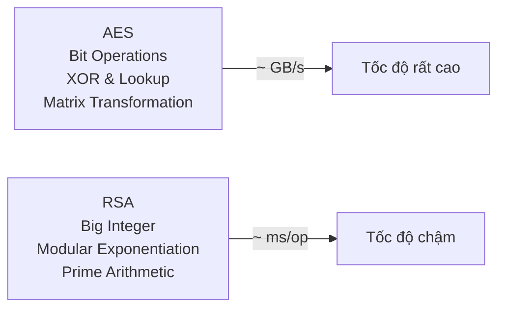

---

## 7. Mã hóa Lai (Hybrid Encryption) trong HTTPS/TLS

Vì mã hóa bất đối xứng (RSA/ECC) xử lý rất chậm, nếu sử dụng RSA để mã hóa toàn bộ dữ liệu truyền tải trên mạng:
* CPU server và client sẽ quá tải.
* Độ trễ (latency) tăng cao.
* Băng thông (throughput) bị tụt giảm nghiêm trọng.

Do đó, các giao thức bảo mật thực tế như **HTTPS / TLS** áp dụng mô hình **Hybrid Encryption (Mã hóa lai)** để tận dụng ưu điểm của cả hai loại mã hóa:

1. **Dùng Asymmetric (RSA/ECC):** Để trao đổi khóa an toàn và xác thực danh tính server/client ở giai đoạn bắt tay (Handshake).
2. **Dùng Symmetric (AES):** Để mã hóa toàn bộ dữ liệu ứng dụng (Application Data) truyền tải sau đó với tốc độ cao.

Sơ đồ luồng hoạt động của mô hình Hybrid Encryption:

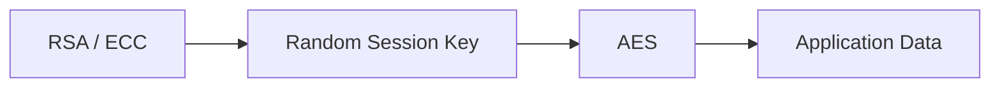

Bảng các bước triển khai Hybrid Encryption trong kết nối TLS:

| Thành phần/Bước | Vai trò/Mô tả | Chi tiết |
| :--- | :--- | :--- |
| **1. Khởi tạo** | Client & Server | Client kết nối và nhận Public Key (Certificate) từ Server |
| **2. Tạo Session Key** | Client | Client sinh ra một `Session Key` ngẫu nhiên dùng cho mã hóa đối xứng |
| **3. Mã hóa Khóa** | Client | `Session Key` được mã hóa bằng Public Key của Server (Mã hóa bất đối xứng) |
| **4. Giải mã Khóa** | Server | Server dùng Private Key tương ứng để giải mã lấy lại `Session Key` |
| **5. Truyền dữ liệu** | Client & Server | Cả hai bên sử dụng `Session Key` với thuật toán AES để mã hóa/giải mã dữ liệu |

---

## 8. So sánh Symmetric vs Asymmetric Encryption

Bảng so sánh tổng hợp các tiêu chí quan trọng giữa Mã hóa Đối xứng và Mã hóa Bất đối xứng:

| Tiêu chí | Symmetric Encryption | Asymmetric Encryption |
| :--- | :--- | :--- |
| **Số lượng khóa** | 1 khóa chung (Shared Secret Key) | 2 khóa (Public Key & Private Key) |
| **Tốc độ xử lý** | Rất nhanh (hàng GB/s) | Chậm hơn (hàng ms/phép toán) |
| **Bài toán quản lý khóa** | Khó truyền khóa an toàn ban đầu | Dễ dàng chia sẻ Public Key công khai |
| **Kích thước dữ liệu** | Phù hợp cho dữ liệu lớn | Chỉ phù hợp dữ liệu nhỏ (khóa, chữ ký) |
| **Ứng dụng chính** | Mã hóa đĩa, mã hóa file, TLS Stream Data | Bắt tay TLS, chữ ký số, xác thực danh tính |
| **Thuật toán tiêu biểu** | AES, 3DES, Blowfish, Twofish | RSA, ECC, DSA |

Sơ đồ tóm tắt thuộc tính nổi bật của hai phương pháp:

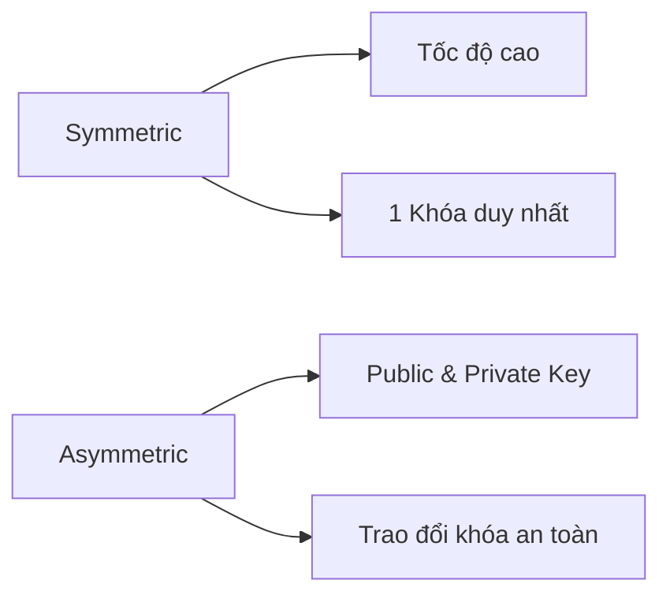

---

## 9. Ưu điểm và Thách thức

### Lợi ích bảo mật

* **Bảo vệ dữ liệu toàn diện:** Đảm bảo an toàn cho dữ liệu lưu trữ (Data at Rest) và dữ liệu truyền tải (Data in Transit).
* **Đảm bảo tính riêng tư & toàn vẹn:** Ngăn ngừa hành vi nghe lén (eavesdropping) và sửa đổi trái phép.
* **Tuân thủ pháp lý & chuẩn an ninh:** Đáp ứng các tiêu chuẩn như GDPR, PCI-DSS, HIPAA.
* **Chống chối bỏ:** Sử dụng chữ ký số giúp xác thực nguồn gốc dữ liệu chính xác.

### Thách thức triển khai

* **Quản lý khóa (Key Management):** Lưu trữ, xoay vòng (rotation) và thu hồi khóa bí mật an toàn là bài toán phức tạp.
* **Chi phí hạ tầng & Hiệu năng:** Mã hóa làm tăng mức tiêu thụ CPU và độ trễ hệ thống nếu không được tối ưu.
* **Độ phức tạp vận hành:** Đòi hỏi quy trình tích hợp chỉn chu và nhân sự có chuyên môn bảo mật.

Sơ đồ phân nhánh Lợi ích và Thách thức:

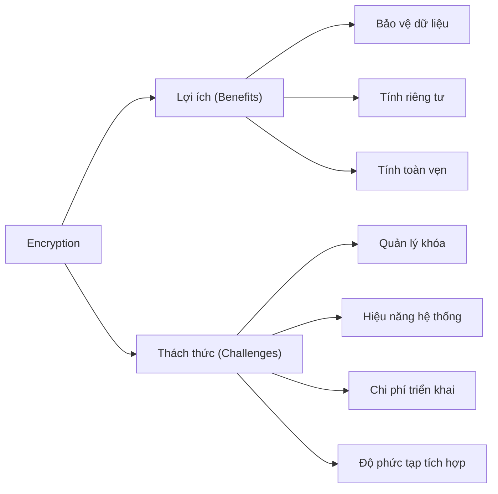

---

## 10. Tương lai của Encryption

Ngành mật mã học đang tiến hóa nhanh chóng để đáp ứng các thách thức mới như điện toán đám mây và máy tính lượng tử:

1. **Bring Your Own Encryption (BYOE):** Mô hình điện toán đám mây cho phép khách hàng tự quản lý và sở hữu khóa mã hóa riêng.
2. **Homomorphic Encryption (Mã hóa đẳng cấu):** Cho phép tính toán và xử lý trực tiếp trên dữ liệu đã mã hóa mà không cần giải mã, bảo mật tuyệt đối dữ liệu trên Cloud.
3. **Quantum Cryptography (Post-Quantum Cryptography - PQC):** Xây dựng các thuật toán mã hóa mới chống lại khả năng phá khóa của máy tính lượng tử.
4. **Honey Encryption:** Phương pháp tạo ra dữ liệu giả trông có vẻ hợp lý khi kẻ tấn công giải mã bằng sai khóa, làm nhiễu thông tin phân tích.

Sơ đồ mindmap các hướng phát triển tương lai:

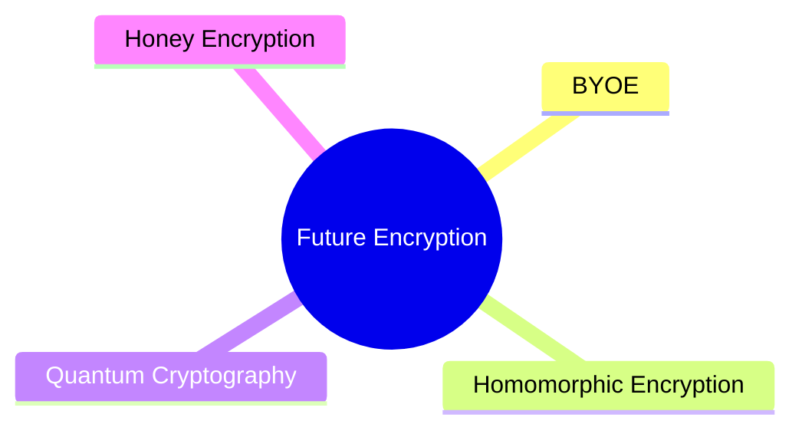

---

## 11. Tổng kết & Ý tưởng Cốt lõi

Sơ đồ tổng quan toàn bộ lộ trình và mối liên kết trong tài liệu:

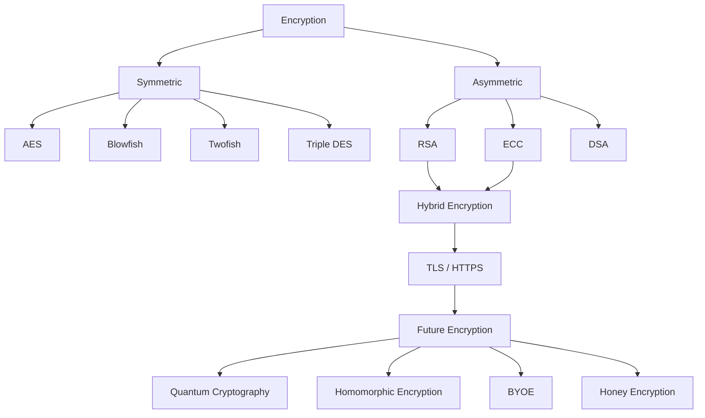

> [!IMPORTANT]
> **Tóm tắt ý tưởng cốt lõi:**
> * **Symmetric Encryption (AES):** Đánh đổi bằng **thiết kế thuật toán tối ưu phép biến đổi bit**, mang lại hiệu năng cực cao để xử lý khối lượng dữ liệu lớn.
> * **Asymmetric Encryption (RSA/ECC):** Đánh đổi bằng **độ khó của các bài toán toán học**, cho phép trao đổi khóa và xác thực an toàn dù chi phí tính toán cao.
> * **Mô hình thực tế:** HTTPS/TLS kết hợp cả hai — dùng Asymmetric Encryption để bắt tay trao đổi khóa, và dùng Symmetric Encryption để truyền dữ liệu.

---
[← Quay lại mục lục](README.md)