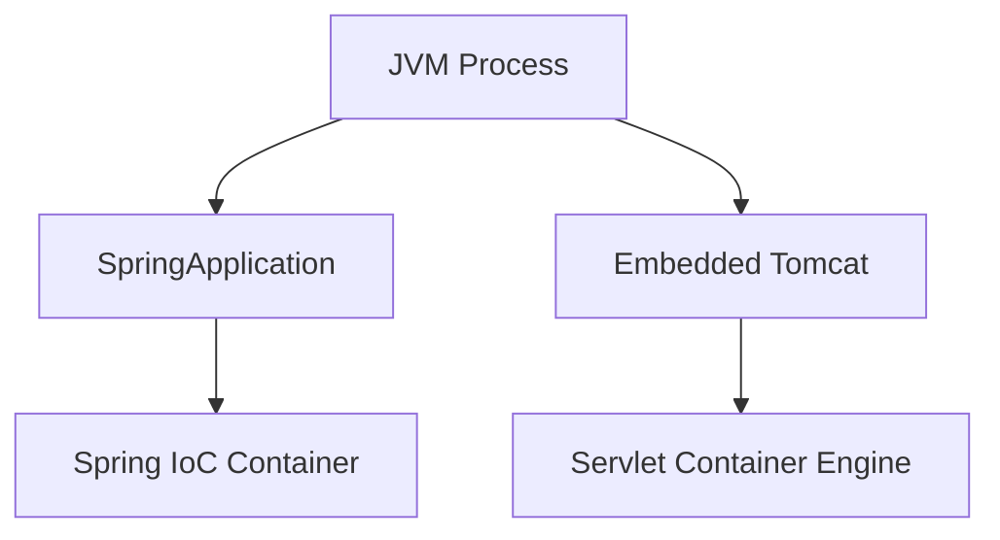
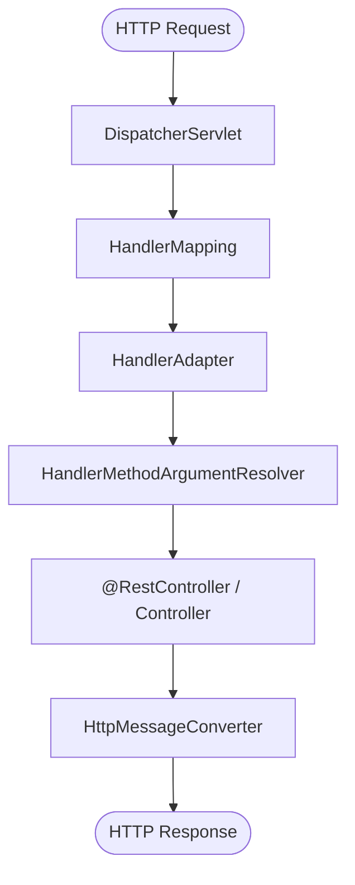
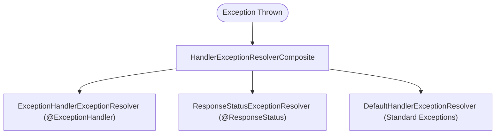
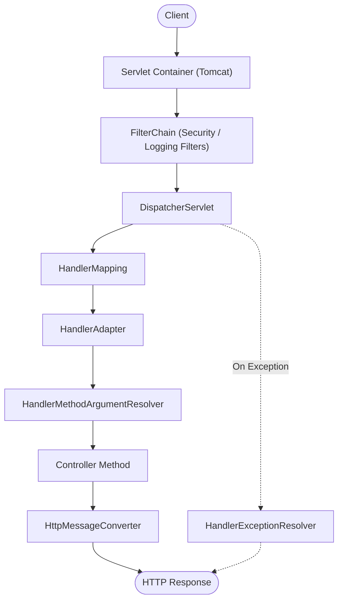

# Spring MVC & Web Layer

## Table of Contents

- [Container Servlet vs Spring IoC](#container-servlet-vs-spring-ioc)
- [Tổng quan DispatcherServlet](#tong-quan-dispatcherservlet)
- [Tích hợp Filter](#tich-hop-filter)
- [Argument Resolver & Message Converter](#argument-resolver--message-converter)
- [Xử lý ngoại lệ toàn cục](#xu-ly-ngoai-le-toan-cuc)
- [Luồng yêu cầu đầy đủ](#luong-yeu-cau-day-du)

---

## Container Servlet vs Spring IoC

Khi một ứng dụng Spring Boot khởi động, **hai hệ thống quản lý vòng đời** chạy song song nhưng hoàn toàn độc lập:



| Hệ thống | Đối tượng được quản lý | Trách nhiệm chính |
| :--- | :--- | :--- |
| **Container Servlet** (Tomcat) | `Servlet`, `Filter`, `FilterChain`, `ServletContext` | Xử lý TCP/IP, quản lý thread pool, thực thi chuỗi filter theo chuẩn Servlet |
| **Spring IoC Container** | `@Component`, `@Bean`, `ApplicationContext` | Quản lý vòng đời Bean, thực hiện Dependency Injection, AOP |

> [!NOTE]
> Nếu một `Filter` được Tomcat khởi tạo trực tiếp (qua `web.xml` hoặc API thuần), Spring không có cơ hội tiêm `@Autowired`; do đó các dependency sẽ là `null`.

---

## Tổng quan DispatcherServlet

Spring MVC áp dụng mẫu **Front‑Controller**: một `DispatcherServlet` duy nhất nhận mọi request và chuyển tải cho các thành phần chuyên biệt.



- **HandlerMapping**: tìm **handler** (thường là method của `@Controller`) phù hợp.
- **HandlerAdapter**: thực thi handler, cho phép các kiểu handler khác nhau (method, `HttpRequestHandler`, …) được gọi một cách đồng nhất.
- **ArgumentResolver**: gán dữ liệu request vào các tham số method.
- **HttpMessageConverter**: chuyển đổi đối tượng Java sang/từ payload HTTP (JSON, XML, …).

Cấu trúc này giúp Spring MVC mở rộng dễ dàng mà không làm rối mã controller.

---

## Tích hợp Filter

Spring Boot cung cấp **ba cách** để đưa `Filter` vào pipeline servlet. Lựa chọn dựa trên mức độ kiểm soát bạn cần:

1. **`@Component`** – Spring tự động quét và đăng ký filter cho toàn bộ URL `/*`.
2. **`FilterRegistrationBean`** – Bạn tự định nghĩa URL pattern, thứ tự thực thi và có thể bật/tắt tùy điều kiện.
3. **`DelegatingFilterProxy`** – Cầu nối tiêu chuẩn giữa Container servlet và Spring IoC, là nền tảng của Spring Security.

| Phương pháp | URL pattern | Thứ tự | Cách khởi tạo |
| :--- | :--- | :--- | :--- |
| `@Component` | `/*` | Mặc định (`LOWEST_PRECEDENCE`) hoặc `@Order` | Eager (Spring tạo bean khi context khởi tạo) |
| `FilterRegistrationBean` | Tùy chỉnh, ví dụ `/api/v1/**` | Rõ ràng qua `setOrder()` | Eager |
| `DelegatingFilterProxy` | Được cấu hình bởi Spring Security | Dựa trên cấu hình proxy | Lazy – tìm bean trong `WebApplicationContext` khi có request đầu tiên |

---

## Argument Resolver & Message Converter

Hai thành phần này giữ **controller** gọn gàng, chỉ tập trung vào logic nghiệp vụ.

### Argument Resolver

Spring đã có sẵn các resolver cho các annotation thông dụng (`@RequestBody`, `@PathVariable`, `@RequestParam`, …). Khi cần xử lý đặc thù, bạn triển khai `HandlerMethodArgumentResolver`.

Triển khai custom `HandlerMethodArgumentResolver`:

```java
@Component
public class UserContextArgumentResolver implements HandlerMethodArgumentResolver {
    // Đọc header X-User-Context, giải mã Base64 → đối tượng UserContext
}
```

Sau đó đăng ký trong `WebMvcConfigurer#addArgumentResolvers`.

### HttpMessageConverter

Chịu trách nhiệm **đọc** và **ghi** payload dựa trên `Content‑Type` và `Accept`. Spring Boot tự động cấu hình Jackson cho JSON. Nếu muốn tùy chỉnh (định dạng ngày, enum, …) khai báo một bean `ObjectMapper`:

Cấu hình tùy chỉnh `ObjectMapper` cho ứng dụng:

```java
@Configuration
public class JacksonConfig {
    @Bean
    public ObjectMapper objectMapper() {
        return JsonMapper.builder()
            .configure(SerializationFeature.WRITE_DATES_AS_TIMESTAMPS, false)
            .configure(DeserializationFeature.FAIL_ON_UNKNOWN_PROPERTIES, false)
            .addModule(new JavaTimeModule())
            .build();
    }
}
```

> [!WARNING]
> Đừng thay thế trực tiếp `ObjectMapper` trong `MappingJackson2HttpMessageConverter`; việc cấu hình ở mức bean đảm bảo tính nhất quán trên toàn ứng dụng (validation, logging, …).

---

## Xử lý ngoại lệ toàn cục

Để tránh lỗi bị xử lý rải rác trong từng controller, chúng ta dùng `@RestControllerAdvice`. Spring MVC sẽ đưa exception qua **đối tượng `HandlerExceptionResolver`** theo thứ tự, dừng lại khi có resolver trả về kết quả.



Khai báo advice xử lý ngoại lệ tập trung chuẩn hóa theo RFC 7807 (`ProblemDetail`):

```java
@RestControllerAdvice
public class GlobalExceptionHandler {
    @ExceptionHandler(ResourceNotFoundException.class)
    public ProblemDetail handleNotFound(ResourceNotFoundException ex, HttpServletRequest req) {
        return ProblemDetail.forStatusAndDetail(HttpStatus.NOT_FOUND, ex.getMessage())
            .type(URI.create("https://api.example.com/errors/resource-not-found"))
            .title("Resource Not Found")
            .instance(URI.create(req.getRequestURI()))
            .property("resourceId", ex.getResourceId());
    }
    // … các handler khác …
}
```

Các response tuân theo **RFC 7807 (`ProblemDetail`)**, mang lại định dạng JSON lỗi đồng nhất.

> [!IMPORTANT]
> Handler cuối cùng (catch‑all) không bao giờ trả về stack trace hay thông tin nội bộ; chỉ trả về thông báo chung để tránh rò rỉ thông tin bảo mật.

---

## Luồng yêu cầu đầy đủ

Kết hợp tất cả các lớp trên, một yêu cầu HTTP di chuyển qua các bước sau:



| Lớp | Trách nhiệm |
| :--- | :--- |
| **Filter** | Tiền xử lý (logging, security) |
| **DispatcherServlet** | Điều phối chính của Spring MVC |
| **HandlerMapping** | Tìm method controller phù hợp |
| **HandlerAdapter** | Thực thi method, bất kể kiểu handler |
| **ArgumentResolver** | Bind dữ liệu request vào tham số method |
| **HttpMessageConverter** | Serialize/Deserialize payload |
| **ExceptionResolver** | Chuyển exception thành response RFC 7807 |

---

[← Back to README](README.md)

