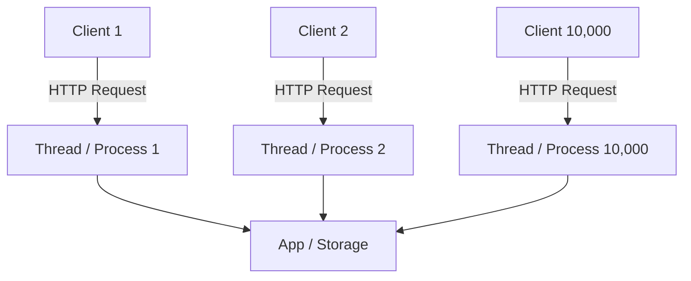
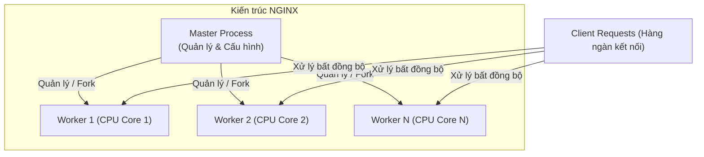

# Chương 1. Tổng quan & Lịch sử ra đời NGINX

Chương này cung cấp cái nhìn tổng quan về NGINX, nguồn gốc ra đời, kiến trúc cốt lõi giải quyết bài toán C10K và sự khác biệt giữa hai phiên bản NGINX Open Source và NGINX Plus.

## Mục lục

- [1.1 NGINX là gì?](#11-nginx-là-gì)
- [1.2 Lịch sử ra đời & Nguồn gốc tên gọi](#12-lịch-sử-ra-đời--nguồn-gốc-tên-gọi)
- [1.3 Bài toán C10K & Sự sụp đổ của mô hình truyền thống](#13-bài-toán-c10k--sự-sụp-đổ-của-mô-hình-truyền-thống)
- [1.4 Bước ngoặt lịch sử: I/O Multiplexing & Kiến trúc Multi-Worker](#14-bước-ngoặt-lịch-sử-io-multiplexing--kiến-trúc-multi-worker)
- [1.5 Mục tiêu thiết kế cốt lõi của NGINX](#15-mục-tiêu-thiết-kế-cốt-lõi-của-nginx)
- [1.6 NGINX Open Source vs NGINX Plus](#16-nginx-open-source-vs-nginx-plus)

---

## 1.1 NGINX là gì?

**NGINX** (phát âm là *"Engine-X"*) là máy chủ mã nguồn mở hiệu năng cao, ban đầu được thiết kế để phục vụ nội dung tĩnh với tốc độ tối ưu và xử lý hàng chục nghìn kết nối đồng thời với lượng tài nguyên CPU & RAM cực kỳ tiết kiệm.

Theo thời gian, NGINX phát triển thành một giải pháp đa năng trong hạ tầng hệ thống:
- **Web Server**: Phục vụ nội dung tĩnh và xử lý yêu cầu HTTP/HTTPS.
- **Reverse Proxy**: Tiếp nhận yêu cầu từ client và chuyển tiếp an toàn đến các ứng dụng backend.
- **Load Balancer**: Phân phối lưu lượng truy cập ở cả tầng L4 (TCP/UDP) và L7 (HTTP/gRPC).
- **API Gateway**: Quản lý, xác thực, điều hướng và giới hạn tốc độ (rate limiting) cho microservices.
- **Content Cache**: Bộ đệm lưu trữ nội dung tĩnh/động để giảm tải cho máy chủ backend.

---

## 1.2 Lịch sử ra đời & Nguồn gốc tên gọi

Dự án NGINX được kỹ sư phần mềm người Nga **Igor Sysoev** bắt đầu phát triển từ năm 2002 nhằm giải quyết vấn đề hiệu năng cho website Rambler.ru (một trong những cổng thông tin lượng truy cập lớn nhất nước Nga thời điểm đó).

**Nguồn gốc tên gọi:** Tên gọi **NGINX** xuất phát từ thuật ngữ *"Engine-X"*, biểu thị một bộ máy động cơ (Engine) với khả năng mở rộng không giới hạn (ký tự $X$).

---

## 1.3 Bài toán C10K & Sự sụp đổ của mô hình truyền thống

Thuật ngữ **C10K** (Concurrent 10,000 Connections) được **Dan Kegel** đề xuất vào năm 1999 để chỉ thách thức kỹ thuật: *Làm thế nào để một máy chủ web duy nhất xử lý đồng thời 10.000 kết nối active mà không làm cạn kiệt tài nguyên hệ thống (CPU, RAM, file descriptors, sockets)?*

### Mô hình truyền thống (Thread / Process-per-connection)
Các máy chủ web thế hệ cũ (như Apache HTTP Server sử dụng MPM Prefork hoặc MPM Worker) gán một tiến trình (Process) hoặc một luồng (Thread) riêng cho từng kết nối HTTP.

| Thành phần/Bước | Vai trò/Mô tả | Chi tiết |
| :--- | :--- | :--- |
| **Client Request** | Yêu cầu kết nối HTTP từ trình duyệt client | Mỗi kết nối yêu cầu giữ 1 thread/process riêng |
| **Worker Thread/Process** | Khối xử lý đồng bộ gán riêng cho từng kết nối | Chiếm 2–4MB RAM |
| **Backend Storage** | Tầng ứng dụng hoặc cơ sở dữ liệu xử lý logic | Bị nghẽn do quá tải Context Switching ở cấp CPU |

Những hạn chế cốt lõi của mô hình đa luồng khi quy mô kết nối tăng vọt bao gồm:
1. **Dung lượng bộ nhớ tăng tuyến tính**: Mỗi luồng/tiến trình tiêu tốn từ 2MB đến 4MB RAM. Với 10.000 kết nối, hệ thống mất từ 20GB đến 40GB+ RAM chỉ để duy trì trạng thái luồng.
2. **Quá tải chuyển đổi ngữ cảnh (Context Switching)**: Khi số lượng luồng vượt xa số lõi CPU vật lý, CPU phải liên tục hoán đổi ngữ cảnh giữa các luồng. Chi phí overhead này chiếm phần lớn năng lực xử lý, gây tắc nghẽn hệ thống (Thread Thrashing).
3. **Chế độ Blocking I/O**: Các socket mặc định ở chế độ blocking. Khi một luồng gọi `read()` trên socket chưa có dữ liệu, luồng đó bị đẩy vào trạng thái đứng chờ. Hàng nghìn luồng bị kẹt ngủ tiếp tục chiếm dụng RAM, khiến tài nguyên máy chủ nhanh chóng cạn kiệt.

---

## 1.4 Bước ngoặt lịch sử: I/O Multiplexing & Kiến trúc Multi-Worker

Để kiến trúc Event-Driven vận hành hiệu quả và mở rộng tối đa trên CPU đa nhân, các hệ điều hành đã bổ sung các cơ chế **I/O Multiplexing thế hệ mới** trực tiếp ở cấp độ Kernel. Đây chính là bước ngoặt kỹ thuật giải quyết trọn vẹn bài toán C10K (hàng chục nghìn kết nối đồng thời).

### 1.4.1 Cơ chế I/O Multiplexing từ Kernel

Giai đoạn 2000 – 2002, các hệ điều hành lớn lần lượt giới thiệu các giao diện theo dõi sự kiện I/O hiệu năng cao:

* 🍎 **`kqueue`** (FreeBSD - 2000 / macOS): Cơ chế theo dõi sự kiện tổng quát (socket, file, signal, timer) với hiệu năng vượt trội.
* 🐧 **`epoll`** (Linux - 2002): Cơ chế thông báo sự kiện I/O có khả năng mở rộng cực cao trên nhân Linux, thay thế cho các syscall cũ bị nghẽn cổ chai như `select()` hay `poll()`.
* 🪟 **`IOCP`** (Windows): Mô hình Asynchronous I/O dựa trên cơ chế completion notification.

#### Nền tảng cốt lõi của hệ sinh thái phần mềm hiện đại

Sự xuất hiện của các cơ chế này đã định hình lại hoàn toàn cách các web server, runtime và framework xử lý I/O:

* **Web Server / Reverse Proxy:** **NGINX**, **Envoy**, **HAProxy** tận dụng trực tiếp `epoll`/`kqueue` để duy trì hàng trăm nghìn kết nối đồng thời với lượng RAM và CPU tiêu thụ tối thiểu.
* **JavaScript / Node.js:** Thư viện **`libuv`** được xây dựng như một lớp trừu tượng (abstraction layer) bọc quanh `epoll`, `kqueue`, `IOCP` để tạo nên vòng lặp sự kiện (Event Loop) nổi tiếng của Node.js.
* **Java:** Tầng **Java NIO (Non-blocking I/O)** và framework **Netty** (nền tảng của Spring WebFlux, gRPC Java, Cassandra, Kafka client) ánh xạ trực tiếp các selector xuống `epoll`/`kqueue` dưới tầng OS.
* **Go / Rust:** Hệ thống **Netpoller** trong Go runtime và thư viện **Tokio / Mio** trong Rust đều trực tiếp ủy thác việc giám sát network socket cho `epoll` và `kqueue`.

> [!NOTE]
> **💡 Easter Egg: Phát biểu gây sốt của Linus Torvalds (7/2025)**
>
> Mới đây (tháng 7/2025), chính **Linus Torvalds** đã đưa ra một tuyên bố rất thẳng thắn về `epoll`. Ông thông báo sẽ **KHÔNG chấp nhận BẤT KỲ bản vá lỗi nào cho epoll** trừ khi đó là lỗi hiển nhiên hoặc được chia nhỏ và giải thích cực kỳ cẩn thận. Lý do ông đưa ra:
>
> > *"Về lâu dài, epoll cần phải được khai tử, hoặc ít nhất là bị coi như một giao diện kế thừa cần được cắt giảm, chứ không phải là thứ để cải tiến thêm."*
>
> > *(Nguyên văn: "epoll needs to die, or at least be seen as a legacy interface that should be cut down, not something to be improved upon".)*
>
> **Bối cảnh đằng sau phát biểu này:**
> * **Sự trỗi dậy của `io_uring`:** `io_uring` đang nổi lên như một giải pháp I/O hiệu năng cao và toàn diện hơn nhiều trên Linux. Nó không chỉ vượt trội ở network I/O mà còn xử lý trọn vẹn cả Disk I/O (điểm yếu cố hữu của `epoll`), giúp vượt qua các giới hạn kiến trúc cũ.
> * **Định hướng tiến hóa dài hạn:** Đây là tuyên bố về triết lý thiết kế hệ thống hơn là lệnh cấm dùng ngay lập tức. Khi công nghệ mới ưu việt hơn ra đời, các giao diện cũ cần được xem là *legacy* để giảm bớt sự phức tạp và nợ kỹ thuật của kernel.
> * **Thực tế hiện tại:** Mặc dù được xếp vào diện "kế thừa", `epoll` vẫn là API cốt lõi và là xương sống phục vụ phần lớn Internet ngày nay (gồm cả NGINX). `io_uring` rất mạnh mẽ nhưng đòi hỏi mô hình lập trình bất đồng bộ khác biệt và phức tạp hơn, khiến nó chưa thể là sự thay thế trực tiếp tức thì cho mọi ứng dụng `epoll`.

---

### 1.4.2 Kiến trúc Master-Worker trong NGINX

NGINX sử dụng mô hình kiến trúc **Master-Worker** kết hợp với cơ chế hướng sự kiện (Event-driven), giúp hệ thống xử lý hàng chục nghìn kết nối đồng thời mà tốn rất ít tài nguyên:

* **1 Tiến trình Quản lý (Master Process):** Đóng vai trò điều phối chính — đọc file cấu hình, quản lý vòng đời và tự động khởi tạo lại các Worker nếu xảy ra sự cố.
* **N Tiến trình Xử lý (Worker Processes):** Chạy độc lập trên từng lõi CPU, trực tiếp nhận và xử lý các yêu cầu từ phía người dùng thông qua Event Loop.
* **Không tranh chấp dữ liệu (Shared-Nothing):** Mỗi Worker xử lý yêu cầu hoàn toàn độc lập, không phải chờ đợi lẫn nhau. Dữ liệu dùng chung (như bộ nhớ đệm Cache, giới hạn Rate Limit) được quản lý qua vùng nhớ chung (Shared Memory).

---

## 1.5 Mục tiêu thiết kế cốt lõi của NGINX

Nhờ kết hợp kiến trúc **Event-Driven**, **Asynchronous**, **Non-blocking I/O** và **I/O Multiplexing**, NGINX giải quyết triệt để bài toán C10K với mức tiêu thụ tài nguyên tối thiểu.

Mỗi Worker Process chạy một vòng lặp sự kiện đơn luồng xử lý hàng nghìn kết nối đồng thời. Với các tác vụ I/O đĩa có nguy cơ gây nghẽn, NGINX sử dụng thêm luồng phụ (Thread Pool hoặc `aio threads`) để tránh làm gián đoạn Event Loop chính.

| Tiêu chí | Mô hình Đa luồng / Đa tiến trình | Mô hình Hướng sự kiện (NGINX) |
| :--- | :--- | :--- |
| **Phân bổ tài nguyên** | 1 Luồng hoặc Tiến trình cho mỗi kết nối | 1 Worker Process quản lý hàng nghìn kết nối đồng thời |
| **Tiêu thụ bộ nhớ RAM** | Tăng tuyến tính theo số kết nối ($O(N)$) | Tăng rất chậm / duy trì ở mức thấp khi quy mô kết nối tăng |
| **Chuyển đổi ngữ cảnh** | Chi phí Context Switching rất cao | Cực kỳ thấp do Event Loop đơn luồng |
| **Phục vụ tệp tĩnh** | Hiệu năng trung bình (phụ thuộc I/O luồng) | Tối ưu tuyệt đối (sử dụng syscall zero-copy `sendfile`) |
| **Khả năng chịu tải** | Dễ bị quá tải khi vượt mốc 1.000 – 5.000 kết nối | Có thể xử lý vượt 100.000 kết nối khi được tinh chỉnh đúng thông số hệ thống (`worker_connections`, `ulimit`, `somaxconn`) |

> [!NOTE]
> Theo tuyên bố từ tác giả Igor Sysoev, NGINX chỉ tiêu tốn khoảng **2.5MB RAM** để duy trì 10.000 kết nối HTTP ở trạng thái chờ (idle keep-alive với cấu hình đệm mặc định; chưa có benchmark độc lập công bố chính thức).

---

[← Quay lại mục lục](README.md)
