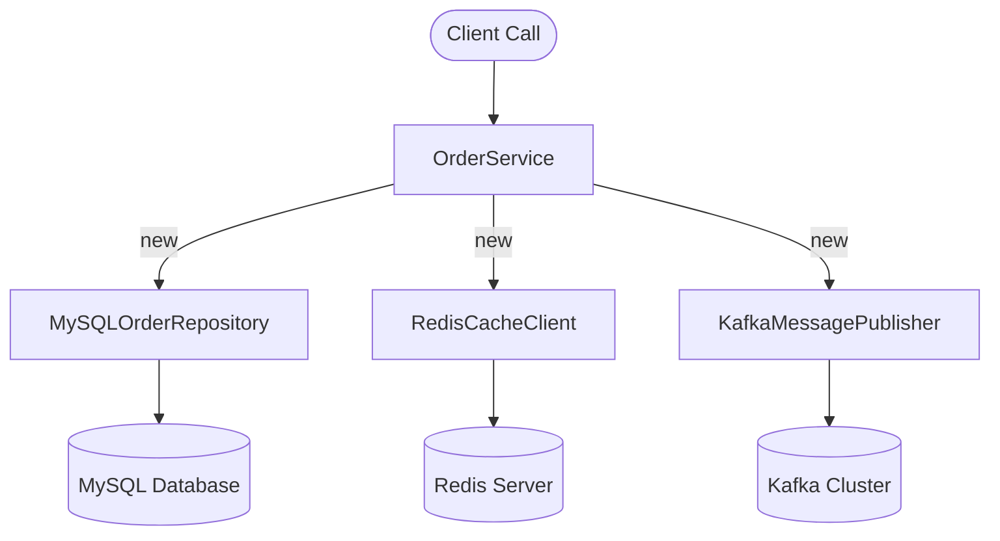
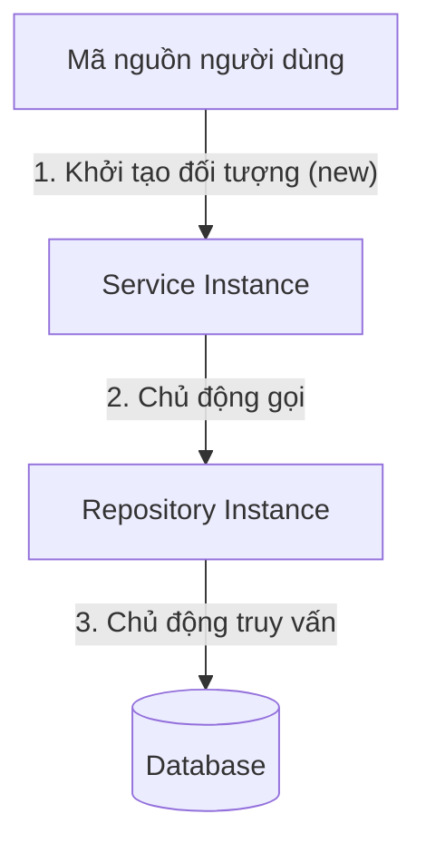
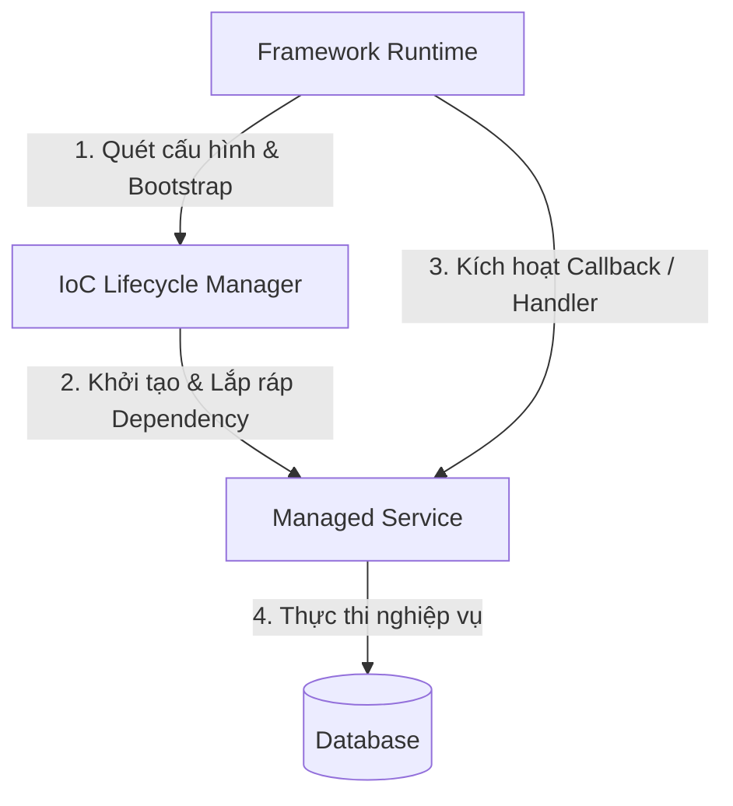
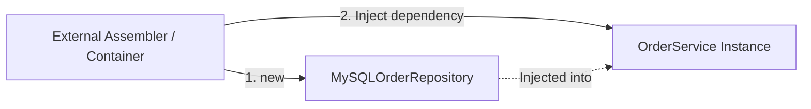
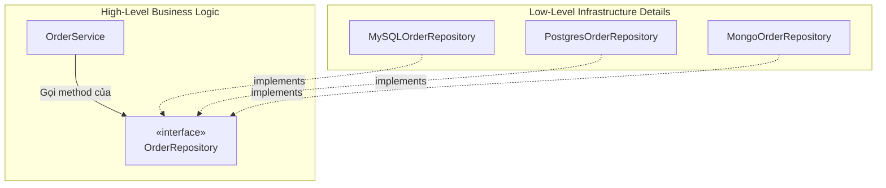
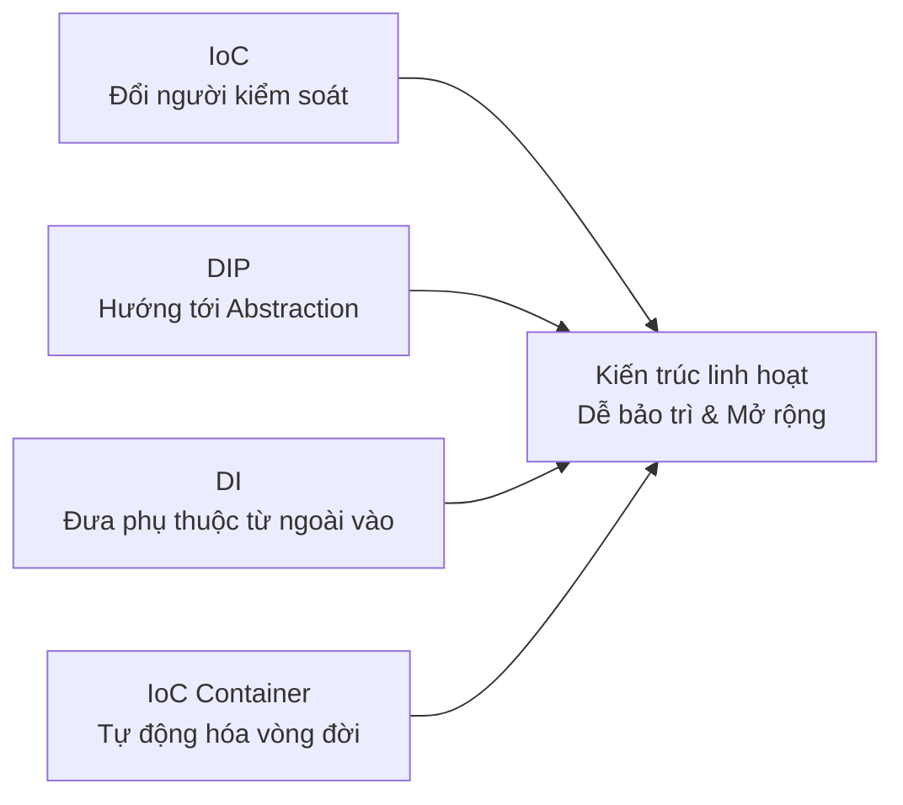

# IoC, DI và DIP: Từ triết lý Inversion of Control đến IoC Container hiện đại

## Table of Contents

- [Vấn đề: Quản lý vòng đời và kết nối đối tượng](#vấn-đề-quản-lý-vòng-đời-và-kết-nối-đối-tượng)
- [Nguyên lý Inversion of Control (IoC)](#nguyên-lý-inversion-of-control-ioc)
- [Kỹ thuật Dependency Injection (DI)](#kỹ-thuật-dependency-injection-di)
- [Nguyên lý Dependency Inversion (DIP)](#nguyên-lý-dependency-inversion-dip)
- [Phân tầng và ma trận quan hệ giữa IoC, DI và DIP](#phân-tầng-và-ma-trận-quan-hệ-giữa-ioc-di-và-dip)
- [Hiện thực IoC Container: Spring và NestJS](#hiện-thực-ioc-container-spring-và-nestjs)
- [Cơ chế vận hành của IoC Container hiện đại](#cơ-chế-vận-hành-của-ioc-container-hiện-đại)
- [Tổng kết và định hướng áp dụng](#tổng-kết-và-định-hướng-áp-dụng)

---

## Vấn đề: Quản lý vòng đời và kết nối đối tượng

Trong các ứng dụng quy mô nhỏ, một lớp nghiệp vụ (**Service**) thường tự đảm nhiệm việc khởi tạo trực tiếp các đối tượng phụ thuộc (**Dependencies**) thông qua toán tử **`new`**.

Khởi tạo trực tiếp dependency trong constructor:

```java
public class OrderService {

    private final MySQLOrderRepository repository;

    public OrderService() {
        // OrderService tự quyết định và khởi tạo trực tiếp dependency
        this.repository = new MySQLOrderRepository();
    }
}
```

Cách tiếp cận này hoạt động ổn định khi hệ thống chỉ có số lượng ít đối tượng. Khi ứng dụng mở rộng quy mô lên hàng trăm dịch vụ, cấu trúc liên kết giữa các đối tượng trở nên phức tạp. Một service thông thường đòi hỏi thêm **Logger**, **Cache Client**, **Message Publisher**, **Audit Service** và các **Database Repositories**.

Mô hình gắn kết chặt (*Tight Coupling*) khi các class tự khởi tạo phụ thuộc:



Khi mỗi lớp tự khởi tạo các phụ thuộc hạ tầng cụ thể, kiến trúc hệ thống phát sinh **ba rủi ro kỹ thuật trọng yếu**:
- **Khó khăn trong kiểm thử tự động (*Testability*)**: Không thể thay thế `MySQLOrderRepository` bằng mock hoặc stub repository khi thực thi các bài kiểm thử đơn vị (*Unit Test*).
- **Vi phạm tính linh hoạt (*Flexibility*)**: Việc chuyển đổi hệ quản trị cơ sở dữ liệu từ **MySQL** sang **PostgreSQL** đòi hỏi phải sửa đổi mã nguồn tại mọi service đang trực tiếp gọi lệnh `new`.
- **Rối loạn quản lý tài nguyên (*Resource Management*)**: Việc phân tán hành vi khởi tạo các kết nối cơ sở dữ liệu (*Database Connections*) hoặc socket mạng dẫn đến nguy cơ rò rỉ và cạn kiệt tài nguyên bộ nhớ.

Câu hỏi cốt lõi đặt ra cho kiến trúc hướng đối tượng:

> [!IMPORTANT]
> **Ai nên chịu trách nhiệm khởi tạo, cấu hình và kết nối các đối tượng trong toàn bộ vòng đời của ứng dụng?**

Lời giải cho bài toán này được định hình qua chuỗi tiến hóa: 
- **Inversion of Control (IoC)**
- **Dependency Injection (DI)** 
- **Dependency Inversion Principle (DIP)**

Khái niệm *Inversion of Control* có nguồn gốc từ bài báo nghiên cứu *Designing Reusable Classes* của **Ralph Johnson** và **Brian Foote** (1988). 

Trước đó vào năm 1983, **Richard Sweet** đã đúc kết tư tưởng này bằng phát biểu kinh điển mang tên **Hollywood Principle**:

> *“Don't call us, we'll call you.”*

Thay vì mã nguồn của lập trình viên chủ động điều hướng luồng thực thi, một framework trung tâm sẽ nắm quyền kiểm soát toàn cục và chỉ kích hoạt mã nguồn ứng dụng khi các sự kiện tương ứng xuất hiện.

---

## Nguyên lý Inversion of Control (IoC)

**Inversion of Control (IoC - Đảo ngược quyền kiểm soát)** là một *nguyên lý kiến trúc tổng quát* xác định sự chuyển dịch quyền điều khiển giữa mã nguồn ứng dụng và hệ thống runtime/framework.

Quyền kiểm soát chương trình được phân định qua hai mô hình đối lập:

Mô hình điều khiển luồng truyền thống trong Java:

```java
public class Application {

    public static void main(String[] args) {
        // Lập trình viên kiểm soát toàn bộ vòng đời và luồng thực thi
        DatabaseConfig config = new DatabaseConfig("jdbc:mysql://localhost:3306/db");
        OrderRepository repo = new MySQLOrderRepository(config);
        OrderService service = new OrderService(repo);

        service.processOrder("ORDER-101");
    }
}
```

### 1. Luồng điều khiển trong mô hình truyền thống (Direct Control)

Trong **mô hình truyền thống (*Direct Control*)**, mã nguồn ứng dụng đóng vai trò *chủ động*: tự mở kết nối, tự quyết định thời điểm khởi tạo đối tượng và điều phối luồng gọi hàm tuần tự.



### 2. Luồng điều khiển trong mô hình Inversion of Control (Framework Control)

Trong **mô hình IoC (*Inverted Control*)**, framework đóng vai trò *trung tâm điều phối*: framework khởi chạy một vòng lặp quản trị (*Event Loop / Dispatcher*), quản lý vòng đời đối tượng và tự động gọi các hook/handler của lập trình viên khi có request hoặc event thích hợp.



> [!NOTE]
> **IoC là một triết lý kiến trúc bao trùm**, không đồng nhất với bất kỳ framework hay thư viện cụ thể nào. Nguyên lý này xuất hiện dưới nhiều hình thức: *GUI Event Loops*, *Lifecycle Callbacks*, *Template Method Pattern*, *Servlet Request Dispatching* và *Dependency Injection*.

---

## Kỹ thuật Dependency Injection (DI)

**Dependency Injection (DI)** là một *kỹ thuật triển khai cụ thể* nhằm hiện thực hóa nguyên lý IoC trong việc quản lý và cung cấp các phụ thuộc cho đối tượng từ bên ngoài.

Năm 2004, **Martin Fowler** công bố bài viết *Inversion of Control Containers and the Dependency Injection pattern* nhằm làm rõ thuật ngữ: thay vì dùng từ "IoC" quá rộng, thuật ngữ **Dependency Injection** mô tả chính xác hành vi *đưa phụ thuộc từ bên ngoài vào đối tượng*.

Chuyển đổi từ mô hình tự khởi tạo sang tiếp nhận phụ thuộc qua **Constructor Injection**:

```java
public class OrderService {

    private final OrderRepository repository;

    // Dependency được truyền từ ngoài vào thông qua Constructor
    public OrderService(OrderRepository repository) {
        this.repository = repository;
    }

    public void completeOrder(String orderId) {
        this.repository.save(orderId);
    }
}
```

Cơ chế lắp ráp phụ thuộc từ bên ngoài (*External Assembler*):



### Các hình thức Dependency Injection

Trong thực tế phát triển phần mềm, DI xuất hiện dưới ba hình thức triển khai chính:

| Hình thức DI | Cơ chế thực hiện | Ưu điểm kỹ thuật | Hạn chế / Đánh giá |
| :--- | :--- | :--- | :--- |
| **Constructor Injection** | Truyền dependencies qua constructor khi tạo instance | Đảm bảo tính **bất biến (*Immutability*)** qua từ khóa `final`, phát hiện thiếu phụ thuộc ngay tại *compile-time*, dễ dàng viết unit test | Constructor phình to khi có quá nhiều dependencies (dấu hiệu cảnh báo cần refactor vi phạm SRP) |
| **Setter Injection** | Cung cấp dependencies qua các phương thức `set...()` | Cho phép tái cấu hình hoặc gán **phụ thuộc tùy chọn (*Optional Dependencies*)** trong runtime | Đối tượng có thể rơi vào **trạng thái chưa hoàn chỉnh (*Incomplete State*)** nếu setter chưa được kích hoạt |
| **Field Injection** | Gán trực tiếp vào thuộc tính qua cơ chế Reflection (`@Autowired`) | Mã nguồn ngắn gọn, loại bỏ hoàn toàn mã khởi tạo boilerplate | Gắn chặt vào cơ chế Reflection của Container, không thể khởi tạo an toàn bằng `new` trong unit test thuần |

Ví dụ minh họa ba hình thức DI trong Java:

```java
public class DependencyInjectionVariants {

    // 1. Constructor Injection (Khuyến nghị nhất quán)
    public static class PreferredService {
        private final OrderRepository repo;

        public PreferredService(OrderRepository repo) {
            this.repo = repo;
        }
    }

    // 2. Setter Injection (Dùng cho optional dependency)
    public static class ConfigurableService {
        private NotificationClient notifier;

        public void setNotifier(NotificationClient notifier) {
            this.notifier = notifier;
        }
    }

    // 3. Field Injection (Hạn chế sử dụng)
    public static class LegacyService {
        // Reflection-based injection
        private OrderRepository repo;
    }
}
```

> [!TIP]
> **Luôn ưu tiên Constructor Injection.** Cách tiếp cận này giúp đối tượng đạt trạng thái an toàn đa luồng (*Thread-safety*), bảo đảm mọi instance được tạo ra đều có đầy đủ phụ thuộc hợp lệ và hoàn toàn không phụ thuộc vào framework khi kiểm thử.

---

## Nguyên lý Dependency Inversion (DIP)

**Dependency Inversion Principle (DIP - Nguyên lý Đảo ngược Phụ thuộc)** là chữ cái **D** trong bộ nguyên lý thiết kế **SOLID**, được **Robert C. Martin (Uncle Bob)** chuẩn hóa với hai mệnh đề cốt lõi:

> **1. Các module cấp cao (*High-level modules*) không nên phụ thuộc vào các module cấp thấp (*Low-level modules*). Cả hai đều phải phụ thuộc vào Abstraction.**
>
> **2. Abstraction không được phụ thuộc vào chi tiết triển khai (*Details*). Chi tiết triển khai bắt buộc phải phụ thuộc vào Abstraction.**

Nếu `OrderService` (nghiệp vụ cấp cao) phụ thuộc trực tiếp vào `MySQLOrderRepository` (hạ tầng lưu trữ cấp thấp), kiến trúc sẽ vi phạm DIP. Khi có nhu cầu thay đổi hệ thống database, toàn bộ logic nghiệp vụ sẽ bị ảnh hưởng lây lan.

Áp dụng DIP thông qua tầng giao diện trừu tượng (**Interface Abstraction**):

```java
// Abstraction thuộc về tầng domain/nghiệp vụ cấp cao
public interface OrderRepository {
    void save(String orderId);
    Order findById(String orderId);
}

// Chi tiết triển khai thuộc tầng hạ tầng cấp thấp
public class MySQLOrderRepository implements OrderRepository {
    @Override
    public void save(String orderId) {
        // Ghi dữ liệu vào MySQL database
    }

    @Override
    public Order findById(String orderId) {
        return new Order(orderId);
    }
}

public class PostgresOrderRepository implements OrderRepository {
    @Override
    public void save(String orderId) {
        // Ghi dữ liệu vào PostgreSQL database
    }

    @Override
    public Order findById(String orderId) {
        return new Order(orderId);
    }
}
```

Đảo ngược chiều phụ thuộc thông qua Abstraction Layer:



So sánh kiến trúc trước và sau khi áp dụng DIP:

| Tiêu chí | Trước khi áp dụng DIP | Sau khi áp dụng DIP |
| :--- | :--- | :--- |
| **Hướng phụ thuộc** | Module cấp cao phụ thuộc trực tiếp vào module cấp thấp | Cả hai module cùng hướng sự phụ thuộc vào **Abstraction** trung gian |
| **Mức độ ghép nối** | **Gắn kết chặt (*Tight Coupling*)** với implementation cụ thể | **Gắn kết lỏng (*Loose Coupling*)** thông qua hợp đồng interface |
| **Khả năng thay thế** | Rất khó khăn, kéo theo sửa đổi mã nguồn nghiệp vụ | Linh hoạt, chỉ cần bổ sung class mới hiện thực interface |
| **Phạm vi kiểm thử** | Bắt buộc phải khởi chạy cơ sở dữ liệu thật | Dễ dàng cô lập bằng **Mock Object / Fake Repository** |

---

## Phân tầng và ma trận quan hệ giữa IoC, DI và DIP

Ba khái niệm **IoC**, **DI** và **DIP** bổ trợ lẫn nhau nhưng tồn tại ở **ba tầng nhận thức kiến trúc hoàn toàn tách biệt**:

Bảng phân tầng kiến trúc từ triết lý đến công cụ tự động hóa:

| Tầng kiến trúc | Khái niệm cốt lõi | Vai trò & Mục tiêu | Trách nhiệm chính | Mối quan hệ chuyển tiếp |
| :--- | :--- | :--- | :--- | :--- |
| **Tầng Triết lý** (*Philosophy Layer*) | **Inversion of Control (IoC)** | Chuyển giao quyền kiểm soát luồng thực thi cho Framework | Định hình luồng điều khiển chung, loại bỏ sự chủ động khởi tạo cứng nhắc | Đặt nền móng tư tưởng cho các nguyên lý thiết kế hướng đối tượng |
| **Tầng Thiết kế** (*Design Layer*) | **Dependency Inversion Principle (DIP)** | Định hướng phụ thuộc vào **Abstraction** thay vì Concrete Class | Tách rời module nghiệp vụ cấp cao khỏi hạ tầng cấp thấp qua interface | Xác lập hợp đồng kiến trúc để kỹ thuật DI triển khai |
| **Tầng Kỹ thuật** (*Implementation Layer*) | **Dependency Injection (DI)** | Cung cấp đối tượng phụ thuộc từ bên ngoài vào component | Thực thi liên kết các instance qua Constructor, Setter hoặc Field | Cung cấp cơ chế kỹ thuật cụ thể để Container tự động hóa |
| **Tầng Công cụ** (*Automation Layer*) | **IoC Container** (Spring, NestJS) | Tự động hóa quản lý vòng đời và giải quyết cây phụ thuộc | Quét metadata, sắp xếp topo DAG, khởi tạo Bean và bọc proxy AOP | Hiện thực hóa toàn bộ chuỗi IoC $\rightarrow$ DIP $\rightarrow$ DI trên thực tế |

Ma trận phân biệt ranh giới giữa IoC, DI và DIP:

| Khái niệm | Bản chất tầng | Câu hỏi giải quyết | Phạm vi ảnh hưởng | Ví dụ điển hình |
| :--- | :--- | :--- | :--- | :--- |
| **IoC** | **Triết lý kiến trúc** (*Paradigm*) | *Ai điều khiển luồng thực thi và vòng đời?* | Toàn bộ ứng dụng và framework | Framework điều phối request tới controller thay vì code tự chạy vòng lặp |
| **DIP** | **Nguyên tắc thiết kế** (*Design Principle*) | *Mã nguồn nên phụ thuộc vào cái gì?* | Quan hệ cấu trúc giữa các module | `OrderService` phụ thuộc vào `OrderRepository` interface |
| **DI** | **Kỹ thuật triển khai** (*Implementation Pattern*) | *Làm sao đưa phụ thuộc vào bên trong đối tượng?* | Khởi tạo và liên kết các component | Truyền `OrderRepository` qua constructor của `OrderService` |

### Ba hiểu lầm phổ biến cần phân định

1. **DI không đồng nghĩa với DIP**:
   Khai báo `public OrderService(MySQLOrderRepository repo)` hoàn toàn tuân thủ kỹ thuật *Dependency Injection*, nhưng lại **vi phạm nghiêm trọng nguyên lý DIP** do vẫn gắn chặt vào một lớp cụ thể (*Concrete Class*).
2. **DIP không bắt buộc phải có IoC Container**:
   Lập trình viên hoàn toàn có thể hiện thực DIP và tự lắp ráp phụ thuộc bằng tay (**Pure DI / Manual DI**) trong phương thức `main()` mà không cần tới bất kỳ framework nào.
3. **IoC không chỉ giới hạn trong Dependency Injection**:
   Các kiến trúc lắng nghe sự kiện (*Event Listeners*), cơ chế lọc request (*Servlet Filter Chains*) hay mẫu thiết kế *Template Method* đều là biểu hiện rõ nét của **IoC** mà không liên quan trực tiếp đến DI.

---

## Hiện thực IoC Container: Spring và NestJS

Khi hệ thống phát triển lên đến hàng nghìn class, việc khởi tạo thủ công (*Pure DI*) trở nên bất khả thi. **IoC Container** đóng vai trò là cỗ máy tự động hóa việc đăng ký, giải quyết đồ thị phụ thuộc (*Dependency Graph Resolution*) và quản lý vòng đời của đối tượng.

### 1. Spring Framework (Java Ecosystem)

Spring Framework sử dụng **`ApplicationContext`** và **`BeanFactory`** làm trái tim điều phối toàn bộ các đối tượng được quản lý (gọi là **Spring Beans**).

Khai báo Spring Service với Constructor Injection:

```java
@Service
public class OrderService {

    private final OrderRepository repository;

    // Spring tự động tìm kiếm Bean triển khai OrderRepository để inject
    public OrderService(OrderRepository repository) {
        this.repository = repository;
    }
}
```

```java
@Repository
public class MySQLOrderRepository implements OrderRepository {
    @Override
    public void save(String orderId) {
        // Tương tác cơ sở dữ liệu
    }

    @Override
    public Order findById(String orderId) {
        return new Order(orderId);
    }
}
```

### 2. NestJS (Node.js & TypeScript Ecosystem)

NestJS xây dựng kiến trúc backend mạnh mẽ trên nền tảng TypeScript, áp dụng mô hình module hóa và dependency injection hướng đối tượng chặt chẽ.

Khai báo Provider và Controller trong NestJS:

```typescript
@Injectable()
export class OrderService {
    constructor(
        @Inject('ORDER_REPOSITORY')
        private readonly orderRepository: OrderRepository
    ) {}
}

@Controller('orders')
export class OrderController {
    constructor(private readonly orderService: OrderService) {}
}

@Module({
    controllers: [OrderController],
    providers: [
        OrderService,
        {
            provide: 'ORDER_REPOSITORY',
            useClass: MySQLOrderRepository,
        },
    ],
})
export class OrderModule {}
```

So sánh kiến trúc IoC Container qua các hệ sinh thái công nghệ:

| Tiêu chí | Spring Framework | NestJS |
| :--- | :--- | :--- |
| **Môi trường chạy** | JVM (Java / Kotlin) | Node.js Runtime (TypeScript) |
| **Thực thể Container** | `ApplicationContext` / `BeanFactory` | Nest IoC Container Engine |
| **Thuật ngữ đối tượng** | **Spring Bean** | **Provider** |
| **Cơ chế Metadata** | Annotations (`@Component`, `@Service`) | Decorators (`@Injectable`, `@Module`) |
| **Tính năng cốt lõi** | Quản lý vòng đời, Singleton cache, tự động giải quyết cây phụ thuộc | Quản lý vòng đời, Singleton cache, tự động giải quyết cây phụ thuộc |

---

## Cơ chế vận hành của IoC Container hiện đại

Mọi IoC Container hiện đại đều tuân theo chu trình vận hành qua **5 giai đoạn tuần tự** từ lúc bootstrap ứng dụng đến khi sẵn sàng tiếp nhận xử lý:

Bảng quy trình 5 giai đoạn khởi tạo và vận hành của IoC Container hiện đại:

| Giai đoạn vòng đời | Mục tiêu kiến trúc | Thao tác kỹ thuật chi tiết | Cơ chế kiểm soát & Tối ưu | Kết quả đầu ra |
| :--- | :--- | :--- | :--- | :--- |
| **1. Metadata Scanning & Registration** | Thu thập và chuẩn hóa thông tin cấu hình ứng dụng | Quét các chú thích (`@Component`, `@Service`, `@Injectable`), tệp cấu hình hoặc Module Providers | Sử dụng ASM Bytecode Reader đọc metadata nhanh mà không cần nạp toàn bộ class | Danh sách `BeanDefinition` lưu trữ thông tin class, scope, dependency types |
| **2. Dependency Graph Resolution** | Xác định trật tự phụ thuộc và bảo toàn tính toàn vẹn | Xây dựng đồ thị có hướng (**DAG**), phân tích quan hệ giữa các component | Áp dụng giải thuật **Sắp xếp Topo (*Topological Sorting*)**; phát hiện sớm **Phụ thuộc vòng (*Circular Dependency*)** | Đồ thị luồng khởi tạo chuẩn xác theo thứ tự từ node lá (leaf) lên node gốc (root) |
| **3. Instantiation & Injection** | Tạo lập đối tượng và liên kết các phụ thuộc | Sử dụng Reflection / Factory Method gọi Constructor và truyền dependencies | Ưu tiên Constructor Injection để khởi tạo đối tượng bất biến (`final`) và an toàn đa luồng | Các instance cơ bản được tạo lập và liên kết chặt chẽ vào cây phụ thuộc |
| **4. Post-Processing & Proxying** | Tích hợp các tính năng cắt ngang (*Cross-Cutting Concerns*) | Kích hoạt các `BeanPostProcessor`, bọc instance bằng **Dynamic Proxy (JDK)** hoặc **CGLIB** | Áp dụng cơ chế **AOP (*Aspect-Oriented Programming*)** trong suốt cho `@Transactional`, `@Security`, Metrics | Proxy instance hoàn chỉnh sẵn sàng can thiệp logic trước/sau phương thức |
| **5. Application Ready & Runtime Serving** | Phục vụ request với hiệu năng tra cứu tối đa | Nạp các instance hoàn thiện vào **Bộ nhớ đệm đơn thể (*Singleton Cache Pool*)** | Duy trì tra cứu với độ phức tạp thời gian đạt mức $O(1)$ thông qua `ConcurrentHashMap` | Container chuyển sang trạng thái *Ready State*, sẵn sàng xử lý nghiệp vụ runtime |

> [!WARNING]
> **Hiện tượng Phụ thuộc Vòng (*Circular Dependency*)** (khi Bean A yêu cầu Bean B và Bean B lại yêu cầu Bean A) khiến Container không thể xác định điểm bắt đầu trên đồ thị topo, dẫn đến ngoại lệ `BeanCurrentlyInCreationException`. Giải pháp triệt để là tái cấu trúc tách rời nghiệp vụ hoặc đưa vào một đối tượng trung gian điều phối.

---

## Tổng kết và định hướng áp dụng

Mối quan hệ phối hợp giữa **IoC**, **DI**, **DIP** và **IoC Container** phản ánh bước nhảy vọt về tư duy kiến trúc trong công nghệ phần mềm:



**Bốn nguyên tắc cốt lõi cần khắc ghi khi thiết kế hệ thống:**
1. **Tách biệt mối quan tâm (*Separation of Concerns*)**: Một lớp nghiệp vụ chỉ nên tập trung tối đa vào business logic, hoàn toàn không được gánh vác trách nhiệm tìm kiếm hay khởi tạo các phụ thuộc hạ tầng.
2. **Lập trình theo giao diện (*Program to Interfaces*)**: Luôn định nghĩa abstraction cho các thành phần truy xuất dữ liệu, dịch vụ bên ngoài và giao tiếp mạng để đảm bảo tính độc lập và khả năng thay thế linh hoạt.
3. **Tuyệt đối ưu tiên Constructor Injection**: Đảm bảo trạng thái bất biến (*Immutability*) và tính an toàn đa luồng (*Thread-safety*) thông qua từ khóa `final`, đồng thời giúp unit test dễ dàng mà không cần tới container.
4. **Làm chủ bản chất công cụ**: Framework (Spring, NestJS) chỉ là phương tiện tự động hóa. Nắm vững bản chất vận hành giúp lập trình viên tối ưu hóa thời gian khởi động, kiểm soát mức tiêu thụ bộ nhớ và ngăn ngừa các lỗi kiến trúc tiềm ẩn.

---
[← Back to README](README.md)
