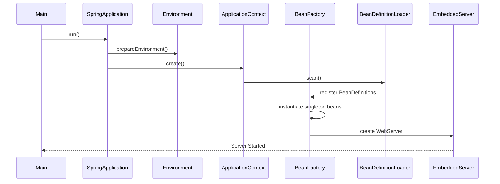
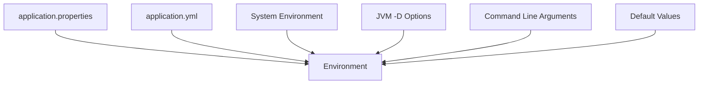
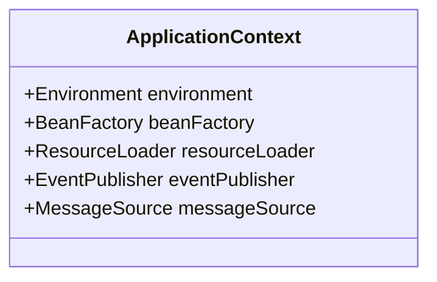
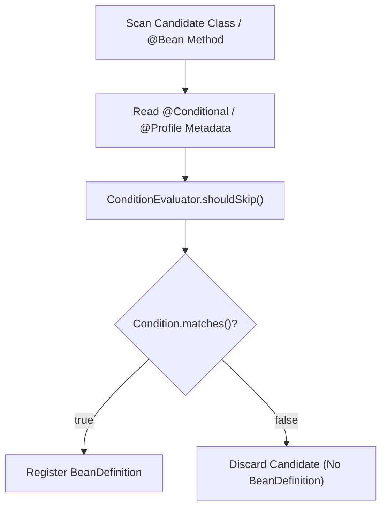
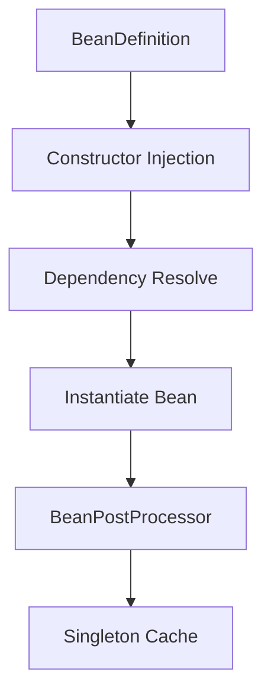
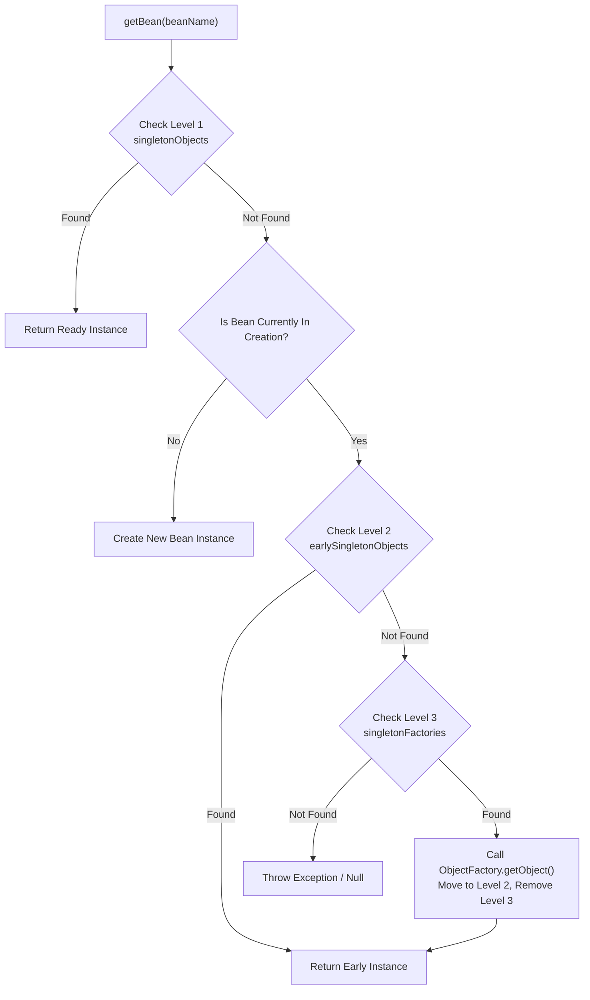
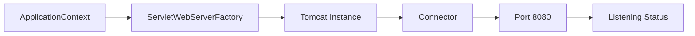
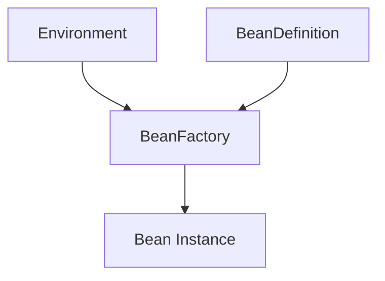
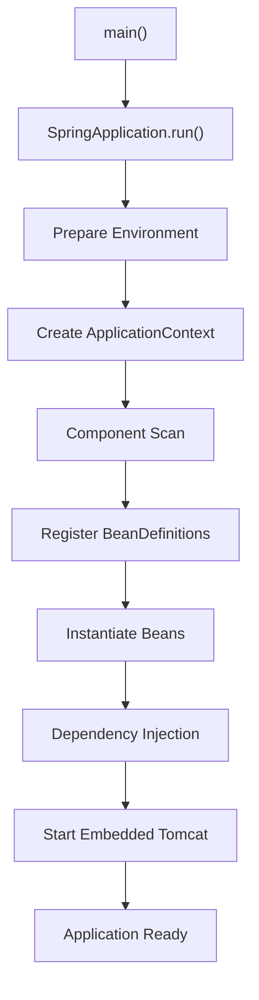

# Khởi động Spring Application

## Table of Contents

- [Tổng quan quy trình khởi động](#tổng-quan-quy-trình-khởi-động)
- [Chuỗi thời gian khởi động (Startup Timeline)](#chuỗi-thời-gian-khởi-động-startup-timeline)
- [Giai đoạn 1: Main Method](#giai-đoạn-1-main-method)
- [Giai đoạn 2: Tạo SpringApplication](#giai-đoạn-2-tạo-springapplication)
- [Xác định loại ứng dụng Web (Detect Web Application Type)](#xác-định-loại-ứng-dụng-web-detect-web-application-type)
- [Giai đoạn 3: Prepare Environment](#giai-đoạn-3-prepare-environment)
- [Khái niệm Environment trong Spring](#khái-niệm-environment-trong-spring)
- [Cơ chế PropertySource](#cơ-chế-propertysource)
- [Vai trò cốt lõi của Environment](#vai-trò-cốt-lõi-của-environment)
- [Giai đoạn 4: Create ApplicationContext](#giai-đoạn-4-create-applicationcontext)
- [Thành phần bên trong ApplicationContext](#thành-phần-bên-trong-applicationcontext)
- [Bản chất của BeanFactory](#bản-chất-của-beanfactory)
- [Khái niệm BeanDefinition](#khái-niệm-beandefinition)
- [BeanDefinition - Bản thiết kế của Bean](#beandefinition---bản-thiết-kế-của-bean)
- [Giai đoạn 5: Component Scan](#giai-đoạn-5-component-scan)
- [Cơ chế Đánh giá Điều kiện @Conditional và @Profile](#cơ-chế-đánh-giá-điều-kiện-conditional-và-profile)
- [Quá trình khởi tạo Bean (Bean Creation)](#quá-trình-khởi-tạo-bean-bean-creation)
- [Bộ nhớ đệm Singleton 3 Cấp và Giải quyết Phụ thuộc Vòng](#bộ-nhớ-đệm-singleton-3-cấp-và-giải-quyết-phụ-thuộc-vòng)
- [Giai đoạn 6: Embedded Server](#giai-đoạn-6-embedded-server)
- [Mối quan hệ giữa Environment, BeanDefinition và BeanFactory](#mối-quan-hệ-giữa-environment-beandefinition-và-beanfactory)
- [Lý do Spring tách biệt giai đoạn Scan và khởi tạo Bean](#lý-do-spring-tách-biệt-giai-đoạn-scan-và-khởi-tạo-bean)
- [Tóm tắt luồng thực thi (Execution Flow)](#tóm-tắt-luồng-thực-thi-execution-flow)
- [Mô hình tư duy tổng quan (Mental Model)](#mô-hình-tư-duy-tổng-quan-mental-model)

---

## Tổng quan quy trình khởi động

Khi khởi động một ứng dụng Spring Boot, phương thức `main` thường chỉ chứa một câu lệnh đơn giản:

Khai báo lớp khởi tạo ứng dụng Spring Boot chuẩn:
```java
@SpringBootApplication
public class Application {
    public static void main(String[] args) {
        SpringApplication.run(Application.class, args);
    }
}
```

Tuy nhiên, ẩn sau câu lệnh duy nhất này là chuỗi xử lý phức tạp được chia làm 6 giai đoạn lớn.

Luồng tổng quan qua các giai đoạn khởi tạo:

```mermaid
flowchart LR
    accTitle: Spring Boot Startup Phases
    accDescr: Overall execution flow from main method call to application ready state.

    startNode["main()"] --> runNode["SpringApplication.run()"]
    runNode --> envNode["Prepare Environment"]
    envNode --> ctxNode["Create ApplicationContext"]
    ctxNode --> loadNode["Load Bean Definitions"]
    loadNode --> factoryNode["Create BeanFactory"]
    factoryNode --> beanNode["Instantiate Singleton Beans"]
    beanNode --> serverNode["Start Embedded Server"]
    serverNode --> readyNode["Application Ready"]
```


Mục tiêu cụ thể của từng giai đoạn khởi động:

| Phase | Mục tiêu | Details |
| :--- | :--- | :--- |
| **Bootstrap** | Khởi tạo `SpringApplication` | Thiết lập bộ điều phối startup ban đầu |
| **Environment** | Chuẩn bị cấu hình | Tổng hợp tất cả nguồn thuộc tính cấu hình |
| **Context** | Tạo IoC Container | Khởi tạo `ApplicationContext` phù hợp với loại ứng dụng |
| **Bean Loading** | Đọc `BeanDefinition` | Quét classpath và nạp metadata của các bean |
| **Bean Creation** | Tạo Bean thật | Khởi tạo, inject dependency và lưu vào Singleton Cache |
| **Web Server** | Khởi động Embedded Server | Kích hoạt Tomcat/Jetty/Undertow lắng nghe HTTP Port |

---

## Chuỗi thời gian khởi động (Startup Timeline)

Chuỗi tương tác giữa các thành phần cốt lõi trong quá trình khởi động:

Biểu đồ trình tự thể hiện sự phối hợp giữa các đối tượng trung tâm:


---

## Giai đoạn 1: Main Method

Phương thức `main` kích hoạt toàn bộ quy trình:

Điểm khởi chạy ứng dụng mặc định:
```java
public static void main(String[] args) {
    SpringApplication.run(App.class, args);
}
```

Bản chất của câu lệnh trên tương đương với:

Khởi tạo instance và gọi phương thức thực thi:
```java
new SpringApplication(App.class).run(args);
```

Class `SpringApplication` đóng vai trò là **Bootstrapper** chính của hệ thống. Đối tượng này không quản lý lifecycle của các bean hay hoạt động như một IoC Container, mà đảm nhận các nhiệm vụ:

- Chuẩn bị môi trường và hạ tầng startup.
- Khởi tạo đúng loại `ApplicationContext`.
- Kích hoạt quy trình nạp cấu hình và tạo bean.

Mô hình phân cấp luồng gọi từ phương thức `main`:
```text
main() -> SpringApplication -> ApplicationContext
```

---

## Giai đoạn 2: Tạo SpringApplication

Khi khởi tạo `SpringApplication` thông qua constructor:

Constructor của class `SpringApplication`:
```java
new SpringApplication(primarySources)
```

Hệ thống Spring sẽ thực hiện các bước chuẩn bị nền tảng bao gồm: lưu lại thông tin main class, xác định loại ứng dụng web, nạp các đối tượng `ApplicationContextInitializer` và `ApplicationListener` từ tập tin cấu hình Spring Factories.

Sơ đồ tuần tự các thao tác trong constructor:
```text
SpringApplication
  ↓ save MainClass
  ↓ detect WebApplicationType
  ↓ load ApplicationContextInitializers
  ↓ load ApplicationListeners
```

---

## Xác định loại ứng dụng Web (Detect Web Application Type)

Spring Boot tự động phân tích classpath để xác định loại môi trường runtime:

- Môi trường Servlet HTTP truyền thống.
- Môi trường Reactive Web (Spring WebFlux).
- Môi trường Console Application (Non-Web).

Quy trình phát hiện loại ứng dụng:
```text
Nếu classpath chứa DispatcherServlet -> SERVLET
Nếu classpath chứa DispatcherHandler -> REACTIVE
Nếu không chứa các class trên         -> NONE
```

Phân loại dựa trên starter dependency được khai báo:

- Khai báo dependency `spring-boot-starter-web` sẽ thiết lập môi trường `SERVLET`.
- Khai báo dependency `spring-boot-starter-webflux` sẽ thiết lập môi trường `REACTIVE`.

---

## Giai đoạn 3: Prepare Environment

Giai đoạn này diễn ra trước khi bất kỳ bean nào được khởi tạo. Spring tập hợp toàn bộ các nguồn cấu hình vào một đối tượng thống nhất.

Các nguồn cấu hình đầu vào hợp thành Environment:


---

## Khái niệm Environment trong Spring

`Environment` là thành phần chịu trách nhiệm quản lý hai khía cạnh chính của ứng dụng: các **Profiles** đang kích hoạt và các **Property Sources** (nguồn thuộc tính cấu hình).

Ví dụ các khai báo cấu hình phổ biến:
```properties
server.port=8080
spring.datasource.url=jdbc:mysql://localhost:3306/db
logging.level.root=INFO
```

Khi sử dụng annotation lấy giá trị cấu hình:
```java
@Value("${server.port}")
```

Spring Framework sẽ tra cứu thông qua đối tượng `Environment` tập trung thay vì trực tiếp truy vấn từng tập tin đĩa cứng hay biến môi trường hệ thống.

---

## Cơ chế PropertySource

`Environment` duy trì danh sách các `PropertySource` theo thứ tự ưu tiên được định trước.

Cấu trúc danh sách các nguồn cấu hình theo thứ tự ưu tiên giảm dần:
```text
Environment
├── Command Line Arguments (Ưu tiên cao nhất)
├── JVM Parameters (-D)
├── ENV Variables
├── application.properties / application.yml
└── Default Properties (Ưu tiên thấp nhất)
```

Khi truy vấn thuộc tính:

Tra cứu giá trị thuộc tính cấu hình:
```java
environment.getProperty("server.port");
```

Hệ thống sẽ duyệt tuần tự qua các `PropertySource`. Nguồn cấu hình nào đứng trước và chứa khóa cần tìm sẽ cung cấp giá trị cuối cùng.

---

## Vai trò cốt lõi của Environment

Nếu thiếu giai đoạn chuẩn bị `Environment`, IoC Container sẽ không thể giải quyết các thông số cấu hình quan trọng cho các bean hạ tầng như URL cơ sở dữ liệu, tham số kết nối Redis, địa chỉ Kafka Broker hay chuỗi JWT Secret. Do đó, `Environment` bắt buộc phải được tạo dựng hoàn chỉnh trước `BeanFactory`.

---

## Giai đoạn 4: Create ApplicationContext

Sau khi khởi tạo xong `Environment`, `SpringApplication` sẽ khởi tạo instance `ApplicationContext` tương ứng với loại ứng dụng đã xác định ở Giai đoạn 2.

> [!NOTE]
> Loại `ApplicationContext` được lựa chọn dựa trên classpath runtime: `AnnotationConfigServletWebServerApplicationContext` cho Servlet Web, `AnnotationConfigApplicationContext` cho Console App, hoặc `AnnotationConfigReactiveWebServerApplicationContext` cho Reactive Web.

---

## Thành phần bên trong ApplicationContext

Mối quan hệ giữa `ApplicationContext` và các thành phần quản lý hạ tầng:



`ApplicationContext` đóng vai trò là bộ điều hành trung tâm quản lý toàn bộ vòng đời của ứng dụng. `BeanFactory` chỉ là một mô-đun thực thi bên trong chịu trách nhiệm quản lý các instance đối tượng.

---

## Bản chất của BeanFactory

`BeanFactory` là IoC Container cấp thấp nhất, chịu trách nhiệm trực tiếp đối với các hoạt động khởi tạo và quản lý bean.

Các nhiệm vụ chính của BeanFactory bao gồm:

- Khởi tạo instance từ thông tin metadata.
- Quản lý bộ nhớ đệm cho các bean phạm vi Singleton.
- Thực hiện Dependency Injection.
- Xử lý các phương thức tiêu hủy (destroy lifecycle).

Quy trình xử lý đối tượng bên trong `BeanFactory`:
```text
BeanFactory -> BeanDefinition -> Create Object -> Dependency Injection -> Singleton Cache
```

---

## Khái niệm BeanDefinition

Spring không khởi tạo instance đối tượng Java ngay lập tức trong quá trình quét package. Thay vào đó, toàn bộ thông tin cấu hình được đóng gói thành các đối tượng `BeanDefinition` (bản thiết kế metadata).

Khai báo một Spring Service thông thường:
```java
@Service
public class UserService {
}
```

Sau giai đoạn quét classpath, thông tin cấu hình của `UserService` được ghi nhận dưới dạng `BeanDefinition`:

```text
BeanDefinition Metadata:
- Bean Class: UserService
- Scope: singleton
- Lazy Initialization: false
- Autowire Mode: constructor
```

---

## BeanDefinition - Bản thiết kế của Bean

Sơ đồ chuyển đổi từ metadata sang instance đối tượng thật:

```text
BeanDefinition (Metadata) -> BeanFactory (Engine) -> Object Instance (Runtime)
```

Mô hình này tương tự như mối quan hệ giữa `Class` và instance đối tượng trong Java runtime:

```text
Class -> Reflection Metadata -> new Object()
```

Spring chủ động phân tách quá trình đọc cấu hình và khởi tạo đối tượng nhằm đạt được các lợi ích kiến trúc:

- Cho phép phân tích toàn bộ mảng phụ thuộc trước khi tạo instance.
- Áp dụng các kỹ thuật AOP Proxy và `BeanPostProcessor`.
- Kiểm tra và phát hiện sớm các lỗi phụ thuộc vòng (Circular Dependency).
- Cho phép chỉnh sửa metadata thông qua `BeanFactoryPostProcessor`.

---

## Giai đoạn 5: Component Scan

Spring thực thi cơ chế Component Scanning dựa trên annotation `@ComponentScan`:

Tiến trình quét và ghi nhận `BeanDefinition`:
```text
Scan Package -> Find @Component / @Service / @Repository / @Controller -> Register BeanDefinition
```

Kết quả của giai đoạn này là danh sách tập hợp các metadata được đăng ký vào `BeanFactory`:

```text
BeanFactory Registry:
├── "userService" -> BeanDefinition(UserService.class)
└── "userRepository" -> BeanDefinition(UserRepository.class)
```

> [!IMPORTANT]
> Hoàn tất giai đoạn Component Scan, hệ thống sở hữu đầy đủ thông tin `BeanDefinition` của các class candidate nhưng **chưa khởi tạo bất kỳ instance bean nào** trong bộ nhớ.

---

## Cơ chế Đánh giá Điều kiện @Conditional và @Profile

Trong môi trường thực tế, ứng dụng thường cần kích hoạt hoặc loại bỏ các bean tùy thuộc vào profile (`dev`, `prod`, `test`) hoặc sự xuất hiện của các thư viện, thuộc tính cấu hình. Spring giải quyết yêu cầu này thông qua annotation `@Conditional` và derivative của nó như `@Profile`.

### Giai đoạn Xử lý trong Lifecycle

Tất cả các điều kiện `@Conditional` và `@Profile` đều được đánh giá ở **Giai đoạn Scan & Parse Metadata (Giai đoạn 5)**, tức trước khi bất kỳ bean instance nào được tạo ra.

Sơ đồ quá trình lọc BeanDefinition bởi ConditionEvaluator:


### Cách Spring Quyết định Đăng ký Bean

Khi bộ quét `ClassPathBeanDefinitionScanner` hoặc `ConfigurationClassParser` phát hiện annotation `@Conditional`:

1. Spring khởi tạo đối tượng `ConditionEvaluator`, cung cấp ngữ cảnh `ConditionContext` (truy cập vào `Environment`, `BeanFactory`, `ResourceLoader`, `ClassLoader`).
2. Spring thực thi phương thức `matches(ConditionContext, AnnotatedTypeMetadata)` của class triển khai interface `Condition`.
3. Đối với `@Profile("dev")`, bản chất `@Profile` là một meta-annotation sử dụng `@Conditional(ProfileCondition.class)`. Class `ProfileCondition` sẽ kiểm tra `environment.acceptsProfiles(Profiles.of(...))`.
4. Nếu `matches()` trả về `false`, `ConditionEvaluator.shouldSkip()` trả về `true`. Spring lập tức dừng việc đăng ký `BeanDefinition` cho class hoặc `@Bean` method đó.

Bảng phân tích hai pha đánh giá điều kiện của `ConditionEvaluator`:

| Pha Đánh giá (`ConfigurationPhase`) | Phạm vi Áp dụng | Hành vi Khi Điều kiện Trả về `false` |
| :--- | :--- | :--- |
| **`PARSE_CONFIGURATION`** | Áp dụng trên lớp `@Configuration` | Bỏ qua toàn bộ lớp cấu hình và tất cả các phương thức `@Bean` bên trong |
| **`REGISTER_BEAN`** | Áp dụng trên `@Bean` method hoặc `@Component` độc lập | Bỏ qua việc đăng ký `BeanDefinition` cho bean cụ thể đó |

> [!NOTE]
> Việc lọc ở cấp độ `BeanDefinition` giúp IoC Container giữ dung lượng bộ nhớ tối ưu và tránh lỗi thiếu dependency runtime cho các bean không được kích hoạt.

---

## Quá trình khởi tạo Bean (Bean Creation)

Sau khi hoàn tất đăng ký toàn bộ `BeanDefinition`, `BeanFactory` tiến hành khởi tạo các singleton bean không thiết lập lazy loading.

Luồng xử lý khởi tạo một Bean instance:


Trình tự chi tiết cho từng đối tượng:

```text
BeanDefinition -> Resolve Dependencies -> Call Constructor -> Populate Fields -> Execute @PostConstruct -> Apply BeanPostProcessors -> Store in Singleton Cache
```

---

## Bộ nhớ đệm Singleton 3 Cấp và Giải quyết Phụ thuộc Vòng

Để đảm bảo hiệu năng và giải quyết bài toán phụ thuộc vòng (Circular Dependency), `BeanFactory` (cụ thể là `DefaultSingletonBeanRegistry`) không chỉ sử dụng một Map đơn lẻ mà duy trì kiến trúc bộ nhớ đệm 3 cấp (3-Level Cache).

### Cấu trúc Bộ nhớ Đệm 3 Cấp

Bảng tổng hợp vai trò và trạng thái bean trong 3 cấp cache:

| Cache Level | Tên Field trong `DefaultSingletonBeanRegistry` | Kiểu Dữ liệu | Trạng thái Bean Lưu trữ |
| :--- | :--- | :--- | :--- |
| **Cache Cấp 1** | `singletonObjects` | `Map<String, Object>` | Bean đã khởi tạo và initialize hoàn chỉnh (sẵn sàng sử dụng) |
| **Cache Cấp 2** | `earlySingletonObjects` | `Map<String, Object>` | Bean mới được gọi Constructor, chưa được inject dependency hay run init callbacks (Early Reference) |
| **Cache Cấp 3** | `singletonFactories` | `Map<String, ObjectFactory<?>>` | Chứa lambda `ObjectFactory` để tạo early reference hoặc AOP Dynamic Proxy sớm |

Sơ đồ truy xuất Bean qua 3 cấp cache:


### Cơ chế Giải quyết Phụ thuộc Vòng (Circular Dependency)

Phụ thuộc vòng xảy ra khi Bean A cần Bean B, và Bean B cũng cần Bean A (`A -> B -> A`).

Tiến trình giải quyết thông qua 3-Level Cache đối với **Field Injection** hoặc **Setter Injection**:

1. Spring bắt đầu khởi tạo `ServiceA`: gọi Constructor của `ServiceA`, chưa inject field.
2. Spring đưa một `ObjectFactory` của `ServiceA` vào **Cache Cấp 3 (`singletonFactories`)** và đánh dấu `ServiceA` là đang trong quá trình tạo (`in creation`).
3. Spring thực hiện inject `ServiceB` vào `ServiceA`. Do `ServiceB` chưa có, Spring tiến hành khởi tạo `ServiceB`.
4. Gọi Constructor `ServiceB`, đưa `ObjectFactory` của `ServiceB` vào Cache Cấp 3.
5. Spring inject `ServiceA` vào `ServiceB`. Spring gọi `getBean("serviceA")`:
   - Tìm ở Cache Cấp 1 -> Không thấy.
   - Phát hiện `ServiceA` đang `in creation`, tìm ở Cache Cấp 2 -> Không thấy.
   - Tìm ở Cache Cấp 3 -> Thấy `ObjectFactory` của `ServiceA`.
   - Gọi `getObject()` thu được instance thô (early reference/proxy) của `ServiceA`, đưa vào Cache Cấp 2 (`earlySingletonObjects`) và xóa khỏi Cache Cấp 3.
6. `ServiceB` nhận `ServiceA` thô, hoàn tất khởi tạo và chuyển vào Cache Cấp 1 (`singletonObjects`).
7. `ServiceA` nhận `ServiceB` hoàn chỉnh, hoàn tất khởi tạo và chuyển vào Cache Cấp 1 (`singletonObjects`).

### Hạn chế và Best Practices

> [!WARNING]
> **Constructor Injection THÌ KHÔNG THỂ tự động giải quyết phụ thuộc vòng**: Khi sử dụng Constructor Injection (`A` truyền `B` vào constructor, `B` truyền `A` vào constructor), Spring chưa thể hoàn tất bước gọi Constructor cho `ServiceA` nên chưa kịp đưa `ObjectFactory` vào Cache Cấp 3. Kết quả là hệ thống bắn ra lỗi `BeanCurrentlyInCreationException`.

Các giải pháp xử lý và khuyến nghị kiến trúc:

- **Giải pháp tạm thời**: Đánh dấu `@Lazy` tại tham số constructor để Spring tạo CGLIB Proxy thay thế instance thật tại thời điểm gọi constructor.
- **Khuyên trong thiết kế**: Phụ thuộc vòng là một **Code Smell** thể hiện việc vi phạm nguyên tắc Đơn nhiệm (Single Responsibility Principle - SRP). Giải pháp tốt nhất là refactor thiết kế bằng cách tách logic dùng chung sang một Bean thứ 3 (`ServiceC`) hoặc sử dụng cơ chế Event Publisher để decouple mối quan hệ giữa các component.

---

## Giai đoạn 6: Embedded Server

Khi các singleton bean cốt lõi đã sẵn sàng, ứng dụng Spring Boot bắt đầu khởi động Web Server nhúng.

Sơ đồ khởi chạy Embedded Web Server:


Spring Boot tìm kiếm bean triển khai interface `ServletWebServerFactory` (ví dụ `TomcatServletWebServerFactory`), yêu cầu khởi tạo instance `WebServer`, cấu hình port cùng các connector liên quan.

Các bước gọi khởi động Web Server:
```text
ApplicationContext -> ServletWebServerApplicationContext -> getWebServer() -> Tomcat.start()
```

Khi Web Server phát tín hiệu bắt đầu lắng nghe trên cổng cấu hình (ví dụ 8080), sự kiện `ApplicationReadyEvent` được kích hoạt, đánh dấu ứng dụng sẵn sàng xử lý các HTTP Request.

---

## Mối quan hệ giữa Environment, BeanDefinition và BeanFactory

Kiến trúc liên kết giữa 3 thành phần trung tâm:



Bảng mô tả vai trò phối hợp giữa các thành phần:

| Component | Role | Details |
| :--- | :--- | :--- |
| **`Environment`** | Cấu hình đầu vào | Cung cấp thông số cấu hình (`@Value`, `@ConfigurationProperties`, profiles) cho `BeanFactory` |
| **`BeanDefinition`** | Metadata mô tả | Cung cấp cấu trúc bản thiết kế (Class, Scope, Autowire Mode) cho `BeanFactory` |
| **`BeanFactory`** | Engine khởi tạo | Kết hợp thông tin từ `Environment` và `BeanDefinition` để tạo instance đối tượng runtime |

---

## Lý do Spring tách biệt giai đoạn Scan và khởi tạo Bean

Nếu Spring khởi tạo đối tượng trực tiếp ngay trong quá trình quét package, việc xử lý các phụ thuộc chéo sẽ gặp thất bại do nhiều class phụ thuộc chưa kịp quét tới.

So sánh hai hướng tiếp cận thiết kế:

```text
CÁCH TIẾP CẬN TRỰC TIẾP (Thất bại):
Scan Class A -> Instantiate Class A -> Class A cần Class B -> Class B chưa được Quét -> Lỗi Crash

CÁCH TIẾP CẬN HAI PHASE CỦA SPRING (Thành công):
Phase 1: Quét toàn bộ Package -> Tạo đầy đủ Danh sách BeanDefinition
Phase 2: Xây dựng Dependency Graph -> Khởi tạo Bean theo Thứ tự Tối ưu
```

Mô hình thiết kế 2 giai đoạn (Metadata trước, Instance sau) giúp Spring:

- Xây dựng sơ đồ phụ thuộc (Dependency Graph) hoàn chỉnh trước khi tạo đối tượng.
- Hỗ trợ các cơ chế can thiệp mở rộng như `BeanFactoryPostProcessor` và `BeanPostProcessor`.
- Xử lý mượt mà các điều kiện nạp bean (`@Conditional`, `@Profile`).

---

## Tóm tắt luồng thực thi (Execution Flow)

Tổng hợp toàn bộ tiến trình từ phương thức `main` đến trạng thái sẵn sàng của ứng dụng:



---

## Mô hình tư duy tổng quan (Mental Model)

Bảng tổng hợp vai trò và bản chất của các thành phần trong kiến trúc khởi động Spring Boot:

| Thành phần | Vai trò | Bản chất |
| :--- | :--- | :--- |
| `SpringApplication` | Bootstrap toàn bộ quá trình khởi động | Bộ điều phối startup |
| `Environment` | Quản lý cấu hình và Property Sources | Kho cấu hình thống nhất |
| `ApplicationContext` | IoC Container cấp cao | Trung tâm điều phối của Spring |
| `BeanFactory` | Tạo, inject và quản lý vòng đời bean | Engine của IoC |
| `BeanDefinition` | Metadata mô tả bean | Blueprint để tạo object |
| `ComponentScan` | Phát hiện candidate bean | Giai đoạn thu thập metadata |
| `@Conditional` / `@Profile` | Đánh giá điều kiện đăng ký BeanDefinition | Bộ lọc metadata giai đoạn parse |
| `Singleton Cache (3 Cấp)` | Quản lý bean singleton và xử lý phụ thuộc vòng | `singletonObjects`, `earlySingletonObjects`, `singletonFactories` |
| `ServletWebServerFactory` | Tạo Embedded Server | Cầu nối giữa Spring và Tomcat/Jetty |
| `Embedded Server` | Lắng nghe HTTP request | Runtime Web Server của ứng dụng |

> [!TIP]
> **Tóm tắt cốt lõi:** `SpringApplication` điều phối startup, `Environment` chuẩn bị cấu hình, `ApplicationContext` sở hữu `BeanFactory`, `BeanFactory` dùng `BeanDefinition` để tạo bean, sau đó Spring Boot khởi động `Embedded Server` và ứng dụng bắt đầu phục vụ request.

---
[← Back to README](README.md)
