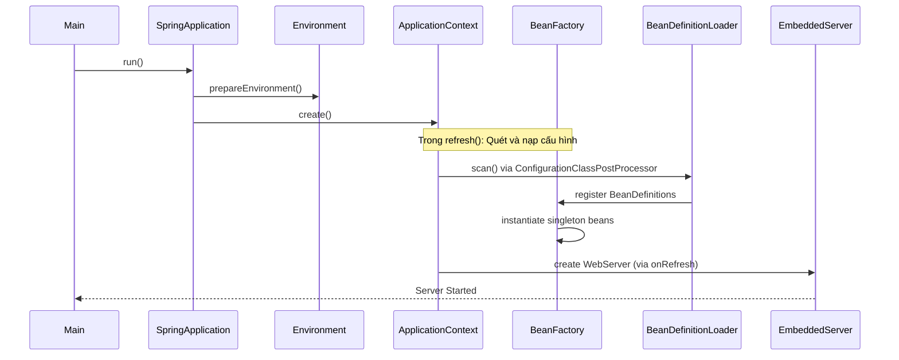
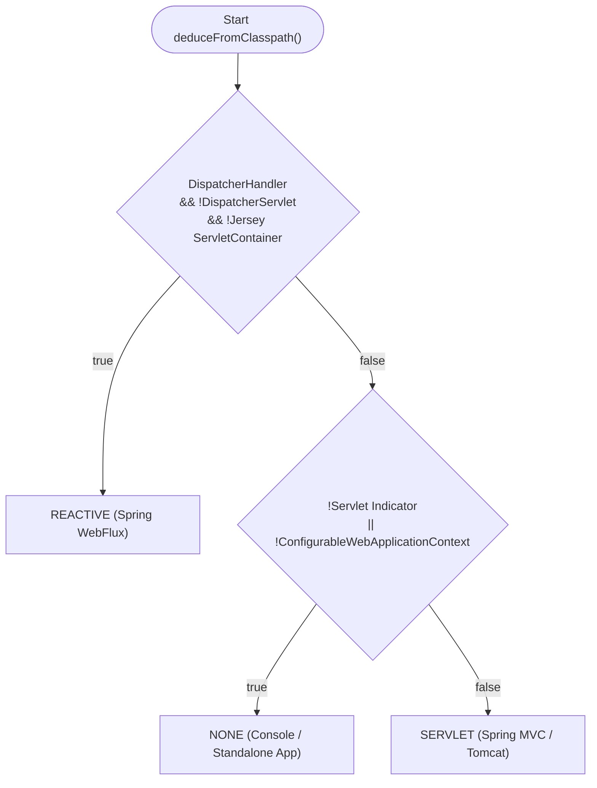
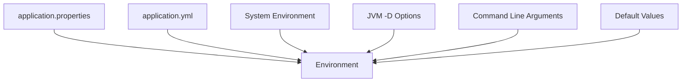
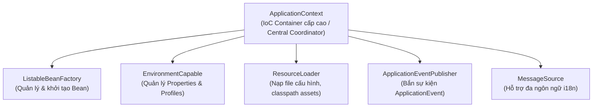
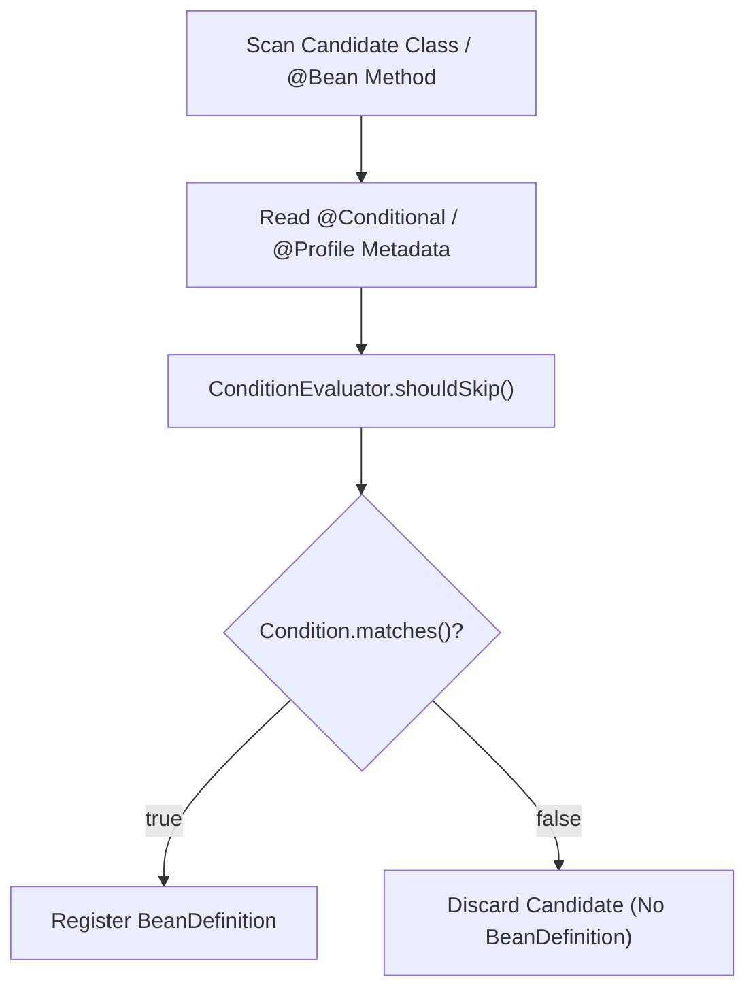
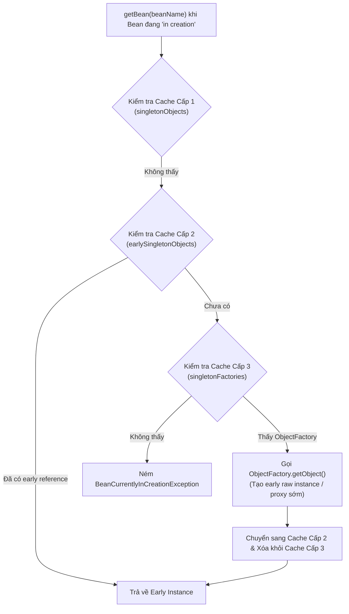
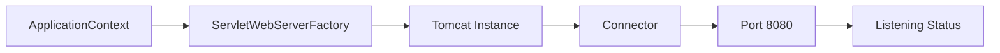
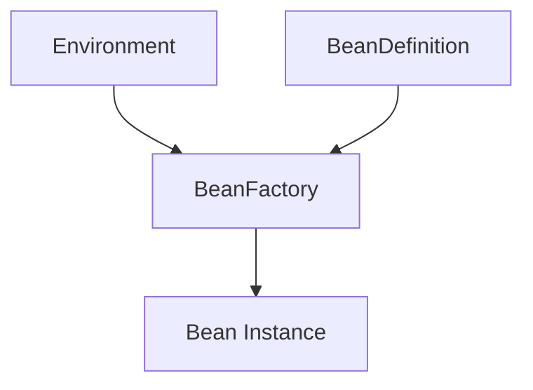

# Khởi động Spring Application

## Table of Contents

- [Tổng quan quy trình khởi động](#tổng-quan-quy-trình-khởi-động)
- [Chuỗi thời gian khởi động (Startup Timeline)](#chuỗi-thời-gian-khởi-động-startup-timeline)
- [Giai đoạn 1: Main Method](#giai-đoạn-1-main-method)
- [Giai đoạn 2: Tạo SpringApplication](#giai-đoạn-2-tạo-springapplication)
- [Xác định loại ứng dụng Web (Detect Web Application Type)](#xác-định-loại-ứng-dụng-web-detect-web-application-type)
- [Giai đoạn 3: Prepare Environment](#giai-đoạn-3-prepare-environment)
- [Khái niệm Environment trong Spring](#khái-niệm-environment-trong-spring)
- [Cơ chế PropertySource](#cơ-chế-propertysource)
- [Vai trò cốt lõi của Environment](#vai-trò-cốt-lõi-của-environment)
- [Giai đoạn 4: Create ApplicationContext](#giai-đoạn-4-create-applicationcontext)
- [Thành phần bên trong ApplicationContext](#thành-phần-bên-trong-applicationcontext)
- [Bản chất của BeanFactory](#bản-chất-của-beanfactory)
- [Khái niệm BeanDefinition](#khái-niệm-beandefinition)
- [BeanDefinition - Bản thiết kế của Bean](#beandefinition---bản-thiết-kế-của-bean)
- [Giai đoạn 5: Component Scan](#giai-đoạn-5-component-scan)
- [Cơ chế Đánh giá Điều kiện @Conditional và @Profile](#cơ-chế-đánh-giá-điều-kiện-conditional-và-profile)
- [Quá trình khởi tạo Bean (Bean Creation)](#quá-trình-khởi-tạo-bean-bean-creation)
- [Bộ nhớ đệm Singleton 3 Cấp và Giải quyết Phụ thuộc Vòng](#bộ-nhớ-đệm-singleton-3-cấp-và-giải-quyết-phụ-thuộc-vòng)
- [Giai đoạn 6: Embedded Server](#giai-đoạn-6-embedded-server)
- [Mối quan hệ giữa Environment, BeanDefinition và BeanFactory](#mối-quan-hệ-giữa-environment-beandefinition-và-beanfactory)
- [Lý do Spring tách biệt giai đoạn Scan và khởi tạo Bean](#lý-do-spring-tách-biệt-giai-đoạn-scan-và-khởi-tạo-bean)
- [Tóm tắt luồng thực thi (Execution Flow)](#tóm-tắt-luồng-thực-thi-execution-flow)

---

## Tổng quan quy trình khởi động

Khi khởi động một ứng dụng Spring Boot, phương thức `main` thường chỉ chứa một câu lệnh đơn giản:

Khai báo lớp khởi tạo ứng dụng Spring Boot chuẩn:
```java
@SpringBootApplication
public class Application {
    public static void main(String[] args) {
        SpringApplication.run(Application.class, args);
    }
}
```

Tuy nhiên, ẩn sau câu lệnh duy nhất này là chuỗi xử lý phức tạp được chia làm 6 giai đoạn lớn.

Luồng tổng quan qua các giai đoạn khởi tạo:

```mermaid
flowchart LR
    accTitle: Spring Boot Startup Phases
    accDescr: Overall execution flow from main method call to application ready state.

    startNode["main()"] --> runNode["SpringApplication.run()"]
    runNode --> envNode["Prepare Environment"]
    envNode --> ctxNode["Create ApplicationContext"]
    ctxNode --> loadNode["Load Bean Definitions"]
    loadNode --> factoryNode["Create BeanFactory"]
    factoryNode --> beanNode["Instantiate Singleton Beans"]
    beanNode --> serverNode["Start Embedded Server"]
    serverNode --> readyNode["Application Ready"]
```


Mục tiêu cụ thể của từng giai đoạn khởi động:

| Phase | Mục tiêu | Details |
| :--- | :--- | :--- |
| **Bootstrap** | Khởi tạo `SpringApplication` | Thiết lập bộ điều phối startup ban đầu |
| **Environment** | Chuẩn bị cấu hình | Tổng hợp tất cả nguồn thuộc tính cấu hình |
| **Context** | Tạo IoC Container | Khởi tạo `ApplicationContext` phù hợp với loại ứng dụng |
| **Bean Loading** | Đọc `BeanDefinition` | Quét classpath và nạp metadata của các bean |
| **Bean Creation** | Tạo Bean thật | Khởi tạo, inject dependency và lưu vào Singleton Cache |
| **Web Server** | Khởi động Embedded Server | Kích hoạt Tomcat/Jetty/Undertow lắng nghe HTTP Port |

---

## Chuỗi thời gian khởi động (Startup Timeline)

Chuỗi tương tác giữa các thành phần cốt lõi trong quá trình khởi động:

Biểu đồ trình tự thể hiện sự phối hợp giữa các đối tượng trung tâm:


---

## Giai đoạn 1: Main Method

Phương thức `main` kích hoạt toàn bộ quy trình:

Điểm khởi chạy ứng dụng mặc định:
```java
public static void main(String[] args) {
    SpringApplication.run(App.class, args);
}
```

Bản chất của câu lệnh trên tương đương với:

Khởi tạo instance và gọi phương thức thực thi:
```java
new SpringApplication(App.class).run(args);
```

Class `SpringApplication` đóng vai trò là **Bootstrapper** chính của hệ thống. Đối tượng này không quản lý lifecycle của các bean hay hoạt động như một IoC Container, mà đảm nhận các nhiệm vụ:

- Chuẩn bị môi trường và hạ tầng startup.
- Khởi tạo đúng loại `ApplicationContext`.
- Kích hoạt quy trình nạp cấu hình và tạo bean.

Mô hình phân cấp luồng gọi từ phương thức `main`:
```text
main() -> SpringApplication -> ApplicationContext
```

---

## Giai đoạn 2: Tạo SpringApplication

Khi khởi tạo `SpringApplication` thông qua constructor:

Constructor của class `SpringApplication`:
```java
new SpringApplication(primarySources)
```

Hệ thống Spring sẽ thực hiện các bước chuẩn bị nền tảng bao gồm: lưu lại thông tin main class, xác định loại ứng dụng web, nạp các đối tượng `ApplicationContextInitializer` và `ApplicationListener` từ tập tin cấu hình Spring Factories.

Sơ đồ tuần tự các thao tác trong constructor:
```text
SpringApplication
  ↓ save MainClass
  ↓ detect WebApplicationType
  ↓ load ApplicationContextInitializers
  ↓ load ApplicationListeners
```

---

## Xác định loại ứng dụng Web (Detect Web Application Type)

Spring Boot tự động phân tích classpath thông qua phương thức `WebApplicationType.deduceFromClasspath()` theo trình tự kiểm tra loại trừ:



Thuật toán phân loại chính xác trong mã nguồn Spring Boot:

1. **Kiểm tra REACTIVE trước**: Nếu classpath chứa `DispatcherHandler` đồng thời **không chứa** `DispatcherServlet` và **không chứa** `org.glassfish.jersey.servlet.ServletContainer` → Xác định là `REACTIVE`.
2. **Kiểm tra điều kiện SERVLET**: Kiểm tra sự tồn tại của 2 class chỉ báo Servlet (`javax.servlet.Servlet` / `jakarta.servlet.Servlet` và `ConfigurableWebApplicationContext`). Nếu thiếu bất kỳ class nào trong hai class trên → Xác định là `NONE`.
3. **Mặc định còn lại**: Nếu thỏa mãn cả 2 class chỉ báo Servlet → Xác định là `SERVLET`.

---

## Giai đoạn 3: Prepare Environment

Giai đoạn này diễn ra trước khi bất kỳ bean nào được khởi tạo. Spring tập hợp toàn bộ các nguồn cấu hình vào một đối tượng thống nhất.

Các nguồn cấu hình đầu vào hợp thành Environment:


---

## Khái niệm Environment trong Spring

`Environment` là thành phần chịu trách nhiệm quản lý hai khía cạnh chính của ứng dụng: các **Profiles** đang kích hoạt và các **Property Sources** (nguồn thuộc tính cấu hình).

Ví dụ các khai báo cấu hình phổ biến:
```properties
server.port=8080
spring.datasource.url=jdbc:mysql://localhost:3306/db
logging.level.root=INFO
```

Khi sử dụng annotation lấy giá trị cấu hình:
```java
@Value("${server.port}")
```

Spring Framework sẽ tra cứu thông qua đối tượng `Environment` tập trung thay vì trực tiếp truy vấn từng tập tin đĩa cứng hay biến môi trường hệ thống.

---

## Cơ chế PropertySource

`Environment` duy trì danh sách các `PropertySource` theo thứ tự ưu tiên được định trước.

Cấu trúc danh sách các nguồn cấu hình theo thứ tự ưu tiên giảm dần (danh sách tóm tắt các nguồn phổ biến):
```text
Environment
├── Command Line Arguments (Ưu tiên cao nhất)
├── JVM Parameters (-D)
├── ENV Variables
├── application.properties / application.yml
└── Default Properties (Ưu tiên thấp nhất)
```

> [!NOTE]
> Thứ tự trên là danh sách rút gọn các nguồn thông dụng. Thứ tự nạp đầy đủ trong tài liệu Spring Boot bao gồm hơn 17 cấp độ (như Devtools properties, `@TestPropertySource`, `SPRING_APPLICATION_JSON`, RandomValuePropertySource, profile-specific files, v.v.).

Khi truy vấn thuộc tính:

Tra cứu giá trị thuộc tính cấu hình:
```java
environment.getProperty("server.port");
```

Hệ thống sẽ duyệt tuần tự qua các `PropertySource`. Nguồn cấu hình nào đứng trước và chứa khóa cần tìm sẽ cung cấp giá trị cuối cùng.

---

## Vai trò cốt lõi của Environment

Nếu thiếu giai đoạn chuẩn bị `Environment`, IoC Container sẽ không thể giải quyết các thông số cấu hình quan trọng cho các bean hạ tầng như URL cơ sở dữ liệu, tham số kết nối Redis, địa chỉ Kafka Broker hay chuỗi JWT Secret. Do đó, `Environment` bắt buộc phải được tạo dựng hoàn chỉnh trước `BeanFactory`.

---

## Giai đoạn 4: Create ApplicationContext

Sau khi khởi tạo xong `Environment`, `SpringApplication` sẽ khởi tạo instance `ApplicationContext` tương ứng với loại ứng dụng đã xác định ở Giai đoạn 2.

> [!NOTE]
> Loại `ApplicationContext` được lựa chọn dựa trên classpath runtime: `AnnotationConfigServletWebServerApplicationContext` cho Servlet Web, `AnnotationConfigApplicationContext` cho Console App, hoặc `AnnotationConfigReactiveWebServerApplicationContext` cho Reactive Web.

---

## Thành phần bên trong ApplicationContext

`ApplicationContext` là IoC Container cấp cao, đóng vai trò như một bộ điều phối trung tâm (Central Coordinator) tích hợp nhiều hệ thống con chuyên trách:



Bảng giải thích các năng lực cốt lõi được `ApplicationContext` tích hợp:

| Năng lực / Phân hệ | Giao diện đảm trách | Chức năng thực tế |
| :--- | :--- | :--- |
| **Quản trị Bean** | `ListableBeanFactory` | Đọc `BeanDefinition`, khởi tạo singleton instance, inject dependency |
| **Cấu hình & Môi trường** | `EnvironmentCapable` | Quản lý active profiles và thứ tự nạp các `PropertySource` |
| **Nạp tài nguyên** | `ResourceLoader` | Tải tài nguyên từ các tiền tố `classpath:`, `file:`, hoặc URL |
| **Cơ chế sự kiện** | `ApplicationEventPublisher` | Bắn các sự kiện vòng đời (`ContextRefreshedEvent`, `ApplicationReadyEvent`) |
| **Đa ngôn ngữ (i18n)** | `MessageSource` | Hỗ trợ phân giải thông điệp và quốc tế hóa giao diện/API |

> [!NOTE]
> `ApplicationContext` không trực tiếp tự làm tất cả mọi việc mà ủy thác từng mảng công việc cho các thành phần con tương ứng, trong đó `BeanFactory` là mô-đun hạt nhân phụ trách quản lý bean.

---

## Bản chất của BeanFactory

`BeanFactory` là IoC Container cấp thấp nhất, chịu trách nhiệm trực tiếp đối với các hoạt động khởi tạo và quản lý bean.

Các nhiệm vụ chính của BeanFactory bao gồm:

- Khởi tạo instance từ thông tin metadata.
- Quản lý bộ nhớ đệm cho các bean phạm vi Singleton.
- Thực hiện Dependency Injection.
- Xử lý các phương thức tiêu hủy (destroy lifecycle).

Quy trình xử lý đối tượng bên trong `BeanFactory`:
```text
BeanFactory -> BeanDefinition -> Create Object -> Dependency Injection -> Singleton Cache
```

---

## Khái niệm BeanDefinition

Spring không khởi tạo instance đối tượng Java ngay lập tức trong quá trình quét package. Thay vào đó, toàn bộ thông tin cấu hình được đóng gói thành các đối tượng `BeanDefinition` (bản thiết kế metadata).

Khai báo một Spring Service thông thường:
```java
@Service
public class UserService {
}
```

Sau giai đoạn quét classpath, thông tin cấu hình của `UserService` được ghi nhận dưới dạng `BeanDefinition`:

```text
BeanDefinition Metadata:
- Bean Class: UserService
- Scope: singleton
- Lazy Initialization: false
- Autowire Mode: constructor
```

---

## BeanDefinition - Bản thiết kế của Bean

Sơ đồ chuyển đổi từ metadata sang instance đối tượng thật:

```text
BeanDefinition (Metadata) -> BeanFactory (Engine) -> Object Instance (Runtime)
```

Mô hình này tương tự như mối quan hệ giữa `Class` và instance đối tượng trong Java runtime:

```text
Class -> Reflection Metadata -> new Object()
```

Spring chủ động phân tách quá trình đọc cấu hình và khởi tạo đối tượng nhằm đạt được các lợi ích kiến trúc:

- Cho phép phân tích toàn bộ mảng phụ thuộc trước khi tạo instance.
- Áp dụng các kỹ thuật AOP Proxy và `BeanPostProcessor`.
- Kiểm tra và phát hiện sớm các lỗi phụ thuộc vòng (Circular Dependency).
- Cho phép chỉnh sửa metadata thông qua `BeanFactoryPostProcessor`.

---

## Giai đoạn 5: Component Scan

Spring thực thi cơ chế Component Scanning dựa trên annotation `@ComponentScan`:

Tiến trình quét và ghi nhận `BeanDefinition`:
```text
Scan Package -> Find @Component / @Service / @Repository / @Controller -> Register BeanDefinition
```

Kết quả của giai đoạn này là danh sách tập hợp các metadata được đăng ký vào `BeanFactory`:

```text
BeanFactory Registry:
├── "userService" -> BeanDefinition(UserService.class)
└── "userRepository" -> BeanDefinition(UserRepository.class)
```

> [!IMPORTANT]
> Hoàn tất giai đoạn Component Scan, hệ thống sở hữu đầy đủ thông tin `BeanDefinition` của các class candidate nhưng **chưa khởi tạo bất kỳ instance bean nào** trong bộ nhớ.

---

## Cơ chế Đánh giá Điều kiện @Conditional và @Profile

Trong môi trường thực tế, ứng dụng thường cần kích hoạt hoặc loại bỏ các bean tùy thuộc vào profile (`dev`, `prod`, `test`) hoặc sự xuất hiện của các thư viện, thuộc tính cấu hình. Spring giải quyết yêu cầu này thông qua annotation `@Conditional` và derivative của nó như `@Profile`.

### Giai đoạn Xử lý trong Lifecycle

Tất cả các điều kiện `@Conditional` và `@Profile` đều được đánh giá ở **Giai đoạn Scan & Parse Metadata (Giai đoạn 5)**, tức trước khi bất kỳ bean instance nào được tạo ra.

Sơ đồ quá trình lọc BeanDefinition bởi ConditionEvaluator:


### Cách Spring Quyết định Đăng ký Bean

Khi bộ quét `ClassPathBeanDefinitionScanner` hoặc `ConfigurationClassParser` phát hiện annotation `@Conditional`:

1. Spring khởi tạo đối tượng `ConditionEvaluator`, cung cấp ngữ cảnh `ConditionContext` (truy cập vào `Environment`, `BeanFactory`, `ResourceLoader`, `ClassLoader`).
2. Spring thực thi phương thức `matches(ConditionContext, AnnotatedTypeMetadata)` của class triển khai interface `Condition`.
3. Đối với `@Profile("dev")`, bản chất `@Profile` là một meta-annotation sử dụng `@Conditional(ProfileCondition.class)`. Class `ProfileCondition` sẽ kiểm tra `environment.acceptsProfiles(Profiles.of(...))`.
4. Nếu `matches()` trả về `false`, `ConditionEvaluator.shouldSkip()` trả về `true`. Spring lập tức dừng việc đăng ký `BeanDefinition` cho class hoặc `@Bean` method đó.

Bảng phân tích hai pha đánh giá điều kiện của `ConditionEvaluator`:

| Pha Đánh giá (`ConfigurationPhase`) | Phạm vi Áp dụng | Hành vi Khi Điều kiện Trả về `false` |
| :--- | :--- | :--- |
| **`PARSE_CONFIGURATION`** | Áp dụng trên lớp `@Configuration` | Bỏ qua toàn bộ lớp cấu hình và tất cả các phương thức `@Bean` bên trong |
| **`REGISTER_BEAN`** | Áp dụng trên `@Bean` method hoặc `@Component` độc lập | Bỏ qua việc đăng ký `BeanDefinition` cho bean cụ thể đó |

> [!NOTE]
> Việc lọc ở cấp độ `BeanDefinition` giúp IoC Container giữ dung lượng bộ nhớ tối ưu và tránh lỗi thiếu dependency runtime cho các bean không được kích hoạt.

---

## Quá trình khởi tạo Bean (Bean Creation)

Sau khi hoàn tất đăng ký toàn bộ `BeanDefinition`, `BeanFactory` tiến hành khởi tạo các singleton bean không thiết lập lazy loading (`lazy-init = false`).

### Bảng chi tiết các giai đoạn khởi tạo Bean

| Bước | Giai đoạn | Hành động cụ thể | Trạng thái Bean & Dependency |
| :--- | :--- | :--- | :--- |
| **1** | **Resolve Constructor Args** | Phân tích tham số của constructor được chọn, tra cứu và resolve các bean phụ thuộc từ `ApplicationContext` | Instance chưa được tạo. Nếu dependency bắt buộc (`required = true`) không tìm thấy $\rightarrow$ ném `BeanCreationException` |
| **2** | **Instantiate (Gọi Constructor)** | Gọi constructor qua Reflection (`new TargetClass(resolvedArgs)`) để cấp phát vùng nhớ JVM | Instance thô được tạo. Các trường `final` nhận giá trị ngay lập tức trong quá trình thực thi constructor |
| **3** | **Populate Properties** | Quét các annotation `@Autowired`, `@Value` trên field và setter method để inject các dependency còn lại | Hoàn tất injection cho Field và Setter. Các trường không thuộc constructor được gán giá trị tại bước này |
| **4** | **Aware Callbacks** | Inject các infrastructure interface nếu bean có triển khai (`BeanNameAware`, `BeanFactoryAware`, `ApplicationContextAware`) | Bean nhận biết được ngữ cảnh môi trường và IoC container đang quản lý nó |
| **5** | **BeanPostProcessor (Before Init)** | Thực thi `postProcessBeforeInitialization()` của tất cả các `BeanPostProcessor` đã đăng ký | Xử lý `@PostConstruct` (thông qua `CommonAnnotationBeanPostProcessor`) trước khi chạy logic init |
| **6** | **InitializingBean & Custom Init** | Gọi `InitializingBean.afterPropertiesSet()` và sau đó gọi phương thức cấu hình `initMethod` | Thực thi logic khởi tạo nghiệp vụ của bean |
| **7** | **BeanPostProcessor (After Init)** | Thực thi `postProcessAfterInitialization()`, bọc AOP Dynamic Proxy (CGLIB / JDK Dynamic Proxy) nếu bean có advice | Trả về proxy bọc ngoài bean gốc nếu có AOP; nếu không có proxy thì giữ nguyên instance gốc |
| **8** | **Singleton Cache** | Đưa instance hoàn chỉnh vào Cache Cấp 1 (`singletonObjects`) trong `DefaultSingletonBeanRegistry` | Bean sẵn sàng phục vụ cho toàn bộ ứng dụng |

---

### Phân tích kỹ thuật: Constructor DI so với Field/Setter DI

Hiểu rõ bản chất JVM trong từng giai đoạn giúp phân biệt rõ ràng hành vi giữa Constructor Injection và Field/Setter Injection:

```java
// 1. Constructor Injection: Khởi tạo tại Bước 1 & Bước 2
@Service
public class OrderService {
    private final PaymentGateway paymentGateway; // Cho phép gán từ khóa final (bất biến)

    public OrderService(PaymentGateway paymentGateway) {
        this.paymentGateway = paymentGateway; // Trường dữ liệu đã nhận giá trị ngay khi constructor kết thúc
    }
}

// 2. Field / Setter Injection: Khởi tạo tại Bước 3 (Populate Properties)
@Service
public class UserService {
    @Autowired
    private UserRepository userRepository; // Không thể khai báo final vì được inject sau bước new()
}
```

Bảng so sánh cơ chế thực thi:

| Tiêu chí | Constructor Injection | Field / Setter Injection |
| :--- | :--- | :--- |
| **Thời điểm inject** | **Bước 1 & 2** (Trước và trong khi `new`) | **Bước 3** (Sau khi object đã tồn tại trong heap) |
| **Khả năng dùng `final`** | **Có** (bảo đảm tính bất biến - immutability) | **Không** (do gán qua Reflection/Setter sau khi khởi tạo) |
| **Xử lý constructor đơn** | Tự động inject từ Spring 4.3+ mà không cần viết `@Autowired` | Luôn cần annotation `@Autowired` hoặc `@Inject` |
| **Ý nghĩa của `required`** | `@Autowired(required = true)` xác định tham số constructor bắt buộc phải resolve thành công để gọi `new` | `@Autowired(required = false)` cho phép gán `null` nếu không tìm thấy bean tương ứng |

> [!TIP]
> **Khuyến nghị thiết kế:** Luôn ưu tiên **Constructor Injection** với các trường `final` nhằm đảm bảo bean không ở trạng thái bán khởi tạo (partially initialized), ngăn ngừa `NullPointerException` và hỗ trợ viết Unit Test dễ dàng mà không cần context Spring.

---

## Bộ nhớ đệm Singleton 3 Cấp và Giải quyết Phụ thuộc Vòng

Khi **Bean A** phụ thuộc **Bean B** mà **Bean B** cũng phụ thuộc ngược lại **Bean A** (`A ↔ B`), **Spring** không đợi **Bean A** hoàn thiện toàn bộ (chạy xong DI và init) mới chuyển cho B dùng. Thay vào đó, **Spring** cung cấp cho B một **bản tham chiếu sớm (early reference)** của A ngay khi A vừa gọi xong constructor (đã có vùng nhớ nhưng chưa inject field). Hệ thống **3 cấp cache** trong `DefaultSingletonBeanRegistry` tồn tại nhằm quản lý an toàn và nhất quán vòng đời của bản tham chiếu sớm này.

### Cấu trúc Bộ nhớ Đệm 3 Cấp

| Cache Level | Tên Field (`DefaultSingletonBeanRegistry`) | Kiểu Dữ liệu | Trạng thái Bean Lưu trữ & Mục đích |
| :--- | :--- | :--- | :--- |
| **Cache Cấp 1** | `singletonObjects` | `Map<String, Object>` | Bean hoàn chỉnh 100% (đã inject đầy đủ dependency, chạy xong callback và sẵn sàng phục vụ) |
| **Cache Cấp 2** | `earlySingletonObjects` | `Map<String, Object>` | Bản tham chiếu sớm (được lấy từ Cache 3 chuyển lên), dùng chung cho các bean khác cần tham chiếu tới khi chưa hoàn thiện |
| **Cache Cấp 3** | `singletonFactories` | `Map<String, ObjectFactory<?>>` | Chứa lambda factory tạo early reference. Nếu bean cần AOP (như `@Transactional`), factory sẽ sinh ra Dynamic Proxy sớm thay vì raw object |

---

### Cơ chế Phân giải Vòng lặp (Field & Setter Injection)

Khi xảy ra phụ thuộc vòng giữa hai bean, Spring thực hiện tra cứu tuần tự từ Cấp 1 đến Cấp 3 để trích xuất hoặc tạo early reference:



Bảng theo dõi tiến trình thực tế khi khởi tạo `ServiceA` và `ServiceB` (`A ↔ B`):

| Bước | Hành động của Container | Trạng thái Cache Cấp 1 (`singletonObjects`) | Trạng thái Cache Cấp 2 (`earlySingletonObjects`) | Trạng thái Cache Cấp 3 (`singletonFactories`) |
| :--- | :--- | :--- | :--- | :--- |
| **1** | Khởi tạo `ServiceA` (gọi constructor xong, chưa inject field) | Rỗng | Rỗng | `serviceA` $\rightarrow$ `ObjectFactory(ServiceA)` |
| **2** | Inject `ServiceB` vào A $\rightarrow$ Kích hoạt tạo `ServiceB` | Rỗng | Rỗng | `serviceA`, `serviceB` |
| **3** | Inject `ServiceA` vào B $\rightarrow$ Tra cứu `getBean("serviceA")` | Rỗng | `serviceA` (lấy từ Factory Cấp 3 lên) | `serviceB` (xóa `serviceA`) |
| **4** | `ServiceB` nhận `serviceA` sớm, hoàn thiện toàn bộ lifecycle | `serviceB` (hoàn chỉnh) | `serviceA` | (xóa `serviceB`) |
| **5** | `ServiceA` nhận `serviceB` hoàn chỉnh, hoàn tất lifecycle | `serviceA`, `serviceB` | (xóa `serviceA`) | Rỗng |

---

### Hạn chế với Constructor Injection

> [!WARNING]
> **Constructor Injection KHÔNG THỂ tự giải quyết phụ thuộc vòng**: 
> So với tiến trình ở trên, điểm mấu chốt là việc đưa `ObjectFactory` vào Cache Cấp 3 **chỉ diễn ra sau khi constructor thực thi xong**. Khi `ServiceA` yêu cầu `ServiceB` ngay trong tham số constructor, JVM bắt buộc phải có `ServiceB` trước khi gọi `new ServiceA()`, khiến `ServiceA` chưa thể hoàn tất constructor để đăng ký vào Cache Cấp 3. Kết quả là hệ thống bắn ra lỗi `BeanCurrentlyInCreationException`.

Các giải pháp xử lý và khuyến nghị kiến trúc:

- **Giải pháp tạm thời**: Đánh dấu `@Lazy` tại tham số constructor để Spring tạo CGLIB Proxy thay thế instance thật tại thời điểm gọi constructor.
- **Khuyến nghị thiết kế**: Phụ thuộc vòng là một **Code Smell** thể hiện việc vi phạm nguyên tắc Đơn nhiệm (Single Responsibility Principle - SRP). Giải pháp tốt nhất là refactor thiết kế bằng cách tách logic dùng chung sang một Bean thứ 3 (`ServiceC`) hoặc sử dụng cơ chế Event Publisher để decouple mối quan hệ giữa các component.

---

## Giai đoạn 6: Embedded Server

Khi các singleton bean cốt lõi đã sẵn sàng, ứng dụng Spring Boot bắt đầu khởi động Web Server nhúng.

Sơ đồ khởi chạy Embedded Web Server:


Spring Boot tìm kiếm bean triển khai interface `ServletWebServerFactory` (ví dụ `TomcatServletWebServerFactory`), yêu cầu khởi tạo instance `WebServer`, cấu hình port cùng các connector liên quan.

Các bước gọi khởi động Web Server:
```text
ApplicationContext -> ServletWebServerApplicationContext -> getWebServer() -> Tomcat.start()
```

Khi Web Server phát tín hiệu bắt đầu lắng nghe trên cổng cấu hình (ví dụ 8080), sự kiện `ApplicationReadyEvent` được kích hoạt, đánh dấu ứng dụng sẵn sàng xử lý các HTTP Request.

---

## Mối quan hệ giữa Environment, BeanDefinition và BeanFactory

Kiến trúc liên kết giữa 3 thành phần trung tâm:



Bảng mô tả vai trò phối hợp giữa các thành phần:

| Component | Role | Details |
| :--- | :--- | :--- |
| **`Environment`** | Cấu hình đầu vào | Cung cấp thông số cấu hình (`@Value`, `@ConfigurationProperties`, profiles) cho `BeanFactory` |
| **`BeanDefinition`** | Metadata mô tả | Cung cấp cấu trúc bản thiết kế (Class, Scope, Autowire Mode) cho `BeanFactory` |
| **`BeanFactory`** | Engine khởi tạo | Kết hợp thông tin từ `Environment` và `BeanDefinition` để tạo instance đối tượng runtime |

---

## Lý do Spring tách biệt giai đoạn Scan và khởi tạo Bean

Nếu Spring khởi tạo đối tượng trực tiếp ngay trong quá trình quét package, việc xử lý các phụ thuộc chéo sẽ gặp thất bại do nhiều class phụ thuộc chưa kịp quét tới.

So sánh hai hướng tiếp cận thiết kế:

```text
CÁCH TIẾP CẬN TRỰC TIẾP (Thất bại):
Scan Class A -> Instantiate Class A -> Class A cần Class B -> Class B chưa được Quét -> Lỗi Crash

CÁCH TIẾP CẬN HAI PHASE CỦA SPRING (Thành công):
Phase 1: Quét toàn bộ Package -> Đánh giá điều kiện -> Tạo đầy đủ Danh sách BeanDefinition
Phase 2: Xây dựng Dependency Graph -> Khởi tạo Bean theo Thứ tự Tối ưu (Constructor -> Field DI -> BPP)
```

Mô hình thiết kế 2 giai đoạn (Metadata trước, Instance sau) cho phép Spring xây dựng sơ đồ phụ thuộc (Dependency Graph) hoàn chỉnh và xử lý an toàn các bộ lọc điều kiện trước khi tiêu tốn tài nguyên cấp phát bộ nhớ cho các instance đối tượng.

---

## Tóm tắt luồng thực thi

Bảng tổng hợp toàn bộ tiến trình tuần tự từ phương thức `main` đến trạng thái sẵn sàng phục vụ của ứng dụng:

| Thứ tự | Bước thực thi | Thành phần đảm trách | Hành động chi tiết |
| :--- | :--- | :--- | :--- |
| **1** | **Main Entry Point** | `main()` | Gọi lệnh `SpringApplication.run(App.class, args)` |
| **2** | **Prepare Environment** | `SpringApplicationRunListeners` | Nạp cấu hình từ `application.yml`, biến môi trường, active profiles vào `Environment` |
| **3** | **Create ApplicationContext** | `ApplicationContextFactory` | Khởi tạo instance Container tương ứng (`ServletWebServerApplicationContext`, Reactive hoặc Non-Web) |
| **4** | **Component Scan & Filter** | `ClassPathBeanDefinitionScanner` | Quét classpath, đánh giá điều kiện `@Conditional` / `@Profile` qua `ConditionEvaluator` |
| **5** | **Register BeanDefinitions** | `BeanDefinitionRegistry` | Lưu trữ metadata của các class hợp lệ vào registry trong `BeanFactory` |
| **6** | **Instantiate Beans** | `DefaultListableBeanFactory` | Phân tích tham số constructor, resolve dependency và gọi constructor (`new`) |
| **7** | **Populate Properties** | `AutowiredAnnotationBeanPostProcessor` | Inject các dependency trên Field và Setter qua Reflection |
| **8** | **Execute BeanPostProcessors** | `BeanPostProcessor` Pipeline | Chạy `@PostConstruct` (Before Init) và bọc AOP Dynamic Proxy (After Init) |
| **9** | **Singleton Caching** | `DefaultSingletonBeanRegistry` | Đưa instance hoàn chỉnh vào Cache Cấp 1 (`singletonObjects`) |
| **10** | **Start Embedded Web Server** | `ServletWebServerApplicationContext` | Kích hoạt `Tomcat`/`Jetty` lắng nghe HTTP port qua hook `onRefresh()` |
| **11** | **Application Ready** | `EventPublishingRunListener` | Bắn sự kiện `ApplicationReadyEvent`, sẵn sàng tiếp nhận request |

---
[← Back to README](README.md)
