# Servlet Container và Spring MVC Integration

## Table of Contents

- [Kiến trúc phân tầng: Servlet Container và Spring IoC](#kiến-trúc-phân-tầng-servlet-container-và-spring-ioc)
- [Servlet Filter nguyên bản](#servlet-filter-nguyên-bản)
- [Cơ chế tích hợp Filter thành Spring Bean](#cơ-chế-tích-hợp-filter-thành-spring-bean)
- [Vòng đời Bean Lifecycle và thời điểm tích hợp Servlet](#vòng-đời-bean-lifecycle-và-thời-điểm-tích-hợp-servlet)
- [Cấu hình nâng cao với FilterRegistrationBean](#cấu-hình-nâng-cao-với-filterregistrationbean)
- [Cầu nối DelegatingFilterProxy trong Spring Framework](#cầu-nối-delegatingfilterproxy-trong-spring-framework)
- [So sánh @Component, FilterRegistrationBean và DelegatingFilterProxy](#so-sánh-component-filterregistrationbean-và-delegatingfilterproxy)
- [Cơ chế hoạt động của OncePerRequestFilter](#cơ-chế-hoạt-động-của-onceperrequestfilter)
- [Bản chất vòng đời Dispatch trong Servlet Container](#bản-chất-vòng-đời-dispatch-trong-servlet-container)
- [Phân định ranh giới xử lý Exception giữa Filter và Controller](#phân-định-ranh-giới-xử-lý-exception-giữa-filter-và-controller)
- [Chiến lược xử lý ngoại lệ tại tầng Filter](#chiến-lược-xử-lý-ngoại-lệ-tại-tầng-filter)
- [Cơ chế HandlerExceptionResolver trong Spring MVC](#cơ-chế-handlerexceptionresolver-trong-spring-mvc)
- [Tổng quan luồng xử lý HTTP Request](#tổng-quan-luồng-xử-lý-http-request)
- [Ma trận phân định ranh giới quản lý](#ma-trận-phân-định-ranh-giới-quản-lý)
- [Lộ trình tích hợp Servlet vào Spring Boot](#lộ-trình-tích-hợp-servlet-vào-spring-boot)

---

## Kiến trúc phân tầng: Servlet Container và Spring IoC

Khi triển khai một ứng dụng web trên nền tảng Java, hai hệ thống quản trị vòng đời đối tượng chạy song song nhưng hoàn toàn tách biệt: **Servlet Container** (ví dụ: Apache Tomcat, Eclipse Jetty) và **Spring IoC Container** (`ApplicationContext`).

Tomcat khởi tạo và quản lý các thành phần tuân theo Servlet Specification. Servlet Container không có nhận thức về các khái niệm Dependency Injection hay Bean Lifecycle của Spring Framework.

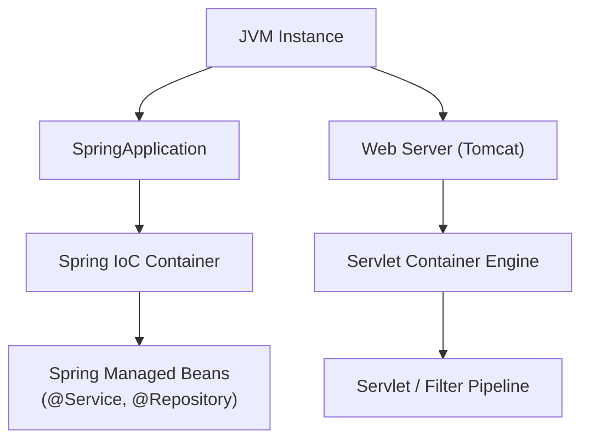

Mỗi bên duy trì một tập hợp các khái niệm kỹ thuật và abstraction riêng biệt:

| Hệ thống | Đối tượng quản lý cốt lõi | Cơ chế vận hành |
| :--- | :--- | :--- |
| **Servlet Container** (Tomcat) | `Servlet`, `Filter`, `FilterChain`, `ServletContext`, `HttpServletRequest`, `HttpServletResponse` | Xử lý kết nối TCP/IP, phân phối luồng I/O theo Servlet Specification |
| **Spring IoC Container** | `@Component`, `@Bean`, `@Service`, `@Controller`, `ApplicationContext` | Quản lý vòng đời Bean, Dependency Injection, AOP Proxying |

> [!IMPORTANT]
> Servlet Container và Spring IoC Container là hai thực thể độc lập. Servlet Container chỉ thực thi các Filter và Servlet đã đăng ký trong `ServletContext`.

---

## Servlet Filter nguyên bản

Theo chuẩn Servlet Specification, một Filter can thiệp trực tiếp vào luồng request trước khi đến được Servlet đích. Đối tượng này được tạo lập và điều phối hoàn toàn bởi Servlet Container.

Cấu trúc một Servlet Filter chuẩn:

```java
public class StandardServletFilter implements Filter {

    @Override
    public void doFilter(
            ServletRequest request,
            ServletResponse response,
            FilterChain chain
    ) throws IOException, ServletException {
        // Tien xu ly request
        chain.doFilter(request, response);
        // Hau xu ly response
    }
}
```

Nếu khởi tạo Filter trực tiếp thông qua cơ chế Servlet thuần hoặc cấu hình `web.xml` truyền thống, Spring IoC sẽ không quản lý đối tượng này.

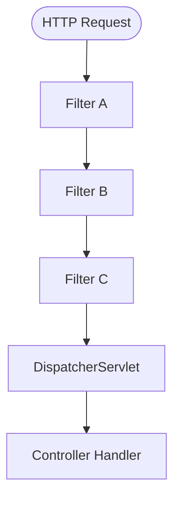

Khi một Filter không nằm trong `ApplicationContext`, mọi nỗ lực khai báo `@Autowired` hoặc Dependency Injection vào trường dữ liệu của Filter đều không có hiệu lực:

```java
public class UnmanagedFilter implements Filter {
    // Truong nay se mang gia tri null vi Tomcat truc tiep khoi tao instance
    private UserService userService;
}
```

---

## Cơ chế tích hợp Filter thành Spring Bean

Spring Boot thu hẹp khoảng cách giữa hai container bằng cách tự động quét các class triển khai interface `Filter` có đánh dấu `@Component`, sau đó đăng ký chúng vào `ServletContext` của embedded Tomcat trong quá trình bootstrap.

Khai báo Filter dưới dạng Spring Bean:

```java
@Component
public class LoggingFilter implements Filter {

    private final AuditService auditService;

    // Dependency Injection hoat dong binh thuong
    public LoggingFilter(AuditService auditService) {
        this.auditService = auditService;
    }

    @Override
    public void doFilter(
            ServletRequest request,
            ServletResponse response,
            FilterChain chain
    ) throws IOException, ServletException {
        auditService.recordTraffic(request.getRemoteAddr());
        chain.doFilter(request, response);
    }
}
```

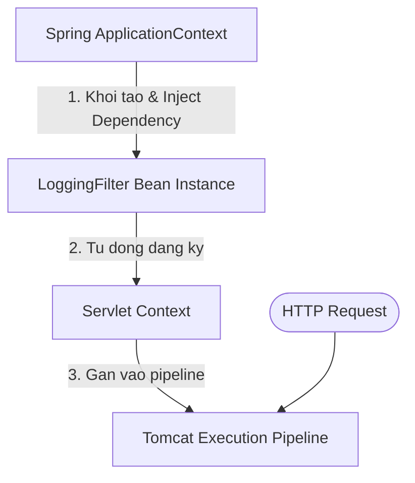

Sự phối hợp phân định trách nhiệm rõ ràng:
- **Spring IoC**: Chịu trách nhiệm khởi tạo instance, inject dependency (`AuditService`), áp dụng proxy nếu cần và quản lý lifecycle.
- **Servlet Container**: Tiếp nhận instance đã đăng ký và thực thi phương thức `doFilter()` mỗi khi có HTTP request tương ứng đi qua pipeline.

---

## Vòng đời Bean Lifecycle và thời điểm tích hợp Servlet

Quá trình tích hợp giữa Spring Bean và Servlet Container diễn ra qua hai giai đoạn riêng biệt: **Bootstrap (Startup Phase)** và **Execution (Runtime Phase)**.

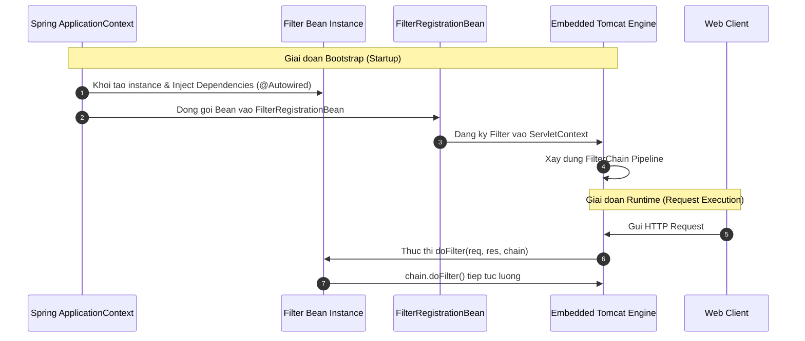

Việc tách biệt hai giai đoạn mang lại lợi ích vận hành rõ ràng: Trong giai đoạn Bootstrap, `ApplicationContext` khởi tạo toàn bộ dependency tree và chỉ bàn giao Filter đã hoàn tất cấu hình cho Servlet Container. Khi bước vào giai đoạn Runtime, Servlet Container điều phối luồng request qua Filter Chain với độ trễ tối thiểu vì không cần thực hiện thêm bước tra cứu hay khởi tạo Bean nào.

---

## Cấu hình nâng cao với FilterRegistrationBean

Khi cần tinh chỉnh URL patterns, thứ tự ưu tiên (Order), hoặc ngăn chặn Spring tự động áp dụng Filter cho toàn bộ route (`/*`), `FilterRegistrationBean` là cơ chế lập trình tường minh và kiểm soát chặt chẽ nhất.

Khai báo đăng ký Filter có cấu hình thứ tự và URL pattern:

```java
@Configuration
public class FilterRegistrationConfiguration {

    @Bean
    public FilterRegistrationBean<CustomSecurityFilter> customSecurityFilterRegistration(
            CustomSecurityFilter filter
    ) {
        FilterRegistrationBean<CustomSecurityFilter> registration = new FilterRegistrationBean<>();
        registration.setFilter(filter);
        registration.addUrlPatterns("/api/v1/secure/*");
        registration.setOrder(1);
        registration.setName("customSecurityFilter");
        return registration;
    }
}
```

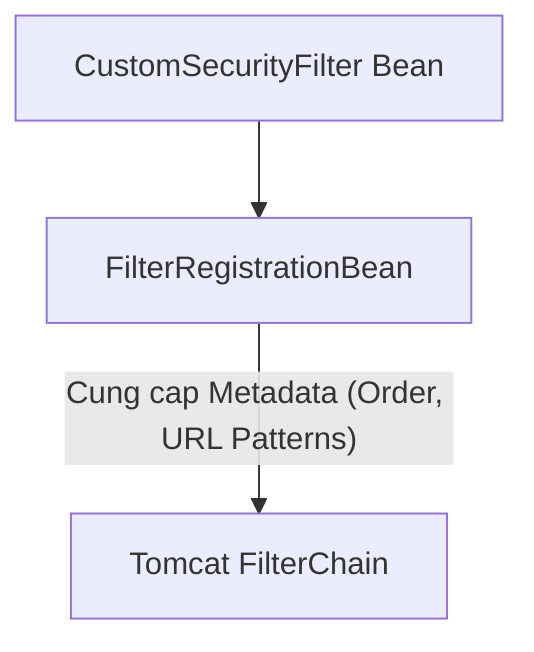

---

## Cầu nối DelegatingFilterProxy trong Spring Framework

Bên cạnh việc đăng ký trực tiếp qua `FilterRegistrationBean`, Spring Framework cung cấp lớp trung gian `DelegatingFilterProxy`. Đây là giải pháp kết nối chuẩn mực giữa vòng đời Servlet Container và Spring `ApplicationContext`, đóng vai trò là nền tảng cốt lõi cho **Spring Security**.

`DelegatingFilterProxy` là một Servlet Filter tiêu chuẩn (được Servlet Container khởi tạo hoặc đăng ký vào `ServletContext`), nhưng bên trong phương thức `doFilter()`, nó thực hiện tìm kiếm một Spring Bean (target bean) trong `WebApplicationContext` và ủy thác toàn bộ logic xử lý request cho bean đó:

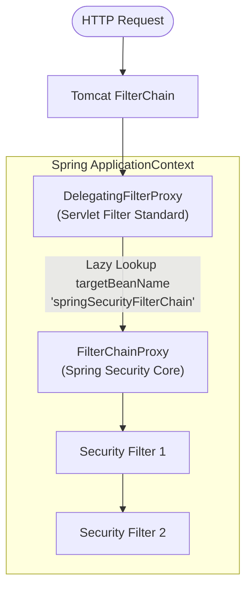

Cấu trúc ủy thác này giải quyết hai bài toán kiến trúc trọng yếu:
1. **Khắc phục bất đồng bộ thời điểm khởi tạo**: Servlet Container có thể khởi tạo các Filter trước khi Spring `ApplicationContext` sẵn sàng. `DelegatingFilterProxy` cho phép trì hoãn việc tra cứu bean đích cho đến khi request đầu tiên được tiếp nhận (lazy lookup).
2. **Cầu nối cho Spring Security Filter Chain**: Spring Security gom toàn bộ các bộ lọc bảo mật thành một `FilterChainProxy` nội bộ (một Spring Bean duy nhất) và chỉ dùng duy nhất một `DelegatingFilterProxy` ở phía Servlet Container để tiếp nhận toàn bộ request.

---

## So sánh @Component, FilterRegistrationBean và DelegatingFilterProxy

Việc lựa chọn cơ chế đăng ký Filter phụ thuộc vào mức độ kiểm soát routing, vòng đời khởi tạo và kiến trúc tích hợp hệ thống.

| Tiêu chí | `@Component` | `FilterRegistrationBean` | `DelegatingFilterProxy` |
| :--- | :--- | :--- | :--- |
| **Cấu hình URL Pattern** | Mặc định áp dụng toàn bộ (`/*`) | Tùy biến linh hoạt (`/api/*`, `/admin/*`) | Định tuyến dựa trên cấu hình đăng ký proxy hoặc target bean |
| **Thứ tự thực thi (`Order`)** | Phụ thuộc `@Order` hoặc mặc định `Ordered.LOWEST_PRECEDENCE` | Thiết lập tường minh qua `registration.setOrder(int)` | Xác định theo thứ tự đăng ký của proxy trong Filter Chain |
| **Kiểm soát kích hoạt** | Tự động kích hoạt toàn cục | Bật/tắt linh hoạt (`setEnabled(false)`) | Ủy quyền toàn quyền điều phối cho target bean bên trong IoC |
| **Cơ chế khởi tạo Target** | Eager (theo Spring context bootstrap) | Eager (đóng gói instance sẵn) | Hỗ trợ Lazy lookup bean từ `WebApplicationContext` |
| **Trường hợp sử dụng điển hình** | Log tiện ích đơn giản, CORS toàn cục | Custom filter với URL patterns và order rõ ràng | Nền tảng Spring Security (`FilterChainProxy`), hệ thống filter phức tạp |

---

## Cơ chế hoạt động của OncePerRequestFilter

`OncePerRequestFilter` là lớp trừu tượng do Spring Web cung cấp nhằm đảm bảo một Filter chỉ thực thi duy nhất **một lần cho mỗi request dispatch**.

Khai báo xác thực JWT kế thừa `OncePerRequestFilter`:

```java
@Component
public class JwtAuthenticationFilter extends OncePerRequestFilter {

    @Override
    protected void doFilterInternal(
            HttpServletRequest request,
            HttpServletResponse response,
            FilterChain filterChain
    ) throws ServletException, IOException {
        String token = request.getHeader("Authorization");
        // Logic giai ma va xac thuc JWT
        filterChain.doFilter(request, response);
    }
}
```

Quan hệ phân cấp kế thừa:

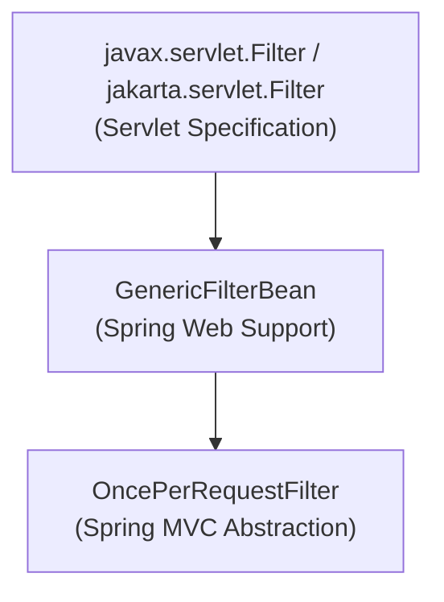

Để ngăn chặn việc thực thi lặp lại khi request được chuyển tiếp (forward) hoặc dispatch lại nội bộ, `OncePerRequestFilter` sử dụng `request.setAttribute()` với một key duy nhất đánh dấu trạng thái xử lý.

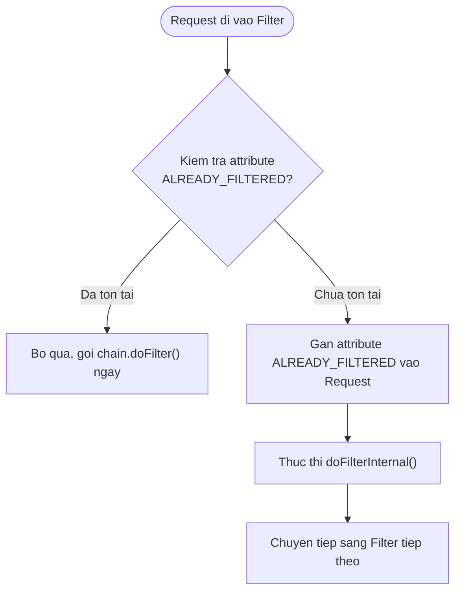

---

## Bản chất vòng đời Dispatch trong Servlet Container

Trong môi trường Servlet, một vòng đời HTTP Request không chỉ có kiểu điều phối thông thường (`REQUEST`), mà có thể trải qua nhiều **DispatcherType** khác nhau trong suốt quá trình xử lý:

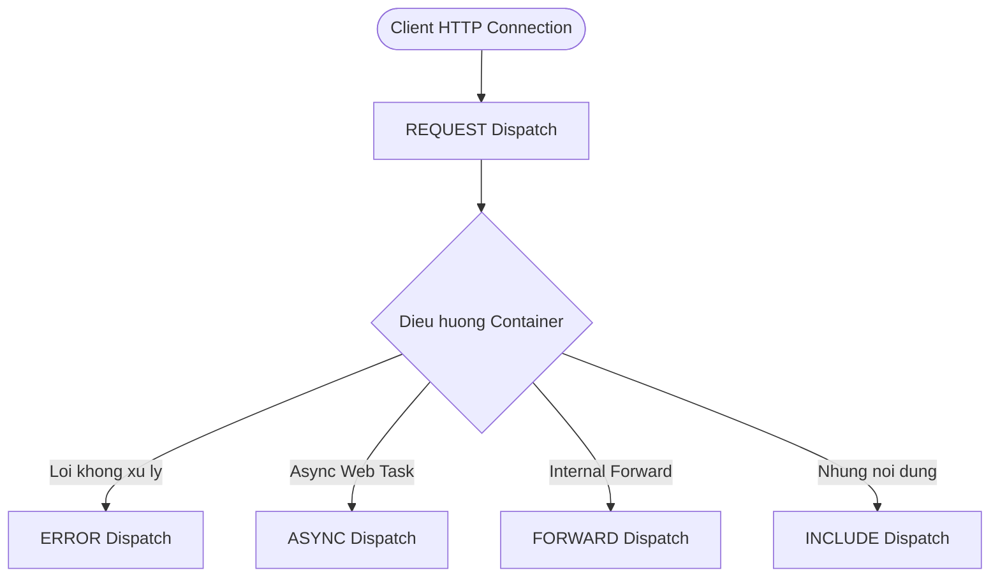

> [!NOTE]
> Sơ đồ trên là mô hình phân loại đơn giản hóa các kiểu dispatch trong Servlet Container. Trên thực tế, các kiểu dispatch này diễn ra độc lập ở các thời điểm và ngữ cảnh khác nhau trong vòng đời request:
> - `FORWARD` / `INCLUDE`: Được kích hoạt thủ công trong code thông qua `RequestDispatcher.forward()` hoặc `include()`.
> - `ERROR`: Được container tự động kích hoạt khi có exception chưa được bắt và tồn tại error-page mapping (ví dụ: chuyển tiếp nội bộ sang route `/error`).
> - `ASYNC`: Được kích hoạt sau khi `AsyncContext.dispatch()` được gọi (thường trên một worker thread khác trong xử lý bất đồng bộ).

Theo mặc định, `OncePerRequestFilter` đã thiết lập các phương thức `shouldNotFilterAsyncDispatch()` và `shouldNotFilterErrorDispatch()` trả về `true` (nghĩa là bỏ qua, không filter lại khi xảy ra async hoặc error dispatch). Khi lập trình viên muốn **bật lại** khả năng lọc cho các kiểu dispatch đặc thù này, có thể chủ động override trả về `false`:

Tùy biến cho phép Filter lọc cả trong Async và Error Dispatch:

```java
@Override
protected boolean shouldNotFilterAsyncDispatch() {
    // Mac dinh tra ve true (bo qua). Override tra ve false de bat buoc Filter chay ca khi ASYNC dispatch
    return false;
}

@Override
protected boolean shouldNotFilterErrorDispatch() {
    // Mac dinh tra ve true (bo qua). Override tra ve false de bat buoc Filter chay ca khi ERROR dispatch toi /error
    return false;
}
```

> [!NOTE]
> `OncePerRequestFilter` không cam kết "chạy duy nhất một lần trong toàn bộ vòng đời TCP socket" nếu có nhiều dispatch type khác nhau được kích hoạt, trừ khi các hook kiểm soát dispatch được thiết lập phù hợp.

---

## Phân định ranh giới xử lý Exception giữa Filter và Controller

Nhiều lập trình viên lầm tưởng rằng `@RestControllerAdvice` hoặc `@ExceptionHandler` có thể bắt được toàn bộ ngoại lệ phát sinh từ bất kỳ đâu trong ứng dụng Spring Boot.

Thực tế, Servlet Filter nằm bên ngoài phạm vi đón nhận của `DispatcherServlet`:

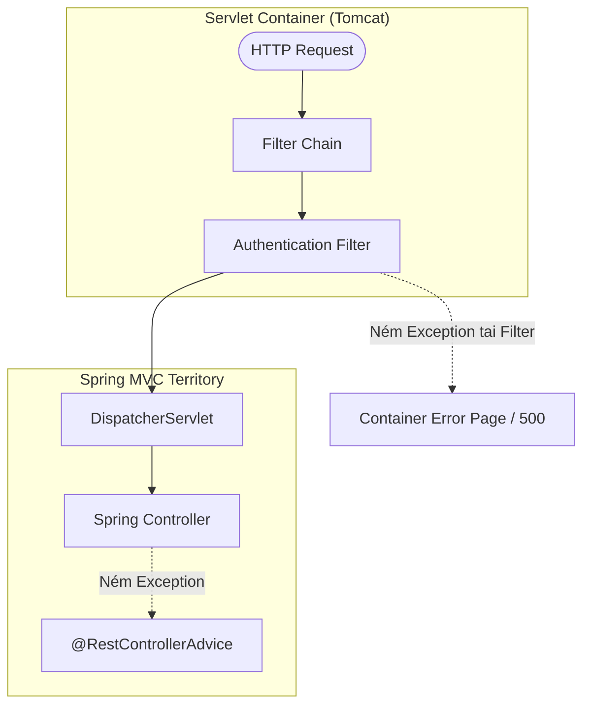

Nếu ngoại lệ ném ra bên trong phương thức `doFilterInternal()` của Filter:

```java
@Component
public class TokenValidationFilter extends OncePerRequestFilter {

    @Override
    protected void doFilterInternal(
            HttpServletRequest request,
            HttpServletResponse response,
            FilterChain filterChain
    ) throws ServletException, IOException {
        String authHeader = request.getHeader("Authorization");
        if (authHeader == null) {
            // Ngoai le nay khong the bay vao @RestControllerAdvice
            throw new IllegalArgumentException("Missing Authorization header");
        }
        filterChain.doFilter(request, response);
    }
}
```

Do ngoại lệ xảy ra trước khi request đến `DispatcherServlet`, cơ chế `HandlerExceptionResolver` của Spring MVC chưa được thiết lập cho request này.

---

## Chiến lược xử lý ngoại lệ tại tầng Filter

Có hai phương án kỹ thuật tiêu chuẩn để xử lý lỗi phát sinh trực tiếp tại tầng Filter.

### Phương án 1: Tự đóng gói HTTP Response JSON

Filter trực tiếp bắt ngoại lệ, thiết lập HTTP Status Code và ghi dữ liệu phản hồi vào output stream:

```java
@Component
public class ResilientSecurityFilter extends OncePerRequestFilter {

    @Override
    protected void doFilterInternal(
            HttpServletRequest request,
            HttpServletResponse response,
            FilterChain filterChain
    ) throws ServletException, IOException {
        try {
            filterChain.doFilter(request, response);
        } catch (CustomSecurityException ex) {
            response.setStatus(HttpServletResponse.SC_UNAUTHORIZED);
            response.setContentType("application/json");
            response.setCharacterEncoding("UTF-8");
            response.getWriter().write("""
                {
                    "code": 401,
                    "error": "UNAUTHORIZED",
                    "message": "%s"
                }
                """.formatted(ex.getMessage()));
        }
    }
}
```

### Phương án 2: Chuyển tiếp tới HandlerExceptionResolver

Sử dụng `HandlerExceptionResolver` được Spring IoC inject vào Filter để ủy quyền cho `@ControllerAdvice`:

```java
@Component
public class DelegatingExceptionFilter extends OncePerRequestFilter {

    private final HandlerExceptionResolver handlerExceptionResolver;

    public DelegatingExceptionFilter(
            @Qualifier("handlerExceptionResolver") HandlerExceptionResolver handlerExceptionResolver
    ) {
        this.handlerExceptionResolver = handlerExceptionResolver;
    }

    @Override
    protected void doFilterInternal(
            HttpServletRequest request,
            HttpServletResponse response,
            FilterChain filterChain
    ) throws ServletException, IOException {
        try {
            filterChain.doFilter(request, response);
        } catch (Exception ex) {
            // Chuyen quyen xu ly ngoai le ve he thong ExceptionResolver cua Spring MVC
            handlerExceptionResolver.resolveException(request, response, null, ex);
        }
    }
}
```

---

## Cơ chế HandlerExceptionResolver trong Spring MVC

Khi một ngoại lệ xảy ra bên trong phạm vi `Controller`, `DispatcherServlet` không bắt exception trực tiếp mà ủy thác cho chuỗi các `HandlerExceptionResolver` đã được đăng ký.

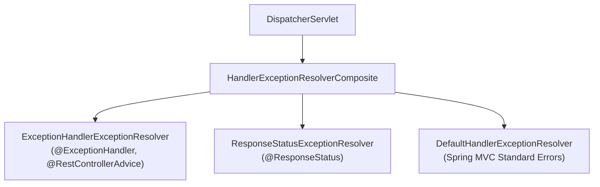

`HandlerExceptionResolverComposite` duyệt qua danh sách các resolver theo thứ tự ưu tiên và sẽ **dừng lại ngay tại resolver đầu tiên trả về kết quả non-null (`ModelAndView`)**, không tiếp tục thực thi các resolver phía sau.

| Thành phần Resolver | Mục tiêu xử lý | Đặc điểm kỹ thuật |
| :--- | :--- | :--- |
| `ExceptionHandlerExceptionResolver` | `@ExceptionHandler` và `@ControllerAdvice` | Ánh xạ ngoại lệ vào method xử lý tùy chỉnh của ứng dụng |
| `ResponseStatusExceptionResolver` | Annotation `@ResponseStatus` | Chuyển đổi mã HTTP status trực tiếp từ metadata của Exception class |
| `DefaultHandlerExceptionResolver` | Lỗi chuẩn của Spring MVC | Xử lý các mã lỗi nội bộ: 405 Method Not Allowed, 400 Bad Request |

---

## Tổng quan luồng xử lý HTTP Request

Toàn bộ chu trình từ khi một TCP packet đến cổng Web Server cho đến khi trả về Client:

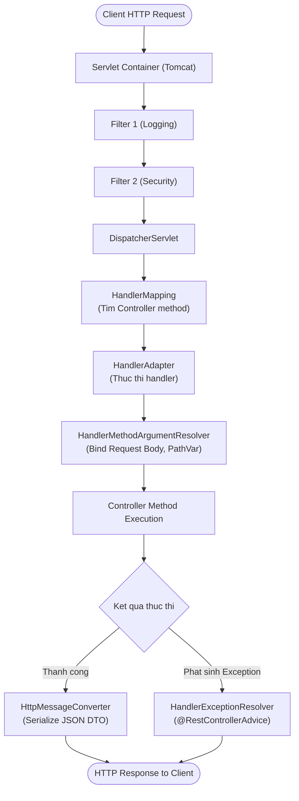

---

## Ma trận phân định ranh giới quản lý

Việc hiểu đúng tầng công nghệ giúp lập trình viên xác định chính xác điểm can thiệp khi cấu hình hệ thống:

| Khái niệm / Thành phần | Cơ quan quản lý | Tầng kiến trúc | Vai trò chính |
| :--- | :--- | :--- | :--- |
| `Filter` / `FilterChain` | Servlet Container | Servlet API | Lọc request trước khi đến Servlet |
| `HttpServletRequest` | Servlet Container | Servlet API | Biểu diễn HTTP Request ở mức thấp |
| `DelegatingFilterProxy` | Servlet Container / Spring | Servlet / Spring Web Bridge | Cầu nối ủy quyền Servlet Filter sang Spring Bean |
| `DispatcherServlet` | Spring Boot / Servlet | Servlet / Spring MVC | Cổng điều phối trung tâm của Spring MVC |
| `HandlerMapping` | Spring Framework | Spring MVC | Tìm kiếm Controller mapping phù hợp |
| `HandlerAdapter` | Spring Framework | Spring MVC | Cầu nối thực thi Controller method |
| `Controller` | Spring IoC | Application Layer | Xử lý business logic của ứng dụng |
| `@RestControllerAdvice` | Spring MVC | Web Exception Layer | Bắt và chuẩn hóa ngoại lệ tầng Controller |
| `OncePerRequestFilter` | Spring Framework | Spring Web Support | Lớp bọc Filter đảm bảo thực thi đơn lẻ |
| `AuthenticationEntryPoint` | Spring Security | Security Filter Layer | Điểm chặn xử lý lỗi Authentication 401 |

---

## Lộ trình tích hợp Servlet vào Spring Boot

Để nắm vững toàn bộ kiến trúc kết nối giữa Servlet Container và Spring Framework, quy trình học tập và áp dụng nên tuân theo lộ trình phân tầng:

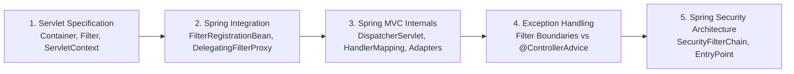

---
[← Back to README](README.md)
