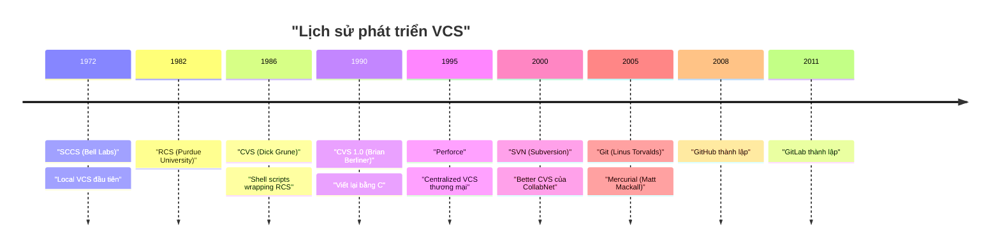

# Chương 1. Giới thiệu về Version Control System (VCS)

Chương này giới thiệu khái niệm cơ bản về hệ thống quản lý phiên bản (VCS), tầm quan trọng của nó trong phát triển phần mềm, các mô hình VCS phổ biến và lý do Git trở thành tiêu chuẩn công nghiệp.

## Mục lục

- [1.1 Version Control System là gì?](#11-version-control-system-là-gì)
- [1.2 Vì sao cần Version Control?](#12-vì-sao-cần-version-control)
- [1.3 Nếu không có Version Control sẽ ra sao?](#13-nếu-không-có-version-control-sẽ-ra-sao)
- [1.4 Các loại Version Control System](#14-các-loại-version-control-system)
- [1.5 Các Version Control System phổ biến (2026)](#15-các-version-control-system-phổ-biến-2026)
- [1.6 Vì sao Git trở thành tiêu chuẩn của ngành?](#16-vì-sao-git-trở-thành-tiêu-chuẩn-của-ngành)

---

## 1.1 Version Control System là gì?

**Version Control System (VCS)** — Hệ thống quản lý phiên bản — là một công cụ phần mềm ghi lại lịch sử thay đổi của các tập tin theo thời gian, giúp bạn dễ dàng khôi phục hoặc xem lại bất kỳ phiên bản nào trong quá khứ.

**Nguyên lý hoạt động cốt lõi:**
- **Lưu trữ lịch sử thay đổi**: Mỗi lần bạn "commit" (lưu lại), VCS chụp ảnh trạng thái của các tập tin tại thời điểm đó.
- **Định danh phiên bản**: Mỗi phiên bản có một định danh duy nhất (số phiên bản, hash).
- **So sánh và hợp nhất**: Có thể xem khác biệt giữa các phiên bản và hợp nhất các thay đổi song song.
- **Phân nhánh**: Cho phép phát triển song song trên nhiều nhánh riêng biệt.

---

## 1.2 Vì sao cần Version Control?

| Lợi ích | Mô tả | Chi tiết |
| :--- | :--- | :--- |
| **Quản lý phiên bản** | Mỗi thay đổi được ghi lại kèm metadata | Lưu thông tin chi tiết về người sửa, thời gian và lý do thay đổi. |
| **Khôi phục dữ liệu** | Quay về bất kỳ trạng thái nào trong quá khứ | Giúp sửa lỗi nhanh bằng cách quay về phiên bản ổn định trước đó. |
| **Làm việc nhóm** | Nhiều người cùng làm việc trên một dự án | Hạn chế việc ghi đè code lẫn nhau, cho phép merge các thay đổi. |
| **Theo dõi thay đổi** | Xem ai đã thay đổi dòng nào | Dễ dàng xác định nguồn gốc của từng dòng code và commit tương ứng. |
| **Audit lịch sử** | Kiểm toán toàn bộ quá trình phát triển | Hữu ích cho bảo mật và đánh giá tiến độ dự án. |
| **Quản lý release** | Đánh dấu phiên bản phát hành | Hỗ trợ release nhiều môi trường khác nhau song song. |

> [!NOTE]
> **Stack Overflow 2025**: 72% developers cho biết VCS giúp giảm thời gian phát triển lên đến 30%.

---

## 1.3 Nếu không có Version Control sẽ ra sao?

Một "truyền thống lâu đời" của nhân loại — đặt tên file kiểu:

```text
project_v1.txt
project_v2.txt
project_final.txt
project_final_real.txt
project_final_real_new.txt
project_final_real_new_2.txt
```

**Rủi ro gặp phải:** mất dữ liệu, ghi đè file của nhau, không biết ai đã sửa những gì, không thể quay lại phiên bản cũ một cách tin cậy.

---

## 1.4 Các loại Version Control System



### Local VCS (VCS cục bộ)
- Cơ sở dữ liệu trên máy tính lưu các bản vá (patches).
- **Ưu điểm**: Đơn giản, không cần kết nối mạng.
- **Nhược điểm**: Không thể cộng tác nhóm, rủi ro mất mát dữ liệu cao nếu hỏng ổ đĩa.
- **Đại diện**: SCCS (1972), RCS (1982).

### Centralized VCS (VCS tập trung — CVCS)
- Một máy chủ trung tâm chứa tất cả các tập tin có phiên bản.
- Client checkout file trực tiếp từ máy chủ trung tâm.
- **Ưu điểm**: Kiểm soát tập trung, dễ quản lý, phân quyền chi tiết.
- **Nhược điểm**: Single point of failure (nếu server hỏng, không ai có thể commit), bắt buộc phải có mạng cho hầu hết thao tác.
- **Đại diện**: CVS (1986), SVN (2000), Perforce (1995).

### Distributed VCS (VCS phân tán — DVCS)
- Mỗi developer có toàn bộ bản sao kho (bao gồm toàn bộ lịch sử commits).
- **Ưu điểm**: Làm việc offline hoàn hảo, không có single point of failure, tốc độ xử lý nhanh, backup phân tán trên mọi máy client.
- **Nhược điểm**: Khó làm quen hơn đối với người mới bắt đầu, tốn dung lượng đĩa ban đầu khi thực hiện tải về (clone) toàn bộ lịch sử.
- **Đại diện**: Git (2005), Mercurial (2005).

---

## 1.5 Các Version Control System phổ biến (2026)

| VCS | Loại | Năm | Tình trạng (2026) |
| :--- | :--- | :--- | :--- |
| **Git** | DVCS | 2005 | 👑 Thống trị (~85% thị trường) |
| **Apache Subversion (SVN)** | CVCS | 2000 | Suy giảm (~2% thị trường) |
| **Mercurial** | DVCS | 2005 | Suy giảm (~1%), vẫn được dùng bởi Meta/Mozilla |
| **Perforce Helix Core** | CVCS | 1995 | Ổn định trong game dev, binary-heavy |
| **Fossil** | DVCS | 2007 | Thị phần nhỏ, SQLite sử dụng |
| **Plastic SCM (Unity VCS)** | DVCS | 2005 | Được Unity mua lại, đang suy giảm |

> [!NOTE]
> **Stack Overflow 2025** (với hơn 49,000 người tham gia): **93.87%** developers sử dụng Git, **5.18%** sử dụng SVN, và **1.13%** sử dụng Mercurial.

---

## 1.6 Vì sao Git trở thành tiêu chuẩn của ngành?

1. **Phân tán hoàn toàn**: Làm việc offline dễ dàng, mọi máy trạm đều là bản backup hoàn chỉnh.
2. **Nhánh cực nhẹ**: Một nhánh chỉ là file text 41 bytes — tạo/chuyển/hợp nhất siêu nhanh.
3. **Toàn vẹn dữ liệu**: SHA-1 (và sắp tới SHA-256) đảm bảo dữ liệu không bị sửa đổi hay hư hỏng mà không bị phát hiện.
4. **Cộng đồng khổng lồ**: Kho lệnh phong phú, tài liệu dồi dào, hệ sinh thái lớn nhất toàn cầu.
5. **Nguồn mở**: Giấy phép GPL-2.0, hoàn toàn miễn phí.
6. **Linh hoạt**: Hỗ trợ mọi workflow từ đơn giản đến phức tạp.
7. **Ecosystem**: Các nền tảng lớn như GitHub, GitLab, Bitbucket hỗ trợ tối đa.

> Git KHÔNG phải là lựa chọn tốt nhất cho mọi trường hợp. Perforce vượt trội cho binary lớn (game dev). SVN đơn giản hơn cho người mới. Fossil tích hợp sẵn wiki+tickets. Git có ~44+ CVE lịch sử và UX được đánh giá là phức tạp không cần thiết.

---
[← Quay lại mục lục](README.md)
