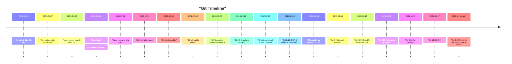

# Chương 2. Git

Chương này đi sâu vào tìm hiểu Git là gì, lịch sử hình thành thú vị đằng sau nó, triết lý thiết kế và nguyên lý hoạt động cốt lõi của Git.

## Mục lục

- [2.1 Git là gì?](#21-git-là-gì)
- [2.2 Lịch sử ra đời của Git](#22-lịch-sử-ra-đời-của-git)
- [2.3 Triết lý thiết kế của Git](#23-triết-lý-thiết-kế-của-git)
- [2.4 Git hoạt động như thế nào?](#24-git-hoạt-động-như-thế-nào)

---

## 2.1 Git là gì?

Git là một **Distributed Version Control System (DVCS)** — Hệ thống quản lý phiên bản phân tán — mã nguồn mở được tạo ra bởi **Linus Torvalds** vào năm 2005. Git được thiết kế để xử lý mọi thứ từ dự án nhỏ đến rất lớn với tốc độ và hiệu quả tối đa.

Git về bản chất là một **hệ thống tập tin định địa chỉ theo nội dung (content-addressable filesystem)** với giao diện VCS bên trên. Nói một cách đơn giản hơn: Git hoạt động giống như một cơ sở dữ liệu lưu trữ ảnh chụp trạng thái (snapshots) cho toàn bộ thư mục dự án của bạn.

---

## 2.2 Lịch sử ra đời của Git

### 2.2.1 Linux Kernel và bài toán quản lý mã nguồn
- **1991-2002**: Mã nguồn Linux kernel được duy trì thủ công bằng cách gửi các file patches qua email và chia sẻ các file nén tarballs.
- **2002-2005**: Dự án Linux kernel bắt đầu sử dụng **BitKeeper** — một hệ thống DVCS thương mại của công ty BitMover, được cấp phép miễn phí cho các dự án nguồn mở.

### 2.2.2 Linus Torvalds và sự ra đời của Git
- **Tháng 4/2005**: **Andrew Tridgell** (tác giả của Samba) thực hiện dịch ngược (reverse-engineer) giao thức BitKeeper để xây dựng một client kết nối miễn phí tên là **SourcePuller**.
- **Larry McVoy** (CEO của BitMover) quyết định thu hồi giấy phép miễn phí của BitKeeper đối với dự án nhân Linux.
- **Linus Torvalds** quyết định tự viết một công cụ quản lý phiên bản mới của riêng mình để tự chủ.
- **7/4/2005**: Git có **commit đầu tiên** — `e83c5163316f89bfbde7d9ab23ca2e25604af290` — với thông điệp: *"Initial revision of 'git', the information manager from hell"* (gồm 11 files, 1,244 dòng code C).
- **20/4/2005**: Nhân Linux chính thức được quản lý bằng Git.
- **26/7/2005**: **Junio C Hamano** tiếp quản vai trò maintainer chính của Git (và duy trì cho đến nay).
- **21/12/2005**: Phiên bản Git 1.0.0 chính thức được phát hành.

> [!NOTE]
> **Linus Torvalds**: "I spent four months on it. So really, all the credit goes to Junio."

### 2.2.3 Câu chuyện thú vị đằng sau Git



**BitKeeper và câu chuyện license:**
- BitKeeper là một DVCS thương mại rất mạnh lúc bấy giờ.
- BitMover cấp phép miễn phí cho cộng đồng mã nguồn mở với điều kiện không được xây dựng các công cụ cạnh tranh hoặc dịch ngược sản phẩm.
- Việc Andrew Tridgell dịch ngược giao thức BitKeeper để viết SourcePuller đã vi phạm thỏa thuận này, dẫn đến việc thu hồi license và thúc đẩy sự ra đời của cả Git lẫn Mercurial (do Matt Mackall phát triển).

**Ý nghĩa tên gọi "Git":**
- Từ "Git" trong tiếng lóng của Anh có nghĩa là "người khó ưa/khó chịu".
- Linus Torvalds giải thích hài hước: *"I'm an egotistical bastard, and I name all my projects after myself. First 'Linux', now 'git'."*
- File README trong commit đầu tiên định nghĩa:
  - *Global Information Tracker* (khi hệ thống hoạt động tốt).
  - *Goddamn Idiotic Truckload of Sh\*t* (khi hệ thống bị lỗi).

---

## 2.3 Triết lý thiết kế của Git

| Nguyên tắc | Mô tả | Chi tiết |
| :--- | :--- | :--- |
| **Fast** | Tốc độ cực nhanh | Thiết kế để xử lý hàng trăm bản vá (patches) mỗi giây. |
| **Distributed** | Phân tán hoàn toàn | Không phụ thuộc vào máy chủ trung tâm để làm việc và truy xuất lịch sử. |
| **Integrity** | Đảm bảo tính toàn vẹn | Sử dụng hàm băm SHA-1 (và SHA-256) để kiểm chứng dữ liệu không bị thay đổi ngoài ý muốn. |
| **Branching** | Phân nhánh mạnh mẽ | Nhánh cực nhẹ (chỉ là file text chứa hash commit), hỗ trợ chuyển đổi và gộp nhánh tức thì. |

> [!NOTE]
> **Linus Torvalds** (Google Tech Talk 2007): "SHA-1, as far as Git is concerned, isn't even a security feature. It's purely a consistency check."

> [!NOTE]
> **WWCVSND (What Would CVS Not Do)**: "Take CVS as an example of what not to do; if in doubt, make the exact opposite decision."

---

## 2.4 Git hoạt động như thế nào?

### Snapshot thay vì Diff
Đây là điểm khác biệt cốt lõi nhất giữa Git và các VCS truyền thống:
- **SVN/Perforce**: Lưu trữ dữ liệu dưới dạng **các bản vá (deltas/diffs)** so với file gốc.
- **Git**: Lưu trữ dữ liệu dưới dạng **ảnh chụp trạng thái (snapshots)**. Mỗi commit lưu lại một bản chụp toàn bộ cấu trúc thư mục tại thời điểm đó. Nếu một file không thay đổi, Git chỉ lưu trữ một liên kết (link) đến file đã lưu trước đó thay vì copy lại.
- **Lưu ý**: Git có sử dụng nén delta (delta compression) khi đóng gói dữ liệu nội bộ (packfiles) nhằm tối ưu dung lượng đĩa, nhưng mô hình dữ liệu logic của nó vẫn là Snapshots.

### SHA-1 Object
Mọi thực thể trong Git được định danh bằng một mã hash SHA-1 dài 40 ký tự hex, tạo ra từ nội dung tập tin, kích thước và loại đối tượng:
```text
SHA-1("blob 13Hello, World!") = 8ab686e...
```

**Quá trình chuyển đổi SHA-1 sang SHA-256:**
- **2017**: Google thực hiện thành công cuộc tấn công va chạm SHA-1 (SHAttered attack).
- **Git 2.13 (2017)**: Tích hợp cơ chế phát hiện va chạm SHA-1 (sha1collisiondetection).
- **Git 2.29 (2020)**: Bắt đầu hỗ trợ thử nghiệm SHA-256.
- **Git 2.51 (2025)**: SHA-256 trở thành thuật toán mặc định cho các repository mới (Git 3.0).
- **Hệ sinh thái**: GitHub hiện tại vẫn chưa hỗ trợ hoàn toàn SHA-256 repos (tính đến tháng 7/2026), trong khi GitLab và Forgejo đã có các bản thử nghiệm/hỗ trợ chính thức từ sớm.

### Blob
- Đối tượng lưu trữ nội dung thô của file (không bao gồm các thông tin như tên file hay quyền truy cập).
- Hai file có nội dung giống hệt nhau sẽ có chung một mã hash SHA-1 bất kể tên file hoặc vị trí của chúng ở đâu.

### Tree
- Đại diện cho một thư mục trong dự án.
- Ánh xạ tên file/thư mục con sang các Blob hash tương ứng hoặc các Tree hash khác.
- Lưu trữ các thông tin chi tiết như: file mode, loại đối tượng (blob/tree), hash SHA-1 và tên file.

### Commit
- Lưu trữ ảnh chụp của toàn bộ repository tại một mốc thời gian cụ thể.
- Chứa con trỏ trỏ đến Tree gốc (root directory), mốc thời gian, thông tin tác giả (author/committer), commit message và hash của commit cha (parent commits).
- Tạo thành một đồ thị có hướng không chu trình (**Directed Acyclic Graph — DAG**).

### Tag
- **Lightweight**: Đơn thuần là một con trỏ tĩnh trỏ đến một commit cụ thể.
- **Annotated**: Được lưu trữ như một đối tượng riêng biệt trong Git database, đi kèm thông tin người tạo tag, ngày tháng, tin nhắn tag và chữ ký GPG (nếu có).

### Repository
- Là thư mục ẩn `.git/` nằm ở thư mục gốc của dự án.
- Chứa toàn bộ cơ sở dữ liệu đối tượng (objects), các tham chiếu (refs) và cấu hình hệ thống.
- **Bare Repository**: Loại repository không chứa thư mục làm việc (working directory), thường được sử dụng trên máy chủ từ xa (remote server) để nhận lệnh `push`.

---
[← Quay lại mục lục](README.md)
